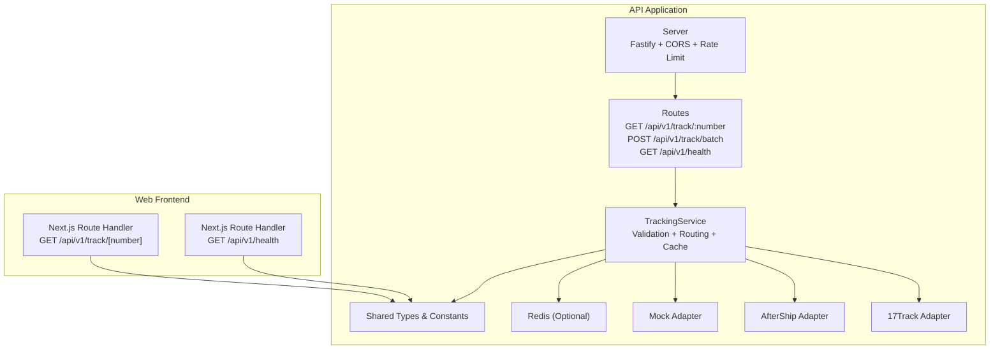
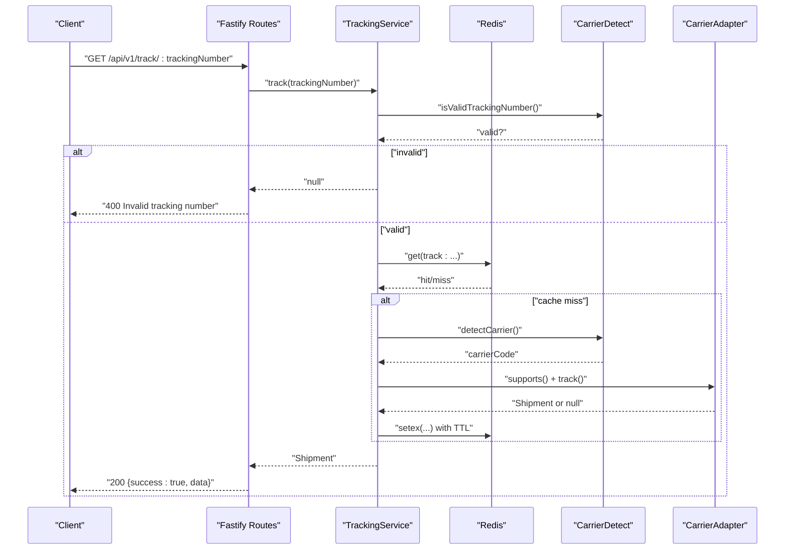
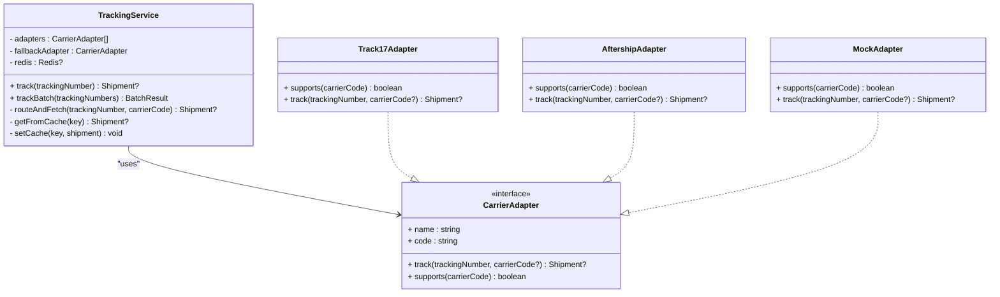
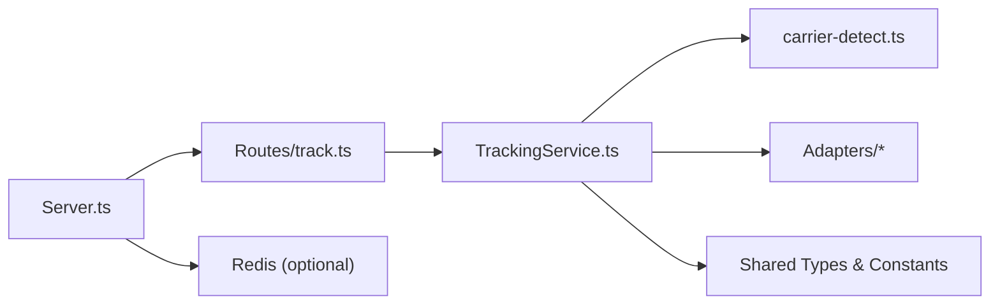

# API Reference

<cite>
**Referenced Files in This Document**
- [server.ts](file://apps/api/src/server.ts)
- [track.ts](file://apps/api/src/routes/track.ts)
- [tracking-service.ts](file://apps/api/src/services/tracking-service.ts)
- [carrier-detect.ts](file://apps/api/src/services/carrier-detect.ts)
- [base-adapter.ts](file://apps/api/src/adapters/base-adapter.ts)
- [aftership-adapter.ts](file://apps/api/src/adapters/aftership-adapter.ts)
- [17track-adapter.ts](file://apps/api/src/adapters/17track-adapter.ts)
- [index.ts](file://packages/shared/src/types/index.ts)
- [constants/index.ts](file://packages/shared/src/constants/index.ts)
- [route.ts](file://apps/web/src/app/api/v1/track/[trackingNumber]/route.ts)
- [route.ts](file://apps/web/src/app/api/v1/health/route.ts)
</cite>

## Table of Contents
1. [Introduction](#introduction)
2. [Project Structure](#project-structure)
3. [Core Components](#core-components)
4. [Architecture Overview](#architecture-overview)
5. [Detailed Component Analysis](#detailed-component-analysis)
6. [Dependency Analysis](#dependency-analysis)
7. [Performance Considerations](#performance-considerations)
8. [Troubleshooting Guide](#troubleshooting-guide)
9. [Conclusion](#conclusion)
10. [Appendices](#appendices)

## Introduction
This document provides comprehensive API documentation for the LOGISTIC tracking service. It covers:
- REST endpoints for single and batch tracking
- Request/response schemas and validation rules
- Authentication and rate limiting policies
- Health check endpoint for monitoring
- Practical examples using curl and SDK usage patterns
- Error codes, retry strategies, and performance optimization recommendations

## Project Structure
The tracking service is implemented as a Fastify-based API application with pluggable carrier adapters and optional Redis caching. Shared types and constants define the data models and configuration.

**Diagram sources**
- [server.ts:13-54](file://apps/api/src/server.ts#L13-L54)
- [track.ts:5-74](file://apps/api/src/routes/track.ts#L5-L74)
- [tracking-service.ts:10-38](file://apps/api/src/services/tracking-service.ts#L10-L38)
- [base-adapter.ts:4-18](file://apps/api/src/adapters/base-adapter.ts#L4-L18)
- [aftership-adapter.ts:23-35](file://apps/api/src/adapters/aftership-adapter.ts#L23-L35)
- [17track-adapter.ts:21-38](file://apps/api/src/adapters/17track-adapter.ts#L21-L38)
- [index.ts:48-83](file://packages/shared/src/types/index.ts#L48-L83)
- [constants/index.ts:31-43](file://packages/shared/src/constants/index.ts#L31-L43)

**Section sources**
- [server.ts:13-54](file://apps/api/src/server.ts#L13-L54)
- [track.ts:5-74](file://apps/api/src/routes/track.ts#L5-L74)
- [index.ts:48-83](file://packages/shared/src/types/index.ts#L48-L83)
- [constants/index.ts:31-43](file://packages/shared/src/constants/index.ts#L31-L43)

## Core Components
- Server initialization with CORS, rate limiting, and optional Redis integration
- Route handlers for single tracking, batch tracking, and health checks
- Tracking service orchestrating validation, carrier detection, adapter routing, and caching
- Pluggable carrier adapters (17Track, AfterShip, and a mock adapter for development)
- Shared types and constants defining shipment models, statuses, and tier configurations

**Section sources**
- [server.ts:13-54](file://apps/api/src/server.ts#L13-L54)
- [track.ts:5-74](file://apps/api/src/routes/track.ts#L5-L74)
- [tracking-service.ts:10-38](file://apps/api/src/services/tracking-service.ts#L10-L38)
- [base-adapter.ts:4-18](file://apps/api/src/adapters/base-adapter.ts#L4-L18)
- [index.ts:48-83](file://packages/shared/src/types/index.ts#L48-L83)
- [constants/index.ts:31-43](file://packages/shared/src/constants/index.ts#L31-L43)

## Architecture Overview
The API exposes three primary endpoints:
- GET /api/v1/track/:trackingNumber
- POST /api/v1/track/batch
- GET /api/v1/health

The backend validates inputs, detects the carrier, routes to the appropriate adapter, caches results, and returns normalized shipment data. The frontend Next.js routes provide a development-friendly mock response for single tracking.

**Diagram sources**
- [track.ts:9-35](file://apps/api/src/routes/track.ts#L9-L35)
- [tracking-service.ts:40-62](file://apps/api/src/services/tracking-service.ts#L40-L62)
- [carrier-detect.ts:7-26](file://apps/api/src/services/carrier-detect.ts#L7-L26)
- [tracking-service.ts:107-126](file://apps/api/src/services/tracking-service.ts#L107-L126)
- [base-adapter.ts:4-18](file://apps/api/src/adapters/base-adapter.ts#L4-L18)

## Detailed Component Analysis

### Endpoint: GET /api/v1/track/:trackingNumber
- Purpose: Retrieve tracking information for a single shipment
- Path Parameters:
  - trackingNumber (string, required): Alphanumeric tracking number (minimum length varies by carrier detection; validated server-side to be at least 5 characters)
- Query Parameters:
  - lang (string, optional): Language preference for localized descriptions (supported by the frontend mock handler; not enforced by the API server)
- Response:
  - 200 OK: { success: true, data: Shipment }
  - 400 Bad Request: { success: false, error: string }
  - 404 Not Found: { success: false, error: string }
- Validation:
  - Minimum length check on the server
  - Additional format validation via carrier detection and regex rules
- Example:
  - curl -i "https://your-host/api/v1/track/AB123456789"

**Section sources**
- [track.ts:9-35](file://apps/api/src/routes/track.ts#L9-L35)
- [carrier-detect.ts:23-26](file://apps/api/src/services/carrier-detect.ts#L23-L26)
- [route.ts:187-222](file://apps/web/src/app/api/v1/track/[trackingNumber]/route.ts#L187-L222)

### Endpoint: POST /api/v1/track/batch
- Purpose: Retrieve tracking information for up to 50 shipments concurrently
- Request Body:
  - trackingNumbers: array of strings (required)
- Response:
  - 200 OK: { success: true, results: Shipment[], failed: Array<{ trackingNumber: string, error: string }> }
  - 400 Bad Request: { success: false, error: string }
- Validation:
  - trackingNumbers must be a non-empty array
  - Maximum 50 items per request
- Processing:
  - Parallel processing with a fixed concurrency window
  - Results aggregated with per-item failure records
- Example:
  - curl -i -X POST "https://your-host/api/v1/track/batch" -H "Content-Type: application/json" -d '{"trackingNumbers":["AB123","XY987"]}'

**Section sources**
- [track.ts:38-64](file://apps/api/src/routes/track.ts#L38-L64)
- [tracking-service.ts:64-91](file://apps/api/src/services/tracking-service.ts#L64-L91)

### Endpoint: GET /api/v1/health
- Purpose: Service health and runtime status
- Response:
  - 200 OK: { status: "ok", timestamp: string, redis: "connected" | "disabled" }
- Notes:
  - Health endpoint is also exposed by the Next.js frontend for local development

**Section sources**
- [track.ts:66-73](file://apps/api/src/routes/track.ts#L66-L73)
- [server.ts:25-46](file://apps/api/src/server.ts#L25-L46)
- [route.ts:3-8](file://apps/web/src/app/api/v1/health/route.ts#L3-L8)

### Data Models and Schemas
- Shipment
  - Fields: trackingNumber, carrierCode, carrierName, origin, destination, currentStatus, estimatedDelivery, actualDelivery, events, metadata, createdAt, updatedAt
- TrackingEvent
  - Fields: timestamp, location, statusCode, descriptionZh, descriptionEn, rawStatus
- Location
  - Fields: city, state, country, countryCode, postalCode, coordinates
- ShipmentMetadata
  - Fields: dataSource, lastSynced, confidence
- Response Envelopes
  - TrackResponse: { success: boolean, data?: Shipment, error?: string }
  - BatchTrackResponse: { success: boolean, results: Shipment[], failed: Array<{ trackingNumber: string, error: string }> }

**Section sources**
- [index.ts:48-83](file://packages/shared/src/types/index.ts#L48-L83)

### Authentication and Rate Limiting
- Authentication:
  - No authentication required for the tracking endpoints
- Rate Limiting:
  - Global rate limit: 60 requests per 1 minute
  - Applies to all endpoints uniformly
- Redis:
  - Optional caching layer; if unavailable, the service degrades gracefully without cache

**Section sources**
- [server.ts:19-23](file://apps/api/src/server.ts#L19-L23)
- [server.ts:25-46](file://apps/api/src/server.ts#L25-L46)

### Carrier Detection and Adapter Routing
- Carrier Detection:
  - Uses regex patterns to infer carrier from tracking number format
  - Returns a standardized carrier code or "unknown"
- Adapter Chain:
  - Configured based on environment variables for 17Track and AfterShip
  - Falls back to a mock adapter when no production keys are present
- Adapter Responsibilities:
  - Normalize raw carrier responses into the standard Shipment model
  - Support method indicates compatibility for a given carrier code

**Diagram sources**
- [tracking-service.ts:10-38](file://apps/api/src/services/tracking-service.ts#L10-L38)
- [base-adapter.ts:4-18](file://apps/api/src/adapters/base-adapter.ts#L4-L18)
- [aftership-adapter.ts:23-35](file://apps/api/src/adapters/aftership-adapter.ts#L23-L35)
- [17track-adapter.ts:21-38](file://apps/api/src/adapters/17track-adapter.ts#L21-L38)

**Section sources**
- [carrier-detect.ts:7-17](file://apps/api/src/services/carrier-detect.ts#L7-L17)
- [tracking-service.ts:93-105](file://apps/api/src/services/tracking-service.ts#L93-L105)
- [aftership-adapter.ts:32-35](file://apps/api/src/adapters/aftership-adapter.ts#L32-L35)
- [17track-adapter.ts:30-38](file://apps/api/src/adapters/17track-adapter.ts#L30-L38)

### Request/Response Examples

- Single Tracking (curl)
  - curl -i "https://your-host/api/v1/track/AB123456789"

- Batch Tracking (curl)
  - curl -i -X POST "https://your-host/api/v1/track/batch" -H "Content-Type: application/json" -d '{"trackingNumbers":["AB123","XY987"]}'

- Health Check (curl)
  - curl -i "https://your-host/api/v1/health"

- SDK Usage Pattern (JavaScript)
  - Fetch a single tracking record and handle envelopes
  - For batch requests, iterate up to 50 items per call and collect failed entries
  - Respect rate limits and implement exponential backoff on 429/5xx

[No sources needed since this subsection provides general guidance]

## Dependency Analysis
The API server registers middleware and routes, while the tracking service depends on shared types and adapter implementations. Redis is optional and integrated at startup.

**Diagram sources**
- [server.ts:13-54](file://apps/api/src/server.ts#L13-L54)
- [track.ts:5-74](file://apps/api/src/routes/track.ts#L5-L74)
- [tracking-service.ts:10-38](file://apps/api/src/services/tracking-service.ts#L10-L38)
- [index.ts:48-83](file://packages/shared/src/types/index.ts#L48-L83)
- [constants/index.ts:31-43](file://packages/shared/src/constants/index.ts#L31-L43)

**Section sources**
- [server.ts:13-54](file://apps/api/src/server.ts#L13-L54)
- [track.ts:5-74](file://apps/api/src/routes/track.ts#L5-L74)
- [tracking-service.ts:10-38](file://apps/api/src/services/tracking-service.ts#L10-L38)
- [index.ts:48-83](file://packages/shared/src/types/index.ts#L48-L83)
- [constants/index.ts:31-43](file://packages/shared/src/constants/index.ts#L31-L43)

## Performance Considerations
- Caching
  - Redis cache is used to avoid repeated carrier API calls
  - TTL varies by shipment status to balance freshness and cost
- Concurrency
  - Batch processing uses a fixed concurrency window to prevent overload
- Adapter Selection
  - Prefer adapters optimized for detected carriers to reduce retries and normalization overhead
- Network Resilience
  - Redis connection uses retry strategy; failures are logged and service continues without cache
- Recommendations
  - Batch requests up to the documented limit to minimize round trips
  - Implement client-side caching for frequently accessed tracking numbers
  - Monitor health endpoint to detect service degradation early

**Section sources**
- [tracking-service.ts:107-126](file://apps/api/src/services/tracking-service.ts#L107-L126)
- [constants/index.ts:31-43](file://packages/shared/src/constants/index.ts#L31-L43)
- [tracking-service.ts:71-88](file://apps/api/src/services/tracking-service.ts#L71-L88)
- [server.ts:29-43](file://apps/api/src/server.ts#L29-L43)

## Troubleshooting Guide
- 400 Bad Request
  - Single tracking: invalid or too short tracking number
  - Batch tracking: missing or exceeding maximum items
- 404 Not Found
  - Tracking number not found by any adapter
- 429 Too Many Requests
  - Exceeded global rate limit (60/minute)
- 5xx Server Errors
  - Carrier API failures or internal exceptions; consider retry with exponential backoff
- Health Checks
  - Use GET /api/v1/health to verify service availability and Redis connectivity

Retry Strategy
- Backoff: exponential with jitter (e.g., 1s, 2s, 4s, 8s)
- Jitter: randomize wait times to avoid thundering herd
- Caps: limit maximum retry duration and interval

**Section sources**
- [track.ts:14-28](file://apps/api/src/routes/track.ts#L14-L28)
- [track.ts:43-55](file://apps/api/src/routes/track.ts#L43-L55)
- [server.ts:19-23](file://apps/api/src/server.ts#L19-L23)

## Conclusion
The LOGISTIC tracking service provides reliable, normalized tracking data across multiple carriers with built-in caching and rate limiting. Clients should validate inputs, batch requests appropriately, and implement resilient retry logic to achieve optimal performance and reliability.

## Appendices

### Endpoint Summary
- GET /api/v1/track/:trackingNumber
  - Query parameters: lang (optional)
  - Responses: 200 (Shipment), 400, 404
- POST /api/v1/track/batch
  - Body: { trackingNumbers: string[] }
  - Responses: 200 (results + failed), 400
- GET /api/v1/health
  - Responses: 200 (status, timestamp, redis)

**Section sources**
- [track.ts:9-35](file://apps/api/src/routes/track.ts#L9-L35)
- [track.ts:38-64](file://apps/api/src/routes/track.ts#L38-L64)
- [track.ts:66-73](file://apps/api/src/routes/track.ts#L66-L73)