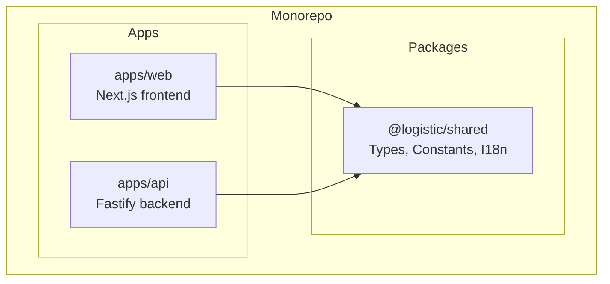
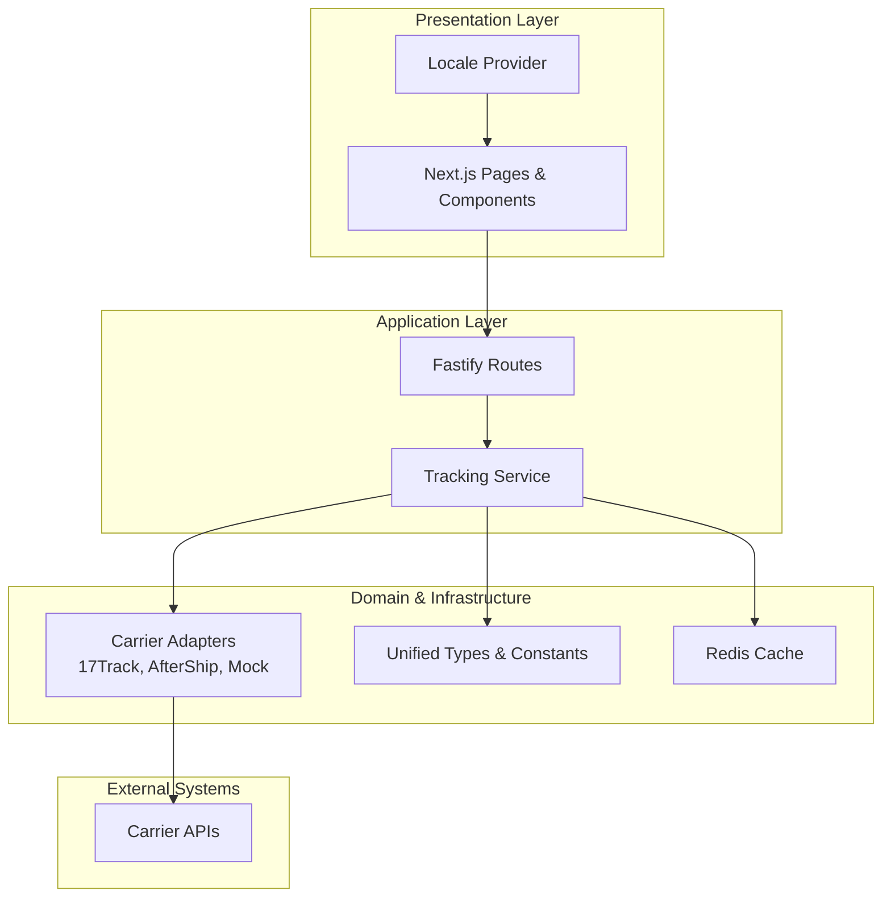
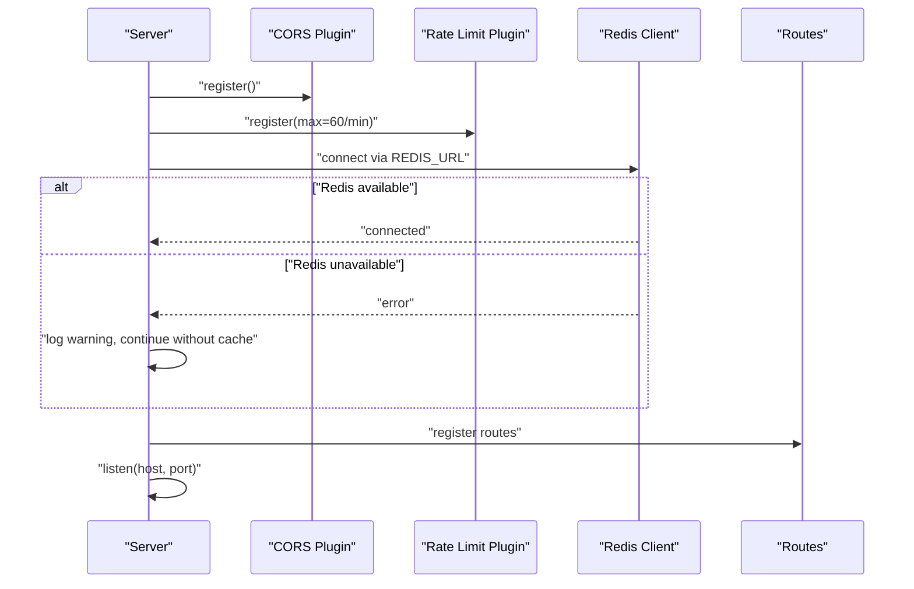
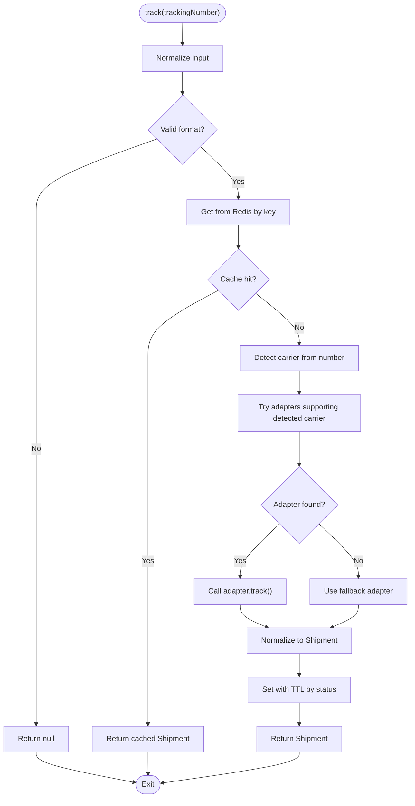
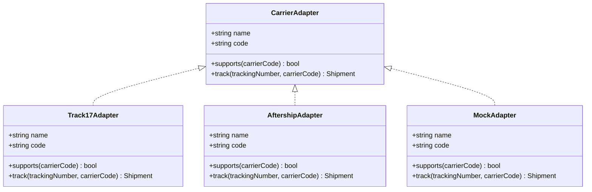
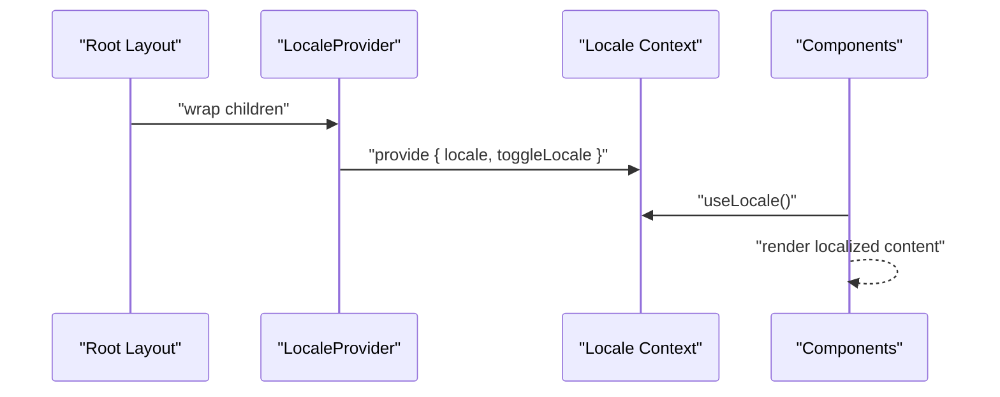
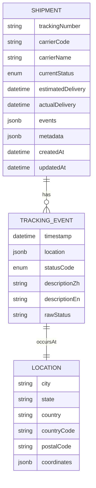
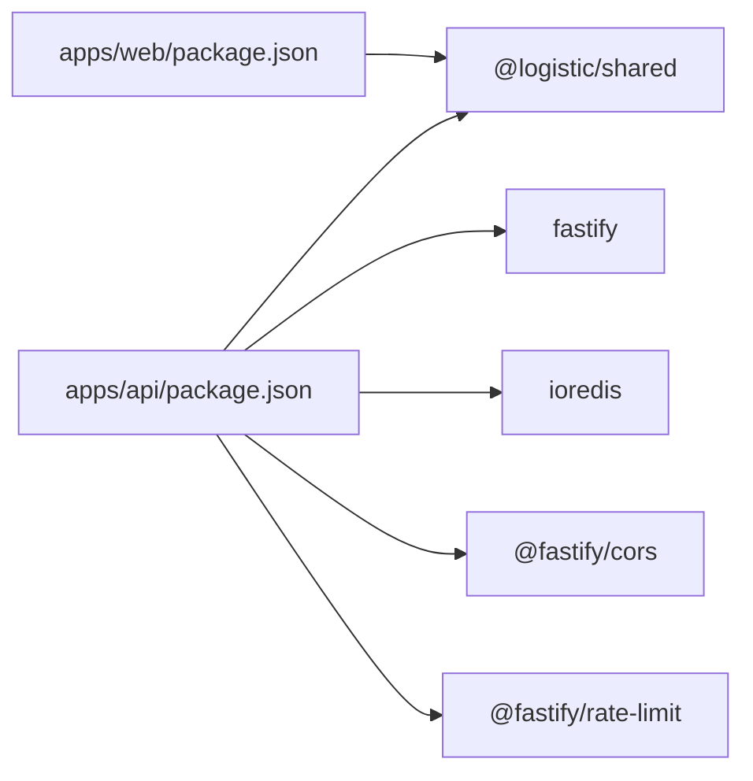

# Architecture Overview

<cite>
**Referenced Files in This Document**
- [pnpm-workspace.yaml](file://pnpm-workspace.yaml)
- [package.json](file://package.json)
- [docker-compose.yml](file://docker-compose.yml)
- [apps/api/package.json](file://apps/api/package.json)
- [apps/web/package.json](file://apps/web/package.json)
- [packages/shared/package.json](file://packages/shared/package.json)
- [apps/api/src/server.ts](file://apps/api/src/server.ts)
- [apps/api/src/routes/track.ts](file://apps/api/src/routes/track.ts)
- [apps/api/src/services/tracking-service.ts](file://apps/api/src/services/tracking-service.ts)
- [apps/api/src/services/carrier-detect.ts](file://apps/api/src/services/carrier-detect.ts)
- [apps/api/src/adapters/base-adapter.ts](file://apps/api/src/adapters/base-adapter.ts)
- [apps/api/src/adapters/aftership-adapter.ts](file://apps/api/src/adapters/aftership-adapter.ts)
- [apps/api/src/adapters/17track-adapter.ts](file://apps/api/src/adapters/17track-adapter.ts)
- [packages/shared/src/index.ts](file://packages/shared/src/index.ts)
- [packages/shared/src/types/index.ts](file://packages/shared/src/types/index.ts)
- [packages/shared/src/constants/index.ts](file://packages/shared/src/constants/index.ts)
- [apps/web/src/app/layout.tsx](file://apps/web/src/app/layout.tsx)
- [apps/web/src/lib/locale-context.tsx](file://apps/web/src/lib/locale-context.tsx)
</cite>

## Table of Contents
1. [Introduction](#introduction)
2. [Project Structure](#project-structure)
3. [Core Components](#core-components)
4. [Architecture Overview](#architecture-overview)
5. [Detailed Component Analysis](#detailed-component-analysis)
6. [Dependency Analysis](#dependency-analysis)
7. [Performance Considerations](#performance-considerations)
8. [Troubleshooting Guide](#troubleshooting-guide)
9. [Conclusion](#conclusion)

## Introduction
This document describes the LOGISTIC system architecture. It is a monorepo built with pnpm workspace containing:
- Frontend application (Next.js)
- Backend application (Fastify)
- Shared TypeScript packages for types, constants, and internationalization

The system implements a layered architecture with clear separation of concerns:
- Presentation layer (Next.js pages and components)
- Application layer (Fastify routes and services)
- Domain and infrastructure layers (adapters for carrier integrations, Redis caching)

It also demonstrates the adapter pattern for carrier integrations, a caching strategy using Redis, and an internationalization architecture centered around a shared package.

## Project Structure
The monorepo is organized into three primary areas:
- apps/web: Next.js frontend application
- apps/api: Fastify backend service
- packages/shared: Shared TypeScript modules (types, constants, i18n)

**Diagram sources**
- [pnpm-workspace.yaml:1-8](file://pnpm-workspace.yaml#L1-L8)
- [apps/web/package.json:1-30](file://apps/web/package.json#L1-L30)
- [apps/api/package.json:1-27](file://apps/api/package.json#L1-L27)
- [packages/shared/package.json:1-22](file://packages/shared/package.json#L1-L22)

**Section sources**
- [pnpm-workspace.yaml:1-8](file://pnpm-workspace.yaml#L1-L8)
- [package.json:1-19](file://package.json#L1-L19)

## Core Components
- Shared package exports types, constants, and i18n for both frontend and backend.
- Backend Fastify server initializes CORS, rate limiting, optional Redis, registers routes, and starts listening.
- Frontend Next.js app sets up fonts, layout, and a locale provider for internationalization.
- Tracking service orchestrates carrier detection, adapter routing, caching, and batching.
- Adapter implementations encapsulate carrier-specific APIs and normalize responses to a unified domain model.

**Section sources**
- [packages/shared/src/index.ts:1-4](file://packages/shared/src/index.ts#L1-L4)
- [apps/api/src/server.ts:1-60](file://apps/api/src/server.ts#L1-L60)
- [apps/web/src/app/layout.tsx:1-44](file://apps/web/src/app/layout.tsx#L1-L44)
- [apps/api/src/services/tracking-service.ts:1-128](file://apps/api/src/services/tracking-service.ts#L1-L128)

## Architecture Overview
The system follows a layered architecture:
- Presentation layer: Next.js pages and components render UI and manage locale state.
- Application layer: Fastify routes handle HTTP requests and delegate to services.
- Domain and infrastructure: Services encapsulate business logic; adapters integrate with external carrier APIs; Redis provides caching.

**Diagram sources**
- [apps/web/src/app/layout.tsx:1-44](file://apps/web/src/app/layout.tsx#L1-L44)
- [apps/web/src/lib/locale-context.tsx:1-33](file://apps/web/src/lib/locale-context.tsx#L1-L33)
- [apps/api/src/routes/track.ts:1-75](file://apps/api/src/routes/track.ts#L1-L75)
- [apps/api/src/services/tracking-service.ts:1-128](file://apps/api/src/services/tracking-service.ts#L1-L128)
- [apps/api/src/adapters/base-adapter.ts:1-39](file://apps/api/src/adapters/base-adapter.ts#L1-L39)
- [apps/api/src/adapters/aftership-adapter.ts:1-151](file://apps/api/src/adapters/aftership-adapter.ts#L1-L151)
- [apps/api/src/adapters/17track-adapter.ts:1-118](file://apps/api/src/adapters/17track-adapter.ts#L1-L118)
- [packages/shared/src/types/index.ts:1-101](file://packages/shared/src/types/index.ts#L1-L101)
- [packages/shared/src/constants/index.ts:1-103](file://packages/shared/src/constants/index.ts#L1-L103)

## Detailed Component Analysis

### Backend Fastify Server
The server initializes middleware, optional Redis, registers routes, and listens on the configured host/port. It gracefully degrades when Redis is unavailable.

**Diagram sources**
- [apps/api/src/server.ts:1-60](file://apps/api/src/server.ts#L1-L60)

**Section sources**
- [apps/api/src/server.ts:1-60](file://apps/api/src/server.ts#L1-L60)

### Tracking Service Orchestration
The tracking service performs validation, cache lookup, carrier detection, adapter routing, normalization, and caching. It supports batch processing with concurrency control.

**Diagram sources**
- [apps/api/src/services/tracking-service.ts:1-128](file://apps/api/src/services/tracking-service.ts#L1-L128)
- [apps/api/src/services/carrier-detect.ts:1-27](file://apps/api/src/services/carrier-detect.ts#L1-L27)
- [packages/shared/src/constants/index.ts:31-43](file://packages/shared/src/constants/index.ts#L31-L43)

**Section sources**
- [apps/api/src/services/tracking-service.ts:1-128](file://apps/api/src/services/tracking-service.ts#L1-L128)
- [apps/api/src/services/carrier-detect.ts:1-27](file://apps/api/src/services/carrier-detect.ts#L1-L27)

### Adapter Pattern Implementation
Adapters implement a common interface to integrate with different carrier APIs. The base interface defines capabilities and a normalized result shape. Specific adapters encapsulate API specifics and status mapping.

**Diagram sources**
- [apps/api/src/adapters/base-adapter.ts:1-39](file://apps/api/src/adapters/base-adapter.ts#L1-L39)
- [apps/api/src/adapters/17track-adapter.ts:1-118](file://apps/api/src/adapters/17track-adapter.ts#L1-L118)
- [apps/api/src/adapters/aftership-adapter.ts:1-151](file://apps/api/src/adapters/aftership-adapter.ts#L1-L151)

**Section sources**
- [apps/api/src/adapters/base-adapter.ts:1-39](file://apps/api/src/adapters/base-adapter.ts#L1-L39)
- [apps/api/src/adapters/17track-adapter.ts:1-118](file://apps/api/src/adapters/17track-adapter.ts#L1-L118)
- [apps/api/src/adapters/aftership-adapter.ts:1-151](file://apps/api/src/adapters/aftership-adapter.ts#L1-L151)

### Frontend Internationalization Architecture
The frontend uses a locale context provider to manage language state and propagate locale to components. The shared package defines supported locales and related types.

**Diagram sources**
- [apps/web/src/app/layout.tsx:1-44](file://apps/web/src/app/layout.tsx#L1-L44)
- [apps/web/src/lib/locale-context.tsx:1-33](file://apps/web/src/lib/locale-context.tsx#L1-L33)
- [packages/shared/src/types/index.ts:1-101](file://packages/shared/src/types/index.ts#L1-L101)

**Section sources**
- [apps/web/src/lib/locale-context.tsx:1-33](file://apps/web/src/lib/locale-context.tsx#L1-L33)
- [packages/shared/src/types/index.ts:1-101](file://packages/shared/src/types/index.ts#L1-L101)

### Data Model and Shared Contracts
The shared package defines standardized types and constants used across the system, including:
- Unified shipment and event models
- Tracking status enumeration
- Cache TTL mapping by status
- Carrier detection patterns
- User tier configurations

**Diagram sources**
- [packages/shared/src/types/index.ts:24-67](file://packages/shared/src/types/index.ts#L24-L67)

**Section sources**
- [packages/shared/src/types/index.ts:1-101](file://packages/shared/src/types/index.ts#L1-L101)
- [packages/shared/src/constants/index.ts:1-103](file://packages/shared/src/constants/index.ts#L1-L103)

## Dependency Analysis
The monorepo enforces clear boundaries:
- apps/web depends on @logistic/shared for types and i18n.
- apps/api depends on @logistic/shared for types and constants; integrates Redis and Fastify plugins.
- packages/shared is a pure TypeScript module exporting types, constants, and i18n.

**Diagram sources**
- [apps/web/package.json:1-30](file://apps/web/package.json#L1-L30)
- [apps/api/package.json:1-27](file://apps/api/package.json#L1-L27)
- [packages/shared/package.json:1-22](file://packages/shared/package.json#L1-L22)

**Section sources**
- [apps/web/package.json:1-30](file://apps/web/package.json#L1-L30)
- [apps/api/package.json:1-27](file://apps/api/package.json#L1-L27)
- [packages/shared/package.json:1-22](file://packages/shared/package.json#L1-L22)

## Performance Considerations
- Caching with Redis: The tracking service caches normalized shipment data keyed by tracking number. TTL varies by status to balance freshness and cost.
- Batch processing: The service processes multiple tracking numbers concurrently with a controlled concurrency limit to avoid overwhelming external APIs.
- Graceful degradation: When Redis is unavailable, the service continues operating without cache, ensuring availability.
- Rate limiting: The backend applies rate limiting to protect resources and maintain responsiveness under load.
- Validation: Early validation of inputs prevents unnecessary downstream work.

**Section sources**
- [apps/api/src/services/tracking-service.ts:64-91](file://apps/api/src/services/tracking-service.ts#L64-L91)
- [apps/api/src/services/tracking-service.ts:107-126](file://apps/api/src/services/tracking-service.ts#L107-L126)
- [apps/api/src/server.ts:19-23](file://apps/api/src/server.ts#L19-L23)
- [packages/shared/src/constants/index.ts:31-43](file://packages/shared/src/constants/index.ts#L31-L43)

## Troubleshooting Guide
Common operational issues and mitigations:
- Redis connectivity errors: The server logs warnings and continues without cache. Verify REDIS_URL and network connectivity.
- Missing API keys: Without carrier API keys, the system falls back to a mock adapter for development. Configure TRACK17_API_KEY or AFTERSHIP_API_KEY to enable real integrations.
- Invalid tracking numbers: Requests with invalid formats receive 400 responses. Ensure alphanumeric input of appropriate length.
- External API failures: Adapters return null on non-OK responses or exceptions. The service falls back to other adapters or the universal fallback.

Operational environment:
- PostgreSQL and Redis are provisioned via Docker Compose for local development.

**Section sources**
- [apps/api/src/server.ts:25-46](file://apps/api/src/server.ts#L25-L46)
- [apps/api/src/services/tracking-service.ts:15-38](file://apps/api/src/services/tracking-service.ts#L15-L38)
- [apps/api/src/routes/track.ts:14-19](file://apps/api/src/routes/track.ts#L14-L19)
- [docker-compose.yml:1-23](file://docker-compose.yml#L1-L23)

## Conclusion
The LOGISTIC system employs a clean monorepo architecture with pnpm workspace, separating frontend (Next.js) and backend (Fastify) while sharing a common TypeScript package. The adapter pattern cleanly abstracts carrier integrations, and Redis-backed caching improves performance and resilience. The layered architecture, combined with validation, rate limiting, and graceful degradation, yields a robust and scalable solution for cross-border shipment tracking.