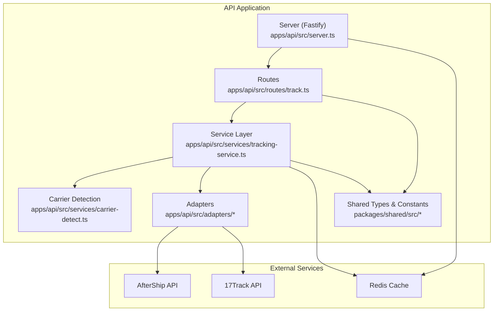
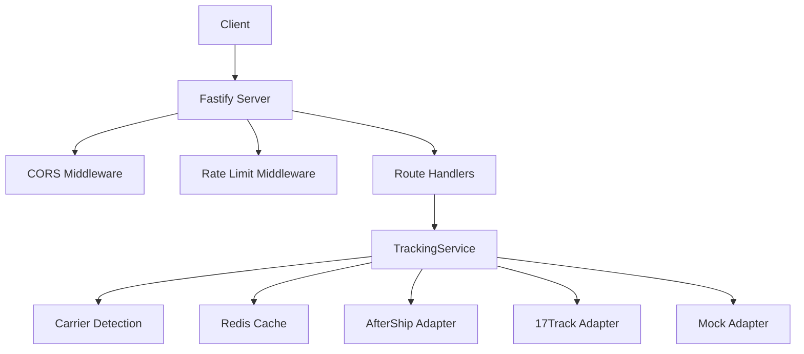
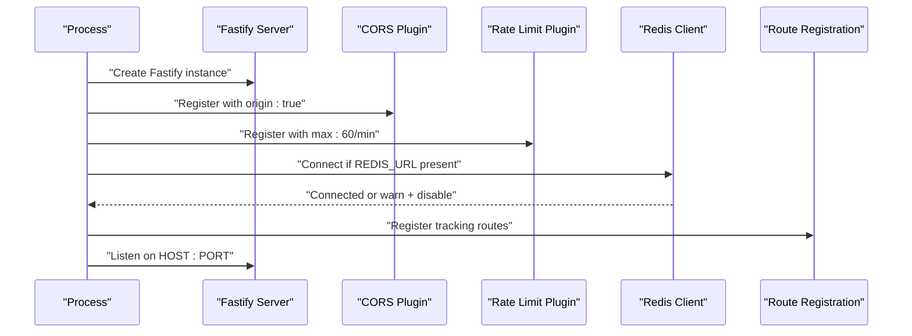
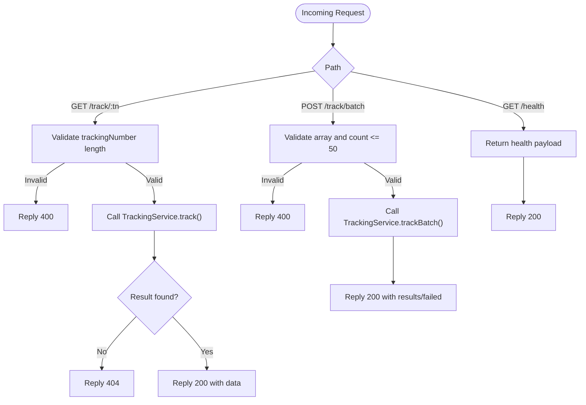
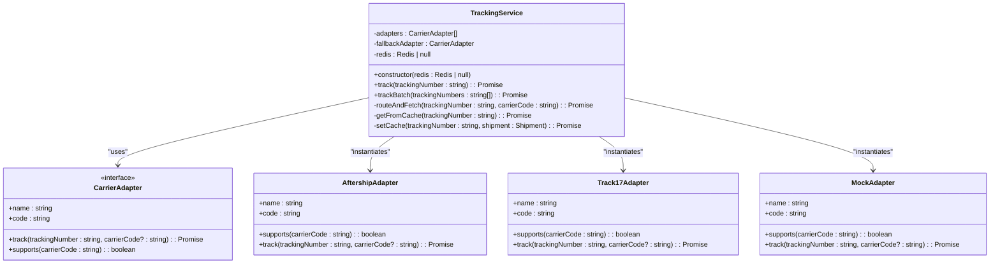
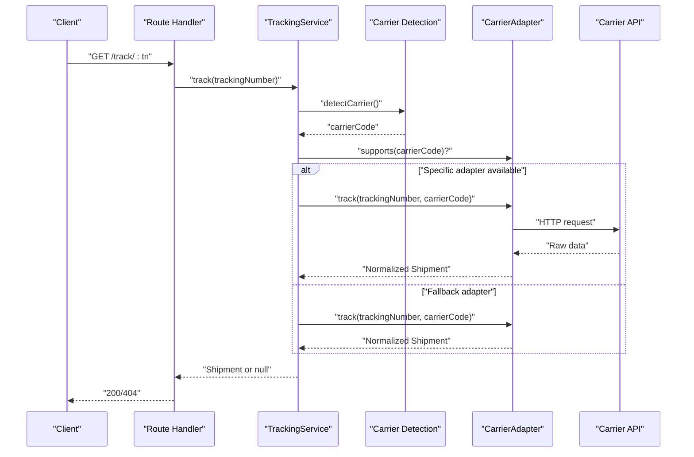
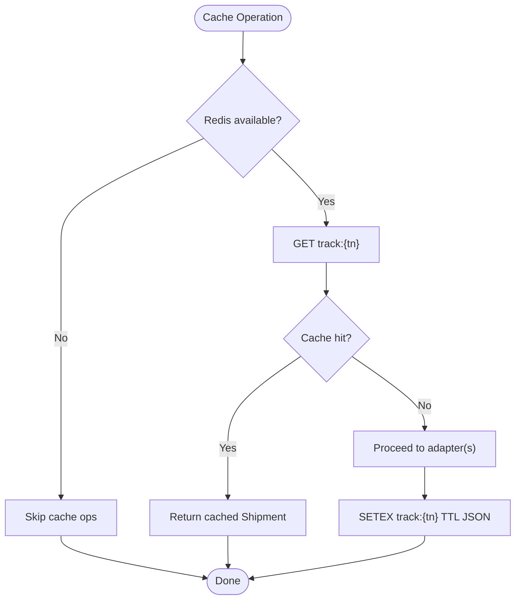
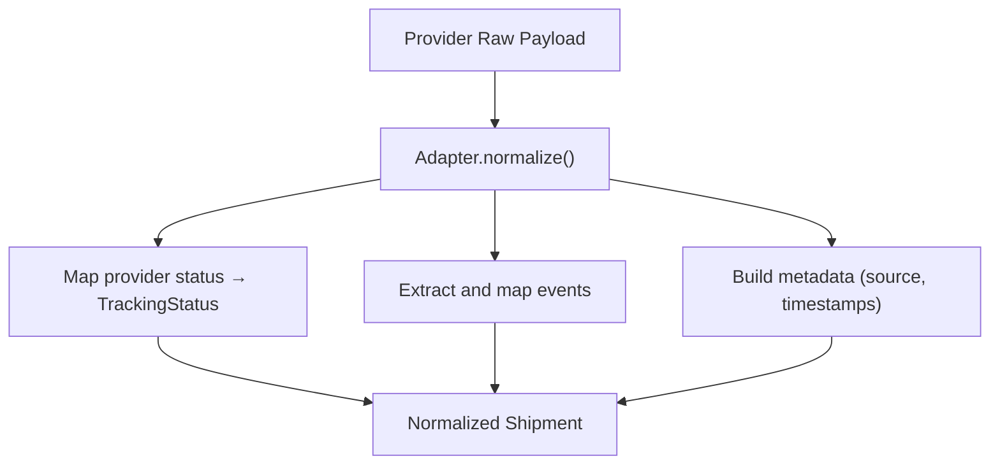
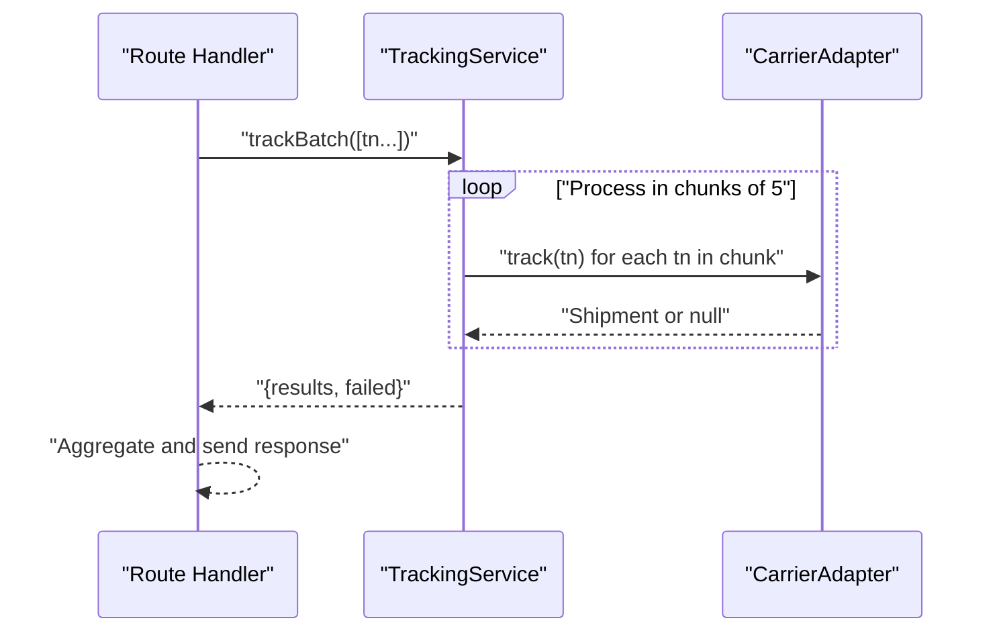
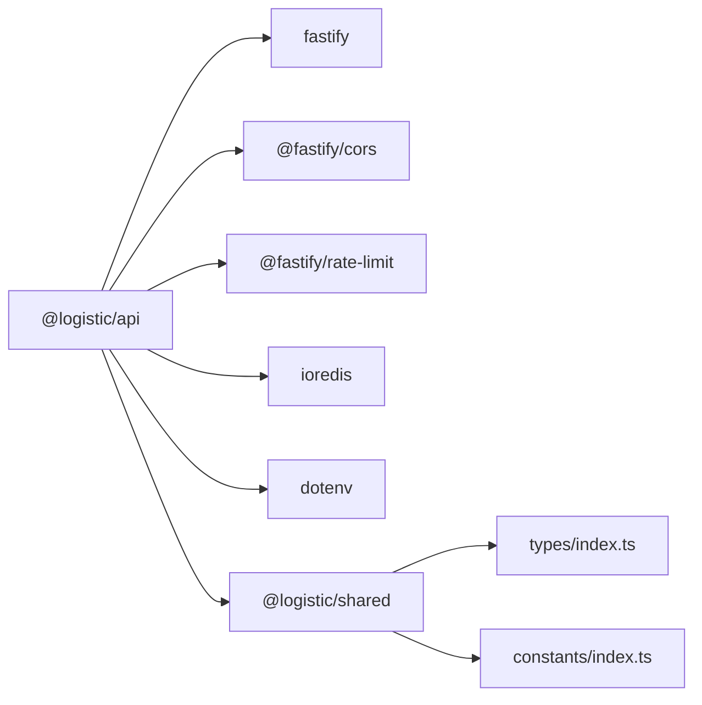

# Backend Architecture (Fastify)

<cite>
**Referenced Files in This Document**
- [server.ts](file://apps/api/src/server.ts)
- [track.ts](file://apps/api/src/routes/track.ts)
- [tracking-service.ts](file://apps/api/src/services/tracking-service.ts)
- [carrier-detect.ts](file://apps/api/src/services/carrier-detect.ts)
- [base-adapter.ts](file://apps/api/src/adapters/base-adapter.ts)
- [aftership-adapter.ts](file://apps/api/src/adapters/aftership-adapter.ts)
- [17track-adapter.ts](file://apps/api/src/adapters/17track-adapter.ts)
- [mock-adapter.ts](file://apps/api/src/adapters/mock-adapter.ts)
- [types/index.ts](file://packages/shared/src/types/index.ts)
- [constants/index.ts](file://packages/shared/src/constants/index.ts)
- [package.json](file://apps/api/package.json)
- [shared package.json](file://packages/shared/package.json)
- [root package.json](file://package.json)
- [docker-compose.yml](file://docker-compose.yml)
</cite>

## Table of Contents
1. [Introduction](#introduction)
2. [Project Structure](#project-structure)
3. [Core Components](#core-components)
4. [Architecture Overview](#architecture-overview)
5. [Detailed Component Analysis](#detailed-component-analysis)
6. [Dependency Analysis](#dependency-analysis)
7. [Performance Considerations](#performance-considerations)
8. [Security Considerations](#security-considerations)
9. [Monitoring and Observability](#monitoring-and-observability)
10. [Troubleshooting Guide](#troubleshooting-guide)
11. [Conclusion](#conclusion)

## Introduction
This document describes the backend architecture of the Fastify-based tracking service. It explains the microservice-style API design, server initialization, middleware configuration, route organization, service layer architecture, dependency injection patterns, error handling strategies, adapter pattern implementation for carrier integrations, caching layer with Redis, data transformation processes, request-response flow, validation patterns, performance optimization techniques, security considerations, rate limiting, and monitoring capabilities.

## Project Structure
The backend is organized as a Fastify application with clear separation of concerns:
- Server initialization and middleware registration
- Route handlers for tracking endpoints
- Service layer orchestrating business logic
- Adapter implementations for carrier APIs
- Shared types and constants consumed by both backend and frontend

**Diagram sources**
- [server.ts:13-54](file://apps/api/src/server.ts#L13-L54)
- [track.ts:5-74](file://apps/api/src/routes/track.ts#L5-L74)
- [tracking-service.ts:10-38](file://apps/api/src/services/tracking-service.ts#L10-L38)
- [carrier-detect.ts:7-26](file://apps/api/src/services/carrier-detect.ts#L7-L26)
- [base-adapter.ts:4-18](file://apps/api/src/adapters/base-adapter.ts#L4-L18)
- [aftership-adapter.ts:23-35](file://apps/api/src/adapters/aftership-adapter.ts#L23-L35)
- [17track-adapter.ts:21-38](file://apps/api/src/adapters/17track-adapter.ts#L21-L38)
- [mock-adapter.ts:7-13](file://apps/api/src/adapters/mock-adapter.ts#L7-L13)
- [types/index.ts:1-101](file://packages/shared/src/types/index.ts#L1-L101)
- [constants/index.ts:1-103](file://packages/shared/src/constants/index.ts#L1-L103)

**Section sources**
- [server.ts:13-54](file://apps/api/src/server.ts#L13-L54)
- [track.ts:5-74](file://apps/api/src/routes/track.ts#L5-L74)
- [tracking-service.ts:10-38](file://apps/api/src/services/tracking-service.ts#L10-L38)
- [base-adapter.ts:4-18](file://apps/api/src/adapters/base-adapter.ts#L4-L18)
- [types/index.ts:1-101](file://packages/shared/src/types/index.ts#L1-L101)
- [constants/index.ts:1-103](file://packages/shared/src/constants/index.ts#L1-L103)

## Core Components
- Fastify server with CORS and rate limiting enabled during startup
- Redis integration with graceful degradation when unavailable
- Route handlers for single tracking, batch tracking, and health checks
- Tracking service orchestrating cache, carrier detection, adapter routing, and normalization
- Adapter implementations for AfterShip and 17Track, plus a development mock adapter
- Shared domain types and constants for status, locations, and cache TTLs

**Section sources**
- [server.ts:13-54](file://apps/api/src/server.ts#L13-L54)
- [track.ts:5-74](file://apps/api/src/routes/track.ts#L5-L74)
- [tracking-service.ts:10-127](file://apps/api/src/services/tracking-service.ts#L10-L127)
- [base-adapter.ts:4-39](file://apps/api/src/adapters/base-adapter.ts#L4-L39)
- [types/index.ts:1-101](file://packages/shared/src/types/index.ts#L1-L101)
- [constants/index.ts:31-43](file://packages/shared/src/constants/index.ts#L31-L43)

## Architecture Overview
The system follows a layered architecture:
- Presentation layer: Fastify routes
- Application layer: TrackingService orchestrates work
- Domain layer: Shared types and constants
- Infrastructure layer: Adapters for external carriers and Redis cache

**Diagram sources**
- [server.ts:16-23](file://apps/api/src/server.ts#L16-L23)
- [track.ts:9-73](file://apps/api/src/routes/track.ts#L9-L73)
- [tracking-service.ts:40-105](file://apps/api/src/services/tracking-service.ts#L40-L105)
- [aftership-adapter.ts:23-64](file://apps/api/src/adapters/aftership-adapter.ts#L23-L64)
- [17track-adapter.ts:21-61](file://apps/api/src/adapters/17track-adapter.ts#L21-L61)
- [mock-adapter.ts:7-13](file://apps/api/src/adapters/mock-adapter.ts#L7-L13)

## Detailed Component Analysis

### Server Initialization and Middleware
- Loads environment variables via dotenv
- Registers CORS allowing dynamic origins
- Registers rate limiting with 60 requests per minute
- Establishes optional Redis connection with retry strategy and graceful fallback
- Registers tracking routes and starts the server

**Diagram sources**
- [server.ts:13-54](file://apps/api/src/server.ts#L13-L54)

**Section sources**
- [server.ts:13-54](file://apps/api/src/server.ts#L13-L54)

### Route Organization and Validation
- GET /api/v1/track/:trackingNumber validates minimum length and delegates to TrackingService
- POST /api/v1/track/batch validates array presence and size limits, then calls TrackingService.trackBatch
- GET /api/v1/health returns runtime status and Redis connectivity state

**Diagram sources**
- [track.ts:9-73](file://apps/api/src/routes/track.ts#L9-L73)

**Section sources**
- [track.ts:9-73](file://apps/api/src/routes/track.ts#L9-L73)

### Service Layer Architecture and Dependency Injection
- TrackingService constructor accepts Redis client (null if disabled)
- Builds adapter chain from environment-configured providers
- Provides track() and trackBatch() orchestration methods
- Implements cache read/write and TTL selection based on status

**Diagram sources**
- [tracking-service.ts:10-38](file://apps/api/src/services/tracking-service.ts#L10-L38)
- [base-adapter.ts:4-18](file://apps/api/src/adapters/base-adapter.ts#L4-L18)
- [aftership-adapter.ts:23-35](file://apps/api/src/adapters/aftership-adapter.ts#L23-L35)
- [17track-adapter.ts:21-38](file://apps/api/src/adapters/17track-adapter.ts#L21-L38)
- [mock-adapter.ts:7-13](file://apps/api/src/adapters/mock-adapter.ts#L7-L13)

**Section sources**
- [tracking-service.ts:10-127](file://apps/api/src/services/tracking-service.ts#L10-L127)
- [base-adapter.ts:4-39](file://apps/api/src/adapters/base-adapter.ts#L4-L39)

### Adapter Pattern Implementation
- Base interface defines track() and supports() contract
- AfterShipAdapter supports all carriers and auto-detects carrier slugs
- Track17Adapter specializes in China-origin carriers and detects customs events
- MockAdapter provides deterministic responses for development

**Diagram sources**
- [tracking-service.ts:93-105](file://apps/api/src/services/tracking-service.ts#L93-L105)
- [carrier-detect.ts:7-17](file://apps/api/src/services/carrier-detect.ts#L7-L17)
- [aftership-adapter.ts:37-64](file://apps/api/src/adapters/aftership-adapter.ts#L37-L64)
- [17track-adapter.ts:40-61](file://apps/api/src/adapters/17track-adapter.ts#L40-L61)
- [mock-adapter.ts:15-72](file://apps/api/src/adapters/mock-adapter.ts#L15-L72)

**Section sources**
- [base-adapter.ts:4-39](file://apps/api/src/adapters/base-adapter.ts#L4-L39)
- [aftership-adapter.ts:23-151](file://apps/api/src/adapters/aftership-adapter.ts#L23-L151)
- [17track-adapter.ts:21-118](file://apps/api/src/adapters/17track-adapter.ts#L21-L118)
- [mock-adapter.ts:7-74](file://apps/api/src/adapters/mock-adapter.ts#L7-L74)

### Caching Layer with Redis
- Cache key pattern: track:{number}
- TTL determined by current status via shared constants
- Read-through and write-through with non-fatal failures
- Graceful degradation when Redis is unavailable

**Diagram sources**
- [tracking-service.ts:107-126](file://apps/api/src/services/tracking-service.ts#L107-L126)
- [constants/index.ts:31-43](file://packages/shared/src/constants/index.ts#L31-L43)

**Section sources**
- [tracking-service.ts:107-126](file://apps/api/src/services/tracking-service.ts#L107-L126)
- [constants/index.ts:31-43](file://packages/shared/src/constants/index.ts#L31-L43)

### Data Transformation and Normalization
- Adapters convert provider-specific payloads into a normalized Shipment model
- Status mapping ensures consistent TrackingStatus across providers
- Location and metadata fields standardized for downstream consumers

**Diagram sources**
- [aftership-adapter.ts:106-149](file://apps/api/src/adapters/aftership-adapter.ts#L106-L149)
- [17track-adapter.ts:63-116](file://apps/api/src/adapters/17track-adapter.ts#L63-L116)
- [types/index.ts:48-67](file://packages/shared/src/types/index.ts#L48-L67)

**Section sources**
- [aftership-adapter.ts:106-149](file://apps/api/src/adapters/aftership-adapter.ts#L106-L149)
- [17track-adapter.ts:63-116](file://apps/api/src/adapters/17track-adapter.ts#L63-L116)
- [types/index.ts:48-67](file://packages/shared/src/types/index.ts#L48-L67)

### Batch Processing and Concurrency Control
- Batch endpoint enforces maximum batch size
- Processes batches with controlled concurrency to avoid overload
- Aggregates successful results and failed items with reasons

**Diagram sources**
- [tracking-service.ts:64-91](file://apps/api/src/services/tracking-service.ts#L64-L91)
- [track.ts:38-63](file://apps/api/src/routes/track.ts#L38-L63)

**Section sources**
- [tracking-service.ts:64-91](file://apps/api/src/services/tracking-service.ts#L64-L91)
- [track.ts:38-63](file://apps/api/src/routes/track.ts#L38-L63)

## Dependency Analysis
- Runtime dependencies include Fastify, CORS, rate-limit, ioredis, and dotenv
- Workspace dependency on @logistic/shared provides types and constants
- Root workspace scripts enable parallel development across API and web apps

**Diagram sources**
- [package.json:13-20](file://apps/api/package.json#L13-L20)
- [shared package.json:8-12](file://packages/shared/package.json#L8-L12)
- [root package.json:6-12](file://package.json#L6-L12)

**Section sources**
- [package.json:13-20](file://apps/api/package.json#L13-L20)
- [shared package.json:8-12](file://packages/shared/package.json#L8-L12)
- [root package.json:6-12](file://package.json#L6-L12)

## Performance Considerations
- Redis caching reduces repeated external API calls and improves latency
- Cache TTL varies by status to balance freshness and performance
- Batch processing uses controlled concurrency to prevent overload
- Graceful Redis failure prevents cascading outages
- Rate limiting protects upstream providers and maintains QoS

[No sources needed since this section provides general guidance]

## Security Considerations
- CORS enabled with dynamic origin acceptance; ensure deployment restricts origins in production
- API keys for carrier integrations are loaded from environment variables
- Rate limiting mitigates abuse; consider per-user quotas and IP-based limits for stronger protection
- Health endpoint exposes minimal operational information; avoid leaking internal details

[No sources needed since this section provides general guidance]

## Monitoring and Observability
- Fastify logger enabled for request logs and errors
- Redis ping and error handling emit warnings; consider structured metrics
- Health endpoint reports Redis connectivity status
- Consider adding request tracing, metrics collection, and error reporting libraries for production-grade observability

[No sources needed since this section provides general guidance]

## Troubleshooting Guide
Common issues and resolutions:
- Redis unavailable: server continues without cache; verify REDIS_URL and connectivity
- No API keys configured: falls back to mock adapter for development
- Invalid tracking number: route returns 400 with error message
- Tracking not found: route returns 404 with error message
- Batch size exceeded: route returns 400 with error message
- Adapter failures: normalized null result; check provider credentials and network

**Section sources**
- [server.ts:25-46](file://apps/api/src/server.ts#L25-L46)
- [tracking-service.ts:32-34](file://apps/api/src/services/tracking-service.ts#L32-L34)
- [track.ts:14-19](file://apps/api/src/routes/track.ts#L14-L19)
- [track.ts:23-28](file://apps/api/src/routes/track.ts#L23-L28)
- [track.ts:50-55](file://apps/api/src/routes/track.ts#L50-L55)

## Conclusion
The Fastify backend implements a clean, modular architecture with clear separation between presentation, application, domain, and infrastructure layers. The adapter pattern enables extensible carrier integrations, while Redis caching and batch processing optimize performance. Robust validation, graceful error handling, and rate limiting contribute to reliability. With proper environment configuration and observability instrumentation, this service is well-positioned to scale and evolve.