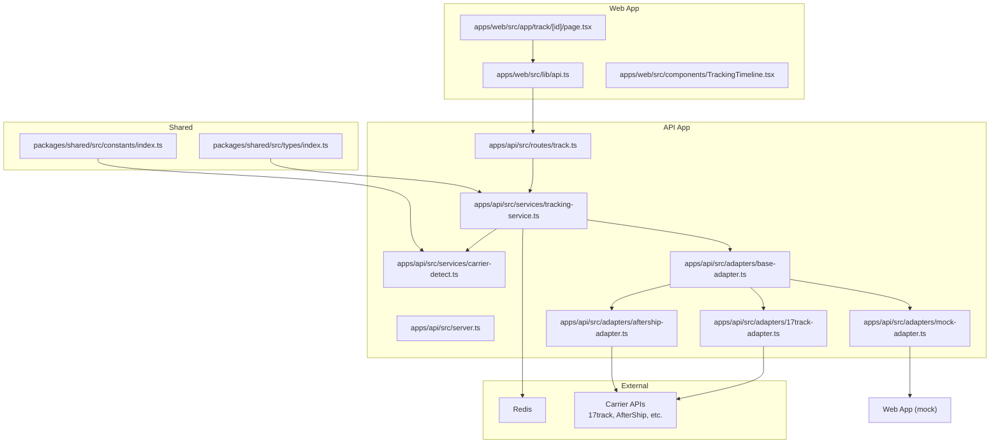
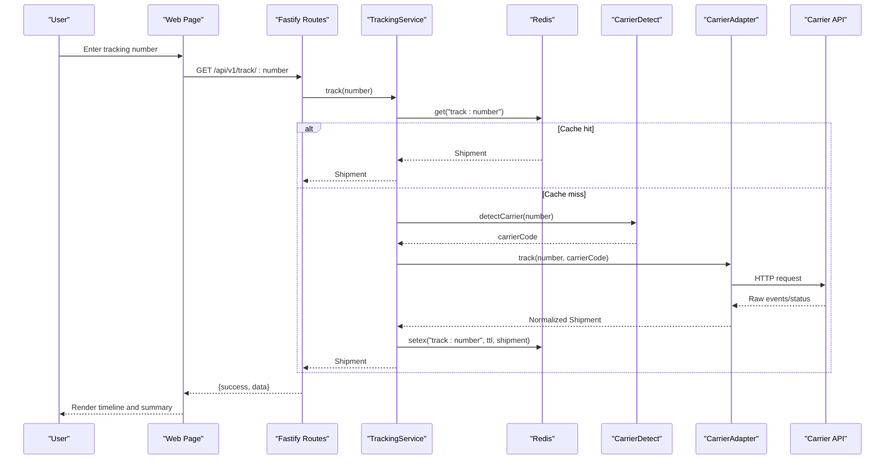
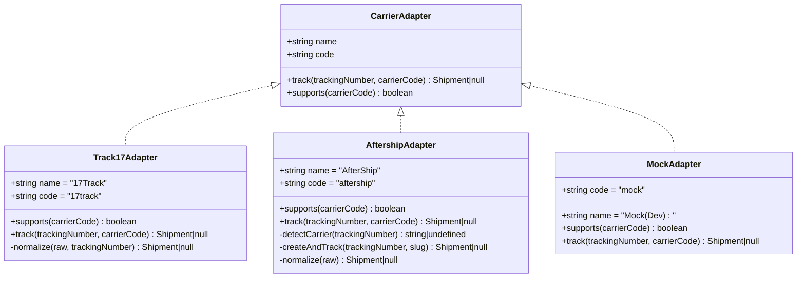
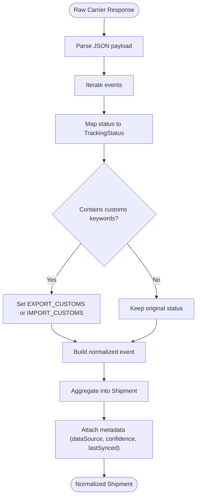
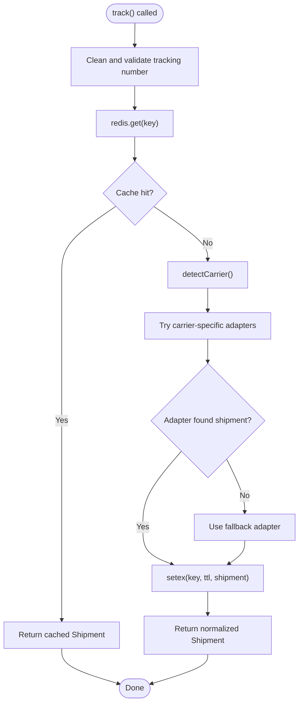
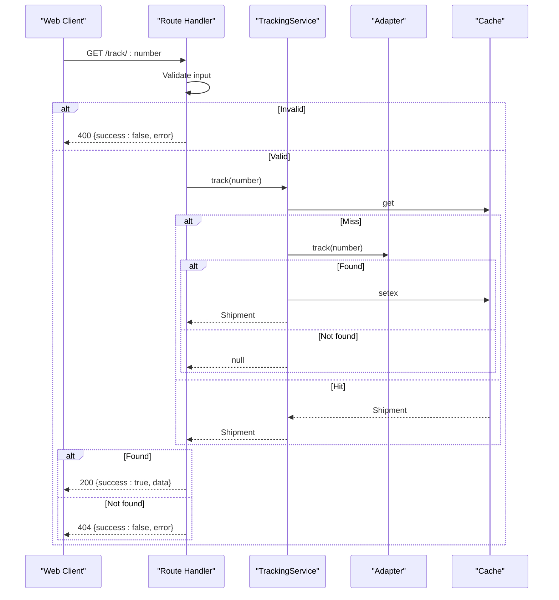
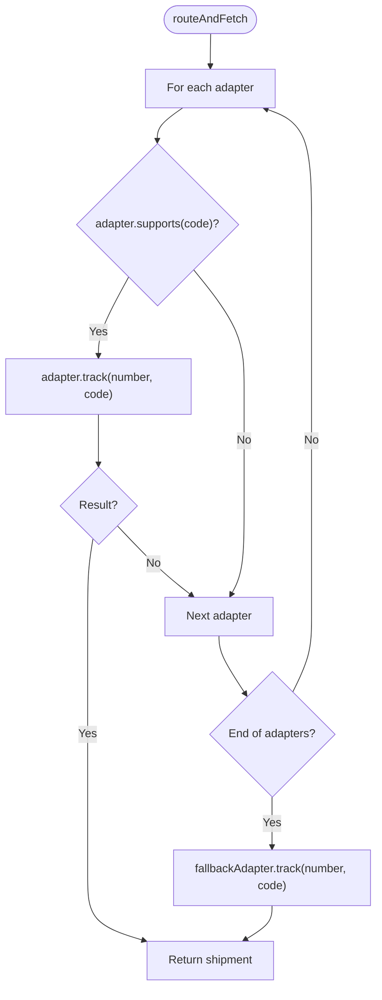
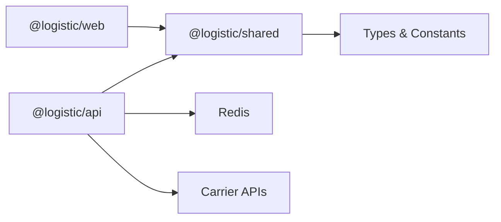

# Data Flow and Communication Patterns

<cite>
**Referenced Files in This Document**
- [apps/api/src/server.ts](file://apps/api/src/server.ts)
- [apps/api/src/routes/track.ts](file://apps/api/src/routes/track.ts)
- [apps/api/src/services/tracking-service.ts](file://apps/api/src/services/tracking-service.ts)
- [apps/api/src/services/carrier-detect.ts](file://apps/api/src/services/carrier-detect.ts)
- [apps/api/src/adapters/base-adapter.ts](file://apps/api/src/adapters/base-adapter.ts)
- [apps/api/src/adapters/17track-adapter.ts](file://apps/api/src/adapters/17track-adapter.ts)
- [apps/api/src/adapters/aftership-adapter.ts](file://apps/api/src/adapters/aftership-adapter.ts)
- [apps/api/src/adapters/mock-adapter.ts](file://apps/api/src/adapters/mock-adapter.ts)
- [packages/shared/src/types/index.ts](file://packages/shared/src/types/index.ts)
- [packages/shared/src/constants/index.ts](file://packages/shared/src/constants/index.ts)
- [apps/web/src/lib/api.ts](file://apps/web/src/lib/api.ts)
- [apps/web/src/app/api/v1/track/[trackingNumber]/route.ts](file://apps/web/src/app/api/v1/track/[trackingNumber]/route.ts)
- [apps/web/src/app/track/[id]/page.tsx](file://apps/web/src/app/track/[id]/page.tsx)
- [apps/web/src/components/TrackingTimeline.tsx](file://apps/web/src/components/TrackingTimeline.tsx)
- [docker-compose.yml](file://docker-compose.yml)
- [package.json](file://package.json)
- [apps/api/package.json](file://apps/api/package.json)
- [apps/web/package.json](file://apps/web/package.json)
</cite>

## Table of Contents
1. [Introduction](#introduction)
2. [Project Structure](#project-structure)
3. [Core Components](#core-components)
4. [Architecture Overview](#architecture-overview)
5. [Detailed Component Analysis](#detailed-component-analysis)
6. [Dependency Analysis](#dependency-analysis)
7. [Performance Considerations](#performance-considerations)
8. [Troubleshooting Guide](#troubleshooting-guide)
9. [Conclusion](#conclusion)

## Introduction
This document explains the end-to-end data flow and communication mechanisms in the LOGISTIC system. It covers how user input is processed through frontend components, API requests, backend orchestration, carrier integrations, caching, and response delivery. It documents the adapter pattern for carrier API communication, data normalization and status standardization, cache management strategies, request-response patterns, error propagation, fallback mechanisms, and performance optimizations.

## Project Structure
The system is a monorepo with two applications and a shared package:
- Web application (Next.js) handles user-facing pages and client-side rendering.
- API application (Fastify) exposes REST endpoints for tracking and integrates with carrier APIs.
- Shared package defines types, constants, and enums used across the system.

**Diagram sources**
- [apps/web/src/app/track/[id]/page.tsx](file://apps/web/src/app/track/[id]/page.tsx#L1-L263)
- [apps/web/src/lib/api.ts:1-56](file://apps/web/src/lib/api.ts#L1-L56)
- [apps/api/src/server.ts:1-60](file://apps/api/src/server.ts#L1-L60)
- [apps/api/src/routes/track.ts:1-75](file://apps/api/src/routes/track.ts#L1-L75)
- [apps/api/src/services/tracking-service.ts:1-128](file://apps/api/src/services/tracking-service.ts#L1-L128)
- [apps/api/src/services/carrier-detect.ts:1-27](file://apps/api/src/services/carrier-detect.ts#L1-L27)
- [apps/api/src/adapters/base-adapter.ts:1-39](file://apps/api/src/adapters/base-adapter.ts#L1-L39)
- [apps/api/src/adapters/17track-adapter.ts:1-118](file://apps/api/src/adapters/17track-adapter.ts#L1-L118)
- [apps/api/src/adapters/aftership-adapter.ts:1-151](file://apps/api/src/adapters/aftership-adapter.ts#L1-L151)
- [apps/api/src/adapters/mock-adapter.ts:1-74](file://apps/api/src/adapters/mock-adapter.ts#L1-L74)
- [packages/shared/src/types/index.ts:1-101](file://packages/shared/src/types/index.ts#L1-L101)
- [packages/shared/src/constants/index.ts:1-103](file://packages/shared/src/constants/index.ts#L1-L103)

**Section sources**
- [package.json:1-19](file://package.json#L1-L19)
- [apps/api/package.json:1-27](file://apps/api/package.json#L1-L27)
- [apps/web/package.json:1-30](file://apps/web/package.json#L1-L30)

## Core Components
- Adapter Pattern: A unified interface for carrier integrations with concrete implementations for 17track, AfterShip, and a mock adapter. This enables pluggable carrier support and standardized response normalization.
- Tracking Service: Orchestrates cache checks, carrier detection, adapter routing, and caching of normalized results.
- Routes: Expose REST endpoints for single and batch tracking, plus health checks.
- Frontend: Provides user input, displays results, and handles errors with localized messages.
- Shared Types and Constants: Define the canonical Shipment model, TrackingStatus, cache TTLs, and carrier detection patterns.

**Section sources**
- [apps/api/src/adapters/base-adapter.ts:1-39](file://apps/api/src/adapters/base-adapter.ts#L1-L39)
- [apps/api/src/adapters/17track-adapter.ts:1-118](file://apps/api/src/adapters/17track-adapter.ts#L1-L118)
- [apps/api/src/adapters/aftership-adapter.ts:1-151](file://apps/api/src/adapters/aftership-adapter.ts#L1-L151)
- [apps/api/src/adapters/mock-adapter.ts:1-74](file://apps/api/src/adapters/mock-adapter.ts#L1-L74)
- [apps/api/src/services/tracking-service.ts:1-128](file://apps/api/src/services/tracking-service.ts#L1-L128)
- [apps/api/src/routes/track.ts:1-75](file://apps/api/src/routes/track.ts#L1-L75)
- [packages/shared/src/types/index.ts:1-101](file://packages/shared/src/types/index.ts#L1-L101)
- [packages/shared/src/constants/index.ts:1-103](file://packages/shared/src/constants/index.ts#L1-L103)

## Architecture Overview
The system follows a layered architecture:
- Presentation Layer (Web): Renders UI, collects user input, and calls API endpoints.
- API Layer (Fastify): Validates requests, delegates to TrackingService, and returns normalized responses.
- Integration Layer (Adapters): Communicates with external carrier APIs, normalizes responses, and standardizes statuses.
- Data Layer: Uses Redis for caching and PostgreSQL for persistent storage (configured via docker-compose).

**Diagram sources**
- [apps/web/src/app/track/[id]/page.tsx](file://apps/web/src/app/track/[id]/page.tsx#L1-L263)
- [apps/web/src/lib/api.ts:1-56](file://apps/web/src/lib/api.ts#L1-L56)
- [apps/api/src/routes/track.ts:1-75](file://apps/api/src/routes/track.ts#L1-L75)
- [apps/api/src/services/tracking-service.ts:1-128](file://apps/api/src/services/tracking-service.ts#L1-L128)
- [apps/api/src/services/carrier-detect.ts:1-27](file://apps/api/src/services/carrier-detect.ts#L1-L27)
- [apps/api/src/adapters/base-adapter.ts:1-39](file://apps/api/src/adapters/base-adapter.ts#L1-L39)
- [apps/api/src/adapters/17track-adapter.ts:1-118](file://apps/api/src/adapters/17track-adapter.ts#L1-L118)
- [apps/api/src/adapters/aftership-adapter.ts:1-151](file://apps/api/src/adapters/aftership-adapter.ts#L1-L151)
- [apps/api/src/adapters/mock-adapter.ts:1-74](file://apps/api/src/adapters/mock-adapter.ts#L1-L74)

## Detailed Component Analysis

### Adapter Pattern Implementation
The adapter pattern encapsulates carrier-specific API differences behind a common interface. The base interface defines:
- Name and code identifiers
- A track method returning a normalized Shipment or null
- A supports method to determine compatibility

Concrete adapters:
- 17trackAdapter: Maps 17track status codes to standard statuses, detects customs events, and normalizes to Shipment.
- AftershipAdapter: Acts as a universal fallback supporting many carriers, with optional carrier detection and creation flows.
- MockAdapter: Provides deterministic sample data for development and testing.

**Diagram sources**
- [apps/api/src/adapters/base-adapter.ts:1-39](file://apps/api/src/adapters/base-adapter.ts#L1-L39)
- [apps/api/src/adapters/17track-adapter.ts:1-118](file://apps/api/src/adapters/17track-adapter.ts#L1-L118)
- [apps/api/src/adapters/aftership-adapter.ts:1-151](file://apps/api/src/adapters/aftership-adapter.ts#L1-L151)
- [apps/api/src/adapters/mock-adapter.ts:1-74](file://apps/api/src/adapters/mock-adapter.ts#L1-L74)

**Section sources**
- [apps/api/src/adapters/base-adapter.ts:1-39](file://apps/api/src/adapters/base-adapter.ts#L1-L39)
- [apps/api/src/adapters/17track-adapter.ts:1-118](file://apps/api/src/adapters/17track-adapter.ts#L1-L118)
- [apps/api/src/adapters/aftership-adapter.ts:1-151](file://apps/api/src/adapters/aftership-adapter.ts#L1-L151)
- [apps/api/src/adapters/mock-adapter.ts:1-74](file://apps/api/src/adapters/mock-adapter.ts#L1-L74)

### Data Normalization and Status Standardization
Normalization ensures all carrier responses conform to the shared Shipment model:
- Event timestamps, locations, and descriptions are mapped consistently.
- Status codes are translated to a unified TrackingStatus enum.
- Origin/destination metadata is standardized, with partial data filled when unavailable.
- Confidence and data source metadata are attached for provenance and quality indication.

**Diagram sources**
- [apps/api/src/adapters/17track-adapter.ts:63-116](file://apps/api/src/adapters/17track-adapter.ts#L63-L116)
- [apps/api/src/adapters/aftership-adapter.ts:106-149](file://apps/api/src/adapters/aftership-adapter.ts#L106-L149)
- [packages/shared/src/types/index.ts:1-101](file://packages/shared/src/types/index.ts#L1-L101)

**Section sources**
- [apps/api/src/adapters/17track-adapter.ts:63-116](file://apps/api/src/adapters/17track-adapter.ts#L63-L116)
- [apps/api/src/adapters/aftership-adapter.ts:106-149](file://apps/api/src/adapters/aftership-adapter.ts#L106-L149)
- [packages/shared/src/types/index.ts:1-101](file://packages/shared/src/types/index.ts#L1-L101)

### Cache Management Strategies
Caching reduces latency and API load:
- Cache key: "track:{trackingNumber}"
- TTL varies by current status to balance freshness and cost.
- Write failures are non-fatal and do not break the request path.
- Redis connection is optional; graceful degradation occurs when unavailable.

**Diagram sources**
- [apps/api/src/services/tracking-service.ts:40-126](file://apps/api/src/services/tracking-service.ts#L40-L126)
- [packages/shared/src/constants/index.ts:31-43](file://packages/shared/src/constants/index.ts#L31-L43)

**Section sources**
- [apps/api/src/services/tracking-service.ts:107-126](file://apps/api/src/services/tracking-service.ts#L107-L126)
- [packages/shared/src/constants/index.ts:31-43](file://packages/shared/src/constants/index.ts#L31-L43)

### Request-Response Patterns and Error Propagation
- Validation: Requests are validated for minimum length and presence of tracking numbers.
- Single tracking endpoint returns either success with data or a structured error.
- Batch tracking enforces a maximum batch size and returns partial results with a failed list.
- Health endpoint reports runtime status and Redis availability.
- Frontend handles HTTP errors and JSON parsing errors, displaying user-friendly messages.

**Diagram sources**
- [apps/api/src/routes/track.ts:8-35](file://apps/api/src/routes/track.ts#L8-L35)
- [apps/api/src/services/tracking-service.ts:40-62](file://apps/api/src/services/tracking-service.ts#L40-L62)
- [apps/web/src/lib/api.ts:5-27](file://apps/web/src/lib/api.ts#L5-L27)

**Section sources**
- [apps/api/src/routes/track.ts:8-35](file://apps/api/src/routes/track.ts#L8-L35)
- [apps/web/src/lib/api.ts:5-27](file://apps/web/src/lib/api.ts#L5-L27)

### Fallback Mechanisms
- Adapter selection prioritizes carriers supported by the detected carrier code.
- If none match, the fallback adapter (AfterShip or Mock) is used.
- The fallback adapter is designed to work broadly and provide a consistent response shape.

**Diagram sources**
- [apps/api/src/services/tracking-service.ts:93-105](file://apps/api/src/services/tracking-service.ts#L93-L105)

**Section sources**
- [apps/api/src/services/tracking-service.ts:93-105](file://apps/api/src/services/tracking-service.ts#L93-L105)

### Data Transformation Examples
- Carrier detection: Uses regex patterns to infer carrier codes from tracking numbers.
- Status mapping: Converts provider-specific statuses to a unified enum.
- Timeline rendering: The frontend composes localized descriptions, dates, and status badges from normalized events.

**Section sources**
- [apps/api/src/services/carrier-detect.ts:7-26](file://apps/api/src/services/carrier-detect.ts#L7-L26)
- [packages/shared/src/constants/index.ts:59-75](file://packages/shared/src/constants/index.ts#L59-L75)
- [apps/web/src/components/TrackingTimeline.tsx:42-125](file://apps/web/src/components/TrackingTimeline.tsx#L42-L125)

## Dependency Analysis
The system exhibits clear separation of concerns:
- Web depends on shared types and calls API endpoints.
- API depends on shared types and adapters; adapters depend on shared status enums.
- Redis is optional; the system gracefully degrades when unavailable.
- Docker Compose provisions Redis and PostgreSQL for local development.

**Diagram sources**
- [apps/web/package.json:1-30](file://apps/web/package.json#L1-L30)
- [apps/api/package.json:1-27](file://apps/api/package.json#L1-L27)
- [packages/shared/src/types/index.ts:1-101](file://packages/shared/src/types/index.ts#L1-L101)
- [docker-compose.yml:1-23](file://docker-compose.yml#L1-L23)

**Section sources**
- [apps/web/package.json:1-30](file://apps/web/package.json#L1-L30)
- [apps/api/package.json:1-27](file://apps/api/package.json#L1-L27)
- [docker-compose.yml:1-23](file://docker-compose.yml#L1-L23)

## Performance Considerations
- Concurrency control: Batch processing limits concurrent adapter calls to avoid overload.
- Caching: Status-aware TTL minimizes repeated carrier calls and reduces latency.
- Optional Redis: Graceful degradation prevents outages when Redis is unavailable.
- Frontend UX: Loading states and error surfaces improve perceived performance and reliability.

**Section sources**
- [apps/api/src/services/tracking-service.ts:71-91](file://apps/api/src/services/tracking-service.ts#L71-L91)
- [apps/api/src/services/tracking-service.ts:118-126](file://apps/api/src/services/tracking-service.ts#L118-L126)
- [apps/api/src/server.ts:25-46](file://apps/api/src/server.ts#L25-L46)

## Troubleshooting Guide
Common issues and resolutions:
- Invalid tracking number: Ensure the number meets length and character requirements; the route handler returns a 400 error with a descriptive message.
- Tracking not found: The route handler returns a 404 with a structured error; confirm the number exists and the carrier is supported.
- Carrier API failures: Adapters return null on non-OK responses; the fallback adapter provides a consistent response shape.
- Redis unavailability: The server logs a warning and continues without cache; expect higher latency on subsequent requests.
- Frontend errors: The client handles HTTP errors and JSON parse errors, displaying user-friendly messages.

**Section sources**
- [apps/api/src/routes/track.ts:14-28](file://apps/api/src/routes/track.ts#L14-L28)
- [apps/api/src/adapters/17track-adapter.ts:40-61](file://apps/api/src/adapters/17track-adapter.ts#L40-L61)
- [apps/api/src/adapters/aftership-adapter.ts:37-64](file://apps/api/src/adapters/aftership-adapter.ts#L37-L64)
- [apps/api/src/server.ts:34-42](file://apps/api/src/server.ts#L34-L42)
- [apps/web/src/lib/api.ts:12-26](file://apps/web/src/lib/api.ts#L12-L26)

## Conclusion
The LOGISTIC system implements a robust, extensible data flow that transforms diverse carrier responses into a unified, cache-backed Shipment model. The adapter pattern cleanly isolates provider specifics, while shared types and constants ensure consistency across the stack. Performance is optimized through intelligent caching and controlled concurrency, and the system gracefully handles failures at every layer, providing reliable user experiences.