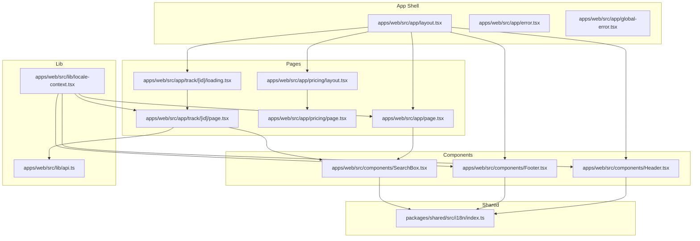
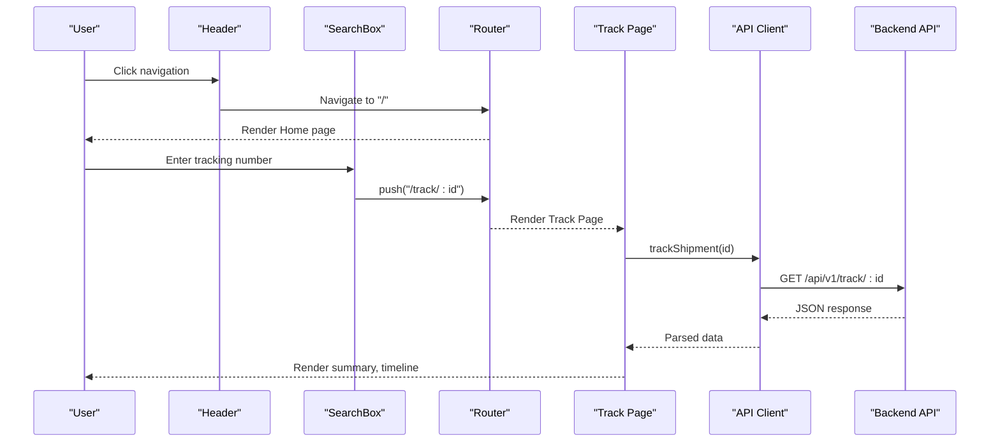
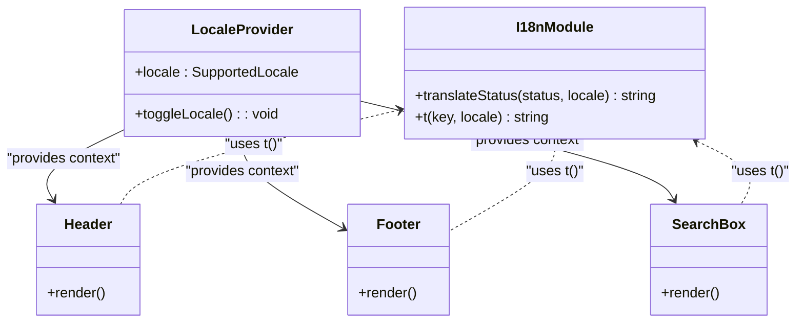
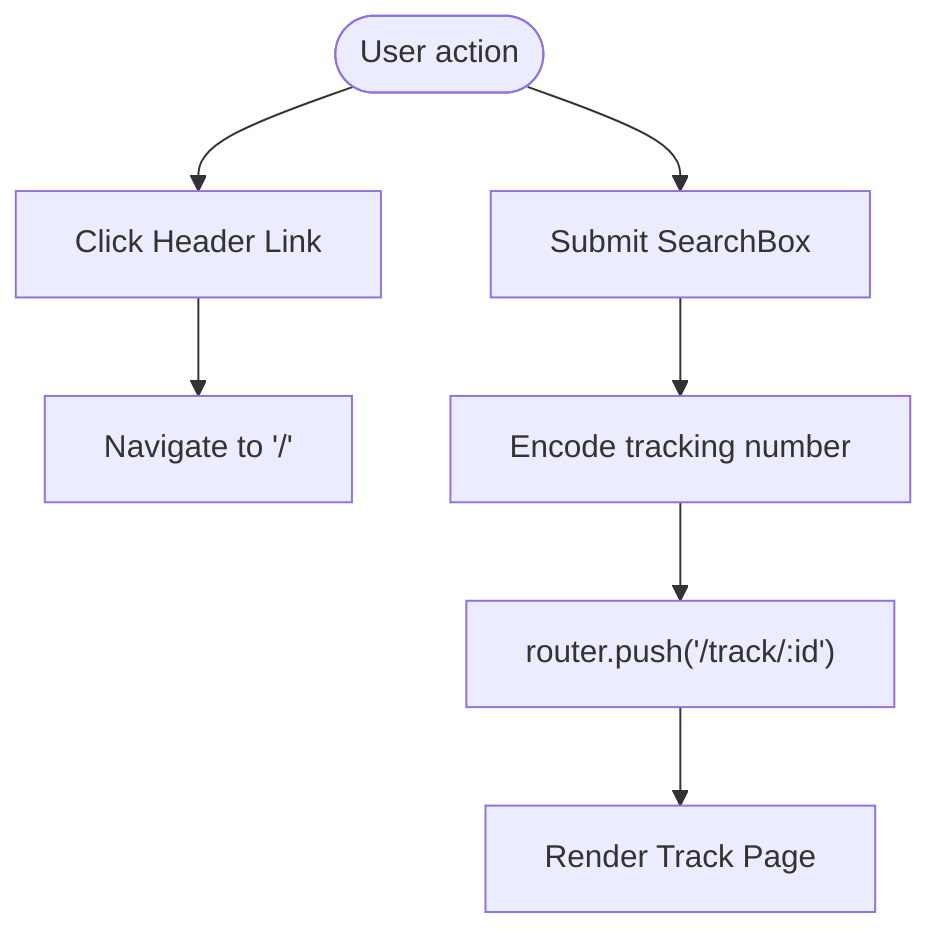
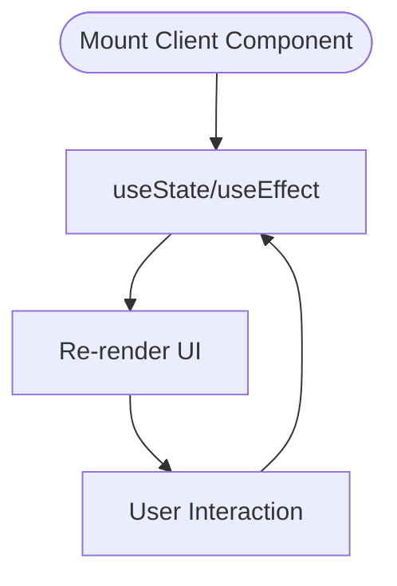
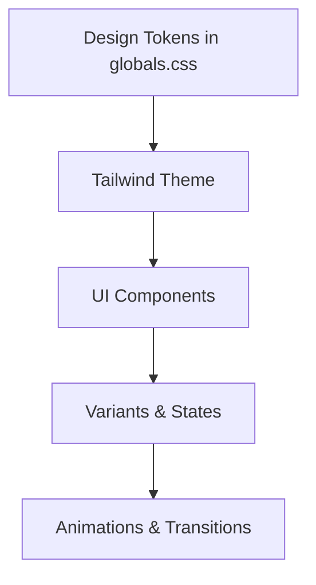
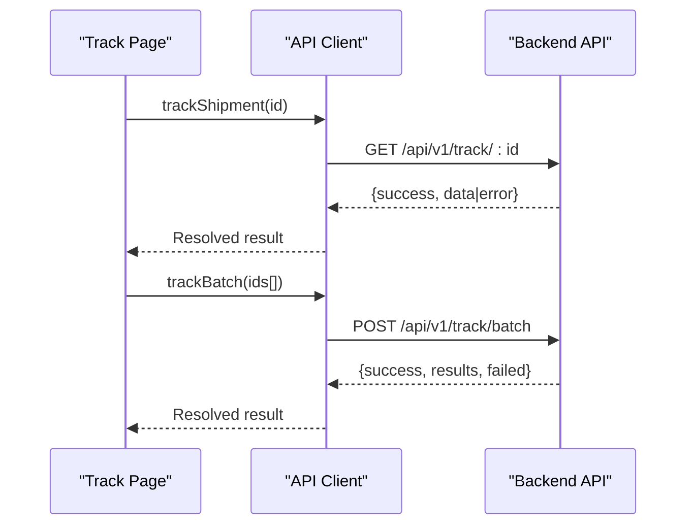
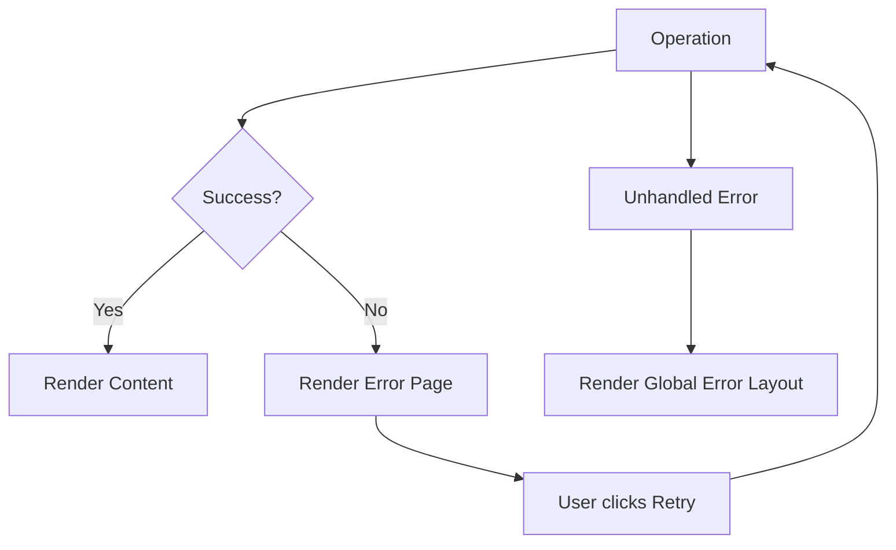
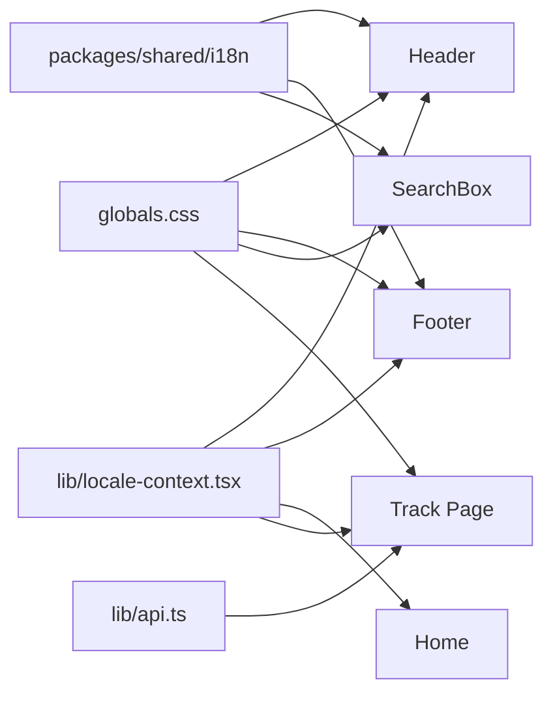

# Frontend Architecture (Next.js)

<cite>
**Referenced Files in This Document**
- [layout.tsx](file://apps/web/src/app/layout.tsx)
- [page.tsx](file://apps/web/src/app/page.tsx)
- [Header.tsx](file://apps/web/src/components/Header.tsx)
- [Footer.tsx](file://apps/web/src/components/Footer.tsx)
- [SearchBox.tsx](file://apps/web/src/components/SearchBox.tsx)
- [globals.css](file://apps/web/src/app/globals.css)
- [api.ts](file://apps/web/src/lib/api.ts)
- [locale-context.tsx](file://apps/web/src/lib/locale-context.tsx)
- [index.ts](file://packages/shared/src/i18n/index.ts)
- [layout.tsx](file://apps/web/src/app/pricing/layout.tsx)
- [page.tsx](file://apps/web/src/app/pricing/page.tsx)
- [page.tsx](file://apps/web/src/app/track/[id]/page.tsx)
- [loading.tsx](file://apps/web/src/app/track/[id]/loading.tsx)
- [error.tsx](file://apps/web/src/app/error.tsx)
- [global-error.tsx](file://apps/web/src/app/global-error.tsx)
</cite>

## Table of Contents
1. [Introduction](#introduction)
2. [Project Structure](#project-structure)
3. [Core Components](#core-components)
4. [Architecture Overview](#architecture-overview)
5. [Detailed Component Analysis](#detailed-component-analysis)
6. [Dependency Analysis](#dependency-analysis)
7. [Performance Considerations](#performance-considerations)
8. [Troubleshooting Guide](#troubleshooting-guide)
9. [Conclusion](#conclusion)

## Introduction
This document describes the frontend architecture of the Next.js application powering the TrackFlow cross-border shipment tracking platform. It explains the app router structure, page components organization, component hierarchy, state management patterns, styling approach using TailwindCSS, routing and navigation, internationalization, component composition, backend API integration, performance optimizations, SEO considerations, and responsive design.

## Project Structure
The frontend is organized under apps/web with:
- App Router pages under apps/web/src/app (app shell, pages, shared layouts, error boundaries)
- UI components under apps/web/src/components
- Shared i18n and types under packages/shared
- Styling via TailwindCSS and a centralized design system in apps/web/src/app/globals.css

**Diagram sources**
- [layout.tsx:24-43](file://apps/web/src/app/layout.tsx#L24-L43)
- [page.tsx:60-444](file://apps/web/src/app/page.tsx#L60-L444)
- [Header.tsx:8-58](file://apps/web/src/components/Header.tsx#L8-L58)
- [Footer.tsx:7-36](file://apps/web/src/components/Footer.tsx#L7-L36)
- [SearchBox.tsx:20-122](file://apps/web/src/components/SearchBox.tsx#L20-L122)
- [locale-context.tsx:16-32](file://apps/web/src/lib/locale-context.tsx#L16-L32)
- [api.ts:5-55](file://apps/web/src/lib/api.ts#L5-L55)
- [index.ts:1-61](file://packages/shared/src/i18n/index.ts#L1-L61)
- [layout.tsx:9-15](file://apps/web/src/app/pricing/layout.tsx#L9-L15)
- [page.tsx:97-216](file://apps/web/src/app/pricing/page.tsx#L97-L216)
- [page.tsx:25-242](file://apps/web/src/app/track/[id]/page.tsx#L25-L242)
- [loading.tsx:1-18](file://apps/web/src/app/track/[id]/loading.tsx#L1-L18)
- [error.tsx:6-51](file://apps/web/src/app/error.tsx#L6-L51)
- [global-error.tsx:3-52](file://apps/web/src/app/global-error.tsx#L3-L52)

**Section sources**
- [layout.tsx:1-44](file://apps/web/src/app/layout.tsx#L1-L44)
- [page.tsx:1-445](file://apps/web/src/app/page.tsx#L1-L445)
- [Header.tsx:1-59](file://apps/web/src/components/Header.tsx#L1-L59)
- [Footer.tsx:1-37](file://apps/web/src/components/Footer.tsx#L1-L37)
- [SearchBox.tsx:1-123](file://apps/web/src/components/SearchBox.tsx#L1-L123)
- [globals.css:1-441](file://apps/web/src/app/globals.css#L1-L441)
- [api.ts:1-56](file://apps/web/src/lib/api.ts#L1-L56)
- [locale-context.tsx:1-33](file://apps/web/src/lib/locale-context.tsx#L1-L33)
- [index.ts:1-61](file://packages/shared/src/i18n/index.ts#L1-L61)
- [layout.tsx:1-16](file://apps/web/src/app/pricing/layout.tsx#L1-L16)
- [page.tsx:1-217](file://apps/web/src/app/pricing/page.tsx#L1-L217)
- [page.tsx:1-263](file://apps/web/src/app/track/[id]/page.tsx#L1-L263)
- [loading.tsx:1-19](file://apps/web/src/app/track/[id]/loading.tsx#L1-L19)
- [error.tsx:1-52](file://apps/web/src/app/error.tsx#L1-L52)
- [global-error.tsx:1-53](file://apps/web/src/app/global-error.tsx#L1-L53)

## Core Components
- Root layout sets metadata, fonts, and wraps children with LocaleProvider and global header/footer.
- Home page composes SearchBox, HeroIllustration, and feature sections with locale-aware content.
- Header and Footer render navigation and localized text via shared i18n.
- SearchBox handles form submission, sample chips, and locale-aware placeholders.
- Pricing page renders plans with feature lists and localized copy.
- Track result page fetches shipment data, displays summary, milestone bar, and timeline.
- Error boundaries provide local and global error handling.

Key patterns:
- Client-side interactivity via "use client" directives.
- Shared i18n keys and status translations in packages/shared.
- Centralized design tokens and animations in globals.css.

**Section sources**
- [layout.tsx:18-43](file://apps/web/src/app/layout.tsx#L18-L43)
- [page.tsx:60-444](file://apps/web/src/app/page.tsx#L60-L444)
- [Header.tsx:8-58](file://apps/web/src/components/Header.tsx#L8-L58)
- [Footer.tsx:7-36](file://apps/web/src/components/Footer.tsx#L7-L36)
- [SearchBox.tsx:20-122](file://apps/web/src/components/SearchBox.tsx#L20-L122)
- [page.tsx:97-216](file://apps/web/src/app/pricing/page.tsx#L97-L216)
- [page.tsx:25-242](file://apps/web/src/app/track/[id]/page.tsx#L25-L242)
- [error.tsx:6-51](file://apps/web/src/app/error.tsx#L6-L51)
- [global-error.tsx:3-52](file://apps/web/src/app/global-error.tsx#L3-L52)

## Architecture Overview
The app follows Next.js App Router conventions with:
- Route groups for nested layouts (pricing).
- Dynamic routes for tracking results.
- Error handling via page-level and global error components.
- Internationalization via a shared i18n module and a locale context provider.

**Diagram sources**
- [Header.tsx:24-43](file://apps/web/src/components/Header.tsx#L24-L43)
- [SearchBox.tsx:25-45](file://apps/web/src/components/SearchBox.tsx#L25-L45)
- [page.tsx:43-68](file://apps/web/src/app/track/[id]/page.tsx#L43-L68)
- [api.ts:5-27](file://apps/web/src/lib/api.ts#L5-L27)

**Section sources**
- [layout.tsx:24-43](file://apps/web/src/app/layout.tsx#L24-L43)
- [page.tsx:60-444](file://apps/web/src/app/page.tsx#L60-L444)
- [Header.tsx:8-58](file://apps/web/src/components/Header.tsx#L8-L58)
- [SearchBox.tsx:20-122](file://apps/web/src/components/SearchBox.tsx#L20-L122)
- [page.tsx:25-242](file://apps/web/src/app/track/[id]/page.tsx#L25-L242)
- [api.ts:1-56](file://apps/web/src/lib/api.ts#L1-L56)

## Detailed Component Analysis

### Locale and Internationalization
- LocaleProvider manages current locale and toggle function.
- Shared i18n module defines supported locales, status translations, and UI translation keys.
- Components consume t() and translateStatus() to render localized content.

**Diagram sources**
- [locale-context.tsx:16-32](file://apps/web/src/lib/locale-context.tsx#L16-L32)
- [index.ts:3-60](file://packages/shared/src/i18n/index.ts#L3-L60)
- [Header.tsx:8-58](file://apps/web/src/components/Header.tsx#L8-L58)
- [Footer.tsx:7-36](file://apps/web/src/components/Footer.tsx#L7-L36)
- [SearchBox.tsx:20-122](file://apps/web/src/components/SearchBox.tsx#L20-L122)

**Section sources**
- [locale-context.tsx:1-33](file://apps/web/src/lib/locale-context.tsx#L1-L33)
- [index.ts:1-61](file://packages/shared/src/i18n/index.ts#L1-L61)
- [Header.tsx:1-59](file://apps/web/src/components/Header.tsx#L1-L59)
- [Footer.tsx:1-37](file://apps/web/src/components/Footer.tsx#L1-L37)
- [SearchBox.tsx:1-123](file://apps/web/src/components/SearchBox.tsx#L1-L123)

### Routing and Navigation
- Root layout injects Header/Footer and exposes children via a main area.
- Header links include Home, Pricing, and API Docs; language toggle uses LocaleProvider.
- SearchBox submits to dynamic route /track/[id] using next/navigation.

**Diagram sources**
- [layout.tsx:24-43](file://apps/web/src/app/layout.tsx#L24-L43)
- [Header.tsx:24-53](file://apps/web/src/components/Header.tsx#L24-L53)
- [SearchBox.tsx:25-45](file://apps/web/src/components/SearchBox.tsx#L25-L45)

**Section sources**
- [layout.tsx:1-44](file://apps/web/src/app/layout.tsx#L1-L44)
- [Header.tsx:1-59](file://apps/web/src/components/Header.tsx#L1-L59)
- [SearchBox.tsx:1-123](file://apps/web/src/components/SearchBox.tsx#L1-L123)

### State Management Patterns
- Client components use React hooks for local state (SearchBox, TrackResultPage).
- Locale state is centralized in LocaleProvider.
- No external state library is used; React built-ins suffice for this app scope.

**Diagram sources**
- [SearchBox.tsx:20-45](file://apps/web/src/components/SearchBox.tsx#L20-L45)
- [page.tsx:30-68](file://apps/web/src/app/track/[id]/page.tsx#L30-L68)
- [locale-context.tsx:16-32](file://apps/web/src/lib/locale-context.tsx#L16-L32)

**Section sources**
- [SearchBox.tsx:1-123](file://apps/web/src/components/SearchBox.tsx#L1-L123)
- [page.tsx:1-263](file://apps/web/src/app/track/[id]/page.tsx#L1-L263)
- [locale-context.tsx:1-33](file://apps/web/src/lib/locale-context.tsx#L1-L33)

### Styling Approach with TailwindCSS
- Centralized design tokens and theme variables in globals.css define colors, gradients, shadows, spacing, and radius scales.
- Utilities for cards, search containers, milestones, timelines, badges, pricing cards, glass effects, and animations.
- Components apply utility classes for responsive layouts and interactive states.

**Diagram sources**
- [globals.css:8-121](file://apps/web/src/app/globals.css#L8-L121)
- [globals.css:242-358](file://apps/web/src/app/globals.css#L242-L358)
- [globals.css:141-228](file://apps/web/src/app/globals.css#L141-L228)

**Section sources**
- [globals.css:1-441](file://apps/web/src/app/globals.css#L1-L441)

### Backend API Integration
- API client encapsulates HTTP calls to /api/v1 endpoints.
- trackShipment fetches single tracking data; trackBatch posts batch requests.
- Error handling returns structured failure responses with user-friendly messages.

**Diagram sources**
- [page.tsx:43-68](file://apps/web/src/app/track/[id]/page.tsx#L43-L68)
- [api.ts:5-55](file://apps/web/src/lib/api.ts#L5-L55)

**Section sources**
- [api.ts:1-56](file://apps/web/src/lib/api.ts#L1-L56)
- [page.tsx:1-263](file://apps/web/src/app/track/[id]/page.tsx#L1-L263)

### Error Handling
- Page-level error boundary renders a friendly message with retry and navigation controls.
- Global error boundary provides a fallback layout for unhandled errors outside the app shell.

**Diagram sources**
- [error.tsx:6-51](file://apps/web/src/app/error.tsx#L6-L51)
- [global-error.tsx:3-52](file://apps/web/src/app/global-error.tsx#L3-L52)

**Section sources**
- [error.tsx:1-52](file://apps/web/src/app/error.tsx#L1-L52)
- [global-error.tsx:1-53](file://apps/web/src/app/global-error.tsx#L1-L53)

## Dependency Analysis
- Components depend on shared i18n for text and status translations.
- Pages depend on lib/api for data fetching.
- Root layout depends on components for header/footer and LocaleProvider for localization.
- Pricing and Track pages share common layout and styling via globals.css.

**Diagram sources**
- [index.ts:1-61](file://packages/shared/src/i18n/index.ts#L1-L61)
- [Header.tsx:1-59](file://apps/web/src/components/Header.tsx#L1-L59)
- [Footer.tsx:1-37](file://apps/web/src/components/Footer.tsx#L1-L37)
- [SearchBox.tsx:1-123](file://apps/web/src/components/SearchBox.tsx#L1-L123)
- [api.ts:1-56](file://apps/web/src/lib/api.ts#L1-L56)
- [locale-context.tsx:1-33](file://apps/web/src/lib/locale-context.tsx#L1-L33)
- [page.tsx:1-263](file://apps/web/src/app/track/[id]/page.tsx#L1-L263)
- [globals.css:1-441](file://apps/web/src/app/globals.css#L1-L441)

**Section sources**
- [index.ts:1-61](file://packages/shared/src/i18n/index.ts#L1-L61)
- [Header.tsx:1-59](file://apps/web/src/components/Header.tsx#L1-L59)
- [Footer.tsx:1-37](file://apps/web/src/components/Footer.tsx#L1-L37)
- [SearchBox.tsx:1-123](file://apps/web/src/components/SearchBox.tsx#L1-L123)
- [api.ts:1-56](file://apps/web/src/lib/api.ts#L1-L56)
- [locale-context.tsx:1-33](file://apps/web/src/lib/locale-context.tsx#L1-L33)
- [page.tsx:1-263](file://apps/web/src/app/track/[id]/page.tsx#L1-L263)
- [globals.css:1-441](file://apps/web/src/app/globals.css#L1-L441)

## Performance Considerations
- Client components are marked appropriately to minimize server rendering overhead.
- Use of CSS animations and transitions is scoped to avoid unnecessary repaints.
- Dynamic route /track/[id] enables fast client-side navigation after initial load.
- Consider implementing caching strategies for repeated tracking queries and lazy-loading illustrations.
- Bundle optimization via Next.js defaults and Tailwind purging are implicitly leveraged by the build pipeline.

[No sources needed since this section provides general guidance]

## Troubleshooting Guide
Common issues and resolutions:
- Tracking number invalid or not found: The TrackResultPage displays an error message and suggests returning home; ensure the number length meets minimum requirements enforced by SearchBox.
- Network failures: API client returns structured errors; verify backend availability and network connectivity.
- Locale switching: Toggle works via LocaleProvider; ensure context is consumed consistently across components.
- Hydration mismatches: Footer uses a date string with suppression to prevent hydration warnings.

**Section sources**
- [page.tsx:43-68](file://apps/web/src/app/track/[id]/page.tsx#L43-L68)
- [api.ts:12-26](file://apps/web/src/lib/api.ts#L12-L26)
- [locale-context.tsx:19-21](file://apps/web/src/lib/locale-context.tsx#L19-L21)
- [Footer.tsx:26-27](file://apps/web/src/components/Footer.tsx#L26-L27)

## Conclusion
The frontend employs a clean Next.js App Router structure with a strong separation of concerns: a root layout providing global shell and locale, reusable components for navigation and search, localized content via a shared i18n module, and a concise API client for backend integration. Styling is centralized through TailwindCSS and a design system, ensuring consistency and maintainability. Error boundaries provide robust user feedback, while routing and navigation deliver a smooth user experience across pages.