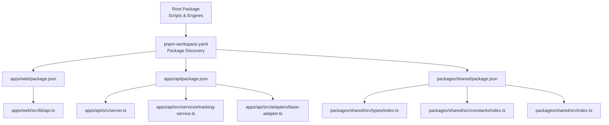
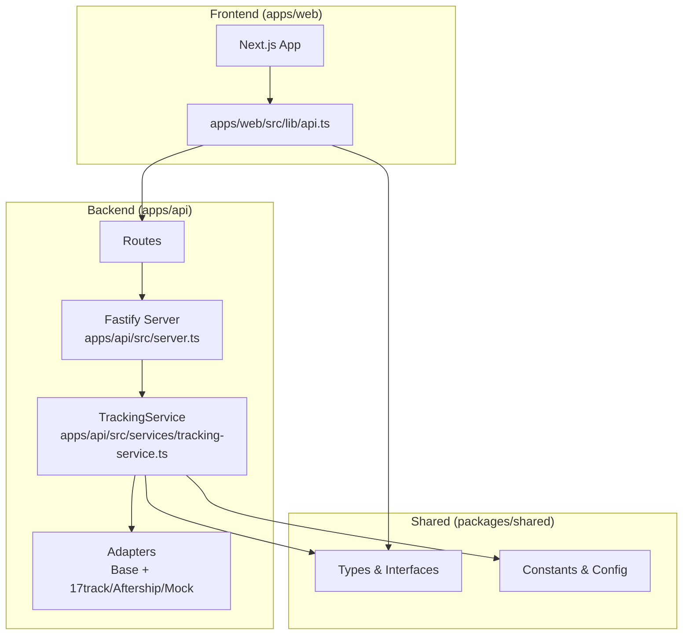
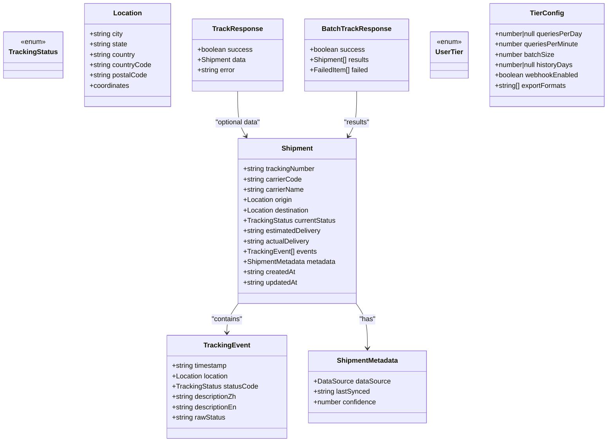
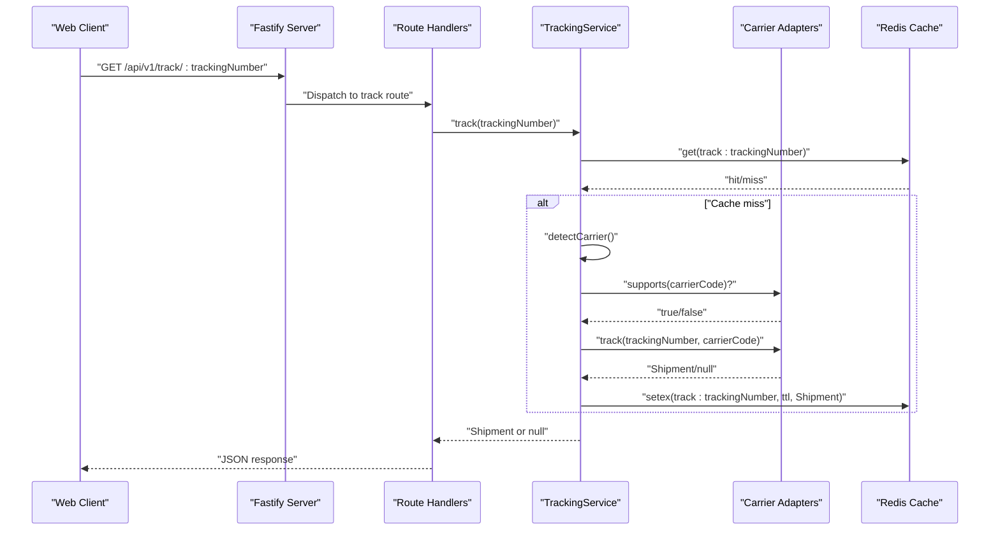
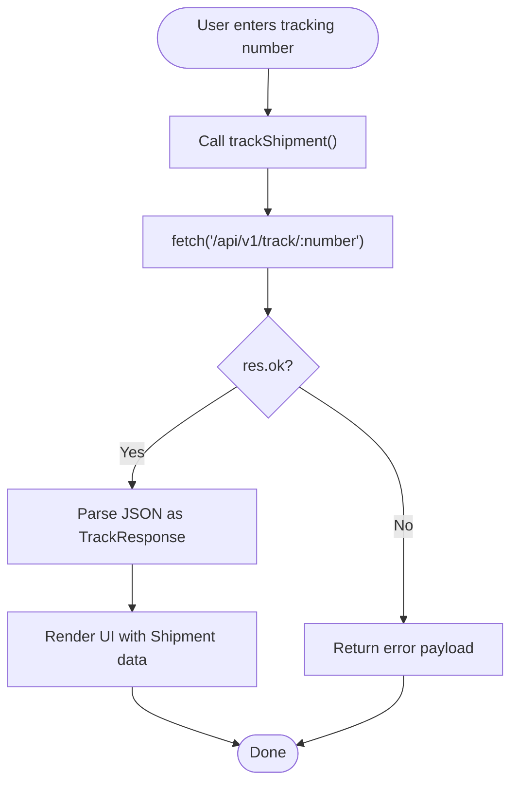
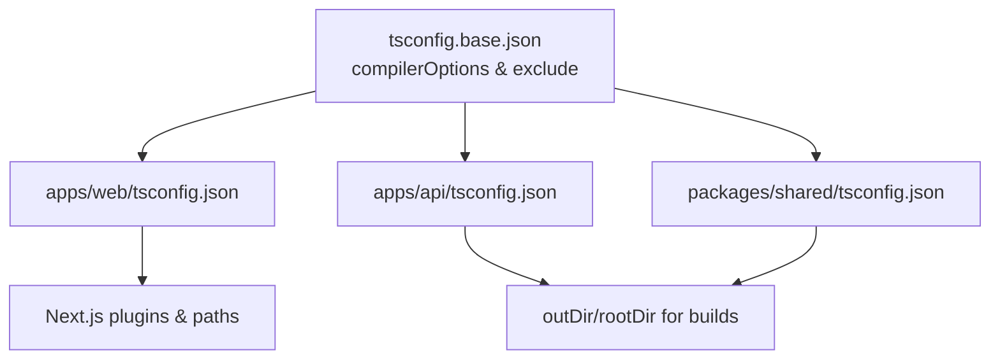
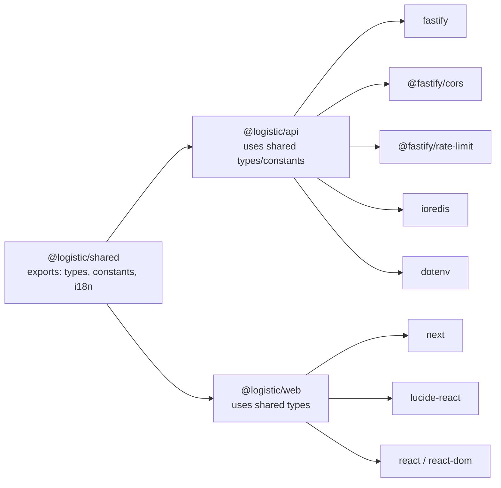

# Monorepo Structure and Workspace Management

<cite>
**Referenced Files in This Document**
- [pnpm-workspace.yaml](file://pnpm-workspace.yaml)
- [package.json](file://package.json)
- [tsconfig.base.json](file://tsconfig.base.json)
- [apps/api/package.json](file://apps/api/package.json)
- [apps/api/tsconfig.json](file://apps/api/tsconfig.json)
- [apps/api/src/server.ts](file://apps/api/src/server.ts)
- [apps/api/src/services/tracking-service.ts](file://apps/api/src/services/tracking-service.ts)
- [apps/api/src/adapters/base-adapter.ts](file://apps/api/src/adapters/base-adapter.ts)
- [apps/web/package.json](file://apps/web/package.json)
- [apps/web/tsconfig.json](file://apps/web/tsconfig.json)
- [apps/web/src/lib/api.ts](file://apps/web/src/lib/api.ts)
- [packages/shared/package.json](file://packages/shared/package.json)
- [packages/shared/tsconfig.json](file://packages/shared/tsconfig.json)
- [packages/shared/src/index.ts](file://packages/shared/src/index.ts)
- [packages/shared/src/types/index.ts](file://packages/shared/src/types/index.ts)
- [packages/shared/src/constants/index.ts](file://packages/shared/src/constants/index.ts)
- [docker-compose.yml](file://docker-compose.yml)
</cite>

## Table of Contents
1. [Introduction](#introduction)
2. [Project Structure](#project-structure)
3. [Core Components](#core-components)
4. [Architecture Overview](#architecture-overview)
5. [Detailed Component Analysis](#detailed-component-analysis)
6. [Dependency Analysis](#dependency-analysis)
7. [Performance Considerations](#performance-considerations)
8. [Troubleshooting Guide](#troubleshooting-guide)
9. [Conclusion](#conclusion)
10. [Appendices](#appendices)

## Introduction
This document explains the LOGISTIC monorepo architecture built with pnpm workspaces. It covers workspace configuration, TypeScript base configuration, separation of concerns across frontend (apps/web), backend (apps/api), and shared packages (packages/shared), and how the workspace enables dependency sharing, build orchestration, and inter-package imports. It also provides practical guidance for adding new packages, managing versions, and handling inter-package imports.

## Project Structure
The repository follows a classic monorepo layout:
- Root manages workspace configuration, shared scripts, and TypeScript base settings.
- apps/web is a Next.js frontend application that consumes shared types and constants.
- apps/api is a Fastify backend service that depends on shared types and exposes tracking endpoints.
- packages/shared is a TypeScript library exporting types, constants, and i18n-related utilities.

Workspace discovery is defined via pnpm-workspace.yaml, which includes all packages under apps and packages. The root package.json defines top-level scripts to run commands across all packages in parallel and filter by package.

**Diagram sources**
- [pnpm-workspace.yaml:1-8](file://pnpm-workspace.yaml#L1-L8)
- [package.json:6-12](file://package.json#L6-L12)
- [apps/web/package.json:12-18](file://apps/web/package.json#L12-L18)
- [apps/api/package.json:13-20](file://apps/api/package.json#L13-L20)
- [packages/shared/package.json:8-13](file://packages/shared/package.json#L8-L13)
- [packages/shared/src/index.ts:1-4](file://packages/shared/src/index.ts#L1-L4)
- [packages/shared/src/types/index.ts:1-101](file://packages/shared/src/types/index.ts#L1-L101)
- [packages/shared/src/constants/index.ts:1-103](file://packages/shared/src/constants/index.ts#L1-L103)
- [apps/api/src/server.ts:1-60](file://apps/api/src/server.ts#L1-L60)
- [apps/api/src/services/tracking-service.ts:1-128](file://apps/api/src/services/tracking-service.ts#L1-L128)
- [apps/api/src/adapters/base-adapter.ts:1-39](file://apps/api/src/adapters/base-adapter.ts#L1-L39)
- [apps/web/src/lib/api.ts:1-56](file://apps/web/src/lib/api.ts#L1-L56)

**Section sources**
- [pnpm-workspace.yaml:1-8](file://pnpm-workspace.yaml#L1-L8)
- [package.json:1-19](file://package.json#L1-L19)

## Core Components
- Shared package (@logistic/shared)
  - Exports types, constants, and i18n modules via named exports.
  - Consumed by both frontend and backend to maintain consistent domain models and configuration.
- API application (@logistic/api)
  - Fastify server with CORS, rate limiting, optional Redis caching, and route registration.
  - Uses shared types and constants for domain modeling and runtime configuration.
- Web application (@logistic/web)
  - Next.js app that calls the API endpoints and renders tracking results.
  - Imports shared types for type-safe UI components and logic.

Key configuration highlights:
- Root TypeScript base configuration centralizes compiler options for all packages.
- Each app maintains its own tsconfig, extending the base configuration.
- The shared package extends the base configuration and sets outDir/rootDir for build outputs.

**Section sources**
- [packages/shared/package.json:1-22](file://packages/shared/package.json#L1-L22)
- [apps/api/package.json:1-27](file://apps/api/package.json#L1-L27)
- [apps/web/package.json:1-30](file://apps/web/package.json#L1-L30)
- [tsconfig.base.json:1-18](file://tsconfig.base.json#L1-L18)
- [apps/api/tsconfig.json:1-9](file://apps/api/tsconfig.json#L1-L9)
- [apps/web/tsconfig.json:1-35](file://apps/web/tsconfig.json#L1-L35)
- [packages/shared/tsconfig.json:1-9](file://packages/shared/tsconfig.json#L1-L9)

## Architecture Overview
The monorepo enforces a clean separation of concerns:
- Frontend (apps/web) handles UI and user interactions, delegating tracking queries to the backend.
- Backend (apps/api) orchestrates carrier adapters, applies caching, and returns normalized tracking data.
- Shared (packages/shared) encapsulates domain types, constants, and i18n to prevent duplication and ensure consistency.

**Diagram sources**
- [apps/web/src/lib/api.ts:1-56](file://apps/web/src/lib/api.ts#L1-L56)
- [apps/api/src/server.ts:1-60](file://apps/api/src/server.ts#L1-L60)
- [apps/api/src/services/tracking-service.ts:1-128](file://apps/api/src/services/tracking-service.ts#L1-L128)
- [apps/api/src/adapters/base-adapter.ts:1-39](file://apps/api/src/adapters/base-adapter.ts#L1-L39)
- [packages/shared/src/types/index.ts:1-101](file://packages/shared/src/types/index.ts#L1-L101)
- [packages/shared/src/constants/index.ts:1-103](file://packages/shared/src/constants/index.ts#L1-L103)

## Detailed Component Analysis

### Shared Package
The shared package defines the domain model and reusable constants:
- Types define tracking status, locations, shipment records, and API response shapes.
- Constants define tier configurations, cache TTLs, status colors, carrier detection patterns, milestone ordering, and supported carriers.
- Export map allows importing specific submodules (types, constants, i18n) for granular consumption.

**Diagram sources**
- [packages/shared/src/types/index.ts:1-101](file://packages/shared/src/types/index.ts#L1-L101)

**Section sources**
- [packages/shared/package.json:8-13](file://packages/shared/package.json#L8-L13)
- [packages/shared/src/index.ts:1-4](file://packages/shared/src/index.ts#L1-L4)
- [packages/shared/src/types/index.ts:1-101](file://packages/shared/src/types/index.ts#L1-L101)
- [packages/shared/src/constants/index.ts:1-103](file://packages/shared/src/constants/index.ts#L1-L103)

### API Application
The API application initializes Fastify, registers plugins (CORS, rate limiting), connects to Redis (gracefully degrading if unavailable), and registers tracking routes. The TrackingService encapsulates carrier detection, adapter routing, and caching logic, leveraging shared types and constants.

**Diagram sources**
- [apps/api/src/server.ts:13-54](file://apps/api/src/server.ts#L13-L54)
- [apps/api/src/services/tracking-service.ts:40-105](file://apps/api/src/services/tracking-service.ts#L40-L105)
- [apps/api/src/adapters/base-adapter.ts:4-18](file://apps/api/src/adapters/base-adapter.ts#L4-L18)

**Section sources**
- [apps/api/src/server.ts:1-60](file://apps/api/src/server.ts#L1-L60)
- [apps/api/src/services/tracking-service.ts:1-128](file://apps/api/src/services/tracking-service.ts#L1-L128)
- [apps/api/src/adapters/base-adapter.ts:1-39](file://apps/api/src/adapters/base-adapter.ts#L1-L39)

### Web Application
The web application uses a lightweight API client to query the backend and render tracking results. It imports shared types to ensure type safety across UI components and utilities.

**Diagram sources**
- [apps/web/src/lib/api.ts:1-56](file://apps/web/src/lib/api.ts#L1-L56)

**Section sources**
- [apps/web/src/lib/api.ts:1-56](file://apps/web/src/lib/api.ts#L1-L56)

### TypeScript Base Configuration
The root tsconfig.base.json centralizes strict compiler options and module resolution settings. Apps extend this base to inherit consistent behavior while setting their own outDir/rootDir and app-specific options (e.g., Next.js plugins and bundler module resolution).

**Diagram sources**
- [tsconfig.base.json:1-18](file://tsconfig.base.json#L1-L18)
- [apps/web/tsconfig.json:1-35](file://apps/web/tsconfig.json#L1-L35)
- [apps/api/tsconfig.json:1-9](file://apps/api/tsconfig.json#L1-L9)
- [packages/shared/tsconfig.json:1-9](file://packages/shared/tsconfig.json#L1-L9)

**Section sources**
- [tsconfig.base.json:1-18](file://tsconfig.base.json#L1-L18)
- [apps/web/tsconfig.json:1-35](file://apps/web/tsconfig.json#L1-L35)
- [apps/api/tsconfig.json:1-9](file://apps/api/tsconfig.json#L1-L9)
- [packages/shared/tsconfig.json:1-9](file://packages/shared/tsconfig.json#L1-L9)

## Dependency Analysis
Workspace management and inter-package imports:
- pnpm-workspace.yaml includes apps/* and packages/*, enabling workspace protocol for dependencies.
- Both apps/web and apps/api depend on @logistic/shared via workspace:*.
- The shared package exports named subpaths (types, constants, i18n) for fine-grained imports.
- The API server optionally connects to Redis for caching; the web app communicates with the API via HTTP.

**Diagram sources**
- [pnpm-workspace.yaml:1-3](file://pnpm-workspace.yaml#L1-L3)
- [apps/api/package.json:13-20](file://apps/api/package.json#L13-L20)
- [apps/web/package.json:12-18](file://apps/web/package.json#L12-L18)
- [packages/shared/package.json:8-13](file://packages/shared/package.json#L8-L13)

**Section sources**
- [pnpm-workspace.yaml:1-8](file://pnpm-workspace.yaml#L1-L8)
- [apps/api/package.json:13-20](file://apps/api/package.json#L13-L20)
- [apps/web/package.json:12-18](file://apps/web/package.json#L12-L18)
- [packages/shared/package.json:8-13](file://packages/shared/package.json#L8-L13)

## Performance Considerations
- Caching: The API caches normalized tracking results in Redis with TTLs derived from current status, reducing downstream adapter calls and latency.
- Concurrency: The tracking service processes batches with a controlled concurrency limit to balance throughput and resource usage.
- Graceful degradation: If Redis is unavailable, the API continues operating without cache, ensuring availability.
- Containerized infrastructure: docker-compose provides ready-to-use PostgreSQL and Redis instances for local development.

**Section sources**
- [apps/api/src/services/tracking-service.ts:64-91](file://apps/api/src/services/tracking-service.ts#L64-L91)
- [apps/api/src/services/tracking-service.ts:107-126](file://apps/api/src/services/tracking-service.ts#L107-L126)
- [apps/api/src/server.ts:25-46](file://apps/api/src/server.ts#L25-L46)
- [docker-compose.yml:1-23](file://docker-compose.yml#L1-L23)

## Troubleshooting Guide
Common issues and resolutions:
- Redis connectivity errors: The server logs warnings and continues without cache. Verify REDIS_URL and container health.
- HTTP errors from API: The web client surfaces user-friendly messages and empty results when the backend responds with non-OK status.
- Type mismatches: Ensure shared types are imported consistently; the shared package’s export map and index barrel facilitate correct imports.
- Workspace dependency resolution: Confirm pnpm-workspace.yaml includes the intended package paths and that dependencies use workspace:*.

**Section sources**
- [apps/api/src/server.ts:34-43](file://apps/api/src/server.ts#L34-L43)
- [apps/web/src/lib/api.ts:12-26](file://apps/web/src/lib/api.ts#L12-L26)
- [packages/shared/src/index.ts:1-4](file://packages/shared/src/index.ts#L1-L4)

## Conclusion
The LOGISTIC monorepo leverages pnpm workspaces and a shared TypeScript package to enforce consistency, reduce duplication, and streamline development across frontend and backend. The root TypeScript base configuration ensures uniform compiler behavior, while workspace protocols enable seamless inter-package imports. The API’s adapter-driven design and caching strategy deliver scalable tracking capabilities, and the web app remains decoupled through typed HTTP APIs.

## Appendices

### Adding a New Package to the Workspace
- Create a new directory under packages or apps as appropriate.
- Add a package.json with a name following the @logistic/<scope> convention.
- Configure scripts and dependencies; use workspace:* for internal dependencies.
- Extend tsconfig.base.json if building a library; set outDir/rootDir for build outputs.
- Run pnpm install to update lockfile and symlink dependencies.

**Section sources**
- [pnpm-workspace.yaml:1-3](file://pnpm-workspace.yaml#L1-L3)
- [packages/shared/package.json:1-22](file://packages/shared/package.json#L1-L22)
- [tsconfig.base.json:1-18](file://tsconfig.base.json#L1-L18)

### Managing Versions Across the Workspace
- Versioning is handled at the individual package level via each package.json version field.
- Keep related packages’ versions aligned when making breaking changes to shared types.
- Use semantic versioning and consider publishing internal packages to a private registry if needed; otherwise rely on workspace:* for local linking.

**Section sources**
- [apps/api/package.json:2-4](file://apps/api/package.json#L2-L4)
- [apps/web/package.json:2-4](file://apps/web/package.json#L2-L4)
- [packages/shared/package.json:2-4](file://packages/shared/package.json#L2-L4)

### Handling Inter-Package Imports
- Import from @logistic/shared using named exports or subpath exports (e.g., types, constants).
- Maintain a single source of truth for domain types and constants in the shared package.
- Prefer barrel exports (index.ts) to simplify imports and improve refactoring.

**Section sources**
- [packages/shared/package.json:8-13](file://packages/shared/package.json#L8-L13)
- [packages/shared/src/index.ts:1-4](file://packages/shared/src/index.ts#L1-L4)
- [apps/web/src/lib/api.ts:1](file://apps/web/src/lib/api.ts#L1)
- [apps/api/src/services/tracking-service.ts:1](file://apps/api/src/services/tracking-service.ts#L1)