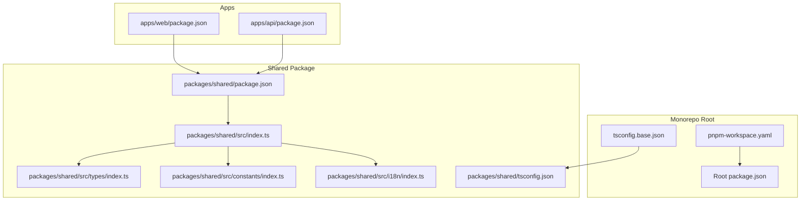
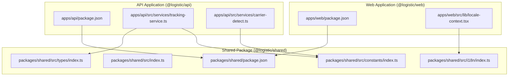
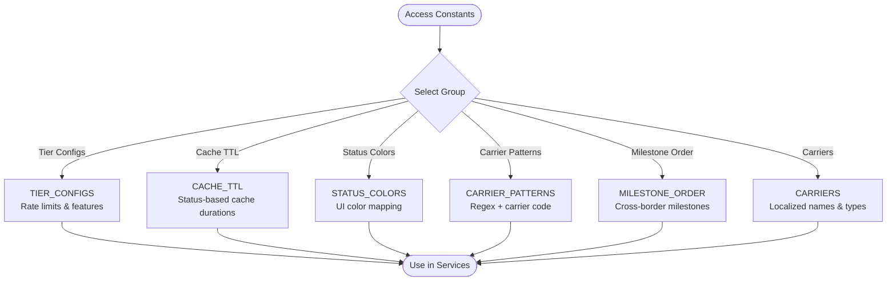
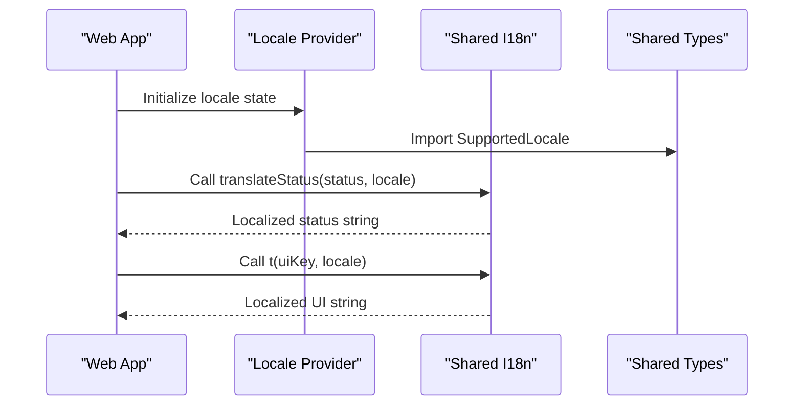
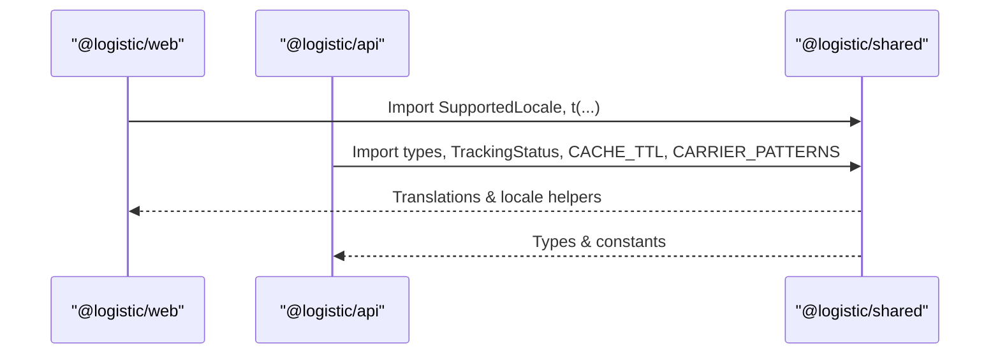
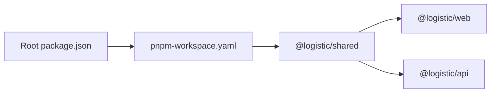

# Shared Packages Architecture

<cite>
**Referenced Files in This Document**
- [package.json](file://packages/shared/package.json)
- [index.ts](file://packages/shared/src/index.ts)
- [types/index.ts](file://packages/shared/src/types/index.ts)
- [constants/index.ts](file://packages/shared/src/constants/index.ts)
- [i18n/index.ts](file://packages/shared/src/i18n/index.ts)
- [pnpm-workspace.yaml](file://pnpm-workspace.yaml)
- [package.json](file://package.json)
- [tsconfig.base.json](file://tsconfig.base.json)
- [tsconfig.json](file://packages/shared/tsconfig.json)
- [apps/api/package.json](file://apps/api/package.json)
- [apps/web/package.json](file://apps/web/package.json)
- [apps/web/src/lib/locale-context.tsx](file://apps/web/src/lib/locale-context.tsx)
- [apps/api/src/services/tracking-service.ts](file://apps/api/src/services/tracking-service.ts)
- [apps/api/src/services/carrier-detect.ts](file://apps/api/src/services/carrier-detect.ts)
</cite>

## Table of Contents
1. [Introduction](#introduction)
2. [Project Structure](#project-structure)
3. [Core Components](#core-components)
4. [Architecture Overview](#architecture-overview)
5. [Detailed Component Analysis](#detailed-component-analysis)
6. [Dependency Analysis](#dependency-analysis)
7. [Performance Considerations](#performance-considerations)
8. [Troubleshooting Guide](#troubleshooting-guide)
9. [Conclusion](#conclusion)

## Introduction
This document describes the shared packages architecture used across the frontend and backend applications in the monorepo. The shared package centralizes common types, constants, and internationalization resources to ensure consistency and reduce duplication. It supports both the Next.js web application and the Fastify API service, enabling them to import standardized data models, configuration constants, and translation utilities via scoped exports.

## Project Structure
The shared package is organized into focused modules:
- Types: Defines enums and interfaces used across the platform.
- Constants: Provides configuration records and lookup tables for rate limits, cache TTLs, status visuals, carrier detection, milestone ordering, and supported carriers.
- Internationalization: Exposes typed translation functions and locales for status and UI keys.
- Index exports: Re-exports all modules for convenient top-level imports.

The monorepo uses pnpm workspaces to manage dependencies and a shared TypeScript configuration across packages.



**Diagram sources**
- [pnpm-workspace.yaml:1-8](file://pnpm-workspace.yaml#L1-L8)
- [package.json:1-19](file://package.json#L1-L19)
- [tsconfig.base.json:1-18](file://tsconfig.base.json#L1-L18)
- [packages/shared/package.json:1-22](file://packages/shared/package.json#L1-L22)
- [packages/shared/src/index.ts:1-4](file://packages/shared/src/index.ts#L1-L4)
- [packages/shared/src/types/index.ts:1-101](file://packages/shared/src/types/index.ts#L1-L101)
- [packages/shared/src/constants/index.ts:1-103](file://packages/shared/src/constants/index.ts#L1-L103)
- [packages/shared/src/i18n/index.ts:1-61](file://packages/shared/src/i18n/index.ts#L1-L61)
- [packages/shared/tsconfig.json:1-9](file://packages/shared/tsconfig.json#L1-L9)
- [apps/web/package.json:1-30](file://apps/web/package.json#L1-L30)
- [apps/api/package.json:1-27](file://apps/api/package.json#L1-L27)

**Section sources**
- [pnpm-workspace.yaml:1-8](file://pnpm-workspace.yaml#L1-L8)
- [package.json:1-19](file://package.json#L1-L19)
- [tsconfig.base.json:1-18](file://tsconfig.base.json#L1-L18)
- [packages/shared/package.json:1-22](file://packages/shared/package.json#L1-L22)
- [packages/shared/src/index.ts:1-4](file://packages/shared/src/index.ts#L1-L4)
- [packages/shared/tsconfig.json:1-9](file://packages/shared/tsconfig.json#L1-L9)

## Core Components
This section outlines the primary building blocks of the shared package and how they are consumed by applications.

- Types module
  - Defines standardized enums and interfaces for tracking status, data sources, locations, tracking events, shipments, API responses, user tiers, and tier configuration.
  - Provides a consistent contract for data exchange between frontend and backend services.

- Constants module
  - Tier configurations: Maps user tiers to rate limits, batch sizes, history retention, webhook enablement, and export formats.
  - Cache TTLs: Maps tracking statuses to cache durations for efficient caching strategies.
  - Status visuals: Maps statuses to color codes for UI rendering.
  - Carrier detection: Provides regular expressions and carrier mappings for tracking number parsing.
  - Milestone ordering: Defines the canonical order of cross-border milestones.
  - Carriers: Enumerates supported carriers with localized names and categories.

- Internationalization module
  - Declares supported locales and exposes translation functions for status and UI keys.
  - Offers a simple API to retrieve localized strings based on status or UI key and selected locale.

- Index exports
  - Re-exports all modules under a single entry point, enabling consumers to import from the shared package namespace.

**Section sources**
- [packages/shared/src/types/index.ts:1-101](file://packages/shared/src/types/index.ts#L1-L101)
- [packages/shared/src/constants/index.ts:1-103](file://packages/shared/src/constants/index.ts#L1-L103)
- [packages/shared/src/i18n/index.ts:1-61](file://packages/shared/src/i18n/index.ts#L1-L61)
- [packages/shared/src/index.ts:1-4](file://packages/shared/src/index.ts#L1-L4)

## Architecture Overview
The shared package acts as a central library consumed by both the web application and the API service. Applications import specific subpaths to access types, constants, or i18n utilities, ensuring precise dependency boundaries and tree-shaking-friendly consumption.



**Diagram sources**
- [apps/web/package.json:1-30](file://apps/web/package.json#L1-L30)
- [apps/api/package.json:1-27](file://apps/api/package.json#L1-L27)
- [packages/shared/package.json:1-22](file://packages/shared/package.json#L1-L22)
- [packages/shared/src/index.ts:1-4](file://packages/shared/src/index.ts#L1-L4)
- [packages/shared/src/types/index.ts:1-101](file://packages/shared/src/types/index.ts#L1-L101)
- [packages/shared/src/constants/index.ts:1-103](file://packages/shared/src/constants/index.ts#L1-L103)
- [packages/shared/src/i18n/index.ts:1-61](file://packages/shared/src/i18n/index.ts#L1-L61)
- [apps/web/src/lib/locale-context.tsx:1-33](file://apps/web/src/lib/locale-context.tsx#L1-L33)
- [apps/api/src/services/tracking-service.ts:1-2](file://apps/api/src/services/tracking-service.ts#L1-L2)
- [apps/api/src/services/carrier-detect.ts:1-1](file://apps/api/src/services/carrier-detect.ts#L1-L1)

## Detailed Component Analysis

### Type System Design
The type system establishes a strongly-typed foundation for cross-border shipment tracking:
- TrackingStatus enum defines canonical statuses used throughout the platform.
- DataSource union type enumerates supported data providers.
- Location interface captures geographic and optional coordinate details.
- TrackingEvent interface models individual milestones with multilingual descriptions.
- Shipment interface aggregates tracking data, metadata, and timestamps.
- TrackResponse and BatchTrackResponse define API response contracts.
- UserTier enum and TierConfig interface model subscription tiers and rate limits.

```mermaid
classDiagram
class TrackingStatus {
<<enum>>
"PENDING"
"PICKED_UP"
"IN_TRANSIT"
"EXPORT_CUSTOMS"
"IMPORT_CUSTOMS"
"OUT_FOR_DELIVERY"
"DELIVERED"
"FAILED"
"RETURNED"
"EXPIRED"
}
class DataSource {
<<union>>
"'17track'"
"'aftership'"
"'trackingmore'"
"'dhl_direct'"
"'fedex_direct'"
"'ups_direct'"
}
class Location {
+string city
+string state
+string country
+string countryCode
+string postalCode
+coordinates.lat
+coordinates.lng
}
class TrackingEvent {
+string timestamp
+Location location
+TrackingStatus statusCode
+string descriptionZh
+string descriptionEn
+string rawStatus
}
class Shipment {
+string trackingNumber
+string carrierCode
+string carrierName
+Location origin
+Location destination
+TrackingStatus currentStatus
+string estimatedDelivery
+string actualDelivery
+TrackingEvent[] events
+ShipmentMetadata metadata
+string createdAt
+string updatedAt
}
class ShipmentMetadata {
+DataSource dataSource
+string lastSynced
+number confidence
}
class TrackResponse {
+boolean success
+Shipment data
+string error
}
class BatchTrackResponse {
+boolean success
+Shipment[] results
+FailedItem[] failed
}
class UserTier {
<<enum>>
"FREE"
"PRO"
"ENTERPRISE"
}
class TierConfig {
+number queriesPerDay
+number queriesPerMinute
+number batchSize
+number historyDays
+boolean webhookEnabled
+string[] exportFormats
}
Shipment --> Location : "has"
Shipment --> TrackingEvent : "contains"
Shipment --> ShipmentMetadata : "has"
TrackResponse --> Shipment : "optional data"
BatchTrackResponse --> Shipment : "results"
```

**Diagram sources**
- [packages/shared/src/types/index.ts:1-101](file://packages/shared/src/types/index.ts#L1-L101)

**Section sources**
- [packages/shared/src/types/index.ts:1-101](file://packages/shared/src/types/index.ts#L1-L101)

### Constant Management
Constants are organized into cohesive groups to support operational and presentation needs:
- Tier configurations: Provide rate limiting and feature availability per user tier.
- Cache TTLs: Define cache lifetimes per status to balance freshness and performance.
- Status visuals: Map statuses to UI colors for consistent visual communication.
- Carrier detection: Provide regex patterns and carrier mappings for tracking number parsing.
- Milestone ordering: Establish a canonical order for cross-border milestones.
- Carriers: Enumerate supported carriers with localized names and categories.



**Diagram sources**
- [packages/shared/src/constants/index.ts:1-103](file://packages/shared/src/constants/index.ts#L1-L103)

**Section sources**
- [packages/shared/src/constants/index.ts:1-103](file://packages/shared/src/constants/index.ts#L1-L103)

### Internationalization Resource Organization
The i18n module provides:
- A SupportedLocale type restricting locales to Chinese and English.
- Translation functions for status and UI keys.
- Centralized key-value pairs for localized strings.



**Diagram sources**
- [apps/web/src/lib/locale-context.tsx:1-33](file://apps/web/src/lib/locale-context.tsx#L1-L33)
- [packages/shared/src/i18n/index.ts:1-61](file://packages/shared/src/i18n/index.ts#L1-L61)
- [packages/shared/src/types/index.ts:1-101](file://packages/shared/src/types/index.ts#L1-L101)

**Section sources**
- [packages/shared/src/i18n/index.ts:1-61](file://packages/shared/src/i18n/index.ts#L1-L61)
- [apps/web/src/lib/locale-context.tsx:1-33](file://apps/web/src/lib/locale-context.tsx#L1-L33)

### Import Patterns Across the Monorepo
Applications consume the shared package using scoped subpath exports:
- Frontend imports SupportedLocale and translation helpers for UI localization.
- Backend imports types and constants for service logic, caching, and carrier detection.



**Diagram sources**
- [apps/web/package.json:12-17](file://apps/web/package.json#L12-L17)
- [apps/api/package.json:13-19](file://apps/api/package.json#L13-L19)
- [packages/shared/package.json:8-13](file://packages/shared/package.json#L8-L13)

**Section sources**
- [apps/web/package.json:12-17](file://apps/web/package.json#L12-L17)
- [apps/api/package.json:13-19](file://apps/api/package.json#L13-L19)
- [packages/shared/package.json:8-13](file://packages/shared/package.json#L8-L13)

## Dependency Analysis
The shared package is consumed by both applications with explicit subpath exports, enabling precise imports and minimizing bundle size. The monorepo’s pnpm workspace configuration ensures local development and builds resolve the shared package from the workspace.



**Diagram sources**
- [pnpm-workspace.yaml:1-8](file://pnpm-workspace.yaml#L1-L8)
- [package.json:1-19](file://package.json#L1-L19)
- [apps/web/package.json:12-17](file://apps/web/package.json#L12-L17)
- [apps/api/package.json:13-19](file://apps/api/package.json#L13-L19)

**Section sources**
- [pnpm-workspace.yaml:1-8](file://pnpm-workspace.yaml#L1-L8)
- [package.json:1-19](file://package.json#L1-L19)
- [apps/web/package.json:12-17](file://apps/web/package.json#L12-L17)
- [apps/api/package.json:13-19](file://apps/api/package.json#L13-L19)

## Performance Considerations
- Use constants for cache TTLs and status visuals to avoid repeated computations and ensure consistent behavior across services.
- Prefer enum-based status comparisons to minimize string parsing overhead.
- Keep translation keys centralized to simplify maintenance and reduce duplication.
- Leverage subpath imports to limit bundle size and improve tree-shaking effectiveness.

## Troubleshooting Guide
- Type errors after updates
  - Run the shared package type checks and rebuild applications to surface type mismatches early.
  - Verify that the shared TypeScript configuration extends the base configuration consistently.

- Missing translations or incorrect locale
  - Confirm SupportedLocale usage and ensure translation keys exist for the target locale.
  - Validate that the locale provider initializes with a supported locale.

- Incorrect carrier detection
  - Review carrier patterns and ensure regex coverage aligns with real-world tracking numbers.
  - Add new patterns incrementally and test against representative samples.

- Version conflicts
  - Keep the shared package version aligned with workspace expectations and update both applications when making breaking changes.

**Section sources**
- [packages/shared/package.json:14-16](file://packages/shared/package.json#L14-L16)
- [packages/shared/tsconfig.json:1-9](file://packages/shared/tsconfig.json#L1-L9)
- [tsconfig.base.json:1-18](file://tsconfig.base.json#L1-L18)

## Conclusion
The shared package provides a robust, type-safe foundation for cross-border logistics tracking across the monorepo. By organizing types, constants, and internationalization resources into cohesive modules and exposing them via scoped subpath exports, it enables consistent behavior, improved maintainability, and efficient consumption by both frontend and backend applications. Extending the system involves adding new types, constants, or translation keys while preserving the existing structure and import patterns.