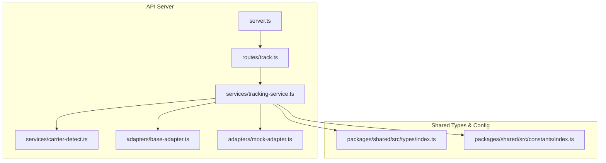
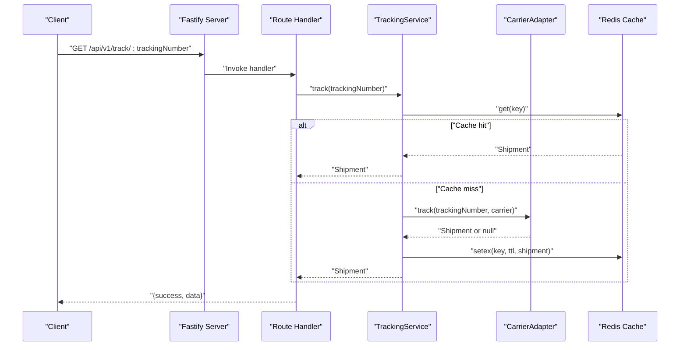
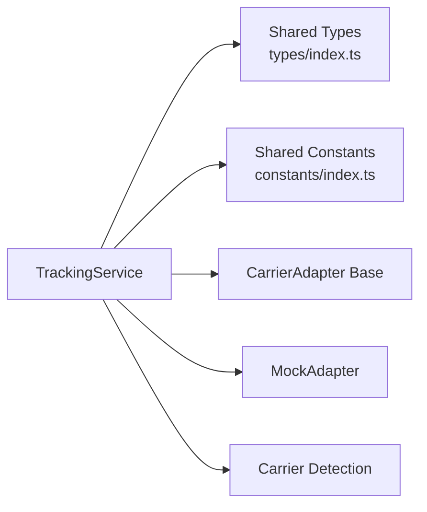

# API Endpoints

<cite>
**Referenced Files in This Document**
- [server.ts](file://apps/api/src/server.ts)
- [track.ts](file://apps/api/src/routes/track.ts)
- [tracking-service.ts](file://apps/api/src/services/tracking-service.ts)
- [carrier-detect.ts](file://apps/api/src/services/carrier-detect.ts)
- [base-adapter.ts](file://apps/api/src/adapters/base-adapter.ts)
- [mock-adapter.ts](file://apps/api/src/adapters/mock-adapter.ts)
- [index.ts](file://packages/shared/src/types/index.ts)
- [constants.ts](file://packages/shared/src/constants/index.ts)
- [route.ts](file://apps/web/src/app/api/v1/track/[trackingNumber]/route.ts)
- [route.ts](file://apps/web/src/app/api/v1/health/route.ts)
</cite>

## Table of Contents
1. [Introduction](#introduction)
2. [Project Structure](#project-structure)
3. [Core Components](#core-components)
4. [Architecture Overview](#architecture-overview)
5. [Detailed Endpoint Documentation](#detailed-endpoint-documentation)
6. [Dependency Analysis](#dependency-analysis)
7. [Performance Considerations](#performance-considerations)
8. [Troubleshooting Guide](#troubleshooting-guide)
9. [Conclusion](#conclusion)

## Introduction
This document provides comprehensive API documentation for the backend endpoints that power shipment tracking. It covers:
- GET /api/v1/track/:trackingNumber for single tracking queries
- POST /api/v1/track/batch for batch processing
- GET /api/v1/health for health checks

It includes request/response schemas, parameter validation, error responses, status codes, rate limiting behavior, authentication requirements, response formatting, curl examples, common use cases, and integration patterns.

## Project Structure
The API server is implemented in a Fastify application with modular routing and service layers. Shared types and configuration are centralized in the shared package.

**Diagram sources**
- [server.ts:1-60](file://apps/api/src/server.ts#L1-L60)
- [track.ts:1-75](file://apps/api/src/routes/track.ts#L1-L75)
- [tracking-service.ts:1-128](file://apps/api/src/services/tracking-service.ts#L1-L128)
- [carrier-detect.ts:1-27](file://apps/api/src/services/carrier-detect.ts#L1-L27)
- [base-adapter.ts:1-39](file://apps/api/src/adapters/base-adapter.ts#L1-L39)
- [mock-adapter.ts:1-74](file://apps/api/src/adapters/mock-adapter.ts#L1-L74)
- [index.ts:1-101](file://packages/shared/src/types/index.ts#L1-L101)
- [constants.ts:1-103](file://packages/shared/src/constants/index.ts#L1-L103)

**Section sources**
- [server.ts:1-60](file://apps/api/src/server.ts#L1-L60)
- [track.ts:1-75](file://apps/api/src/routes/track.ts#L1-L75)
- [tracking-service.ts:1-128](file://apps/api/src/services/tracking-service.ts#L1-L128)
- [index.ts:1-101](file://packages/shared/src/types/index.ts#L1-L101)
- [constants.ts:1-103](file://packages/shared/src/constants/index.ts#L1-L103)

## Core Components
- Fastify server with CORS and rate limiting enabled globally
- Redis-backed caching for tracking results
- Adapter-based carrier integration supporting multiple providers
- Shared types for shipment, tracking events, and response envelopes
- Tier-based rate limits and cache TTLs

Key behaviors:
- Global rate limit: 60 requests per minute
- Redis optional; degraded gracefully when unavailable
- Cache TTL varies by tracking status
- Validation enforces minimum length and alphanumeric constraints for tracking numbers

**Section sources**
- [server.ts:19-23](file://apps/api/src/server.ts#L19-L23)
- [server.ts:25-46](file://apps/api/src/server.ts#L25-L46)
- [tracking-service.ts:107-126](file://apps/api/src/services/tracking-service.ts#L107-L126)
- [constants.ts:31-43](file://packages/shared/src/constants/index.ts#L31-L43)
- [carrier-detect.ts:23-26](file://apps/api/src/services/carrier-detect.ts#L23-L26)

## Architecture Overview
The request lifecycle for tracking follows a predictable flow: route validation → service orchestration → adapter selection → caching → response.

**Diagram sources**
- [track.ts:9-35](file://apps/api/src/routes/track.ts#L9-L35)
- [tracking-service.ts:40-62](file://apps/api/src/services/tracking-service.ts#L40-L62)
- [tracking-service.ts:107-126](file://apps/api/src/services/tracking-service.ts#L107-L126)
- [base-adapter.ts:4-18](file://apps/api/src/adapters/base-adapter.ts#L4-L18)

## Detailed Endpoint Documentation

### GET /api/v1/track/:trackingNumber
Purpose: Retrieve tracking information for a single shipment by tracking number.

- Method: GET
- Path: /api/v1/track/:trackingNumber
- Path parameters:
  - trackingNumber (string, required): Alphanumeric tracking number; minimum length 5 characters
- Query parameters:
  - lang (string, optional): Language preference for localized descriptions (supported by the frontend route; not enforced by backend)
- Authentication: Not required
- Rate limiting: Applies to the global rate limiter (60 per minute)
- Response envelope:
  - success: boolean
  - data: Shipment object (see schema below)
  - error: string (present on error)
- Status codes:
  - 200 OK: Tracking data returned
  - 400 Bad Request: Invalid tracking number format
  - 404 Not Found: Tracking number not found
  - 500 Internal Server Error: Unexpected error

Request validation:
- Minimum length: 5 characters
- Allowed characters: alphanumeric
- Additional provider-specific validation is performed by the carrier detection service

Success response schema (data):
- trackingNumber: string
- carrierCode: string
- carrierName: string
- origin: Location
- destination: Location
- currentStatus: enum value
- estimatedDelivery?: string (ISO 8601 UTC)
- actualDelivery?: string (ISO 8601 UTC)
- events: array of TrackingEvent
- metadata: ShipmentMetadata
- createdAt: string (ISO 8601 UTC)
- updatedAt: string (ISO 8601 UTC)

Location:
- city: string
- state?: string
- country: string
- countryCode: string
- postalCode?: string
- coordinates?: { lat: number; lng: number }

TrackingEvent:
- timestamp: string (ISO 8601 UTC)
- location: Location
- statusCode: enum value
- descriptionZh: string
- descriptionEn: string
- rawStatus: string

ShipmentMetadata:
- dataSource: enum value
- lastSynced: string (ISO 8601 UTC)
- confidence: number (0–100)

Common errors:
- 400: "Invalid tracking number"
- 404: "Tracking number not found"

Example curl:
- curl -i "https://your-api-base/api/v1/track/AB123456789"

Integration patterns:
- Frontend can pass lang via query string to receive localized descriptions (frontend route)
- Use caching to reduce repeated queries for the same tracking number

**Section sources**
- [track.ts:9-35](file://apps/api/src/routes/track.ts#L9-L35)
- [carrier-detect.ts:23-26](file://apps/api/src/services/carrier-detect.ts#L23-L26)
- [index.ts:48-67](file://packages/shared/src/types/index.ts#L48-L67)
- [index.ts:38-45](file://packages/shared/src/types/index.ts#L38-L45)
- [index.ts:63-67](file://packages/shared/src/types/index.ts#L63-L67)

### POST /api/v1/track/batch
Purpose: Retrieve tracking information for multiple shipments concurrently.

- Method: POST
- Path: /api/v1/track/batch
- Authentication: Not required
- Rate limiting: Applies to the global rate limiter (60 per minute)
- Request body:
  - trackingNumbers: array of strings (required); minimum 1, maximum 50
- Response envelope:
  - success: boolean
  - results: array of Shipment
  - failed: array of { trackingNumber: string; error: string }
- Status codes:
  - 200 OK: Results returned (may include partial failures)
  - 400 Bad Request: Invalid request payload
  - 500 Internal Server Error: Unexpected error

Validation:
- trackingNumbers must be a non-empty array
- Maximum batch size: 50 items
- Individual entries are validated by the single-tracking flow

Response schema:
- results: array of Shipment
- failed: array of { trackingNumber: string; error: string }

Example curl:
- curl -i -X POST "https://your-api-base/api/v1/track/batch" -H "Content-Type: application/json" -d '{"trackingNumbers":["AB123456789","XY987654321"]}'

Integration patterns:
- Use for bulk order dashboards or shipping reports
- Expect partial success; inspect failed entries for remediation

**Section sources**
- [track.ts:38-64](file://apps/api/src/routes/track.ts#L38-L64)
- [tracking-service.ts:64-91](file://apps/api/src/services/tracking-service.ts#L64-L91)
- [index.ts:76-83](file://packages/shared/src/types/index.ts#L76-L83)

### GET /api/v1/health
Purpose: Health check endpoint for monitoring and readiness probes.

- Method: GET
- Path: /api/v1/health
- Authentication: Not required
- Response:
  - status: "ok"
  - timestamp: string (ISO 8601 UTC)
  - redis: "connected" or "disabled" (reflects Redis availability)
- Status codes:
  - 200 OK: Service healthy
  - 500 Internal Server Error: Unexpected error

Note: The frontend also exposes a similar health route for client-side usage.

**Section sources**
- [track.ts:67-73](file://apps/api/src/routes/track.ts#L67-L73)
- [route.ts:1-9](file://apps/web/src/app/api/v1/health/route.ts#L1-L9)

## Dependency Analysis
The tracking pipeline depends on shared types and configuration, and integrates with carrier adapters. Redis is optional but improves performance and reduces external API load.

**Diagram sources**
- [tracking-service.ts:1-128](file://apps/api/src/services/tracking-service.ts#L1-L128)
- [base-adapter.ts:1-39](file://apps/api/src/adapters/base-adapter.ts#L1-L39)
- [mock-adapter.ts:1-74](file://apps/api/src/adapters/mock-adapter.ts#L1-L74)
- [index.ts:1-101](file://packages/shared/src/types/index.ts#L1-L101)
- [constants.ts:1-103](file://packages/shared/src/constants/index.ts#L1-L103)

**Section sources**
- [tracking-service.ts:1-128](file://apps/api/src/services/tracking-service.ts#L1-L128)
- [base-adapter.ts:1-39](file://apps/api/src/adapters/base-adapter.ts#L1-L39)
- [mock-adapter.ts:1-74](file://apps/api/src/adapters/mock-adapter.ts#L1-L74)
- [index.ts:1-101](file://packages/shared/src/types/index.ts#L1-L101)
- [constants.ts:1-103](file://packages/shared/src/constants/index.ts#L1-L103)

## Performance Considerations
- Global rate limit: 60 requests per minute applies to all endpoints
- Batch processing: Up to 50 tracking numbers per request
- Concurrency: Batch queries process in chunks of 5 to balance throughput and resource usage
- Caching: Redis TTL varies by status to optimize refresh cadence
- Graceful degradation: When Redis is unavailable, the service continues without cache

Recommendations:
- Implement client-side retries with exponential backoff for transient failures
- Group frequent queries and leverage caching to minimize redundant calls
- Monitor redis field in health responses to confirm cache availability

**Section sources**
- [server.ts:19-23](file://apps/api/src/server.ts#L19-L23)
- [tracking-service.ts:71-88](file://apps/api/src/services/tracking-service.ts#L71-L88)
- [constants.ts:31-43](file://packages/shared/src/constants/index.ts#L31-L43)
- [server.ts:25-46](file://apps/api/src/server.ts#L25-L46)

## Troubleshooting Guide
Common issues and resolutions:
- 400 Bad Request on single tracking:
  - Cause: Tracking number too short or contains invalid characters
  - Resolution: Ensure the tracking number is 5–50 alphanumeric characters
- 404 Not Found:
  - Cause: Tracking number not recognized or not found by adapters
  - Resolution: Verify the number format and provider support
- 400 Bad Request on batch:
  - Cause: Missing or empty trackingNumbers array, or exceeding 50 items
  - Resolution: Limit batch size to ≤50 and ensure non-empty array
- Health check indicates redis: disabled:
  - Cause: REDIS_URL not configured or Redis unreachable
  - Resolution: Configure REDIS_URL or accept cache-disabled operation
- Rate limit exceeded:
  - Symptom: 429 responses after 60 requests per minute
  - Resolution: Back off, coalesce requests, or upgrade tier (if applicable)

**Section sources**
- [track.ts:14-19](file://apps/api/src/routes/track.ts#L14-L19)
- [track.ts:43-55](file://apps/api/src/routes/track.ts#L43-L55)
- [server.ts:19-23](file://apps/api/src/server.ts#L19-L23)
- [server.ts:25-46](file://apps/api/src/server.ts#L25-L46)

## Conclusion
The tracking API provides reliable, scalable endpoints for single and batch tracking with built-in caching, graceful degradation, and clear validation. Clients should adhere to validation rules, respect rate limits, and leverage caching for optimal performance. The shared types and constants ensure consistent data representation across the system.