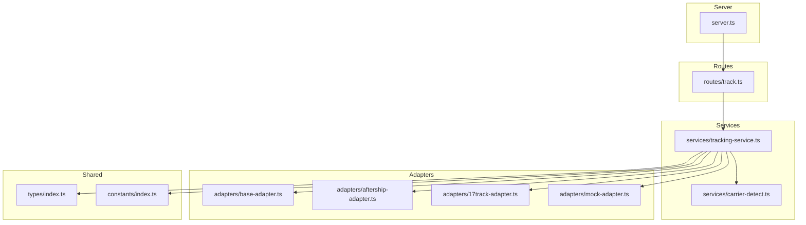
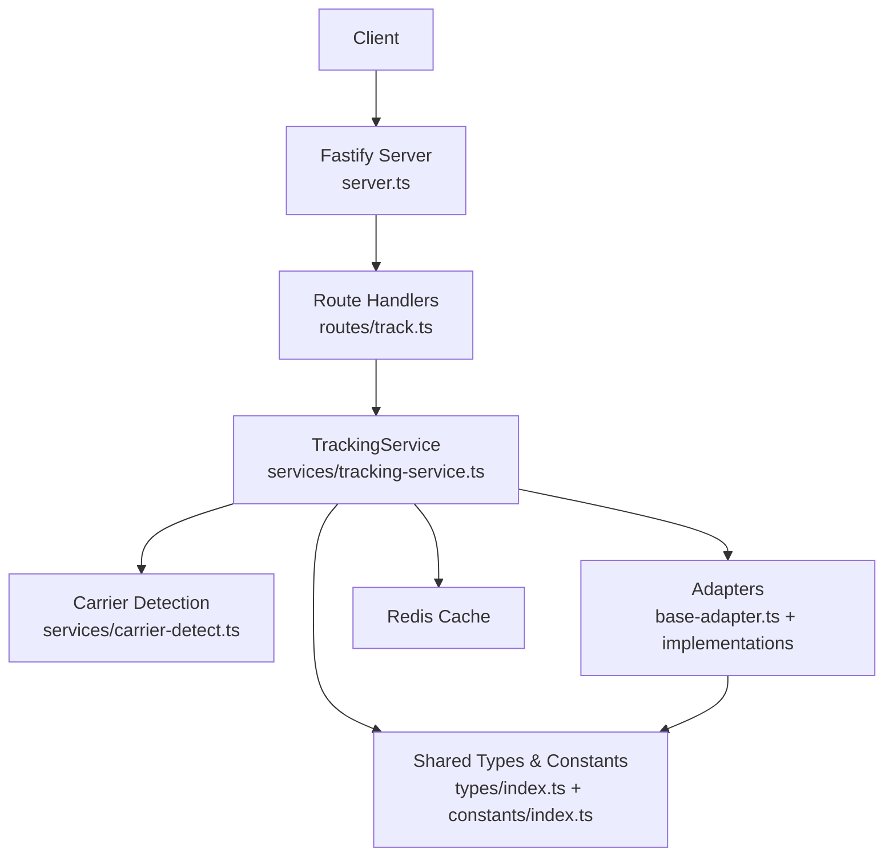
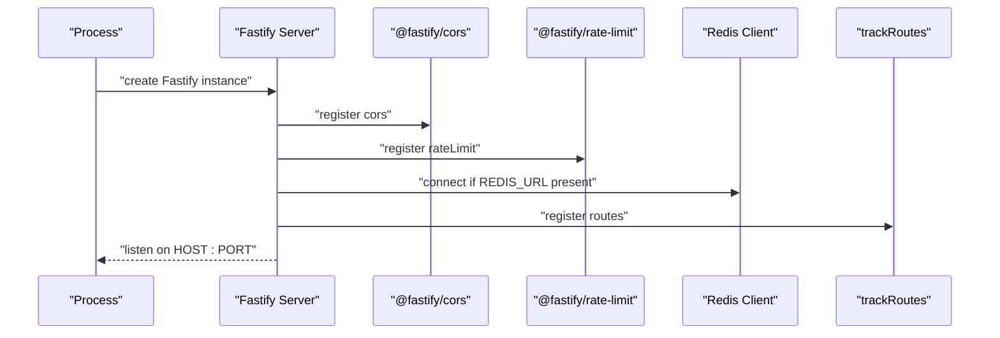
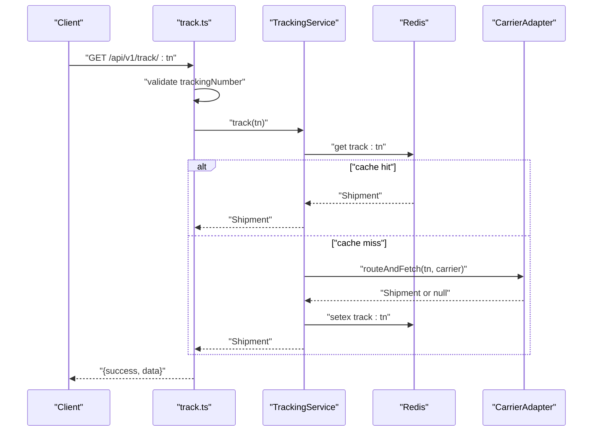
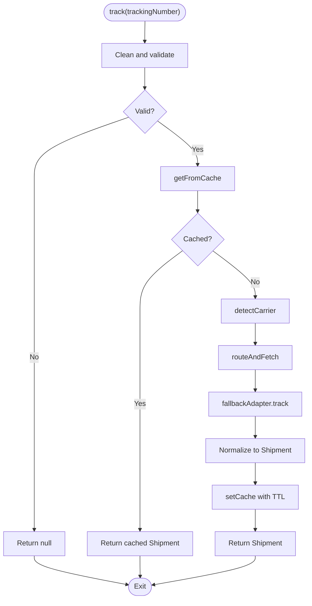
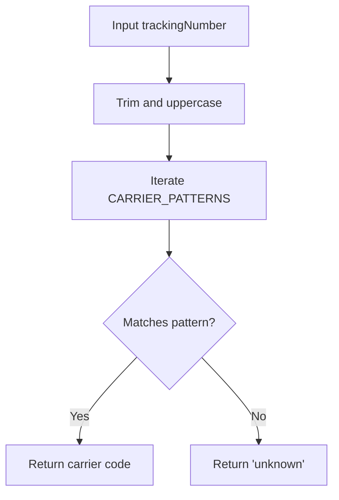
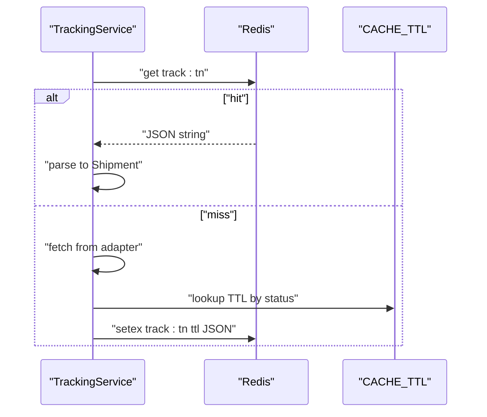
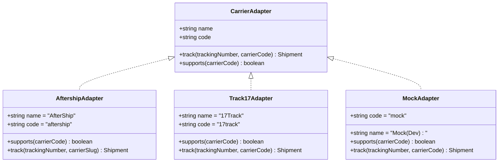
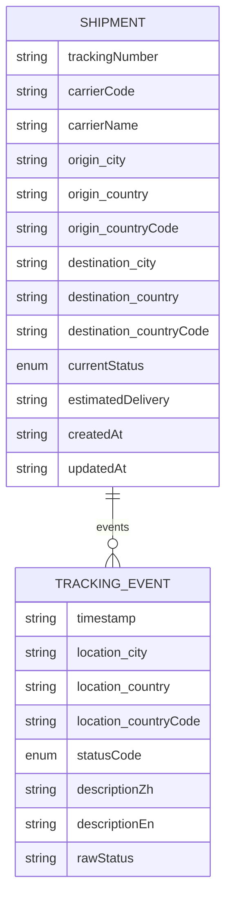
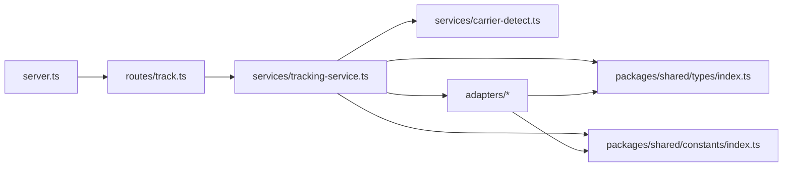

# Backend Service (Fastify)

<cite>
**Referenced Files in This Document**
- [server.ts](file://apps/api/src/server.ts)
- [track.ts](file://apps/api/src/routes/track.ts)
- [tracking-service.ts](file://apps/api/src/services/tracking-service.ts)
- [carrier-detect.ts](file://apps/api/src/services/carrier-detect.ts)
- [base-adapter.ts](file://apps/api/src/adapters/base-adapter.ts)
- [aftership-adapter.ts](file://apps/api/src/adapters/aftership-adapter.ts)
- [17track-adapter.ts](file://apps/api/src/adapters/17track-adapter.ts)
- [mock-adapter.ts](file://apps/api/src/adapters/mock-adapter.ts)
- [types/index.ts](file://packages/shared/src/types/index.ts)
- [constants/index.ts](file://packages/shared/src/constants/index.ts)
- [package.json](file://apps/api/package.json)
- [shared package.json](file://packages/shared/package.json)
- [docker-compose.yml](file://docker-compose.yml)
- [web health route](file://apps/web/src/app/api/v1/health/route.ts)
- [web track route](file://apps/web/src/app/api/v1/track/[trackingNumber]/route.ts)
</cite>

## Table of Contents
1. [Introduction](#introduction)
2. [Project Structure](#project-structure)
3. [Core Components](#core-components)
4. [Architecture Overview](#architecture-overview)
5. [Detailed Component Analysis](#detailed-component-analysis)
6. [Dependency Analysis](#dependency-analysis)
7. [Performance Considerations](#performance-considerations)
8. [Troubleshooting Guide](#troubleshooting-guide)
9. [Conclusion](#conclusion)
10. [Appendices](#appendices)

## Introduction
This document describes the Fastify backend service responsible for tracking shipments across multiple carriers. It covers server initialization, middleware configuration (CORS, rate limiting), API endpoint structure, the tracking service orchestration, carrier detection algorithms, Redis caching integration, the adapter pattern for pluggable carrier integrations, error handling, health checks, performance optimization strategies, request/response schemas, authentication considerations, deployment configurations, and monitoring/logging/maintenance procedures.

## Project Structure
The API application is organized into modular layers:
- Server bootstrap and middleware registration
- Route handlers
- Business logic (tracking service)
- Carrier detection utilities
- Pluggable adapter implementations
- Shared types and constants

**Diagram sources**
- [server.ts:1-60](file://apps/api/src/server.ts#L1-L60)
- [track.ts:1-75](file://apps/api/src/routes/track.ts#L1-L75)
- [tracking-service.ts:1-128](file://apps/api/src/services/tracking-service.ts#L1-L128)
- [carrier-detect.ts:1-27](file://apps/api/src/services/carrier-detect.ts#L1-L27)
- [base-adapter.ts:1-39](file://apps/api/src/adapters/base-adapter.ts#L1-L39)
- [aftership-adapter.ts:1-151](file://apps/api/src/adapters/aftership-adapter.ts#L1-L151)
- [17track-adapter.ts:1-118](file://apps/api/src/adapters/17track-adapter.ts#L1-L118)
- [mock-adapter.ts:1-74](file://apps/api/src/adapters/mock-adapter.ts#L1-L74)
- [types/index.ts:1-101](file://packages/shared/src/types/index.ts#L1-L101)
- [constants/index.ts:1-103](file://packages/shared/src/constants/index.ts#L1-L103)

**Section sources**
- [server.ts:1-60](file://apps/api/src/server.ts#L1-L60)
- [track.ts:1-75](file://apps/api/src/routes/track.ts#L1-L75)
- [tracking-service.ts:1-128](file://apps/api/src/services/tracking-service.ts#L1-L128)
- [base-adapter.ts:1-39](file://apps/api/src/adapters/base-adapter.ts#L1-L39)

## Core Components
- Server initialization and middleware:
  - Fastify instance with structured logging
  - CORS enabled for browser clients
  - Rate limiting configured globally
  - Optional Redis client with graceful degradation
- Routes:
  - GET /api/v1/track/:trackingNumber
  - POST /api/v1/track/batch
  - GET /api/v1/health
- Services:
  - TrackingService orchestrates caching, carrier detection, adapter routing, and normalization
- Adapters:
  - Unified CarrierAdapter interface
  - AftershipAdapter (universal fallback)
  - Track17Adapter (strong for China-origin carriers)
  - MockAdapter (development fallback)
- Shared types and constants:
  - Shipment, TrackingEvent, Location, TrackingStatus
  - Carrier detection patterns and cache TTLs

**Section sources**
- [server.ts:13-54](file://apps/api/src/server.ts#L13-L54)
- [track.ts:5-74](file://apps/api/src/routes/track.ts#L5-L74)
- [tracking-service.ts:10-38](file://apps/api/src/services/tracking-service.ts#L10-L38)
- [base-adapter.ts:4-18](file://apps/api/src/adapters/base-adapter.ts#L4-L18)
- [types/index.ts:48-67](file://packages/shared/src/types/index.ts#L48-L67)
- [constants/index.ts:60-75](file://packages/shared/src/constants/index.ts#L60-L75)

## Architecture Overview
The system follows a layered architecture:
- HTTP layer registers routes and validates requests
- Service layer encapsulates business logic and caching
- Adapter layer abstracts external carrier APIs
- Shared package defines types and constants used across layers

**Diagram sources**
- [server.ts:13-54](file://apps/api/src/server.ts#L13-L54)
- [track.ts:5-74](file://apps/api/src/routes/track.ts#L5-L74)
- [tracking-service.ts:10-38](file://apps/api/src/services/tracking-service.ts#L10-L38)
- [carrier-detect.ts:7-17](file://apps/api/src/services/carrier-detect.ts#L7-L17)
- [base-adapter.ts:4-18](file://apps/api/src/adapters/base-adapter.ts#L4-L18)
- [types/index.ts:48-67](file://packages/shared/src/types/index.ts#L48-L67)
- [constants/index.ts:31-43](file://packages/shared/src/constants/index.ts#L31-L43)

## Detailed Component Analysis

### Server Initialization and Middleware
- Logger enabled for structured logs
- CORS registered with origin enabled
- Rate limit registered with 60 requests per minute
- Redis connection optional; if unavailable, service continues without cache
- Routes registered after middleware setup

**Diagram sources**
- [server.ts:13-54](file://apps/api/src/server.ts#L13-L54)

**Section sources**
- [server.ts:13-54](file://apps/api/src/server.ts#L13-L54)

### Route Handlers and Validation
- GET /api/v1/track/:trackingNumber
  - Validates tracking number length and format
  - Delegates to TrackingService
  - Returns standardized response envelope
- POST /api/v1/track/batch
  - Validates array presence and size (≤50)
  - Delegates to TrackingService.batch
  - Returns aggregated results and failures
- GET /api/v1/health
  - Returns service health and Redis status

**Diagram sources**
- [track.ts:9-35](file://apps/api/src/routes/track.ts#L9-L35)
- [tracking-service.ts:40-62](file://apps/api/src/services/tracking-service.ts#L40-L62)
- [tracking-service.ts:107-126](file://apps/api/src/services/tracking-service.ts#L107-L126)

**Section sources**
- [track.ts:5-74](file://apps/api/src/routes/track.ts#L5-L74)

### Tracking Service Orchestration
- Lifecycle:
  1) Clean input and validate format
  2) Attempt cache lookup
  3) Detect carrier via pattern matching
  4) Route to best adapter (specific then fallback)
  5) Normalize raw data to Shipment
  6) Cache normalized result with TTL based on status
- Batch processing:
  - Processes in chunks with concurrency limit
  - Aggregates successful results and failures

**Diagram sources**
- [tracking-service.ts:40-62](file://apps/api/src/services/tracking-service.ts#L40-L62)
- [tracking-service.ts:93-105](file://apps/api/src/services/tracking-service.ts#L93-L105)
- [tracking-service.ts:107-126](file://apps/api/src/services/tracking-service.ts#L107-L126)

**Section sources**
- [tracking-service.ts:10-38](file://apps/api/src/services/tracking-service.ts#L10-L38)
- [tracking-service.ts:64-91](file://apps/api/src/services/tracking-service.ts#L64-L91)

### Carrier Detection Algorithms
- detectCarrier:
  - Iterates over predefined patterns to infer carrier code
  - Returns 'unknown' if no match
- isValidTrackingNumber:
  - Enforces length and alphanumeric constraints

**Diagram sources**
- [carrier-detect.ts:7-17](file://apps/api/src/services/carrier-detect.ts#L7-L17)
- [constants/index.ts:60-75](file://packages/shared/src/constants/index.ts#L60-L75)

**Section sources**
- [carrier-detect.ts:1-27](file://apps/api/src/services/carrier-detect.ts#L1-L27)
- [constants/index.ts:60-75](file://packages/shared/src/constants/index.ts#L60-L75)

### Redis Caching Integration
- Connection:
  - Optional via REDIS_URL
  - Graceful degradation if unavailable
  - Ping test confirms connectivity
- Cache keys:
  - Key format: track:{trackingNumber}
  - TTL determined by shipment’s current status
- Write behavior:
  - Non-fatal failures; service continues

**Diagram sources**
- [tracking-service.ts:107-126](file://apps/api/src/services/tracking-service.ts#L107-L126)
- [constants/index.ts:31-43](file://packages/shared/src/constants/index.ts#L31-L43)

**Section sources**
- [server.ts:25-46](file://apps/api/src/server.ts#L25-L46)
- [tracking-service.ts:107-126](file://apps/api/src/services/tracking-service.ts#L107-L126)
- [constants/index.ts:31-43](file://packages/shared/src/constants/index.ts#L31-L43)

### Adapter Pattern Implementation
- Interface:
  - CarrierAdapter defines track and supports contract
  - RawTrackingResult and RawTrackingEvent for intermediate normalization
- Implementations:
  - AftershipAdapter: universal fallback supporting many carriers
  - Track17Adapter: optimized for China-origin carriers with customs detection
  - MockAdapter: development/testing fallback returning synthetic data
- Routing:
  - Specific adapters first, then fallback adapter

**Diagram sources**
- [base-adapter.ts:4-18](file://apps/api/src/adapters/base-adapter.ts#L4-L18)
- [aftership-adapter.ts:23-35](file://apps/api/src/adapters/aftership-adapter.ts#L23-L35)
- [17track-adapter.ts:21-38](file://apps/api/src/adapters/17track-adapter.ts#L21-L38)
- [mock-adapter.ts:7-13](file://apps/api/src/adapters/mock-adapter.ts#L7-L13)

**Section sources**
- [base-adapter.ts:1-39](file://apps/api/src/adapters/base-adapter.ts#L1-L39)
- [aftership-adapter.ts:1-151](file://apps/api/src/adapters/aftership-adapter.ts#L1-L151)
- [17track-adapter.ts:1-118](file://apps/api/src/adapters/17track-adapter.ts#L1-L118)
- [mock-adapter.ts:1-74](file://apps/api/src/adapters/mock-adapter.ts#L1-L74)

### Request/Response Schemas
- Request bodies:
  - GET /api/v1/track/:trackingNumber accepts query parameter lang
  - POST /api/v1/track/batch expects { trackingNumbers: string[] }
- Response envelopes:
  - Standardized { success: boolean, data?: Shipment, error?: string }
  - Batch response includes results and failed entries
- Data model:
  - Shipment, TrackingEvent, Location, TrackingStatus, DataSource, Metadata

**Diagram sources**
- [types/index.ts:48-67](file://packages/shared/src/types/index.ts#L48-L67)
- [types/index.ts:37-45](file://packages/shared/src/types/index.ts#L37-L45)
- [types/index.ts:24-35](file://packages/shared/src/types/index.ts#L24-L35)

**Section sources**
- [track.ts:9-35](file://apps/api/src/routes/track.ts#L9-L35)
- [track.ts:38-64](file://apps/api/src/routes/track.ts#L38-L64)
- [types/index.ts:69-83](file://packages/shared/src/types/index.ts#L69-L83)
- [types/index.ts:48-67](file://packages/shared/src/types/index.ts#L48-L67)

### Authentication Considerations
- No authentication middleware is registered in the server bootstrap
- AftershipAdapter requires an API key header
- Track17Adapter requires a token header
- Recommendation: Introduce authentication middleware (e.g., API key or JWT) and enforce per-route as needed

**Section sources**
- [server.ts:13-54](file://apps/api/src/server.ts#L13-L54)
- [aftership-adapter.ts:44-48](file://apps/api/src/adapters/aftership-adapter.ts#L44-L48)
- [17track-adapter.ts:43-47](file://apps/api/src/adapters/17track-adapter.ts#L43-L47)

### Deployment Configurations
- Environment variables:
  - PORT, HOST for binding
  - REDIS_URL for optional caching
  - TRACK17_API_KEY and AFTERSHIP_API_KEY for carrier integrations
- Docker Compose:
  - Provides Redis and PostgreSQL services for local development
- Scripts:
  - Dev/watch mode, build, start, typecheck

**Section sources**
- [server.ts:10-11](file://apps/api/src/server.ts#L10-L11)
- [server.ts:27-46](file://apps/api/src/server.ts#L27-L46)
- [docker-compose.yml:1-23](file://docker-compose.yml#L1-L23)
- [package.json:6-12](file://apps/api/package.json#L6-L12)

### Monitoring, Logging, and Maintenance
- Logging:
  - Fastify logger enabled; Redis errors logged as warnings
- Health checks:
  - GET /api/v1/health returns service status and Redis availability
  - Frontend also exposes a lightweight health endpoint
- Maintenance:
  - Redis ping during startup; graceful fallback if unavailable
  - Cache TTLs tuned per status to balance freshness and cost

**Section sources**
- [server.ts:34-46](file://apps/api/src/server.ts#L34-L46)
- [track.ts:66-73](file://apps/api/src/routes/track.ts#L66-L73)
- [web health route:3-8](file://apps/web/src/app/api/v1/health/route.ts#L3-L8)

## Dependency Analysis
- Internal dependencies:
  - server.ts depends on routes/track.ts
  - routes/track.ts depends on services/tracking-service.ts
  - tracking-service.ts depends on carrier-detect.ts and adapters
  - adapters depend on shared types and constants
- External dependencies:
  - Fastify, @fastify/cors, @fastify/rate-limit, ioredis, dotenv
- Workspace dependencies:
  - @logistic/shared provides types and constants

**Diagram sources**
- [server.ts:6](file://apps/api/src/server.ts#L6)
- [track.ts:2](file://apps/api/src/routes/track.ts#L2)
- [tracking-service.ts:1-8](file://apps/api/src/services/tracking-service.ts#L1-L8)
- [base-adapter.ts:1](file://apps/api/src/adapters/base-adapter.ts#L1)
- [types/index.ts:1](file://packages/shared/src/types/index.ts#L1)
- [constants/index.ts:1](file://packages/shared/src/constants/index.ts#L1)

**Section sources**
- [package.json:13-20](file://apps/api/package.json#L13-L20)
- [shared package.json:8-13](file://packages/shared/package.json#L8-L13)

## Performance Considerations
- Concurrency control:
  - Batch processing uses chunked concurrency to avoid overload
- Caching:
  - Redis cache reduces repeated external API calls
  - TTL varies by status to optimize refresh cadence
- Adapter selection:
  - Prefer specific adapters for known carriers to minimize retries
- Network resilience:
  - Redis retry strategy and graceful degradation
- Rate limiting:
  - Global rate limit prevents abuse

**Section sources**
- [tracking-service.ts:71-88](file://apps/api/src/services/tracking-service.ts#L71-L88)
- [constants/index.ts:31-43](file://packages/shared/src/constants/index.ts#L31-L43)
- [server.ts:20-23](file://apps/api/src/server.ts#L20-L23)

## Troubleshooting Guide
- Server fails to start:
  - Verify environment variables (PORT, HOST, REDIS_URL, API keys)
  - Check Redis connectivity and network accessibility
- Empty or null responses:
  - Confirm tracking number validity and supported carrier patterns
  - Inspect adapter-specific error logs
- Cache issues:
  - Redis unavailability disables caching; service continues
  - Verify cache key format and TTL configuration
- Health check failures:
  - Review Redis ping result and route registration

**Section sources**
- [server.ts:25-46](file://apps/api/src/server.ts#L25-L46)
- [tracking-service.ts:107-126](file://apps/api/src/services/tracking-service.ts#L107-L126)
- [track.ts:66-73](file://apps/api/src/routes/track.ts#L66-L73)

## Conclusion
The Fastify backend provides a robust, extensible tracking platform with clear separation of concerns. Its adapter-based design enables easy integration of new carriers, while Redis caching and intelligent TTLs improve performance. The modular structure and shared types facilitate maintainability and consistency across the system.

## Appendices

### API Endpoints Summary
- GET /api/v1/track/:trackingNumber
  - Query parameters: lang (optional)
  - Response: { success: boolean, data?: Shipment, error?: string }
- POST /api/v1/track/batch
  - Body: { trackingNumbers: string[] }
  - Response: { success: boolean, results: Shipment[], failed: { trackingNumber: string, error: string }[] }
- GET /api/v1/health
  - Response: { status: string, timestamp: string, redis: string }

**Section sources**
- [track.ts:9-35](file://apps/api/src/routes/track.ts#L9-L35)
- [track.ts:38-64](file://apps/api/src/routes/track.ts#L38-L64)
- [track.ts:66-73](file://apps/api/src/routes/track.ts#L66-L73)