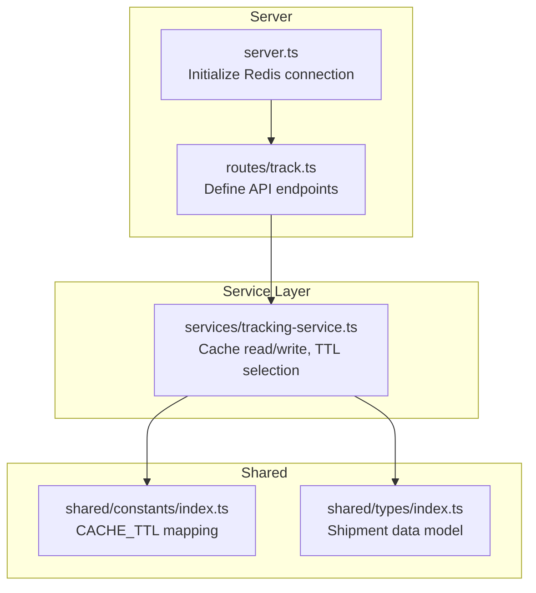
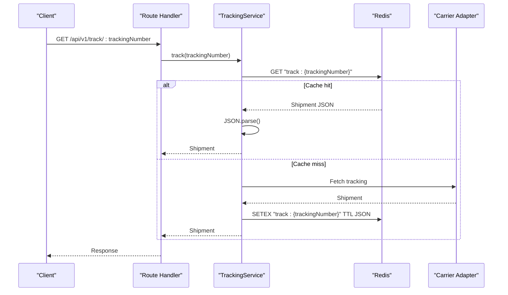
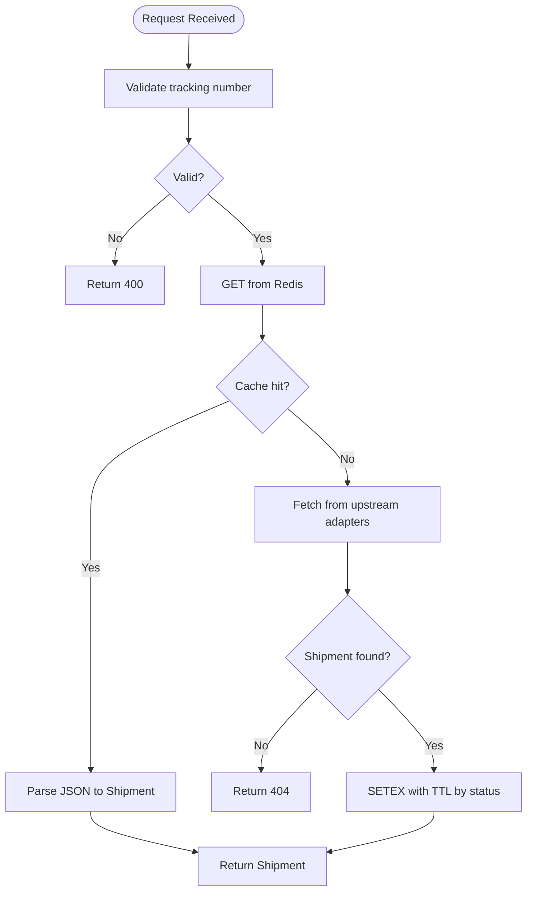
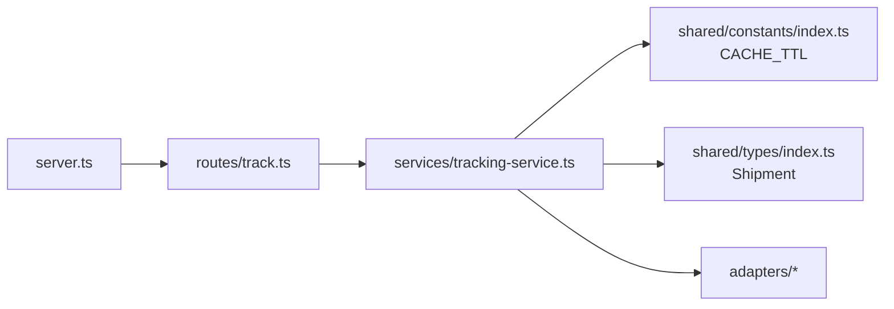

# Caching Strategy

<cite>
**Referenced Files in This Document**
- [server.ts](file://apps/api/src/server.ts)
- [track.ts](file://apps/api/src/routes/track.ts)
- [tracking-service.ts](file://apps/api/src/services/tracking-service.ts)
- [constants/index.ts](file://packages/shared/src/constants/index.ts)
- [types/index.ts](file://packages/shared/src/types/index.ts)
- [base-adapter.ts](file://apps/api/src/adapters/base-adapter.ts)
- [mock-adapter.ts](file://apps/api/src/adapters/mock-adapter.ts)
- [carrier-detect.ts](file://apps/api/src/services/carrier-detect.ts)
</cite>

## Table of Contents
1. [Introduction](#introduction)
2. [Project Structure](#project-structure)
3. [Core Components](#core-components)
4. [Architecture Overview](#architecture-overview)
5. [Detailed Component Analysis](#detailed-component-analysis)
6. [Dependency Analysis](#dependency-analysis)
7. [Performance Considerations](#performance-considerations)
8. [Troubleshooting Guide](#troubleshooting-guide)
9. [Conclusion](#conclusion)
10. [Appendices](#appendices)

## Introduction
This document explains the Redis caching strategy implemented in the tracking API. It covers cache key patterns, TTL management based on tracking status, connection configuration with retry strategies, graceful degradation when Redis is unavailable, data serialization, and cache invalidation strategies. It also includes performance optimization techniques, memory management, monitoring approaches, configuration options, troubleshooting, and best practices.

## Project Structure
The caching strategy spans several modules:
- Server initialization establishes the Redis connection and registers routes.
- Routes define the API endpoints and pass the Redis client to services.
- Tracking service implements cache reads/writes and TTL selection.
- Shared constants define cache TTL values mapped to tracking statuses.
- Types define the serialized data model stored in Redis.

**Diagram sources**
- [server.ts:25-46](file://apps/api/src/server.ts#L25-L46)
- [track.ts:5-6](file://apps/api/src/routes/track.ts#L5-L6)
- [tracking-service.ts:107-126](file://apps/api/src/services/tracking-service.ts#L107-L126)
- [constants/index.ts:31-43](file://packages/shared/src/constants/index.ts#L31-L43)
- [types/index.ts:47-61](file://packages/shared/src/types/index.ts#L47-L61)

**Section sources**
- [server.ts:13-54](file://apps/api/src/server.ts#L13-L54)
- [track.ts:5-74](file://apps/api/src/routes/track.ts#L5-L74)
- [tracking-service.ts:10-38](file://apps/api/src/services/tracking-service.ts#L10-L38)
- [constants/index.ts:31-43](file://packages/shared/src/constants/index.ts#L31-L43)
- [types/index.ts:47-61](file://packages/shared/src/types/index.ts#L47-L61)

## Core Components
- Redis connection and retry strategy: Configured with a bounded retry strategy and limited retries per request. On errors, the application logs a warning and continues without cache.
- Cache key pattern: Keys are prefixed with a namespace and the tracking number, enabling easy scoping and potential invalidation.
- TTL selection: TTL is derived from a mapping keyed by the shipment’s current status, with a fallback value for unknown statuses.
- Serialization: Shipment objects are JSON-stringified before storage and parsed upon retrieval.
- Graceful degradation: When Redis is unavailable or errors occur, the service continues operating without cache.

**Section sources**
- [server.ts:25-46](file://apps/api/src/server.ts#L25-L46)
- [tracking-service.ts:107-126](file://apps/api/src/services/tracking-service.ts#L107-L126)
- [constants/index.ts:31-43](file://packages/shared/src/constants/index.ts#L31-L43)

## Architecture Overview
The caching architecture integrates Redis into the request lifecycle:
- On request, the service attempts to read from cache.
- If miss, it performs upstream tracking and writes the result to cache with a TTL based on status.
- Redis errors are caught and treated as non-fatal.

**Diagram sources**
- [track.ts:9-35](file://apps/api/src/routes/track.ts#L9-L35)
- [tracking-service.ts:40-62](file://apps/api/src/services/tracking-service.ts#L40-L62)
- [tracking-service.ts:107-126](file://apps/api/src/services/tracking-service.ts#L107-L126)

## Detailed Component Analysis

### Redis Connection and Retry Strategy
- Connection is optional. If REDIS_URL is absent, the server runs without cache.
- When configured, Redis is initialized with:
  - maxRetriesPerRequest: bounded retries per operation.
  - retryStrategy: exponential backoff capped at a fixed interval.
- An error handler sets redis to null and logs a warning, effectively disabling cache for subsequent requests.
- A ping validates connectivity during startup.

Operational implications:
- Limits retry pressure on transient failures.
- Ensures the system remains functional even under Redis outages.

**Section sources**
- [server.ts:25-46](file://apps/api/src/server.ts#L25-L46)

### Cache Key Patterns
- Keys are constructed using a namespace and the tracking number: "track:{trackingNumber}".
- This pattern enables:
  - Clear scoping of tracking caches.
  - Easy invalidation by scanning or prefix-based operations if needed.
  - Consistent naming across environments.

**Section sources**
- [tracking-service.ts:110](file://apps/api/src/services/tracking-service.ts#L110)

### TTL Management Based on Tracking Status
- TTL values are defined per status in shared constants.
- During cache write, the service selects TTL from the mapping using the shipment’s current status.
- A fallback TTL is applied if the status is not present in the mapping.

Status-to-TTL mapping highlights:
- Pending: longer TTL to reduce upstream load while awaiting activity.
- In-transit and customs statuses: shorter TTL to reflect frequent updates.
- Out-for-delivery: minimal TTL to keep near-real-time data.
- Delivered/Expired: moderate TTL to balance freshness and cost.
- Failed/Returned: intermediate TTL to capture transient states.

**Section sources**
- [constants/index.ts:31-43](file://packages/shared/src/constants/index.ts#L31-L43)
- [tracking-service.ts:121](file://apps/api/src/services/tracking-service.ts#L121)

### Data Serialization and Deserialization
- Storage: Shipment objects are JSON-stringified before SETEX.
- Retrieval: Values are parsed back into Shipment objects.
- This approach ensures compact storage and straightforward interoperability.

Considerations:
- Ensure Shipment remains serializable.
- Avoid storing non-serializable fields (e.g., dates as objects) to prevent parse errors.

**Section sources**
- [tracking-service.ts:112](file://apps/api/src/services/tracking-service.ts#L112)
- [tracking-service.ts:122](file://apps/api/src/services/tracking-service.ts#L122)
- [types/index.ts:47-61](file://packages/shared/src/types/index.ts#L47-L61)

### Cache Invalidation Strategies
Current behavior:
- No explicit invalidation is implemented. Keys persist until TTL expiration.
- This simplifies operations but may retain stale data if upstream events change frequently.

Potential strategies (conceptual):
- Prefix-based invalidation: introduce a versioned prefix and rotate it periodically.
- Event-driven invalidation: upon receiving upstream updates, delete the corresponding key.
- Partial updates: update only changed fields while preserving others.

Note: The current design favors simplicity and resilience over immediate invalidation.

**Section sources**
- [tracking-service.ts:118-126](file://apps/api/src/services/tracking-service.ts#L118-L126)

### Graceful Degradation When Redis Is Unavailable
- If Redis is unreachable or errors occur, the service:
  - Continues to operate without cache.
  - Writes to cache are non-fatal and ignored on error.
  - Health endpoint reflects Redis availability.

Benefits:
- High availability: API remains responsive even under Redis issues.
- Operational safety: failures do not cascade to clients.

**Section sources**
- [server.ts:34-37](file://apps/api/src/server.ts#L34-L37)
- [tracking-service.ts:123-125](file://apps/api/src/services/tracking-service.ts#L123-L125)
- [track.ts:67-73](file://apps/api/src/routes/track.ts#L67-L73)

### Request Flow and Cache Behavior

**Diagram sources**
- [track.ts:9-35](file://apps/api/src/routes/track.ts#L9-L35)
- [tracking-service.ts:40-62](file://apps/api/src/services/tracking-service.ts#L40-L62)
- [tracking-service.ts:107-126](file://apps/api/src/services/tracking-service.ts#L107-L126)

## Dependency Analysis
- server.ts depends on ioredis and Fastify to initialize Redis and register routes.
- routes/track.ts constructs TrackingService with the Redis client.
- tracking-service.ts depends on shared constants for TTL mapping and types for serialization.
- Adapters implement the CarrierAdapter interface; the service routes to the best adapter and falls back to a universal adapter if needed.

**Diagram sources**
- [server.ts:5](file://apps/api/src/server.ts#L5)
- [track.ts:2](file://apps/api/src/routes/track.ts#L2)
- [tracking-service.ts:1-8](file://apps/api/src/services/tracking-service.ts#L1-L8)
- [constants/index.ts:31-43](file://packages/shared/src/constants/index.ts#L31-L43)
- [types/index.ts:47-61](file://packages/shared/src/types/index.ts#L47-L61)
- [base-adapter.ts:4-18](file://apps/api/src/adapters/base-adapter.ts#L4-L18)

**Section sources**
- [server.ts:1-59](file://apps/api/src/server.ts#L1-L59)
- [track.ts:1-75](file://apps/api/src/routes/track.ts#L1-L75)
- [tracking-service.ts:1-128](file://apps/api/src/services/tracking-service.ts#L1-L128)
- [base-adapter.ts:4-18](file://apps/api/src/adapters/base-adapter.ts#L4-L18)

## Performance Considerations
- Concurrency control: Batch processing uses a fixed concurrency window to avoid overwhelming upstream providers.
- Retry strategy: Bounded retries per request reduce retry storms and protect upstream systems.
- TTL tuning: Shorter TTLs for dynamic statuses reduce staleness; longer TTLs for pending/delivered reduce upstream calls.
- Serialization overhead: JSON stringify/parsing adds CPU cost; ensure Shipment remains lightweight and serializable.
- Memory footprint: TTL-based eviction prevents unbounded growth; monitor key counts and memory usage.
- Monitoring: Health endpoint exposes Redis connectivity status for operational visibility.

[No sources needed since this section provides general guidance]

## Troubleshooting Guide
Common issues and resolutions:
- Redis connection errors:
  - Symptoms: Warning logs indicating Redis error and degraded mode.
  - Resolution: Verify REDIS_URL, network connectivity, and Redis availability. The system continues without cache automatically.
- Cache write failures:
  - Symptoms: No effect on request outcome; errors are caught and ignored.
  - Resolution: Inspect Redis connectivity and disk space; ensure network stability.
- Unexpected cache misses:
  - Causes: TTL expiration, cache disabled, or upstream not returning data.
  - Resolution: Confirm Redis is reachable and healthy; verify TTL mapping and status values.
- Health endpoint shows disabled Redis:
  - Cause: REDIS_URL not configured or connection failed.
  - Resolution: Set REDIS_URL and restart the service.

**Section sources**
- [server.ts:34-37](file://apps/api/src/server.ts#L34-L37)
- [tracking-service.ts:123-125](file://apps/api/src/services/tracking-service.ts#L123-L125)
- [track.ts:67-73](file://apps/api/src/routes/track.ts#L67-L73)

## Conclusion
The caching strategy balances simplicity, resilience, and performance:
- Optional Redis integration with robust retry and error handling.
- Status-aware TTL selection to optimize freshness vs. cost.
- JSON-based serialization for straightforward storage and retrieval.
- Graceful degradation ensures continuous operation even when Redis is unavailable.
Future enhancements could include explicit invalidation or event-driven updates to further improve cache correctness and reduce stale data.

[No sources needed since this section summarizes without analyzing specific files]

## Appendices

### Configuration Options
- Environment variables:
  - REDIS_URL: Redis connection string. If absent, the service runs without cache.
  - TRACK17_API_KEY, AFTERSHIP_API_KEY: Enable specific carrier adapters when present.
  - PORT, HOST: Server binding configuration.
- Redis client options:
  - maxRetriesPerRequest: bounded retries per operation.
  - retryStrategy: exponential backoff with a cap.
  - error event handler disables cache on failure.

**Section sources**
- [server.ts:25-46](file://apps/api/src/server.ts#L25-L46)
- [tracking-service.ts:21-37](file://apps/api/src/services/tracking-service.ts#L21-L37)

### Monitoring Approaches
- Health endpoint: Exposes redis connectivity status alongside standard health fields.
- Logs: Redis connection warnings and successful connections are logged at info/warn levels.
- Observability: Add metrics for cache hits/misses, TTL distribution, and upstream latency.

**Section sources**
- [track.ts:67-73](file://apps/api/src/routes/track.ts#L67-L73)
- [server.ts:34-39](file://apps/api/src/server.ts#L34-L39)

### Best Practices for Cache Utilization
- Keep Shipment serializable and compact.
- Monitor TTL effectiveness and adjust mappings based on observed status distributions.
- Prefer short TTLs for highly dynamic statuses; longer TTLs for stable states.
- Avoid heavy computation in cache read/write paths; keep JSON parsing minimal.
- Consider adding cache warming for high-volume tracking numbers during off-peak hours.

[No sources needed since this section provides general guidance]