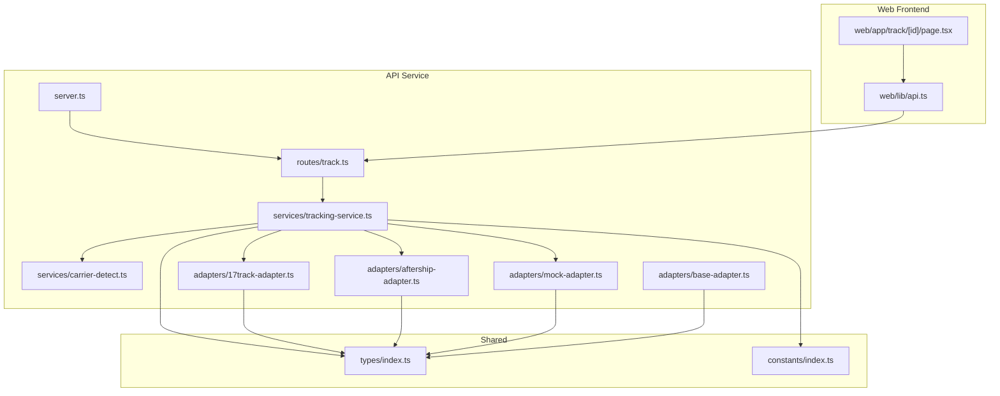
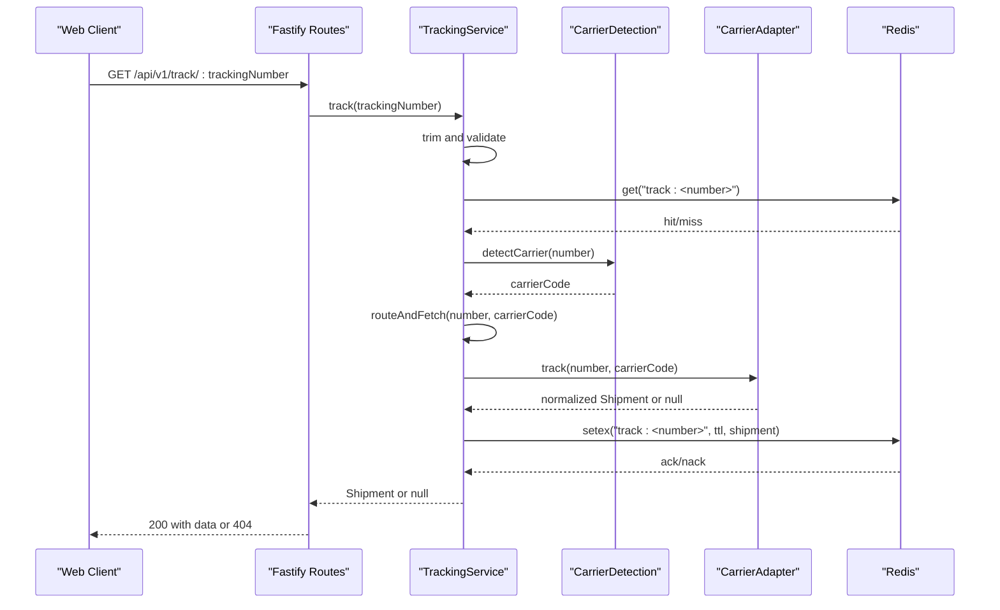
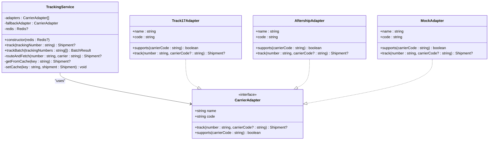
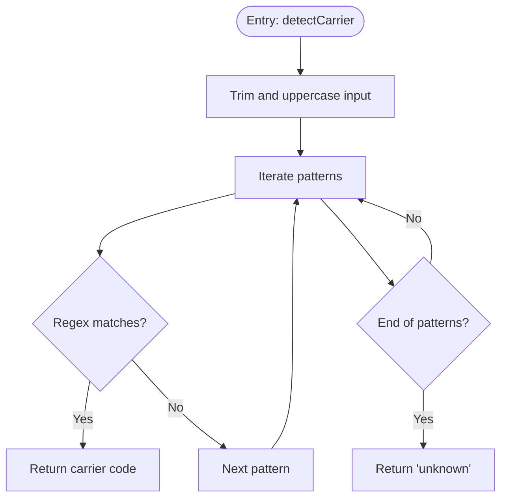
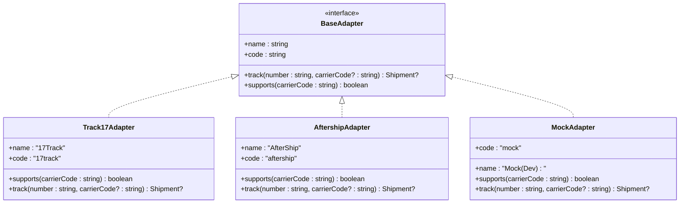
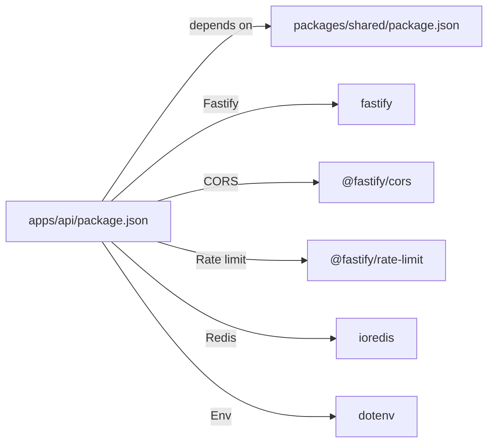

# Core Services

<cite>
**Referenced Files in This Document**
- [tracking-service.ts](file://apps/api/src/services/tracking-service.ts)
- [carrier-detect.ts](file://apps/api/src/services/carrier-detect.ts)
- [base-adapter.ts](file://apps/api/src/adapters/base-adapter.ts)
- [17track-adapter.ts](file://apps/api/src/adapters/17track-adapter.ts)
- [aftership-adapter.ts](file://apps/api/src/adapters/aftership-adapter.ts)
- [mock-adapter.ts](file://apps/api/src/adapters/mock-adapter.ts)
- [index.ts](file://packages/shared/src/types/index.ts)
- [index.ts](file://packages/shared/src/constants/index.ts)
- [track.ts](file://apps/api/src/routes/track.ts)
- [server.ts](file://apps/api/src/server.ts)
- [api.ts](file://apps/web/src/lib/api.ts)
- [page.tsx](file://apps/web/src/app/track/[id]/page.tsx)
</cite>

## Table of Contents
1. [Introduction](#introduction)
2. [Project Structure](#project-structure)
3. [Core Components](#core-components)
4. [Architecture Overview](#architecture-overview)
5. [Detailed Component Analysis](#detailed-component-analysis)
6. [Dependency Analysis](#dependency-analysis)
7. [Performance Considerations](#performance-considerations)
8. [Troubleshooting Guide](#troubleshooting-guide)
9. [Conclusion](#conclusion)
10. [Appendices](#appendices)

## Introduction
This document describes the core backend services responsible for tracking shipments across multiple carriers. It focuses on the TrackingService orchestration layer, including adapter selection, request routing, and response aggregation. It also documents the CarrierDetection service with pattern matching algorithms, carrier recognition logic, and validation rules. The guide covers service dependencies, error handling strategies, performance optimization techniques, initialization, configuration options, and integration patterns with the frontend.

## Project Structure
The backend is organized into:
- API service: Fastify server, routes, and core services
- Adapters: Pluggable integrations for carrier APIs
- Shared package: Types, constants, and cross-cutting concerns

**Diagram sources**
- [server.ts:13-54](file://apps/api/src/server.ts#L13-L54)
- [track.ts:5-74](file://apps/api/src/routes/track.ts#L5-L74)
- [tracking-service.ts:10-127](file://apps/api/src/services/tracking-service.ts#L10-L127)
- [carrier-detect.ts:7-26](file://apps/api/src/services/carrier-detect.ts#L7-L26)
- [17track-adapter.ts:21-117](file://apps/api/src/adapters/17track-adapter.ts#L21-L117)
- [aftership-adapter.ts:23-150](file://apps/api/src/adapters/aftership-adapter.ts#L23-L150)
- [mock-adapter.ts:7-73](file://apps/api/src/adapters/mock-adapter.ts#L7-L73)
- [base-adapter.ts:4-38](file://apps/api/src/adapters/base-adapter.ts#L4-L38)
- [index.ts:1-101](file://packages/shared/src/types/index.ts#L1-L101)
- [index.ts:1-103](file://packages/shared/src/constants/index.ts#L1-L103)
- [api.ts:5-55](file://apps/web/src/lib/api.ts#L5-L55)
- [page.tsx:25-262](file://apps/web/src/app/track/[id]/page.tsx#L25-L262)

**Section sources**
- [server.ts:13-54](file://apps/api/src/server.ts#L13-L54)
- [track.ts:5-74](file://apps/api/src/routes/track.ts#L5-L74)
- [tracking-service.ts:10-127](file://apps/api/src/services/tracking-service.ts#L10-L127)
- [base-adapter.ts:4-38](file://apps/api/src/adapters/base-adapter.ts#L4-L38)
- [index.ts:1-101](file://packages/shared/src/types/index.ts#L1-L101)
- [index.ts:1-103](file://packages/shared/src/constants/index.ts#L1-L103)
- [api.ts:5-55](file://apps/web/src/lib/api.ts#L5-L55)
- [page.tsx:25-262](file://apps/web/src/app/track/[id]/page.tsx#L25-L262)

## Core Components
- TrackingService: Orchestrates tracking requests, selects adapters, routes requests, aggregates responses, and manages caching.
- CarrierDetection: Provides pattern-based carrier detection and basic format validation.
- Adapter Layer: Implements CarrierAdapter interface for 17Track, AfterShip, and a development mock adapter.
- Shared Types and Constants: Defines shipment models, statuses, cache TTLs, carrier patterns, and tier configurations.

Key responsibilities:
- Orchestration: Validation, cache lookup, carrier detection, adapter routing, and caching writes.
- Detection: Regex-based carrier pattern matching and basic tracking number validation.
- Adapters: Normalize external carrier responses into a unified Shipment model.
- Frontend Integration: Expose REST endpoints and consume via web client.

**Section sources**
- [tracking-service.ts:10-127](file://apps/api/src/services/tracking-service.ts#L10-L127)
- [carrier-detect.ts:7-26](file://apps/api/src/services/carrier-detect.ts#L7-L26)
- [base-adapter.ts:4-38](file://apps/api/src/adapters/base-adapter.ts#L4-L38)
- [index.ts:1-101](file://packages/shared/src/types/index.ts#L1-L101)
- [index.ts:31-75](file://packages/shared/src/constants/index.ts#L31-L75)

## Architecture Overview
The system follows a layered architecture:
- HTTP layer: Fastify routes expose tracking endpoints.
- Service layer: TrackingService orchestrates the end-to-end flow.
- Detection layer: CarrierDetection identifies carrier codes from tracking numbers.
- Adapter layer: Pluggable integrations for carrier APIs.
- Shared layer: Types and constants define the canonical data model and configuration.
- Optional cache: Redis-backed caching for performance.

**Diagram sources**
- [track.ts:8-35](file://apps/api/src/routes/track.ts#L8-L35)
- [tracking-service.ts:40-62](file://apps/api/src/services/tracking-service.ts#L40-L62)
- [tracking-service.ts:93-105](file://apps/api/src/services/tracking-service.ts#L93-L105)
- [carrier-detect.ts:7-17](file://apps/api/src/services/carrier-detect.ts#L7-L17)
- [17track-adapter.ts:40-61](file://apps/api/src/adapters/17track-adapter.ts#L40-L61)
- [aftership-adapter.ts:37-64](file://apps/api/src/adapters/aftership-adapter.ts#L37-L64)
- [mock-adapter.ts:15-72](file://apps/api/src/adapters/mock-adapter.ts#L15-L72)
- [tracking-service.ts:107-126](file://apps/api/src/services/tracking-service.ts#L107-L126)

## Detailed Component Analysis

### TrackingService Orchestration
Responsibilities:
- Initialization: Builds an ordered adapter chain based on configured API keys, with a fallback adapter.
- Single tracking: Validates input, checks cache, detects carrier, routes to best adapter, caches result.
- Batch tracking: Processes multiple tracking numbers with controlled concurrency and aggregates results/failures.
- Caching: Reads/writes normalized shipment data to Redis with TTLs derived from status.

Implementation highlights:
- Adapter chain prioritization: Specific adapters for supported carriers are tried first; otherwise fallback adapter handles the request.
- Fallback strategy: AfterShip adapter acts as a universal fallback; in absence of API keys, a mock adapter is used for development.
- Concurrency control: Batch processing uses a fixed concurrency window to balance throughput and resource usage.
- Non-fatal cache failures: Cache write errors do not fail the request.

**Diagram sources**
- [tracking-service.ts:10-127](file://apps/api/src/services/tracking-service.ts#L10-L127)
- [base-adapter.ts:4-18](file://apps/api/src/adapters/base-adapter.ts#L4-L18)
- [17track-adapter.ts:21-117](file://apps/api/src/adapters/17track-adapter.ts#L21-L117)
- [aftership-adapter.ts:23-150](file://apps/api/src/adapters/aftership-adapter.ts#L23-L150)
- [mock-adapter.ts:7-73](file://apps/api/src/adapters/mock-adapter.ts#L7-L73)

**Section sources**
- [tracking-service.ts:15-38](file://apps/api/src/services/tracking-service.ts#L15-L38)
- [tracking-service.ts:40-62](file://apps/api/src/services/tracking-service.ts#L40-L62)
- [tracking-service.ts:64-91](file://apps/api/src/services/tracking-service.ts#L64-L91)
- [tracking-service.ts:93-105](file://apps/api/src/services/tracking-service.ts#L93-L105)
- [tracking-service.ts:107-126](file://apps/api/src/services/tracking-service.ts#L107-L126)

### CarrierDetection Service
Responsibilities:
- detectCarrier: Matches tracking number against predefined patterns to infer carrier code.
- isValidTrackingNumber: Basic format validation ensuring alphanumeric length constraints.

Pattern matching logic:
- Iterates through a curated list of regex patterns mapped to carrier codes.
- Returns the first match or "unknown" if none found.
- Validation enforces a minimum and maximum length for tracking numbers.

**Diagram sources**
- [carrier-detect.ts:7-17](file://apps/api/src/services/carrier-detect.ts#L7-L17)
- [index.ts:59-75](file://packages/shared/src/constants/index.ts#L59-L75)

**Section sources**
- [carrier-detect.ts:7-26](file://apps/api/src/services/carrier-detect.ts#L7-L26)
- [index.ts:59-75](file://packages/shared/src/constants/index.ts#L59-L75)

### Adapter Layer
Adapter contracts and behaviors:
- Base interface: Defines name, code, track, and supports methods.
- Track17Adapter: Specialized for China-origin carriers; maps 17Track statuses to standard statuses and detects customs events.
- AftershipAdapter: Universal fallback supporting many carriers; auto-detects carrier when missing and can create tracking entries.
- MockAdapter: Development-only adapter returning synthetic shipment data.

**Diagram sources**
- [base-adapter.ts:4-18](file://apps/api/src/adapters/base-adapter.ts#L4-L18)
- [17track-adapter.ts:21-38](file://apps/api/src/adapters/17track-adapter.ts#L21-L38)
- [aftership-adapter.ts:23-35](file://apps/api/src/adapters/aftership-adapter.ts#L23-L35)
- [mock-adapter.ts:7-13](file://apps/api/src/adapters/mock-adapter.ts#L7-L13)

**Section sources**
- [base-adapter.ts:4-38](file://apps/api/src/adapters/base-adapter.ts#L4-L38)
- [17track-adapter.ts:21-117](file://apps/api/src/adapters/17track-adapter.ts#L21-L117)
- [aftership-adapter.ts:23-150](file://apps/api/src/adapters/aftership-adapter.ts#L23-L150)
- [mock-adapter.ts:7-73](file://apps/api/src/adapters/mock-adapter.ts#L7-L73)

### Data Model and Caching
Data model:
- Shipment: Canonical representation of tracking information with status, events, origin/destination, and metadata.
- TrackingEvent: Individual checkpoint with location, status, and timestamps.
- TrackingStatus: Standardized statuses across carriers.

Caching:
- Cache keys: "track:<trackingNumber>"
- TTLs: Derived from current status to optimize refresh cadence.
- Write failures: Logged but do not block request completion.

**Section sources**
- [index.ts:48-67](file://packages/shared/src/types/index.ts#L48-L67)
- [index.ts:38-45](file://packages/shared/src/types/index.ts#L38-L45)
- [index.ts:2-13](file://packages/shared/src/types/index.ts#L2-L13)
- [index.ts:31-43](file://packages/shared/src/constants/index.ts#L31-L43)
- [tracking-service.ts:107-126](file://apps/api/src/services/tracking-service.ts#L107-L126)

### Service Initialization and Configuration
Initialization:
- Environment variables: TRACK17_API_KEY, AFTERSHIP_API_KEY, REDIS_URL, PORT, HOST.
- Adapter chain: Built dynamically based on available keys; fallback to mock if none configured.
- Redis: Optional connection with graceful degradation; health endpoint reports status.

Configuration options:
- API keys: Enable specific adapters; absence enables fallback adapter.
- Redis: Enables caching; optional for development.
- Rate limiting: Applied at the HTTP layer.

**Section sources**
- [tracking-service.ts:15-38](file://apps/api/src/services/tracking-service.ts#L15-L38)
- [server.ts:25-46](file://apps/api/src/server.ts#L25-L46)
- [track.ts:66-73](file://apps/api/src/routes/track.ts#L66-L73)

### Integration Patterns
- Backend routes: Fastify endpoints expose single and batch tracking.
- Frontend consumption: Web client calls API endpoints and renders results.
- Error propagation: HTTP status codes and structured responses inform UI behavior.

**Section sources**
- [track.ts:8-35](file://apps/api/src/routes/track.ts#L8-L35)
- [track.ts:37-64](file://apps/api/src/routes/track.ts#L37-L64)
- [api.ts:5-55](file://apps/web/src/lib/api.ts#L5-L55)
- [page.tsx:25-262](file://apps/web/src/app/track/[id]/page.tsx#L25-L262)

## Dependency Analysis
External dependencies and runtime behavior:
- Fastify: HTTP server and routing framework.
- ioredis: Redis client for caching with retry strategy.
- dotenv: Loads environment variables.
- @logistic/shared: Shared types and constants consumed by both API and web.

**Diagram sources**
- [package.json:13-25](file://apps/api/package.json#L13-L25)
- [package.json:13-21](file://packages/shared/package.json#L13-L21)

**Section sources**
- [package.json:13-25](file://apps/api/package.json#L13-L25)
- [package.json:13-21](file://packages/shared/package.json#L13-L21)

## Performance Considerations
- Caching: Status-aware TTL reduces redundant carrier API calls and improves response times.
- Concurrency: Batch processing limits concurrent requests to avoid overwhelming downstream APIs.
- Adapter prioritization: Prefer specialized adapters for higher accuracy and fewer retries.
- Redis resilience: Configured retry strategy and graceful degradation prevent outages from blocking requests.
- Frontend UX: Loading states and error messaging improve perceived performance and user experience.

[No sources needed since this section provides general guidance]

## Troubleshooting Guide
Common issues and resolutions:
- Invalid tracking number: Validation rejects inputs outside the expected length and character set.
- Tracking not found: Adapter returns null; ensure carrier detection matched a supported carrier or rely on fallback adapter.
- Cache write failures: Non-fatal; requests still succeed but cache updates are skipped.
- Redis connectivity: Health endpoint indicates disabled or connected state; server continues without cache if unavailable.
- Batch limits: Enforced at the API boundary; adjust client-side batching accordingly.

Operational checks:
- Verify environment variables for API keys and Redis URL.
- Confirm adapter availability and fallback behavior.
- Monitor cache hit rates and TTL effectiveness.

**Section sources**
- [carrier-detect.ts:23-26](file://apps/api/src/services/carrier-detect.ts#L23-L26)
- [tracking-service.ts:43-45](file://apps/api/src/services/tracking-service.ts#L43-L45)
- [tracking-service.ts:58-61](file://apps/api/src/services/tracking-service.ts#L58-L61)
- [tracking-service.ts:123-125](file://apps/api/src/services/tracking-service.ts#L123-L125)
- [server.ts:34-46](file://apps/api/src/server.ts#L34-L46)
- [track.ts:50-55](file://apps/api/src/routes/track.ts#L50-L55)

## Conclusion
The backend provides a robust, extensible tracking platform:
- TrackingService orchestrates validation, caching, detection, routing, and aggregation.
- CarrierDetection offers reliable pattern-based carrier inference.
- Adapter layer supports multiple carriers with a universal fallback and development mock.
- Shared types and constants ensure consistent data modeling and configuration.
- Integration with the frontend is straightforward via REST endpoints and structured responses.

[No sources needed since this section summarizes without analyzing specific files]

## Appendices

### API Endpoints
- GET /api/v1/track/:trackingNumber
  - Query parameters: lang (optional)
  - Responses: 200 with Shipment, 400 for invalid input, 404 when not found
- POST /api/v1/track/batch
  - Body: { trackingNumbers: string[] }
  - Responses: 200 with results and failed list, 400 for invalid input
- GET /api/v1/health
  - Responses: 200 with status and Redis connectivity info

**Section sources**
- [track.ts:8-35](file://apps/api/src/routes/track.ts#L8-L35)
- [track.ts:37-64](file://apps/api/src/routes/track.ts#L37-L64)
- [track.ts:66-73](file://apps/api/src/routes/track.ts#L66-L73)