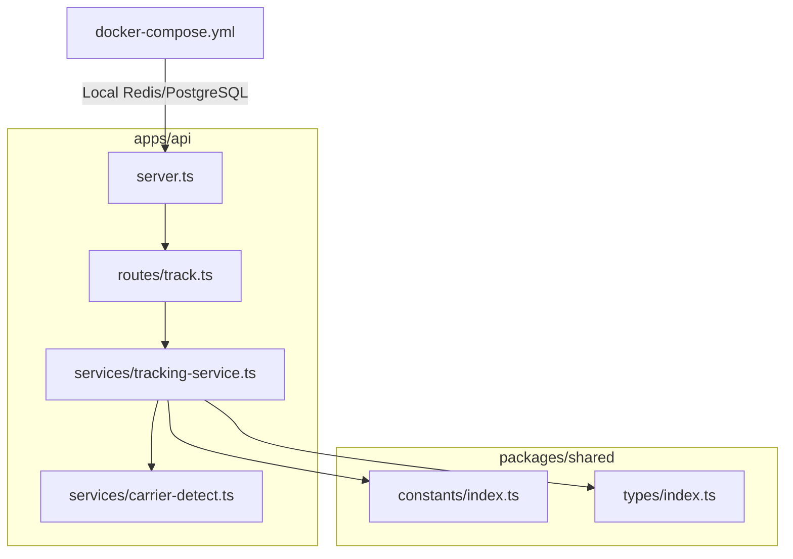
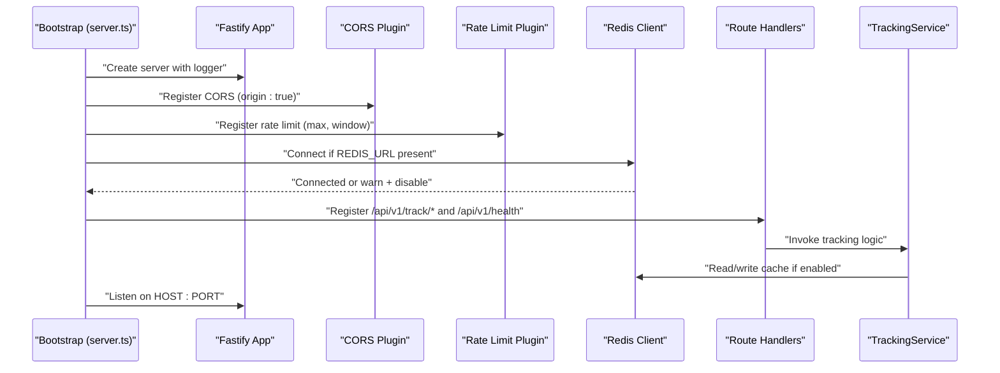
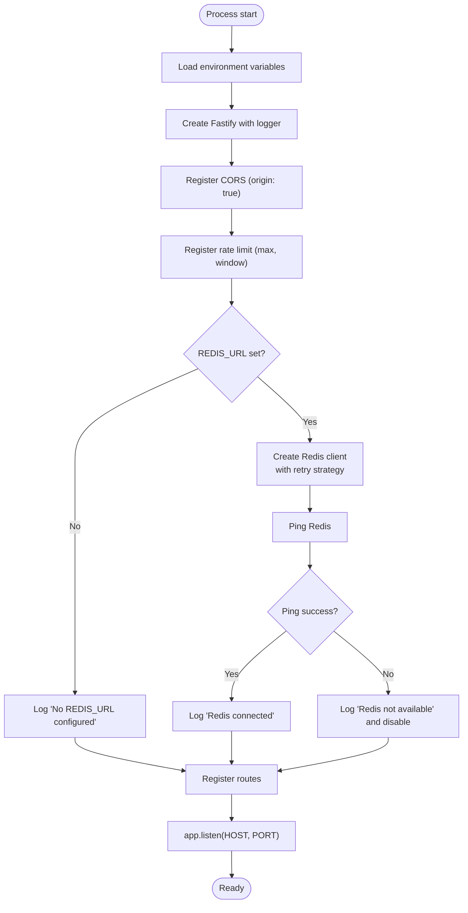
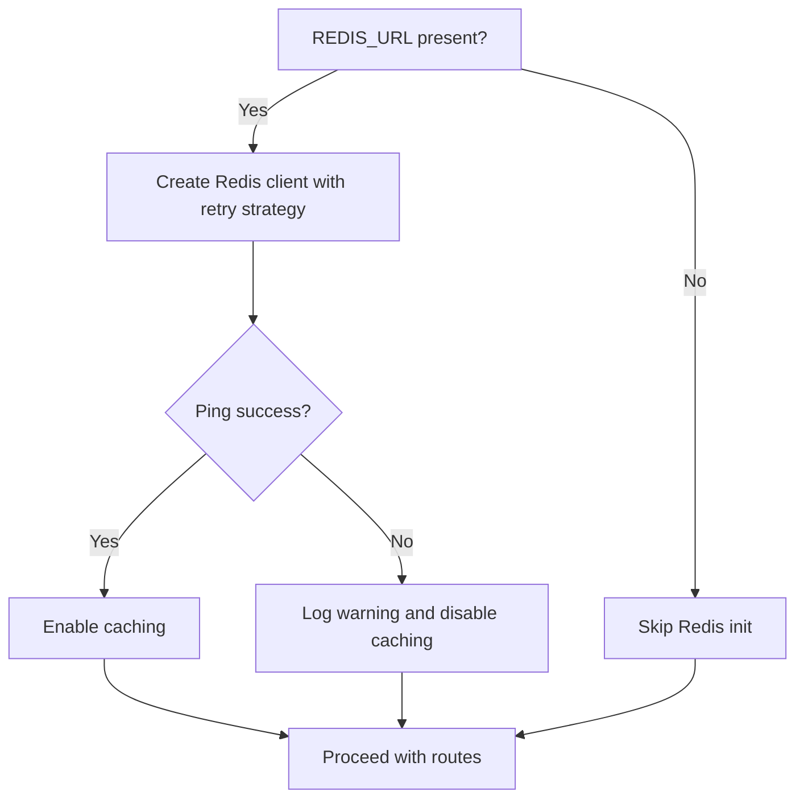
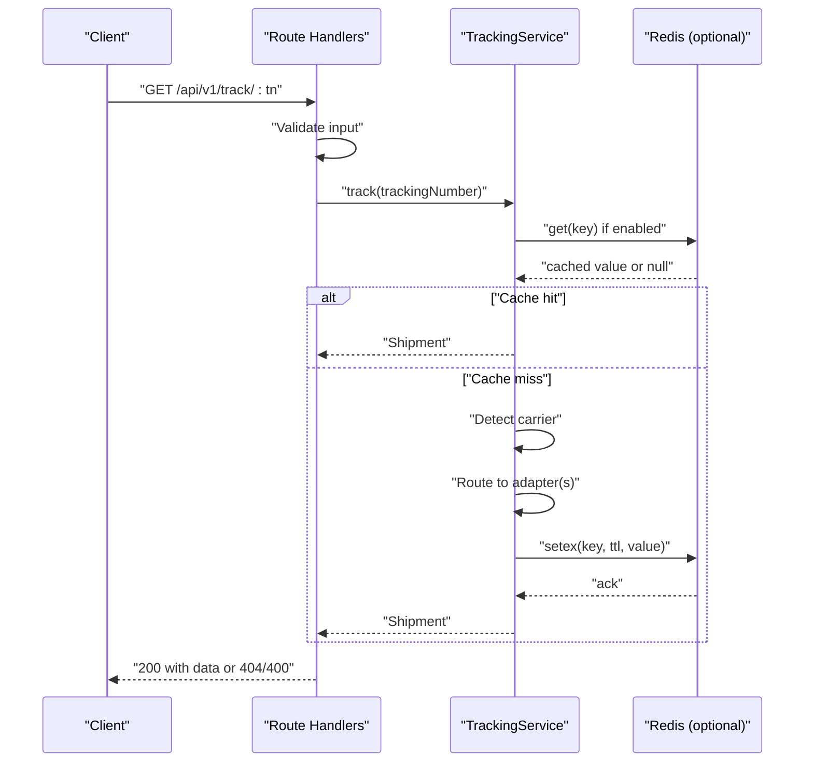
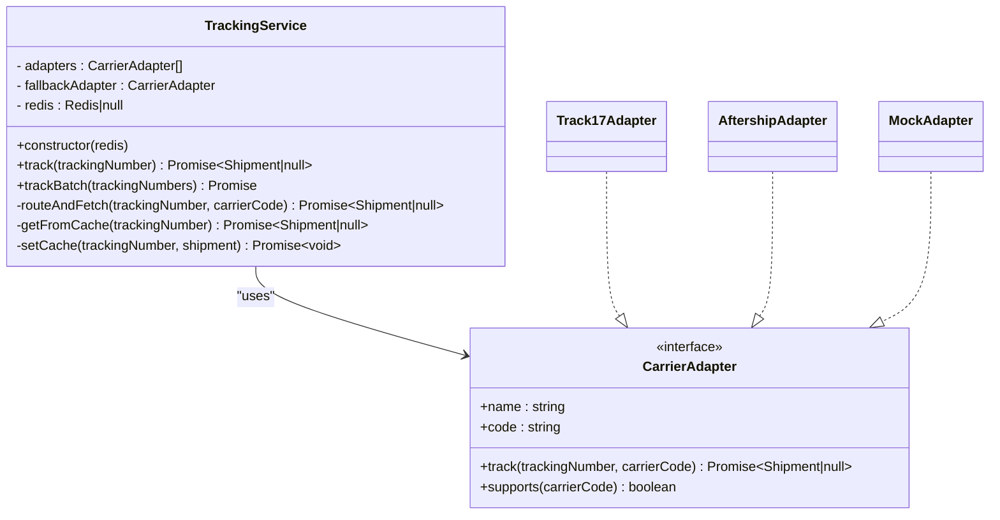
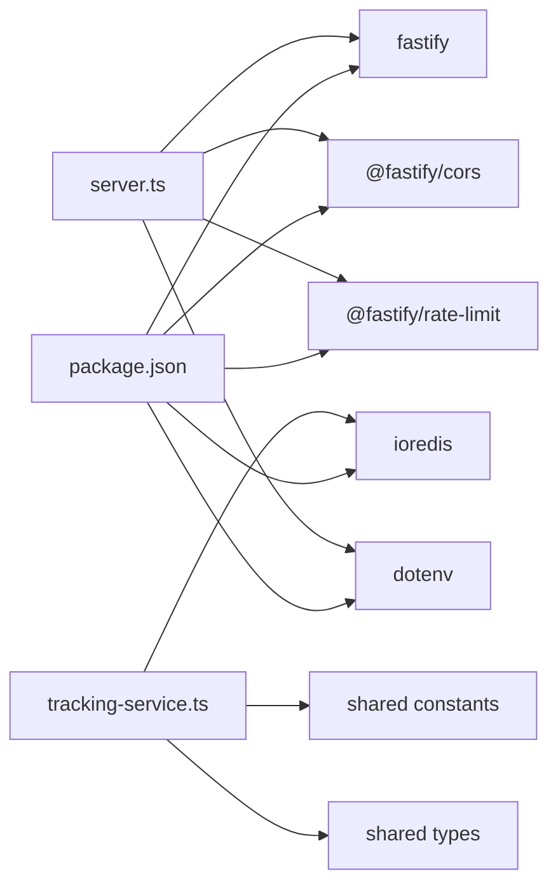

# Server Configuration

<cite>
**Referenced Files in This Document**
- [apps/api/src/server.ts](file://apps/api/src/server.ts)
- [apps/api/package.json](file://apps/api/package.json)
- [apps/api/src/routes/track.ts](file://apps/api/src/routes/track.ts)
- [apps/api/src/services/tracking-service.ts](file://apps/api/src/services/tracking-service.ts)
- [apps/api/src/services/carrier-detect.ts](file://apps/api/src/services/carrier-detect.ts)
- [packages/shared/src/constants/index.ts](file://packages/shared/src/constants/index.ts)
- [packages/shared/src/types/index.ts](file://packages/shared/src/types/index.ts)
- [docker-compose.yml](file://docker-compose.yml)
</cite>

## Table of Contents
1. [Introduction](#introduction)
2. [Project Structure](#project-structure)
3. [Core Components](#core-components)
4. [Architecture Overview](#architecture-overview)
5. [Detailed Component Analysis](#detailed-component-analysis)
6. [Dependency Analysis](#dependency-analysis)
7. [Performance Considerations](#performance-considerations)
8. [Troubleshooting Guide](#troubleshooting-guide)
9. [Conclusion](#conclusion)
10. [Appendices](#appendices)

## Introduction
This document explains the Fastify server configuration for the API application. It covers server initialization, environment variable setup, middleware configuration (CORS and rate limiting), Redis connection setup with graceful degradation, error handling and logging, port/host configuration, startup procedures, and production readiness considerations. It also outlines deployment prerequisites and environment variable requirements derived from the repository.

## Project Structure
The API server is implemented as a Fastify application under apps/api. Key elements:
- Server bootstrap and middleware registration in server.ts
- Route definitions in routes/track.ts
- Business logic and Redis caching in services/tracking-service.ts
- Shared constants and types in packages/shared
- Docker Compose for local Redis and PostgreSQL services

**Diagram sources**
- [apps/api/src/server.ts](file://apps/api/src/server.ts)
- [apps/api/src/routes/track.ts](file://apps/api/src/routes/track.ts)
- [apps/api/src/services/tracking-service.ts](file://apps/api/src/services/tracking-service.ts)
- [apps/api/src/services/carrier-detect.ts](file://apps/api/src/services/carrier-detect.ts)
- [packages/shared/src/constants/index.ts](file://packages/shared/src/constants/index.ts)
- [packages/shared/src/types/index.ts](file://packages/shared/src/types/index.ts)
- [docker-compose.yml](file://docker-compose.yml)

**Section sources**
- [apps/api/src/server.ts](file://apps/api/src/server.ts)
- [apps/api/src/routes/track.ts](file://apps/api/src/routes/track.ts)
- [apps/api/src/services/tracking-service.ts](file://apps/api/src/services/tracking-service.ts)
- [packages/shared/src/constants/index.ts](file://packages/shared/src/constants/index.ts)
- [packages/shared/src/types/index.ts](file://packages/shared/src/types/index.ts)
- [docker-compose.yml](file://docker-compose.yml)

## Core Components
- Fastify server instance with built-in logging enabled
- CORS middleware allowing dynamic origins
- Rate limiting middleware with fixed limits
- Optional Redis client for caching with graceful fallback
- Route handlers for single and batch tracking, plus health endpoint
- Tracking service orchestrating adapter selection, caching, and batching

**Section sources**
- [apps/api/src/server.ts](file://apps/api/src/server.ts)
- [apps/api/src/routes/track.ts](file://apps/api/src/routes/track.ts)
- [apps/api/src/services/tracking-service.ts](file://apps/api/src/services/tracking-service.ts)

## Architecture Overview
The server initializes Fastify, registers middleware, optionally connects to Redis, registers routes, and starts listening on configured host/port. Routes delegate to the TrackingService, which uses Redis for caching and selects appropriate carrier adapters.

**Diagram sources**
- [apps/api/src/server.ts](file://apps/api/src/server.ts)
- [apps/api/src/routes/track.ts](file://apps/api/src/routes/track.ts)
- [apps/api/src/services/tracking-service.ts](file://apps/api/src/services/tracking-service.ts)

## Detailed Component Analysis

### Server Initialization and Startup
- Loads environment variables via dotenv before reading PORT and HOST
- Creates Fastify with logging enabled
- Registers CORS with origin enabled
- Registers rate limiting with fixed max and time window
- Attempts Redis connection if REDIS_URL is set; logs warnings and disables caching on failure
- Registers route handlers and starts listening on HOST and PORT

**Diagram sources**
- [apps/api/src/server.ts](file://apps/api/src/server.ts)

**Section sources**
- [apps/api/src/server.ts](file://apps/api/src/server.ts)

### Environment Variables and Configuration
- PORT: defaults to 3001; parsed as integer
- HOST: defaults to 0.0.0.0
- REDIS_URL: optional; if absent, server runs without cache
- TRACK17_API_KEY and AFTERSHIP_API_KEY: optional; if missing, a mock adapter is used for development
- dotenv is loaded early to populate process.env

Operational notes:
- PORT and HOST are read after dotenv.load
- Redis connection is attempted only if REDIS_URL is truthy
- Adapter availability depends on presence of respective API keys

**Section sources**
- [apps/api/src/server.ts](file://apps/api/src/server.ts)
- [apps/api/src/services/tracking-service.ts](file://apps/api/src/services/tracking-service.ts)

### Middleware Configuration
- CORS: registered with origin enabled, allowing dynamic origins
- Rate Limit: registered with a fixed maximum and time window; suitable for protecting endpoints from abuse

Behavioral characteristics:
- CORS allows requests from any origin
- Rate limiting applies globally to all routes registered before it

**Section sources**
- [apps/api/src/server.ts](file://apps/api/src/server.ts)

### Redis Connection Setup and Graceful Degradation
- If REDIS_URL is set, a Redis client is created with:
  - Limited retries
  - Exponential-like retry strategy capped at a maximum interval
- On connection error, the server logs a warning and continues without cache
- On successful ping, the server logs a success message
- If REDIS_URL is not set, the server logs that caching is disabled

Caching behavior:
- Cache reads/writes are performed only when Redis is available
- Cache write failures are non-fatal and do not interrupt request handling

**Diagram sources**
- [apps/api/src/server.ts](file://apps/api/src/server.ts)
- [apps/api/src/services/tracking-service.ts](file://apps/api/src/services/tracking-service.ts)

**Section sources**
- [apps/api/src/server.ts](file://apps/api/src/server.ts)
- [apps/api/src/services/tracking-service.ts](file://apps/api/src/services/tracking-service.ts)

### Route Handlers and Request Processing
- GET /api/v1/track/:trackingNumber
  - Validates tracking number length/format
  - Delegates to TrackingService.track
  - Returns 400 for invalid input, 404 if not found, otherwise success payload
- POST /api/v1/track/batch
  - Validates body and array length (<= 50)
  - Delegates to TrackingService.trackBatch
  - Returns aggregated results and failed items
- GET /api/v1/health
  - Returns server status and Redis connectivity indicator

**Diagram sources**
- [apps/api/src/routes/track.ts](file://apps/api/src/routes/track.ts)
- [apps/api/src/services/tracking-service.ts](file://apps/api/src/services/tracking-service.ts)

**Section sources**
- [apps/api/src/routes/track.ts](file://apps/api/src/routes/track.ts)
- [apps/api/src/services/tracking-service.ts](file://apps/api/src/services/tracking-service.ts)

### Adapter Selection and Carrier Detection
- Carrier detection uses shared patterns to infer carrier from tracking number
- Adapter chain is constructed based on available API keys:
  - If TRACK17_API_KEY is present, Track17Adapter is included
  - If AFTERSHIP_API_KEY is present, AftershipAdapter is included
  - If neither is present, a MockAdapter is used for development
- The last adapter in the chain acts as a universal fallback

**Diagram sources**
- [apps/api/src/services/tracking-service.ts](file://apps/api/src/services/tracking-service.ts)
- [apps/api/src/adapters/base-adapter.ts](file://apps/api/src/adapters/base-adapter.ts)

**Section sources**
- [apps/api/src/services/tracking-service.ts](file://apps/api/src/services/tracking-service.ts)
- [apps/api/src/services/carrier-detect.ts](file://apps/api/src/services/carrier-detect.ts)
- [packages/shared/src/constants/index.ts](file://packages/shared/src/constants/index.ts)
- [packages/shared/src/types/index.ts](file://packages/shared/src/types/index.ts)

## Dependency Analysis
External dependencies relevant to server configuration:
- fastify: core framework
- @fastify/cors: cross-origin policy
- @fastify/rate-limit: request throttling
- ioredis: Redis client
- dotenv: environment variable loading

Internal dependencies:
- Shared constants define cache TTLs and carrier patterns used by the service
- Types define request/response shapes and status enums

**Diagram sources**
- [apps/api/package.json](file://apps/api/package.json)
- [apps/api/src/server.ts](file://apps/api/src/server.ts)
- [apps/api/src/services/tracking-service.ts](file://apps/api/src/services/tracking-service.ts)
- [packages/shared/src/constants/index.ts](file://packages/shared/src/constants/index.ts)
- [packages/shared/src/types/index.ts](file://packages/shared/src/types/index.ts)

**Section sources**
- [apps/api/package.json](file://apps/api/package.json)
- [apps/api/src/server.ts](file://apps/api/src/server.ts)
- [apps/api/src/services/tracking-service.ts](file://apps/api/src/services/tracking-service.ts)

## Performance Considerations
- Redis caching reduces repeated external API calls; cache TTLs vary by tracking status
- Batch tracking processes up to a fixed size with controlled concurrency
- Rate limiting protects endpoints from overload
- Graceful Redis failure avoids downtime but may increase upstream load

Recommendations:
- Monitor cache hit ratio and tune TTLs based on observed patterns
- Consider increasing rate limits or implementing per-tier limits if needed
- Add circuit breaker or timeout around Redis operations for resilience

[No sources needed since this section provides general guidance]

## Troubleshooting Guide
Common issues and remedies:
- Server fails to start due to environment misconfiguration
  - Ensure PORT and HOST are set appropriately
  - Verify REDIS_URL if caching is desired
- Redis connection errors
  - Confirm Redis is reachable and credentials are correct
  - Review retry strategy and timeouts
- Health endpoint indicates Redis disabled
  - Expected if REDIS_URL is not set
  - Investigate connection errors if present
- Unexpected 400/404 responses
  - Validate tracking number format and length
  - Check batch size limits

Operational logging:
- Server logs startup messages and warnings for Redis connectivity
- Route handlers log validation errors and not-found conditions

**Section sources**
- [apps/api/src/server.ts](file://apps/api/src/server.ts)
- [apps/api/src/routes/track.ts](file://apps/api/src/routes/track.ts)
- [apps/api/src/services/tracking-service.ts](file://apps/api/src/services/tracking-service.ts)

## Conclusion
The Fastify server is configured for simplicity and resilience. It enables CORS and rate limiting out of the box, conditionally integrates Redis for caching, and exposes essential tracking endpoints. Production readiness hinges on proper environment configuration, monitoring, and optional enhancements like per-tier rate limiting and circuit breakers.

[No sources needed since this section summarizes without analyzing specific files]

## Appendices

### Deployment Considerations
- Required environment variables
  - PORT (default 3001)
  - HOST (default 0.0.0.0)
  - REDIS_URL (optional; omit to disable caching)
  - TRACK17_API_KEY (optional; enables Track17 adapter)
  - AFTERSHIP_API_KEY (optional; enables Aftership adapter)
- Local Redis and PostgreSQL can be started via Docker Compose for development
- Health endpoint reports Redis connectivity status

**Section sources**
- [apps/api/src/server.ts](file://apps/api/src/server.ts)
- [apps/api/src/routes/track.ts](file://apps/api/src/routes/track.ts)
- [docker-compose.yml](file://docker-compose.yml)

### Production Readiness Checklist
- Set explicit PORT and HOST values
- Configure REDIS_URL for caching and enable monitoring
- Provide API keys for preferred carriers or rely on mock adapter for dev
- Instrument health checks and metrics
- Harden rate limiting and consider per-user tiers
- Back up and monitor Redis and upstream carrier APIs

[No sources needed since this section provides general guidance]