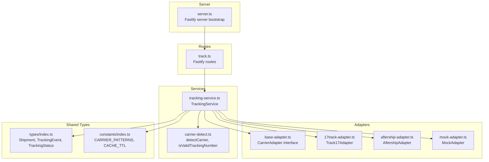
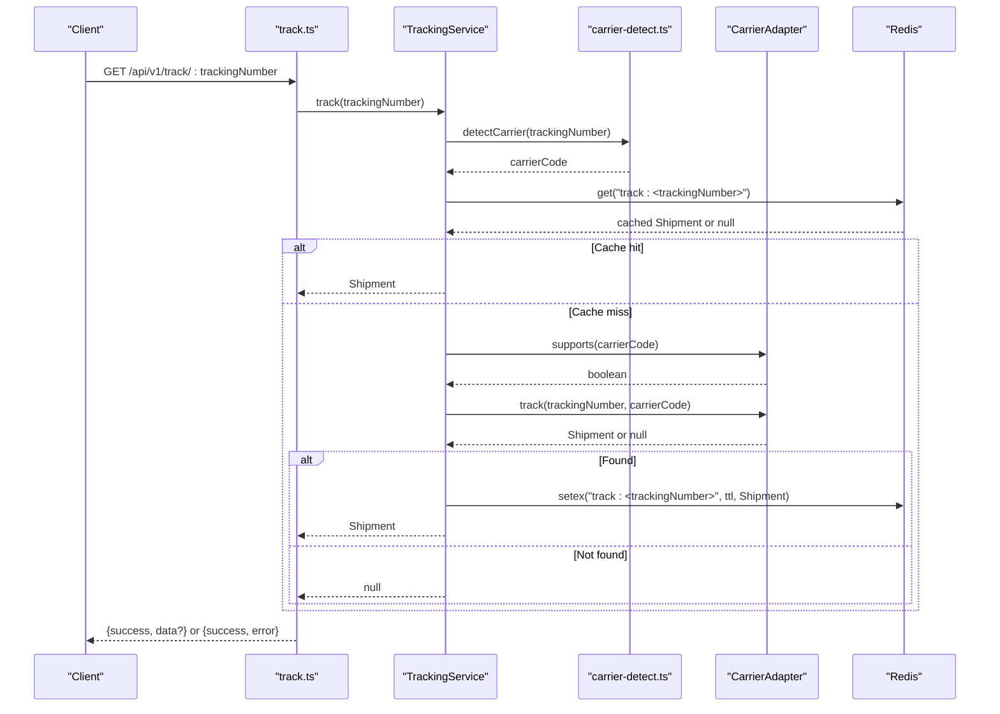
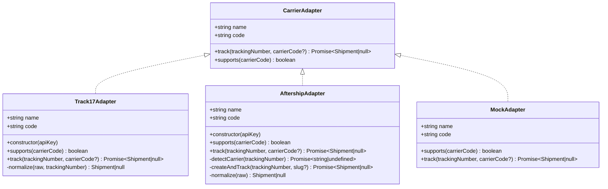
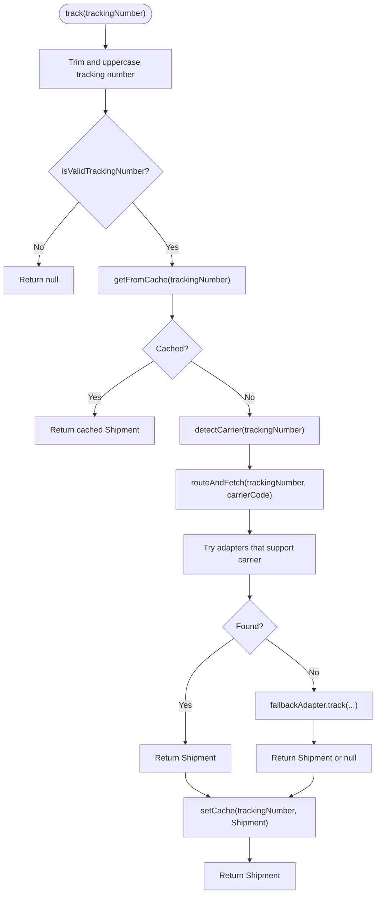
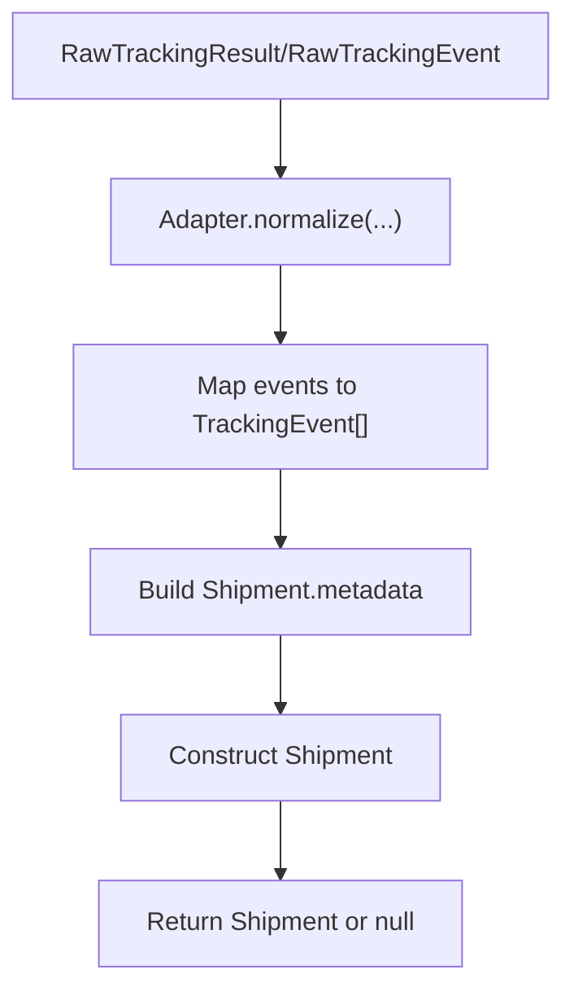
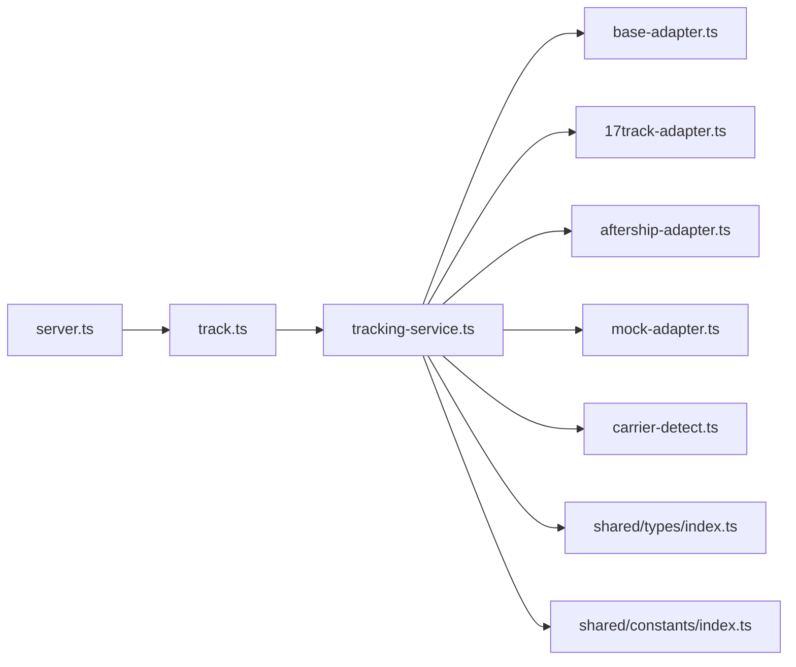

# Adapter Pattern Implementation

<cite>
**Referenced Files in This Document**
- [base-adapter.ts](file://apps/api/src/adapters/base-adapter.ts)
- [17track-adapter.ts](file://apps/api/src/adapters/17track-adapter.ts)
- [aftership-adapter.ts](file://apps/api/src/adapters/aftership-adapter.ts)
- [mock-adapter.ts](file://apps/api/src/adapters/mock-adapter.ts)
- [tracking-service.ts](file://apps/api/src/services/tracking-service.ts)
- [carrier-detect.ts](file://apps/api/src/services/carrier-detect.ts)
- [track.ts](file://apps/api/src/routes/track.ts)
- [server.ts](file://apps/api/src/server.ts)
- [index.ts](file://packages/shared/src/types/index.ts)
- [index.ts](file://packages/shared/src/constants/index.ts)
</cite>

## Table of Contents
1. [Introduction](#introduction)
2. [Project Structure](#project-structure)
3. [Core Components](#core-components)
4. [Architecture Overview](#architecture-overview)
5. [Detailed Component Analysis](#detailed-component-analysis)
6. [Dependency Analysis](#dependency-analysis)
7. [Performance Considerations](#performance-considerations)
8. [Troubleshooting Guide](#troubleshooting-guide)
9. [Conclusion](#conclusion)

## Introduction
This document explains the adapter pattern implementation in the carrier integration system. It covers the CarrierAdapter interface design, the normalized raw response structures (RawTrackingResult and RawTrackingEvent), the abstract nature of the base adapter enabling pluggable integrations, and the contract that adapter implementations must fulfill. It also documents error handling patterns, null return scenarios, and the relationship between raw responses and the final Shipment object.

## Project Structure
The carrier integration system is organized around a clean separation of concerns:
- Adapters: Implementations for specific carriers (17Track, AfterShip, Mock)
- Services: Business logic orchestrating tracking requests and caching
- Routes: HTTP endpoints exposing tracking functionality
- Shared Types: Common data structures and constants used across the system

**Diagram sources**
- [base-adapter.ts:1-39](file://apps/api/src/adapters/base-adapter.ts#L1-L39)
- [17track-adapter.ts:1-118](file://apps/api/src/adapters/17track-adapter.ts#L1-L118)
- [aftership-adapter.ts:1-151](file://apps/api/src/adapters/aftership-adapter.ts#L1-L151)
- [mock-adapter.ts:1-74](file://apps/api/src/adapters/mock-adapter.ts#L1-L74)
- [tracking-service.ts:1-128](file://apps/api/src/services/tracking-service.ts#L1-L128)
- [carrier-detect.ts:1-27](file://apps/api/src/services/carrier-detect.ts#L1-L27)
- [track.ts:1-75](file://apps/api/src/routes/track.ts#L1-L75)
- [server.ts:1-60](file://apps/api/src/server.ts#L1-L60)
- [index.ts](file://packages/shared/src/types/index.ts)
- [index.ts](file://packages/shared/src/constants/index.ts)

**Section sources**
- [base-adapter.ts:1-39](file://apps/api/src/adapters/base-adapter.ts#L1-L39)
- [tracking-service.ts:1-128](file://apps/api/src/services/tracking-service.ts#L1-L128)
- [track.ts:1-75](file://apps/api/src/routes/track.ts#L1-L75)
- [server.ts:1-60](file://apps/api/src/server.ts#L1-L60)
- [index.ts](file://packages/shared/src/types/index.ts)
- [index.ts](file://packages/shared/src/constants/index.ts)

## Core Components
This section documents the core interfaces and data structures that define the adapter pattern contract and normalized response model.

- CarrierAdapter interface
  - Purpose: Defines the contract that all carrier adapters must implement
  - Methods:
    - track(trackingNumber, carrierCode?): Promise<Shipment | null>
      - Fetches tracking information for a given tracking number
      - Returns null when the tracking number is not found or when the adapter cannot process the request
    - supports(carrierCode): boolean
      - Validates whether the adapter supports a given carrier code
  - Properties:
    - name: Human-readable adapter name
    - code: Unique adapter code used for routing and identification

- RawTrackingResult and RawTrackingEvent
  - Purpose: Define normalized raw response structures before mapping to Shipment
  - RawTrackingResult fields:
    - trackingNumber: string
    - carrierCode: string
    - carrierName: string
    - originCountry?: string
    - destinationCountry?: string
    - currentStatus: string
    - estimatedDelivery?: string
    - events: RawTrackingEvent[]
  - RawTrackingEvent fields:
    - timestamp: string
    - location: string
    - country?: string
    - status: string
    - description: string

- Shipment and TrackingEvent (final normalized model)
  - Purpose: Final standardized representation used by the application
  - Shipment fields include trackingNumber, carrierCode, carrierName, origin, destination, currentStatus, estimatedDelivery, actualDelivery?, events[], metadata, createdAt, updatedAt
  - TrackingEvent fields include timestamp, location, statusCode, descriptionZh, descriptionEn, rawStatus

Implementation guidelines for creating new adapter classes:
- Implement the CarrierAdapter interface
- Respect the contract:
  - track must return a Shipment or null
  - supports must return true only for supported carrier codes
- Normalize raw carrier responses into the standardized Shipment and TrackingEvent structures
- Handle errors gracefully by returning null when the carrier API fails or returns invalid data
- Ensure the adapter is stateless or manages external resources (e.g., API keys) via constructor parameters

**Section sources**
- [base-adapter.ts:4-18](file://apps/api/src/adapters/base-adapter.ts#L4-L18)
- [base-adapter.ts:20-38](file://apps/api/src/adapters/base-adapter.ts#L20-L38)
- [index.ts](file://packages/shared/src/types/index.ts)
- [index.ts](file://packages/shared/src/constants/index.ts)

## Architecture Overview
The system uses an adapter pattern to enable pluggable carrier integrations. The TrackingService orchestrates request routing, caching, and fallback behavior. The adapter implementations encapsulate carrier-specific logic and normalization.

**Diagram sources**
- [track.ts:8-35](file://apps/api/src/routes/track.ts#L8-L35)
- [tracking-service.ts:40-62](file://apps/api/src/services/tracking-service.ts#L40-L62)
- [tracking-service.ts:93-105](file://apps/api/src/services/tracking-service.ts#L93-L105)
- [carrier-detect.ts:7-17](file://apps/api/src/services/carrier-detect.ts#L7-L17)

**Section sources**
- [tracking-service.ts:10-38](file://apps/api/src/services/tracking-service.ts#L10-L38)
- [track.ts:1-75](file://apps/api/src/routes/track.ts#L1-L75)

## Detailed Component Analysis

### CarrierAdapter Interface and Implementations
The CarrierAdapter interface defines the contract that all carrier adapters must satisfy. Implementations encapsulate carrier-specific logic and normalization.

**Diagram sources**
- [base-adapter.ts:4-18](file://apps/api/src/adapters/base-adapter.ts#L4-L18)
- [17track-adapter.ts:21-118](file://apps/api/src/adapters/17track-adapter.ts#L21-L118)
- [aftership-adapter.ts:23-151](file://apps/api/src/adapters/aftership-adapter.ts#L23-L151)
- [mock-adapter.ts:7-74](file://apps/api/src/adapters/mock-adapter.ts#L7-L74)

Key implementation characteristics:
- Track17Adapter
  - Strong support for China-origin carriers
  - Normalizes raw events with customs detection logic
  - Returns null on API errors or missing data
- AftershipAdapter
  - Universal fallback supporting many carriers
  - Implements carrier detection and creation of tracking entries
  - Returns null on HTTP errors or invalid responses
- MockAdapter
  - Development/testing adapter returning synthetic data
  - Always supports any carrier code

**Section sources**
- [17track-adapter.ts:30-61](file://apps/api/src/adapters/17track-adapter.ts#L30-L61)
- [17track-adapter.ts:63-116](file://apps/api/src/adapters/17track-adapter.ts#L63-L116)
- [aftership-adapter.ts:32-64](file://apps/api/src/adapters/aftership-adapter.ts#L32-L64)
- [aftership-adapter.ts:66-104](file://apps/api/src/adapters/aftership-adapter.ts#L66-L104)
- [aftership-adapter.ts:106-149](file://apps/api/src/adapters/aftership-adapter.ts#L106-L149)
- [mock-adapter.ts:11-72](file://apps/api/src/adapters/mock-adapter.ts#L11-L72)

### TrackingService Orchestration
The TrackingService manages adapter selection, caching, and fallback behavior. It builds an adapter chain based on configured API keys and routes requests accordingly.

**Diagram sources**
- [tracking-service.ts:40-62](file://apps/api/src/services/tracking-service.ts#L40-L62)
- [tracking-service.ts:93-105](file://apps/api/src/services/tracking-service.ts#L93-L105)
- [tracking-service.ts:107-126](file://apps/api/src/services/tracking-service.ts#L107-L126)
- [carrier-detect.ts:7-17](file://apps/api/src/services/carrier-detect.ts#L7-L17)

**Section sources**
- [tracking-service.ts:15-38](file://apps/api/src/services/tracking-service.ts#L15-L38)
- [tracking-service.ts:40-62](file://apps/api/src/services/tracking-service.ts#L40-L62)
- [tracking-service.ts:93-105](file://apps/api/src/services/tracking-service.ts#L93-L105)
- [tracking-service.ts:107-126](file://apps/api/src/services/tracking-service.ts#L107-L126)

### Raw Responses to Shipment Mapping
Adapters transform raw carrier responses into the standardized Shipment and TrackingEvent structures. The mapping process involves:
- Extracting tracking metadata (carrier code/name, origin/destination)
- Normalizing timestamps and locations
- Converting carrier-specific status codes/tags to the unified TrackingStatus enum
- Building event arrays with localized descriptions and raw status markers

**Diagram sources**
- [base-adapter.ts:20-38](file://apps/api/src/adapters/base-adapter.ts#L20-L38)
- [17track-adapter.ts:63-116](file://apps/api/src/adapters/17track-adapter.ts#L63-L116)
- [aftership-adapter.ts:106-149](file://apps/api/src/adapters/aftership-adapter.ts#L106-L149)
- [index.ts](file://packages/shared/src/types/index.ts)

**Section sources**
- [17track-adapter.ts:63-116](file://apps/api/src/adapters/17track-adapter.ts#L63-L116)
- [aftership-adapter.ts:106-149](file://apps/api/src/adapters/aftership-adapter.ts#L106-L149)
- [index.ts](file://packages/shared/src/types/index.ts)

## Dependency Analysis
The system exhibits low coupling and high cohesion:
- Adapters depend only on the CarrierAdapter interface and shared types
- TrackingService depends on adapters, detector utilities, and shared constants
- Routes depend only on the service layer and handle HTTP concerns
- Shared types and constants provide a stable contract across modules

**Diagram sources**
- [tracking-service.ts:1-128](file://apps/api/src/services/tracking-service.ts#L1-L128)
- [base-adapter.ts:1-39](file://apps/api/src/adapters/base-adapter.ts#L1-L39)
- [17track-adapter.ts:1-118](file://apps/api/src/adapters/17track-adapter.ts#L1-L118)
- [aftership-adapter.ts:1-151](file://apps/api/src/adapters/aftership-adapter.ts#L1-L151)
- [mock-adapter.ts:1-74](file://apps/api/src/adapters/mock-adapter.ts#L1-L74)
- [carrier-detect.ts:1-27](file://apps/api/src/services/carrier-detect.ts#L1-L27)
- [index.ts](file://packages/shared/src/types/index.ts)
- [index.ts](file://packages/shared/src/constants/index.ts)
- [track.ts:1-75](file://apps/api/src/routes/track.ts#L1-L75)
- [server.ts:1-60](file://apps/api/src/server.ts#L1-L60)

**Section sources**
- [tracking-service.ts:1-128](file://apps/api/src/services/tracking-service.ts#L1-L128)
- [track.ts:1-75](file://apps/api/src/routes/track.ts#L1-L75)
- [server.ts:1-60](file://apps/api/src/server.ts#L1-L60)

## Performance Considerations
- Caching strategy: Redis-backed cache with TTLs varying by TrackingStatus to reduce API calls and improve response times
- Request batching: Parallel processing with controlled concurrency for batch tracking requests
- Graceful degradation: When Redis is unavailable, the system continues operating without cache
- Adapter prioritization: Prefer adapters with stronger carrier support to minimize retries and fallbacks

[No sources needed since this section provides general guidance]

## Troubleshooting Guide
Common error handling patterns and scenarios:
- Null returns from adapters
  - Occur when tracking numbers are not found, carrier codes are unsupported, or API requests fail
  - The system treats null as "not found" and returns appropriate HTTP responses
- HTTP errors and exceptions
  - Adapters catch exceptions and return null to prevent cascading failures
  - TrackingService logs and handles cache read/write errors non-fatally
- Carrier detection failures
  - Unknown carrier codes fall back to universal adapters (AfterShip or Mock)
- Validation failures
  - Invalid tracking numbers are rejected early with HTTP 400 responses

**Section sources**
- [17track-adapter.ts:40-61](file://apps/api/src/adapters/17track-adapter.ts#L40-L61)
- [aftership-adapter.ts:37-64](file://apps/api/src/adapters/aftership-adapter.ts#L37-L64)
- [tracking-service.ts:43-45](file://apps/api/src/services/tracking-service.ts#L43-L45)
- [tracking-service.ts:107-126](file://apps/api/src/services/tracking-service.ts#L107-L126)
- [track.ts:14-28](file://apps/api/src/routes/track.ts#L14-L28)

## Conclusion
The adapter pattern implementation provides a clean, extensible foundation for integrating multiple carriers while maintaining a consistent internal representation. The CarrierAdapter interface, normalized raw response structures, and robust error handling ensure reliable operation across diverse carrier APIs. The TrackingService orchestrates routing, caching, and fallback behavior, while shared types and constants enforce a stable contract across the system.