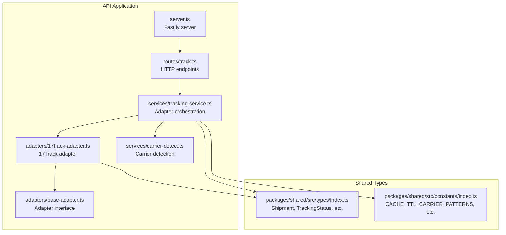
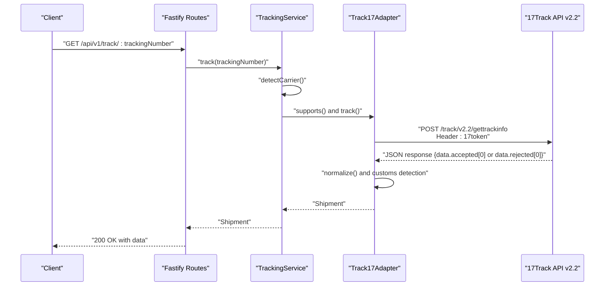
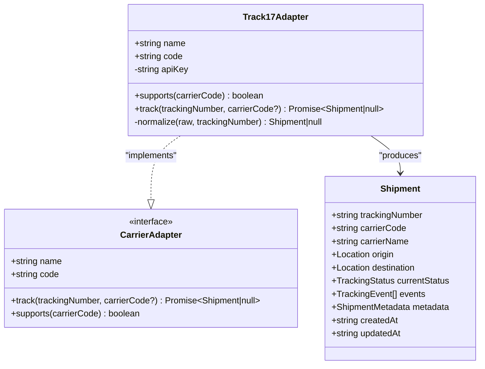
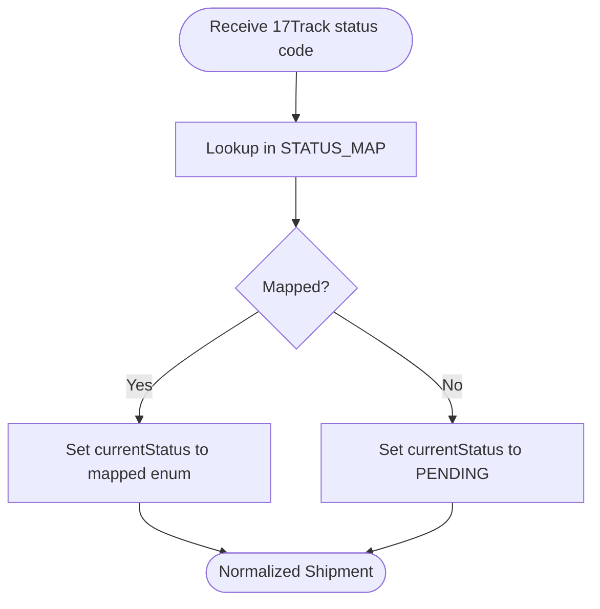
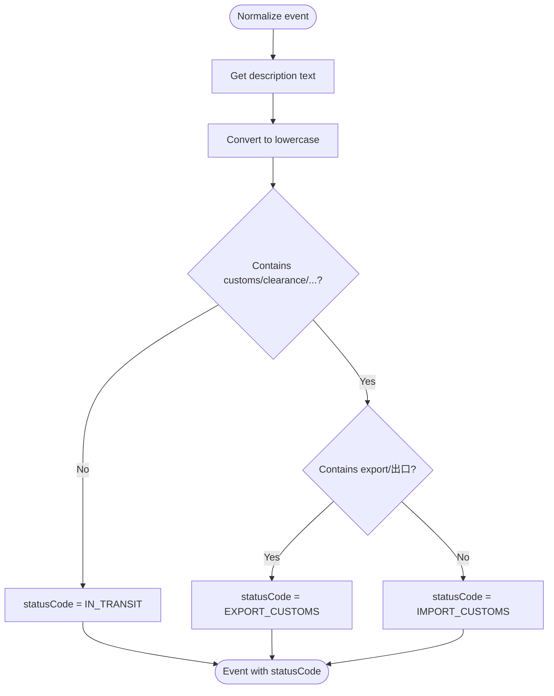
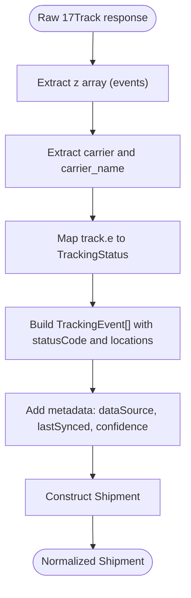
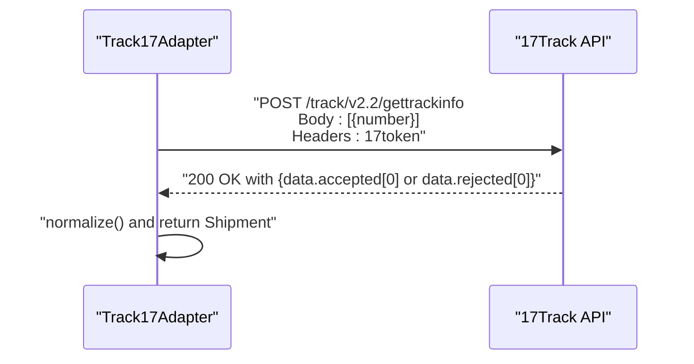
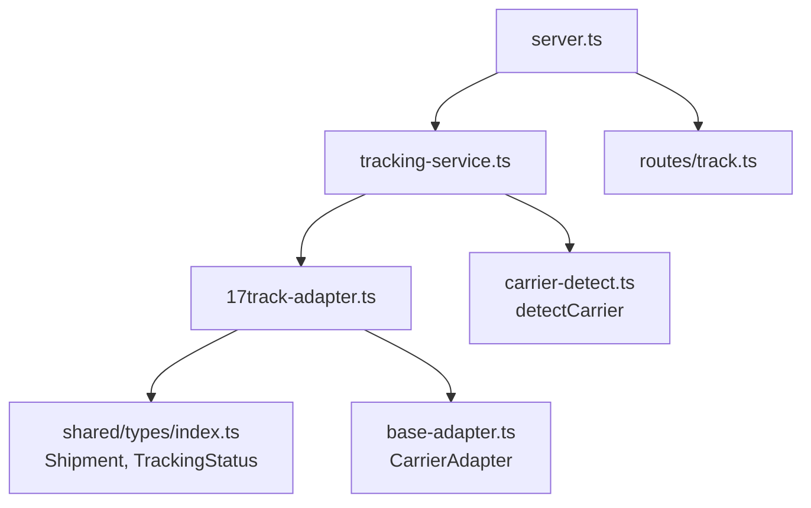

# 17Track Adapter Implementation

<cite>
**Referenced Files in This Document**
- [17track-adapter.ts](file://apps/api/src/adapters/17track-adapter.ts)
- [base-adapter.ts](file://apps/api/src/adapters/base-adapter.ts)
- [index.ts](file://packages/shared/src/types/index.ts)
- [tracking-service.ts](file://apps/api/src/services/tracking-service.ts)
- [carrier-detect.ts](file://apps/api/src/services/carrier-detect.ts)
- [track.ts](file://apps/api/src/routes/track.ts)
- [index.ts](file://packages/shared/src/constants/index.ts)
- [server.ts](file://apps/api/src/server.ts)
- [package.json](file://apps/api/package.json)
- [route.ts](file://apps/web/src/app/api/v1/track/[trackingNumber]/route.ts)
- [api.ts](file://apps/web/src/lib/api.ts)
</cite>

## Table of Contents
1. [Introduction](#introduction)
2. [Project Structure](#project-structure)
3. [Core Components](#core-components)
4. [Architecture Overview](#architecture-overview)
5. [Detailed Component Analysis](#detailed-component-analysis)
6. [Dependency Analysis](#dependency-analysis)
7. [Performance Considerations](#performance-considerations)
8. [Troubleshooting Guide](#troubleshooting-guide)
9. [Conclusion](#conclusion)
10. [Appendices](#appendices)

## Introduction
This document provides comprehensive documentation for the 17Track adapter implementation within the logistics tracking platform. It explains how the adapter integrates with the 17Track v2.2 API, including authentication via the 17token header, request formatting for tracking number queries, response parsing, status code mapping to standardized TrackingStatus enums, customs detection logic, and the data normalization process that produces a unified Shipment model. It also covers configuration requirements, rate limiting considerations, error handling strategies, and examples of successful tracking responses and edge cases.

## Project Structure
The 17Track adapter is part of the API application and works alongside other adapters and shared types. The adapter participates in a routing and caching pipeline managed by the tracking service and exposes HTTP endpoints for single and batch tracking queries.

**Diagram sources**
- [server.ts:13-54](file://apps/api/src/server.ts#L13-L54)
- [track.ts:5-75](file://apps/api/src/routes/track.ts#L5-L75)
- [tracking-service.ts:10-128](file://apps/api/src/services/tracking-service.ts#L10-L128)
- [17track-adapter.ts:21-118](file://apps/api/src/adapters/17track-adapter.ts#L21-L118)
- [base-adapter.ts:4-18](file://apps/api/src/adapters/base-adapter.ts#L4-L18)
- [carrier-detect.ts:7-26](file://apps/api/src/services/carrier-detect.ts#L7-L26)
- [index.ts:1-101](file://packages/shared/src/types/index.ts#L1-L101)
- [index.ts:31-103](file://packages/shared/src/constants/index.ts#L31-L103)

**Section sources**
- [server.ts:13-54](file://apps/api/src/server.ts#L13-L54)
- [track.ts:5-75](file://apps/api/src/routes/track.ts#L5-L75)
- [tracking-service.ts:10-128](file://apps/api/src/services/tracking-service.ts#L10-L128)
- [17track-adapter.ts:21-118](file://apps/api/src/adapters/17track-adapter.ts#L21-L118)
- [base-adapter.ts:4-18](file://apps/api/src/adapters/base-adapter.ts#L4-L18)
- [carrier-detect.ts:7-26](file://apps/api/src/services/carrier-detect.ts#L7-L26)
- [index.ts:1-101](file://packages/shared/src/types/index.ts#L1-L101)
- [index.ts:31-103](file://packages/shared/src/constants/index.ts#L31-L103)

## Core Components
- 17Track Adapter: Implements the CarrierAdapter interface to query the 17Track API, parse responses, and normalize data into the unified Shipment model.
- Tracking Service: Orchestrates adapter selection, caching, and fallback behavior; manages concurrency for batch requests.
- Shared Types: Define the Shipment model, TrackingStatus enum, and related interfaces used across adapters.
- Routes: Expose HTTP endpoints for single and batch tracking queries with input validation and response formatting.
- Carrier Detection: Provides carrier code inference from tracking number patterns.

**Section sources**
- [17track-adapter.ts:21-118](file://apps/api/src/adapters/17track-adapter.ts#L21-L118)
- [tracking-service.ts:10-128](file://apps/api/src/services/tracking-service.ts#L10-L128)
- [index.ts:1-101](file://packages/shared/src/types/index.ts#L1-L101)
- [track.ts:5-75](file://apps/api/src/routes/track.ts#L5-L75)
- [carrier-detect.ts:7-26](file://apps/api/src/services/carrier-detect.ts#L7-L26)

## Architecture Overview
The 17Track adapter integrates with the 17Track API using a dedicated endpoint and a bearer-like 17token header. Requests are formatted as JSON arrays containing a single tracking number. Responses are parsed to extract normalized tracking events and shipment metadata, mapped to standardized statuses, and enriched with customs detection logic.

**Diagram sources**
- [track.ts:9-35](file://apps/api/src/routes/track.ts#L9-L35)
- [tracking-service.ts:40-105](file://apps/api/src/services/tracking-service.ts#L40-L105)
- [17track-adapter.ts:40-61](file://apps/api/src/adapters/17track-adapter.ts#L40-L61)
- [17track-adapter.ts:42-49](file://apps/api/src/adapters/17track-adapter.ts#L42-L49)

## Detailed Component Analysis

### 17Track Adapter
The adapter implements the CarrierAdapter interface and encapsulates all 17Track-specific logic:
- Authentication: Uses the 17token header supplied during construction.
- Request Formatting: Sends a POST request to the v2.2 endpoint with a JSON body containing an array of one tracking number object.
- Response Parsing: Extracts the accepted or rejected tracking object and normalizes it into a Shipment.
- Status Mapping: Converts 17Track numeric status codes to standardized TrackingStatus enums.
- Customs Detection: Identifies import/export clearance events using keyword matching across multiple languages.
- Data Normalization: Produces a unified Shipment model with consistent fields and metadata.

**Diagram sources**
- [17track-adapter.ts:21-118](file://apps/api/src/adapters/17track-adapter.ts#L21-L118)
- [base-adapter.ts:4-18](file://apps/api/src/adapters/base-adapter.ts#L4-L18)
- [index.ts:48-67](file://packages/shared/src/types/index.ts#L48-L67)

**Section sources**
- [17track-adapter.ts:21-118](file://apps/api/src/adapters/17track-adapter.ts#L21-L118)
- [base-adapter.ts:4-18](file://apps/api/src/adapters/base-adapter.ts#L4-L18)
- [index.ts:1-13](file://packages/shared/src/types/index.ts#L1-L13)
- [index.ts:48-67](file://packages/shared/src/types/index.ts#L48-L67)

### Status Code Mapping
The adapter maps 17Track numeric status codes to standardized TrackingStatus enums. This ensures consistent status representation across carriers.

**Diagram sources**
- [17track-adapter.ts:8-16](file://apps/api/src/adapters/17track-adapter.ts#L8-L16)
- [17track-adapter.ts:106](file://apps/api/src/adapters/17track-adapter.ts#L106)

**Section sources**
- [17track-adapter.ts:8-16](file://apps/api/src/adapters/17track-adapter.ts#L8-L16)
- [17track-adapter.ts:106](file://apps/api/src/adapters/17track-adapter.ts#L106)

### Customs Detection Logic
Customs detection identifies import/export clearance events by scanning event descriptions for keywords in multiple languages. The logic distinguishes between export and import customs based on keyword presence.

**Diagram sources**
- [17track-adapter.ts:74-81](file://apps/api/src/adapters/17track-adapter.ts#L74-L81)
- [17track-adapter.ts:19](file://apps/api/src/adapters/17track-adapter.ts#L19)

**Section sources**
- [17track-adapter.ts:74-81](file://apps/api/src/adapters/17track-adapter.ts#L74-L81)
- [17track-adapter.ts:19](file://apps/api/src/adapters/17track-adapter.ts#L19)

### Data Normalization Process
The adapter normalizes 17Track responses into the unified Shipment model. It extracts tracking events, maps status codes, and enriches metadata while preserving the raw status string for auditability.

**Diagram sources**
- [17track-adapter.ts:63-116](file://apps/api/src/adapters/17track-adapter.ts#L63-L116)

**Section sources**
- [17track-adapter.ts:63-116](file://apps/api/src/adapters/17track-adapter.ts#L63-L116)

### Request and Response Handling
- Endpoint: POST https://api.17track.net/track/v2.2/gettrackinfo
- Headers: 17token (API key), Content-Type: application/json
- Request Body: Array containing a single tracking number object
- Response: JSON with accepted or rejected tracking object; adapter selects the first element

**Diagram sources**
- [17track-adapter.ts:42-59](file://apps/api/src/adapters/17track-adapter.ts#L42-L59)

**Section sources**
- [17track-adapter.ts:5](file://apps/api/src/adapters/17track-adapter.ts#L5)
- [17track-adapter.ts:42-59](file://apps/api/src/adapters/17track-adapter.ts#L42-L59)

### Configuration Requirements
- API Key: Required environment variable TRACK17_API_KEY to enable the 17Track adapter.
- Redis: Optional environment variable REDIS_URL for caching; the service gracefully degrades without it.
- Rate Limiting: Global rate limit middleware configured at the server level.

**Section sources**
- [tracking-service.ts:21-24](file://apps/api/src/services/tracking-service.ts#L21-L24)
- [server.ts:25-46](file://apps/api/src/server.ts#L25-L46)
- [server.ts:19-23](file://apps/api/src/server.ts#L19-L23)
- [package.json:13-26](file://apps/api/package.json#L13-L26)

### Error Handling Strategies
- HTTP Layer: Routes return 400 for invalid inputs and 404 when tracking data is not found.
- Adapter Layer: The adapter returns null on HTTP errors or parsing failures.
- Tracking Service: Returns null for missing data and caches results for subsequent requests.
- Frontend: Handles non-OK responses and JSON parsing errors with user-friendly messages.

**Section sources**
- [track.ts:14-28](file://apps/api/src/routes/track.ts#L14-L28)
- [17track-adapter.ts:58-60](file://apps/api/src/adapters/17track-adapter.ts#L58-L60)
- [tracking-service.ts:47-59](file://apps/api/src/services/tracking-service.ts#L47-L59)
- [api.ts:12-26](file://apps/web/src/lib/api.ts#L12-L26)

### Examples and Edge Cases
- Successful Tracking Response: The adapter normalizes a valid 17Track response into a Shipment with events and current status.
- Edge Case: No accepted/rejected tracking object returned; adapter returns null.
- Edge Case: HTTP error or JSON parsing failure; adapter returns null.
- Edge Case: Tracking number not found; route returns 404.

**Section sources**
- [17track-adapter.ts:53-55](file://apps/api/src/adapters/17track-adapter.ts#L53-L55)
- [17track-adapter.ts:58-60](file://apps/api/src/adapters/17track-adapter.ts#L58-L60)
- [track.ts:23-28](file://apps/api/src/routes/track.ts#L23-L28)

## Dependency Analysis
The 17Track adapter depends on shared types for the Shipment model and TrackingStatus enum. It integrates with the tracking service for orchestration and with the carrier detection service for carrier inference. The server provides runtime configuration for rate limiting and optional Redis caching.

**Diagram sources**
- [17track-adapter.ts:1-3](file://apps/api/src/adapters/17track-adapter.ts#L1-L3)
- [base-adapter.ts:4-18](file://apps/api/src/adapters/base-adapter.ts#L4-L18)
- [tracking-service.ts:10-128](file://apps/api/src/services/tracking-service.ts#L10-L128)
- [carrier-detect.ts:7-26](file://apps/api/src/services/carrier-detect.ts#L7-L26)
- [server.ts:13-54](file://apps/api/src/server.ts#L13-L54)
- [track.ts:5-75](file://apps/api/src/routes/track.ts#L5-L75)

**Section sources**
- [17track-adapter.ts:1-3](file://apps/api/src/adapters/17track-adapter.ts#L1-L3)
- [tracking-service.ts:10-128](file://apps/api/src/services/tracking-service.ts#L10-L128)
- [carrier-detect.ts:7-26](file://apps/api/src/services/carrier-detect.ts#L7-L26)
- [server.ts:13-54](file://apps/api/src/server.ts#L13-L54)
- [track.ts:5-75](file://apps/api/src/routes/track.ts#L5-L75)

## Performance Considerations
- Caching: Results are cached in Redis with TTLs based on current status, reducing repeated API calls.
- Concurrency: Batch tracking processes requests with a fixed concurrency limit to balance throughput and resource usage.
- Rate Limiting: Global rate limiting is applied at the server level to prevent abuse.

**Section sources**
- [tracking-service.ts:118-126](file://apps/api/src/services/tracking-service.ts#L118-L126)
- [index.ts:31-43](file://packages/shared/src/constants/index.ts#L31-L43)
- [tracking-service.ts:71-88](file://apps/api/src/services/tracking-service.ts#L71-L88)
- [server.ts:19-23](file://apps/api/src/server.ts#L19-L23)

## Troubleshooting Guide
- Missing API Key: If TRACK17_API_KEY is not set, the 17Track adapter is not included in the adapter chain; the service falls back to other adapters or the mock adapter.
- Invalid Tracking Number: Validation enforces a minimum length; routes return 400 for invalid inputs.
- Network/Parse Errors: The adapter catches exceptions and returns null; upstream routes handle null by returning 404.
- Redis Issues: If Redis is unavailable, the service continues without caching and logs a warning.

**Section sources**
- [tracking-service.ts:21-34](file://apps/api/src/services/tracking-service.ts#L21-L34)
- [track.ts:14-19](file://apps/api/src/routes/track.ts#L14-L19)
- [17track-adapter.ts:58-60](file://apps/api/src/adapters/17track-adapter.ts#L58-L60)
- [server.ts:34-46](file://apps/api/src/server.ts#L34-L46)

## Conclusion
The 17Track adapter provides robust integration with the 17Track v2.2 API, featuring secure authentication, precise request formatting, resilient response parsing, standardized status mapping, and intelligent customs detection. It fits seamlessly into the broader tracking pipeline, leveraging caching and rate limiting for performance and reliability. Proper configuration of API keys and Redis enables optimal operation, while comprehensive error handling ensures graceful degradation under adverse conditions.

## Appendices

### API Endpoints
- GET /api/v1/track/:trackingNumber
  - Validates input length and delegates to TrackingService
  - Returns 200 with data or 404 if not found
- POST /api/v1/track/batch
  - Accepts an array of tracking numbers (up to 50)
  - Returns aggregated results and failed items

**Section sources**
- [track.ts:9-35](file://apps/api/src/routes/track.ts#L9-L35)
- [track.ts:38-64](file://apps/api/src/routes/track.ts#L38-L64)

### Frontend Integration
- Web app fetches tracking data via client-side API helpers
- Handles non-OK responses and JSON parsing errors with user-friendly messages

**Section sources**
- [api.ts:5-27](file://apps/web/src/lib/api.ts#L5-L27)
- [route.ts:187-223](file://apps/web/src/app/api/v1/track/[trackingNumber]/route.ts#L187-L223)