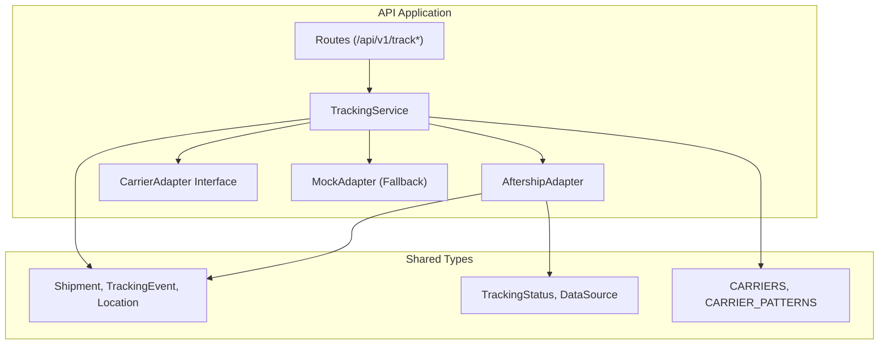
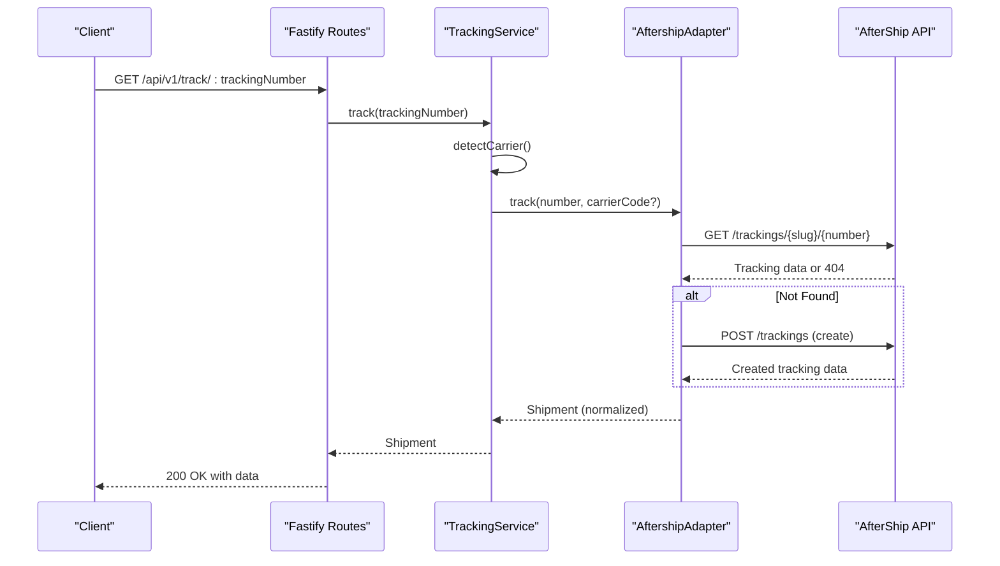
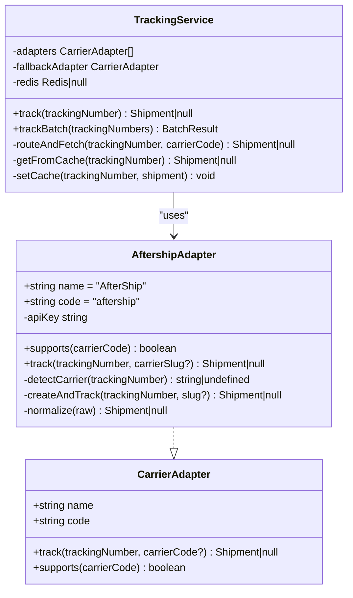
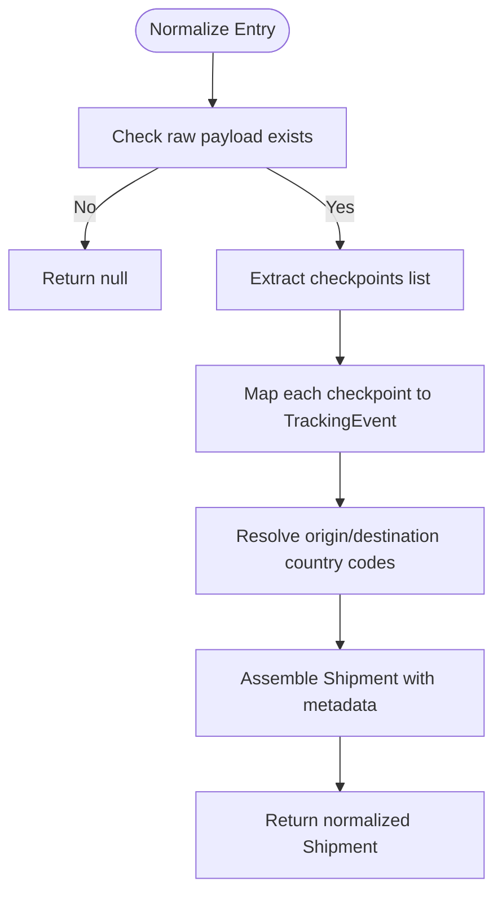
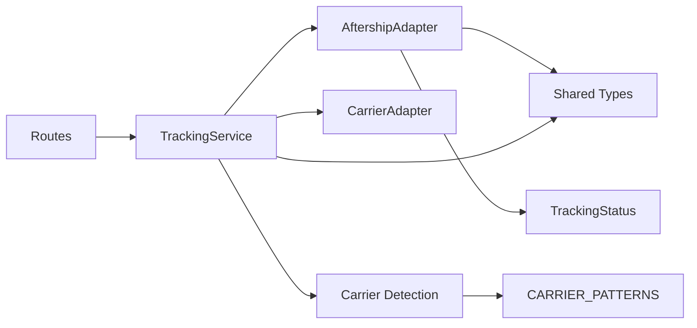

# AfterShip Adapter Implementation

<cite>
**Referenced Files in This Document**
- [aftership-adapter.ts](file://apps/api/src/adapters/aftership-adapter.ts)
- [base-adapter.ts](file://apps/api/src/adapters/base-adapter.ts)
- [tracking-service.ts](file://apps/api/src/services/tracking-service.ts)
- [carrier-detect.ts](file://apps/api/src/services/carrier-detect.ts)
- [types/index.ts](file://packages/shared/src/types/index.ts)
- [constants/index.ts](file://packages/shared/src/constants/index.ts)
- [track.ts](file://apps/api/src/routes/track.ts)
- [server.ts](file://apps/api/src/server.ts)
- [mock-adapter.ts](file://apps/api/src/adapters/mock-adapter.ts)
</cite>

## Table of Contents
1. [Introduction](#introduction)
2. [Project Structure](#project-structure)
3. [Core Components](#core-components)
4. [Architecture Overview](#architecture-overview)
5. [Detailed Component Analysis](#detailed-component-analysis)
6. [Dependency Analysis](#dependency-analysis)
7. [Performance Considerations](#performance-considerations)
8. [Troubleshooting Guide](#troubleshooting-guide)
9. [Conclusion](#conclusion)
10. [Appendices](#appendices)

## Introduction
This document explains the AfterShip adapter implementation used to integrate cross-border logistics tracking into the unified tracking service. It covers authentication, request/response handling, data transformation to the standardized shipment model, multi-carrier support via AfterShip’s consolidated API, rate limiting considerations, error handling, configuration requirements, and troubleshooting guidance. The AfterShip adapter serves as a universal fallback for tracking numbers when specific carrier adapters are not available or when carrier detection is required.

## Project Structure
The AfterShip adapter resides in the API application under the adapters directory and integrates with the tracking service and shared types. The API exposes HTTP endpoints for single and batch tracking requests, while the service orchestrates adapter selection and caching.

**Diagram sources**
- [track.ts:1-75](file://apps/api/src/routes/track.ts#L1-L75)
- [tracking-service.ts:1-128](file://apps/api/src/services/tracking-service.ts#L1-L128)
- [aftership-adapter.ts:1-151](file://apps/api/src/adapters/aftership-adapter.ts#L1-L151)
- [base-adapter.ts:1-39](file://apps/api/src/adapters/base-adapter.ts#L1-L39)
- [types/index.ts:1-101](file://packages/shared/src/types/index.ts#L1-L101)
- [constants/index.ts:1-103](file://packages/shared/src/constants/index.ts#L1-L103)

**Section sources**
- [track.ts:1-75](file://apps/api/src/routes/track.ts#L1-L75)
- [tracking-service.ts:1-128](file://apps/api/src/services/tracking-service.ts#L1-L128)
- [aftership-adapter.ts:1-151](file://apps/api/src/adapters/aftership-adapter.ts#L1-L151)
- [base-adapter.ts:1-39](file://apps/api/src/adapters/base-adapter.ts#L1-L39)
- [types/index.ts:1-101](file://packages/shared/src/types/index.ts#L1-L101)
- [constants/index.ts:1-103](file://packages/shared/src/constants/index.ts#L1-L103)

## Core Components
- AftershipAdapter: Implements the CarrierAdapter interface to query AfterShip’s v4 API, auto-detect carriers when needed, create tracking entries if missing, and normalize responses to the unified Shipment model.
- TrackingService: Builds an adapter chain based on configured API keys, detects carriers, routes requests to appropriate adapters, caches results, and supports batch processing.
- Shared Types: Define the normalized Shipment, TrackingEvent, Location, and TrackingStatus used across adapters.
- Routes: Expose HTTP endpoints for single and batch tracking, including basic validation and response formatting.

Key responsibilities:
- Authentication: Uses the AfterShip API key header.
- Request handling: Queries tracking endpoints and optionally detects carrier or creates tracking entries.
- Response normalization: Converts AfterShip’s response fields into the unified model, mapping status tags and extracting location and event data.
- Fallback behavior: Acts as a universal fallback when no specific adapter supports the detected carrier.

**Section sources**
- [aftership-adapter.ts:23-151](file://apps/api/src/adapters/aftership-adapter.ts#L23-L151)
- [tracking-service.ts:10-128](file://apps/api/src/services/tracking-service.ts#L10-L128)
- [types/index.ts:24-67](file://packages/shared/src/types/index.ts#L24-L67)
- [track.ts:8-74](file://apps/api/src/routes/track.ts#L8-L74)

## Architecture Overview
The system follows a layered architecture:
- HTTP Layer: Fastify routes accept requests and delegate to the tracking service.
- Service Layer: Determines carrier, selects the best adapter, and manages caching.
- Adapter Layer: Integrates with external carrier APIs (AfterShip) and normalizes responses.
- Shared Types: Provide a consistent data contract across adapters.

**Diagram sources**
- [track.ts:9-34](file://apps/api/src/routes/track.ts#L9-L34)
- [tracking-service.ts:40-105](file://apps/api/src/services/tracking-service.ts#L40-L105)
- [aftership-adapter.ts:37-104](file://apps/api/src/adapters/aftership-adapter.ts#L37-L104)

## Detailed Component Analysis

### AftershipAdapter
Implements the CarrierAdapter interface and encapsulates AfterShip integration:
- Authentication: Sends the AfterShip API key via the dedicated header.
- Carrier detection: Calls the detection endpoint when no carrier slug is provided.
- Tracking creation: Creates a tracking entry if the initial lookup fails with a not-found response.
- Response normalization: Transforms AfterShip’s checkpoint list and top-level fields into the unified Shipment model, mapping status tags and assembling locations.

**Diagram sources**
- [base-adapter.ts:4-18](file://apps/api/src/adapters/base-adapter.ts#L4-L18)
- [aftership-adapter.ts:23-151](file://apps/api/src/adapters/aftership-adapter.ts#L23-L151)
- [tracking-service.ts:10-128](file://apps/api/src/services/tracking-service.ts#L10-L128)

Key behaviors:
- Multi-carrier support: The adapter reports universal support, enabling it to handle any carrier AfterShip supports.
- Auto-detection: If no carrier slug is provided, the adapter attempts to detect it using AfterShip’s detection endpoint.
- Creation fallback: On not-found responses, the adapter creates the tracking entry and retries normalization.
- Status mapping: AfterShip’s status tags are mapped to the unified TrackingStatus enum.

**Section sources**
- [aftership-adapter.ts:23-151](file://apps/api/src/adapters/aftership-adapter.ts#L23-L151)
- [base-adapter.ts:4-18](file://apps/api/src/adapters/base-adapter.ts#L4-L18)

### TrackingService Orchestration
Builds the adapter chain at runtime based on environment variables:
- Adds a specific carrier adapter if its API key is present.
- Adds the AfterShip adapter if its API key is present.
- Falls back to a mock adapter when no real API keys are configured.

Routing logic:
- Attempts to route to adapters that support the detected carrier.
- Falls back to the universal adapter (AfterShip or Mock) when no specific adapter matches.

Caching:
- Reads and writes cached results using Redis when available.
- Applies cache TTLs based on current status.

Batch processing:
- Processes up to a fixed concurrency limit with controlled batching.

**Section sources**
- [tracking-service.ts:15-128](file://apps/api/src/services/tracking-service.ts#L15-L128)
- [carrier-detect.ts:7-26](file://apps/api/src/services/carrier-detect.ts#L7-L26)

### Data Transformation and Unified Model
Normalization extracts:
- Tracking identity: number, carrier code/name, origin/destination country codes.
- Timeline: ordered events with timestamps, locations, and mapped status codes.
- Metadata: data source, last synced timestamp, and confidence score.

**Diagram sources**
- [aftership-adapter.ts:106-149](file://apps/api/src/adapters/aftership-adapter.ts#L106-L149)
- [types/index.ts:24-67](file://packages/shared/src/types/index.ts#L24-L67)

**Section sources**
- [aftership-adapter.ts:106-149](file://apps/api/src/adapters/aftership-adapter.ts#L106-L149)
- [types/index.ts:24-67](file://packages/shared/src/types/index.ts#L24-L67)

### HTTP Integration and Request/Response Handling
Endpoints:
- Single tracking: Validates input length, delegates to TrackingService, and returns either a 404 or a 200 with the normalized shipment.
- Batch tracking: Validates the array length and invokes batch tracking, returning success with results and failures.

Rate limiting:
- The API server applies a generic rate limit policy at the Fastify level.

CORS and Redis:
- CORS is enabled and Redis is optional; the service gracefully degrades without it.

**Section sources**
- [track.ts:9-74](file://apps/api/src/routes/track.ts#L9-L74)
- [server.ts:19-46](file://apps/api/src/server.ts#L19-L46)

## Dependency Analysis
The AfterShip adapter depends on shared types for the unified model and constants for carrier patterns. The tracking service composes adapters and interacts with Redis for caching. Routes depend on the tracking service for business logic.

**Diagram sources**
- [track.ts:1-75](file://apps/api/src/routes/track.ts#L1-L75)
- [tracking-service.ts:1-128](file://apps/api/src/services/tracking-service.ts#L1-L128)
- [aftership-adapter.ts:1-151](file://apps/api/src/adapters/aftership-adapter.ts#L1-L151)
- [types/index.ts:1-101](file://packages/shared/src/types/index.ts#L1-L101)
- [constants/index.ts:60-75](file://packages/shared/src/constants/index.ts#L60-L75)

**Section sources**
- [tracking-service.ts:1-128](file://apps/api/src/services/tracking-service.ts#L1-L128)
- [aftership-adapter.ts:1-151](file://apps/api/src/adapters/aftership-adapter.ts#L1-L151)
- [types/index.ts:1-101](file://packages/shared/src/types/index.ts#L1-L101)
- [constants/index.ts:60-75](file://packages/shared/src/constants/index.ts#L60-L75)

## Performance Considerations
- Caching: Redis caching reduces repeated external API calls and improves response times. TTL varies by status to balance freshness and cost.
- Concurrency: Batch processing limits concurrent requests to avoid overwhelming external APIs.
- Adapter selection: Prefer specific adapters when available to reduce unnecessary detection and creation steps.
- Latency: The mock adapter simulates realistic delays, indicating potential network overhead for real providers.

[No sources needed since this section provides general guidance]

## Troubleshooting Guide
Common issues and resolutions:
- Invalid tracking number: Requests with invalid lengths receive a 400 error; ensure the number meets minimum length requirements.
- Tracking not found: The adapter attempts to create the tracking entry automatically on 404 responses; if still not found, returns null.
- API key misconfiguration: Without a valid AfterShip API key, the adapter chain excludes AfterShip; configure the environment variable to enable it.
- Redis unavailability: The service continues operating without cache; verify connectivity if performance regresses.
- Rate limiting: Generic server-side rate limiting may apply; consider client-side throttling or batching.

Operational checks:
- Verify environment variables for API keys and Redis URL.
- Confirm adapter chain construction and fallback behavior.
- Inspect normalized Shipment fields for completeness and accuracy.

**Section sources**
- [track.ts:14-28](file://apps/api/src/routes/track.ts#L14-L28)
- [tracking-service.ts:15-38](file://apps/api/src/services/tracking-service.ts#L15-L38)
- [aftership-adapter.ts:37-64](file://apps/api/src/adapters/aftership-adapter.ts#L37-L64)
- [server.ts:25-46](file://apps/api/src/server.ts#L25-L46)

## Conclusion
The AfterShip adapter provides robust, universal tracking capabilities by consolidating carrier-specific APIs behind a single interface. It auto-detects carriers, creates tracking entries when necessary, and normalizes diverse provider responses into a unified model. Combined with the tracking service’s adapter routing and caching, it delivers scalable, resilient tracking for cross-border logistics.

[No sources needed since this section summarizes without analyzing specific files]

## Appendices

### Configuration Requirements
- Environment variables:
  - AFTERSHIP_API_KEY: Enables the AfterShip adapter in the adapter chain.
  - Optional: REDIS_URL: Enables Redis caching; service gracefully degrades without it.
  - Optional: TRACK17_API_KEY: Enables a specific carrier adapter when present.
- Node.js runtime: Requires a supported version as specified by the workspace configuration.

**Section sources**
- [tracking-service.ts:21-29](file://apps/api/src/services/tracking-service.ts#L21-L29)
- [server.ts:27-46](file://apps/api/src/server.ts#L27-L46)
- [package.json:14-17](file://package.json#L14-L17)

### API Key Management Best Practices
- Store API keys in environment variables; never commit secrets to source control.
- Rotate keys periodically and monitor usage quotas.
- Use separate keys for staging and production environments.

[No sources needed since this section provides general guidance]

### Example Response Scenarios
- Successful tracking: Returns a normalized Shipment with timeline events and current status.
- Auto-detected carrier: When no slug is provided, the adapter detects the carrier and proceeds with tracking.
- Tracking creation: On 404 responses, the adapter creates the tracking entry and retries normalization.
- Fallback behavior: When no specific adapter supports the carrier, the AfterShip adapter acts as a universal fallback.

**Section sources**
- [aftership-adapter.ts:37-104](file://apps/api/src/adapters/aftership-adapter.ts#L37-L104)
- [tracking-service.ts:93-105](file://apps/api/src/services/tracking-service.ts#L93-L105)

### Integration Patterns with Tracking Service
- Single tracking: Use the GET endpoint to resolve a single tracking number.
- Batch tracking: Use the POST endpoint to process multiple numbers with controlled concurrency.
- Carrier detection: The service detects carrier codes from tracking number patterns; pass explicit codes to bypass detection when known.

**Section sources**
- [track.ts:9-74](file://apps/api/src/routes/track.ts#L9-L74)
- [tracking-service.ts:40-105](file://apps/api/src/services/tracking-service.ts#L40-L105)
- [carrier-detect.ts:7-26](file://apps/api/src/services/carrier-detect.ts#L7-L26)