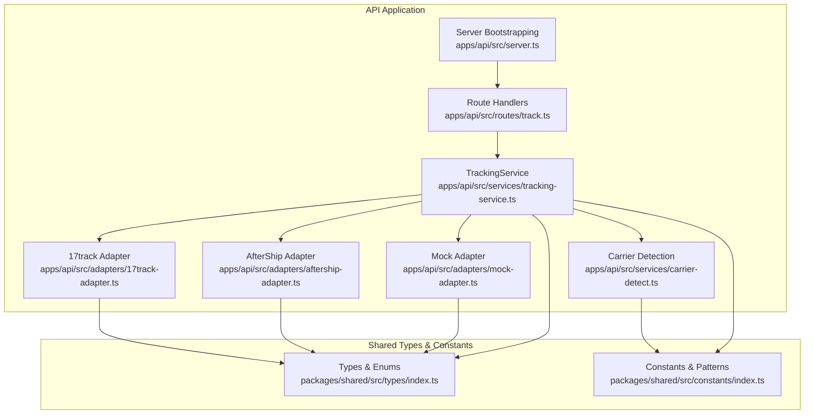
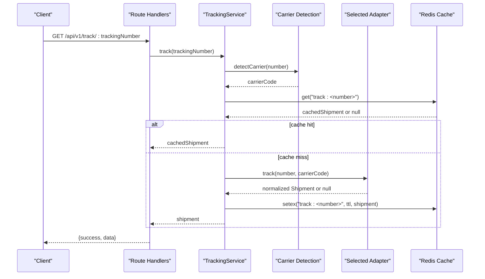
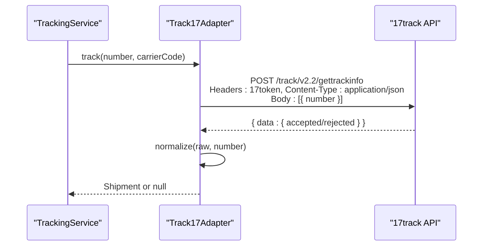
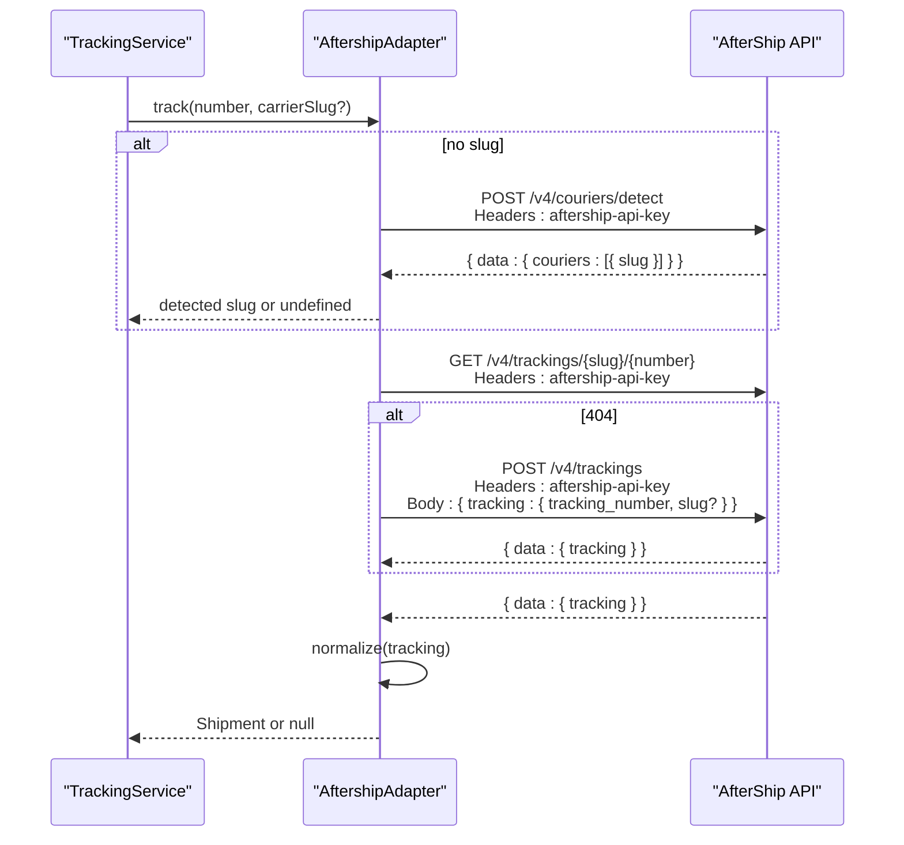
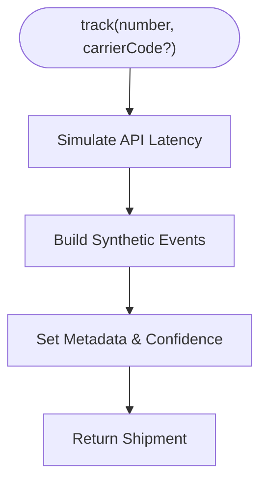
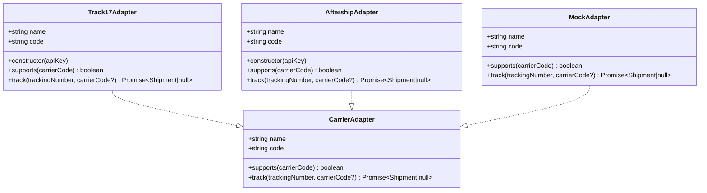
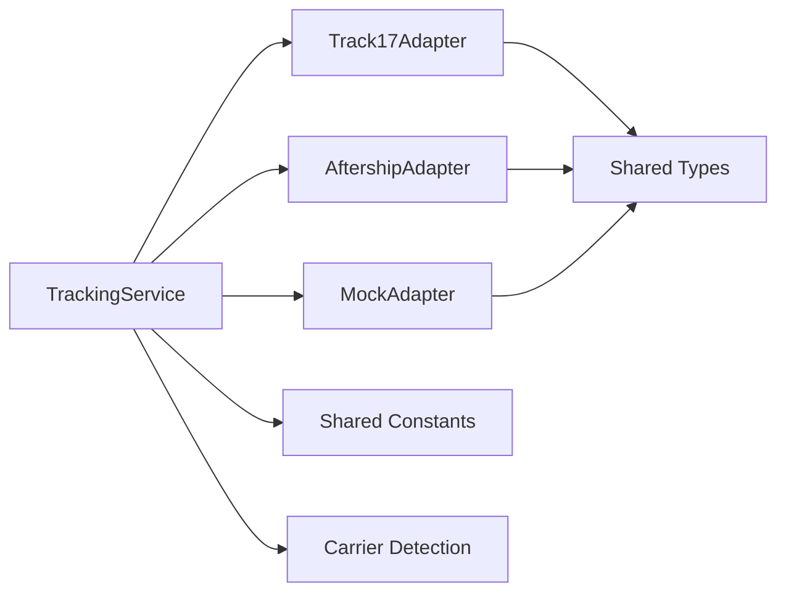

# Carrier Adapter Implementations

<cite>
**Referenced Files in This Document**
- [17track-adapter.ts](file://apps/api/src/adapters/17track-adapter.ts)
- [aftership-adapter.ts](file://apps/api/src/adapters/aftership-adapter.ts)
- [mock-adapter.ts](file://apps/api/src/adapters/mock-adapter.ts)
- [base-adapter.ts](file://apps/api/src/adapters/base-adapter.ts)
- [tracking-service.ts](file://apps/api/src/services/tracking-service.ts)
- [carrier-detect.ts](file://apps/api/src/services/carrier-detect.ts)
- [track.ts](file://apps/api/src/routes/track.ts)
- [server.ts](file://apps/api/src/server.ts)
- [index.ts](file://packages/shared/src/types/index.ts)
- [index.ts](file://packages/shared/src/constants/index.ts)
</cite>

## Table of Contents
1. [Introduction](#introduction)
2. [Project Structure](#project-structure)
3. [Core Components](#core-components)
4. [Architecture Overview](#architecture-overview)
5. [Detailed Component Analysis](#detailed-component-analysis)
6. [Dependency Analysis](#dependency-analysis)
7. [Performance Considerations](#performance-considerations)
8. [Troubleshooting Guide](#troubleshooting-guide)
9. [Conclusion](#conclusion)

## Introduction
This document provides comprehensive documentation for the carrier adapter implementations in the LOGISTIC project. It covers the 17track adapter integration, the AfterShip adapter implementation, and the mock adapter used for development and testing. For each adapter, we explain configuration requirements, API authentication, request formatting, response parsing, rate limiting considerations, error handling strategies, and response normalization processes. We also include code examples showing how adapters handle different response scenarios and edge cases.

## Project Structure
The carrier adapters are located under the API application's adapters directory and implement a common interface defined in the base adapter. The tracking service orchestrates adapter selection and routing, while the shared package defines standardized types and constants used across the system.

**Diagram sources**
- [tracking-service.ts:10-38](file://apps/api/src/services/tracking-service.ts#L10-L38)
- [17track-adapter.ts:21-28](file://apps/api/src/adapters/17track-adapter.ts#L21-L28)
- [aftership-adapter.ts:23-30](file://apps/api/src/adapters/aftership-adapter.ts#L23-L30)
- [mock-adapter.ts:7-13](file://apps/api/src/adapters/mock-adapter.ts#L7-L13)
- [carrier-detect.ts:7-17](file://apps/api/src/services/carrier-detect.ts#L7-L17)
- [track.ts:5-6](file://apps/api/src/routes/track.ts#L5-L6)
- [server.ts:13-49](file://apps/api/src/server.ts#L13-L49)
- [index.ts:1-101](file://packages/shared/src/types/index.ts#L1-L101)
- [index.ts:1-103](file://packages/shared/src/constants/index.ts#L1-L103)

**Section sources**
- [tracking-service.ts:10-38](file://apps/api/src/services/tracking-service.ts#L10-L38)
- [17track-adapter.ts:21-28](file://apps/api/src/adapters/17track-adapter.ts#L21-L28)
- [aftership-adapter.ts:23-30](file://apps/api/src/adapters/aftership-adapter.ts#L23-L30)
- [mock-adapter.ts:7-13](file://apps/api/src/adapters/mock-adapter.ts#L7-L13)
- [carrier-detect.ts:7-17](file://apps/api/src/services/carrier-detect.ts#L7-L17)
- [track.ts:5-6](file://apps/api/src/routes/track.ts#L5-L6)
- [server.ts:13-49](file://apps/api/src/server.ts#L13-L49)
- [index.ts:1-101](file://packages/shared/src/types/index.ts#L1-L101)
- [index.ts:1-103](file://packages/shared/src/constants/index.ts#L1-L103)

## Core Components
- CarrierAdapter interface: Defines the contract for all adapters, including name, code, supports(), and track().
- 17track Adapter: Implements tracking via 17track’s API with specific status mapping and customs detection.
- AfterShip Adapter: Universal fallback adapter supporting 900+ carriers with automatic carrier detection and creation logic.
- Mock Adapter: Development/testing adapter returning synthetic tracking data.
- TrackingService: Orchestrates adapter selection, caching, and routing based on configuration and availability.
- Shared Types and Constants: Define standardized enums, interfaces, and carrier detection patterns.

**Section sources**
- [base-adapter.ts:4-18](file://apps/api/src/adapters/base-adapter.ts#L4-L18)
- [17track-adapter.ts:21-61](file://apps/api/src/adapters/17track-adapter.ts#L21-L61)
- [aftership-adapter.ts:23-64](file://apps/api/src/adapters/aftership-adapter.ts#L23-L64)
- [mock-adapter.ts:7-72](file://apps/api/src/adapters/mock-adapter.ts#L7-L72)
- [tracking-service.ts:10-38](file://apps/api/src/services/tracking-service.ts#L10-L38)
- [index.ts:1-101](file://packages/shared/src/types/index.ts#L1-L101)
- [index.ts:59-75](file://packages/shared/src/constants/index.ts#L59-L75)

## Architecture Overview
The system follows a modular adapter pattern. The TrackingService initializes adapters based on environment variables, detects carriers from tracking numbers, routes requests to the most suitable adapter, caches results, and returns normalized shipment data.

**Diagram sources**
- [track.ts:9-34](file://apps/api/src/routes/track.ts#L9-L34)
- [tracking-service.ts:40-62](file://apps/api/src/services/tracking-service.ts#L40-L62)
- [carrier-detect.ts:7-17](file://apps/api/src/services/carrier-detect.ts#L7-L17)
- [tracking-service.ts:107-126](file://apps/api/src/services/tracking-service.ts#L107-L126)

## Detailed Component Analysis

### 17track Adapter
The 17track adapter integrates with 17track’s Track API v2.2 to retrieve tracking information for China-origin carriers. It handles authentication via a dedicated header, formats requests with a tracking number, parses the response, and normalizes it into the standard Shipment model.

- Configuration requirements
  - Environment variable: TRACK17_API_KEY
  - The adapter is constructed with this key and registered in the TrackingService when present.

- API authentication and request formatting
  - Endpoint: https://api.17track.net/track/v2.2/gettrackinfo
  - Authentication: Uses the 17token header with the API key.
  - Request body: JSON array containing the tracking number object.

- Response parsing and normalization
  - Parses the accepted or rejected tracking info from the response.
  - Maps 17track status codes to the standard TrackingStatus enum.
  - Detects customs-related events using keywords and sets appropriate status codes.
  - Builds a Shipment with events, origin/destination placeholders, and metadata.

- Error handling strategies
  - Returns null if the HTTP response is not OK.
  - Returns null if the response payload lacks expected fields.
  - Wraps network calls in try/catch to prevent unhandled exceptions.

- Response normalization process
  - Converts raw tracking events to standardized TrackingEvent entries.
  - Sets carrier code/name from the response and defaults to fallback values if missing.
  - Adds metadata indicating data source and confidence level.

- Edge cases and scenarios
  - Missing tracking info: Returns null.
  - Non-OK HTTP status: Returns null.
  - Unsupported carrier: The adapter declares support only for specific China-origin carriers and postal registered mail.

**Diagram sources**
- [17track-adapter.ts:40-61](file://apps/api/src/adapters/17track-adapter.ts#L40-L61)
- [17track-adapter.ts:63-116](file://apps/api/src/adapters/17track-adapter.ts#L63-L116)

**Section sources**
- [17track-adapter.ts:5-28](file://apps/api/src/adapters/17track-adapter.ts#L5-L28)
- [17track-adapter.ts:30-38](file://apps/api/src/adapters/17track-adapter.ts#L30-L38)
- [17track-adapter.ts:40-61](file://apps/api/src/adapters/17track-adapter.ts#L40-L61)
- [17track-adapter.ts:63-116](file://apps/api/src/adapters/17track-adapter.ts#L63-L116)
- [tracking-service.ts:21-24](file://apps/api/src/services/tracking-service.ts#L21-L24)

### AfterShip Adapter
The AfterShip adapter serves as a universal fallback, supporting 900+ carriers. It can auto-detect carrier slugs from tracking numbers and create tracking records if they do not exist.

- Configuration requirements
  - Environment variable: AFTERSHIP_API_KEY
  - The adapter is constructed with this key and registered in the TrackingService when present.

- API endpoints and request formatting
  - Carrier detection endpoint: POST /v4/couriers/detect with tracking number payload.
  - Tracking retrieval endpoint: GET /v4/trackings/{slug}/{trackingNumber}.
  - Creation endpoint: POST /v4/trackings with tracking number and optional slug.

- Data transformation logic
  - Maps AfterShip status tags to the standard TrackingStatus enum.
  - Normalizes checkpoint data into TrackingEvent entries with timestamps, locations, and status codes.
  - Extracts origin/destination country codes from ISO3 values.
  - Sets estimated delivery date and metadata.

- Error handling strategies
  - Returns null for non-OK responses.
  - On 404 during tracking retrieval, attempts to create the tracking record and then normalize it.
  - Wraps network calls in try/catch to prevent failures from propagating.

- Response normalization process
  - Transforms checkpoints into standardized events.
  - Populates Shipment fields including carrier code/name, origin/destination, current status, and timestamps.

- Edge cases and scenarios
  - Unknown carrier: Attempts detection first; if detection fails, falls back to the universal adapter.
  - Tracking not found: Attempts creation and then normalizes the newly created tracking.
  - Missing fields: Uses safe defaults and empty locations.

**Diagram sources**
- [aftership-adapter.ts:37-64](file://apps/api/src/adapters/aftership-adapter.ts#L37-L64)
- [aftership-adapter.ts:66-82](file://apps/api/src/adapters/aftership-adapter.ts#L66-L82)
- [aftership-adapter.ts:84-104](file://apps/api/src/adapters/aftership-adapter.ts#L84-L104)
- [aftership-adapter.ts:106-149](file://apps/api/src/adapters/aftership-adapter.ts#L106-L149)

**Section sources**
- [aftership-adapter.ts:5-30](file://apps/api/src/adapters/aftership-adapter.ts#L5-L30)
- [aftership-adapter.ts:32-35](file://apps/api/src/adapters/aftership-adapter.ts#L32-L35)
- [aftership-adapter.ts:37-64](file://apps/api/src/adapters/aftership-adapter.ts#L37-L64)
- [aftership-adapter.ts:66-104](file://apps/api/src/adapters/aftership-adapter.ts#L66-L104)
- [aftership-adapter.ts:106-149](file://apps/api/src/adapters/aftership-adapter.ts#L106-L149)
- [tracking-service.ts:26-29](file://apps/api/src/services/tracking-service.ts#L26-L29)

### Mock Adapter
The mock adapter provides synthetic tracking data for development and testing when no API keys are configured. It simulates realistic tracking events and returns a normalized Shipment.

- Purpose and usage
  - Acts as the fallback adapter when no production API keys are present.
  - Returns a fixed set of events representing a typical international shipment lifecycle.

- Response simulation
  - Simulates API latency with a short delay.
  - Generates a sequence of events including pickup, export customs, transit, import customs, and in-transit updates.
  - Sets origin and destination locations and an estimated delivery date.

- Normalization behavior
  - Produces a Shipment with standardized fields, including metadata indicating the data source and high confidence.

- Edge cases and scenarios
  - Always returns a valid Shipment for any input tracking number and carrier code.
  - Intended for local development and automated testing.

**Diagram sources**
- [mock-adapter.ts:15-72](file://apps/api/src/adapters/mock-adapter.ts#L15-L72)

**Section sources**
- [mock-adapter.ts:5-13](file://apps/api/src/adapters/mock-adapter.ts#L5-L13)
- [mock-adapter.ts:15-72](file://apps/api/src/adapters/mock-adapter.ts#L15-L72)
- [tracking-service.ts:31-34](file://apps/api/src/services/tracking-service.ts#L31-L34)

### Base Adapter Interface
All adapters implement the CarrierAdapter interface, which defines:
- name and code identifiers
- supports(carrierCode) to determine compatibility
- track(trackingNumber, carrierCode?) to fetch and normalize tracking data

**Diagram sources**
- [base-adapter.ts:4-18](file://apps/api/src/adapters/base-adapter.ts#L4-L18)
- [17track-adapter.ts:21-28](file://apps/api/src/adapters/17track-adapter.ts#L21-L28)
- [aftership-adapter.ts:23-30](file://apps/api/src/adapters/aftership-adapter.ts#L23-L30)
- [mock-adapter.ts:7-13](file://apps/api/src/adapters/mock-adapter.ts#L7-L13)

**Section sources**
- [base-adapter.ts:4-18](file://apps/api/src/adapters/base-adapter.ts#L4-L18)

## Dependency Analysis
The adapter implementations depend on shared types and constants for standardized data models and carrier detection patterns. The TrackingService composes adapters based on environment variables and selects the best adapter for a given carrier code.

**Diagram sources**
- [tracking-service.ts:10-38](file://apps/api/src/services/tracking-service.ts#L10-L38)
- [17track-adapter.ts:1-3](file://apps/api/src/adapters/17track-adapter.ts#L1-L3)
- [aftership-adapter.ts:1-3](file://apps/api/src/adapters/aftership-adapter.ts#L1-L3)
- [mock-adapter.ts:1-3](file://apps/api/src/adapters/mock-adapter.ts#L1-L3)
- [index.ts:1-101](file://packages/shared/src/types/index.ts#L1-L101)
- [index.ts:59-75](file://packages/shared/src/constants/index.ts#L59-L75)
- [carrier-detect.ts](file://apps/api/src/services/carrier-detect.ts#L1)

**Section sources**
- [tracking-service.ts:10-38](file://apps/api/src/services/tracking-service.ts#L10-L38)
- [index.ts:1-101](file://packages/shared/src/types/index.ts#L1-L101)
- [index.ts:59-75](file://packages/shared/src/constants/index.ts#L59-L75)
- [carrier-detect.ts](file://apps/api/src/services/carrier-detect.ts#L1)

## Performance Considerations
- Caching strategy
  - Results are cached in Redis with TTLs based on current status to reduce repeated API calls.
  - Cache keys follow the pattern track:<trackingNumber>.
  - TTL values are defined in shared constants and vary by status.

- Concurrency and batching
  - The service processes batch requests with a concurrency limit to balance throughput and resource usage.
  - Batch size is limited to prevent overload.

- Rate limiting
  - The API server applies a global rate limit at the HTTP layer.
  - Per-user tier limits are defined in shared constants and can be enforced at higher layers.

- Network resilience
  - Redis connection errors are handled gracefully; the system continues without cache.
  - Adapter calls wrap network operations in try/catch to avoid cascading failures.

**Section sources**
- [tracking-service.ts:107-126](file://apps/api/src/services/tracking-service.ts#L107-L126)
- [index.ts:32-43](file://packages/shared/src/constants/index.ts#L32-L43)
- [track.ts:72-73](file://apps/api/src/routes/track.ts#L72-L73)
- [server.ts:19-23](file://apps/api/src/server.ts#L19-L23)
- [index.ts:92-100](file://packages/shared/src/constants/index.ts#L92-L100)

## Troubleshooting Guide
- Missing API keys
  - If neither TRACK17_API_KEY nor AFTERSHIP_API_KEY is configured, the service falls back to the mock adapter for development and testing.

- Tracking number validation
  - The service validates tracking numbers to ensure they meet basic format requirements before processing.

- Adapter selection issues
  - The service routes to adapters that support the detected carrier code first, then falls back to the universal adapter.

- Cache-related problems
  - If Redis is unavailable or errors occur, the service logs warnings and continues without caching.

- Common error responses
  - Invalid tracking number length triggers a 400 response.
  - Tracking not found returns a 404 response with an error message.

**Section sources**
- [tracking-service.ts:31-34](file://apps/api/src/services/tracking-service.ts#L31-L34)
- [tracking-service.ts:43-45](file://apps/api/src/services/tracking-service.ts#L43-L45)
- [tracking-service.ts:93-105](file://apps/api/src/services/tracking-service.ts#L93-L105)
- [server.ts:34-46](file://apps/api/src/server.ts#L34-L46)
- [track.ts:14-19](file://apps/api/src/routes/track.ts#L14-L19)
- [track.ts:23-28](file://apps/api/src/routes/track.ts#L23-L28)

## Conclusion
The carrier adapter implementations provide a robust, extensible framework for tracking shipments across multiple carriers. The 17track adapter focuses on China-origin carriers with precise status mapping and customs detection, while the AfterShip adapter offers broad coverage as a universal fallback. The mock adapter enables seamless development and testing. Together with the TrackingService’s routing, caching, and error handling, the system delivers reliable tracking results with clear normalization and standardized data models.