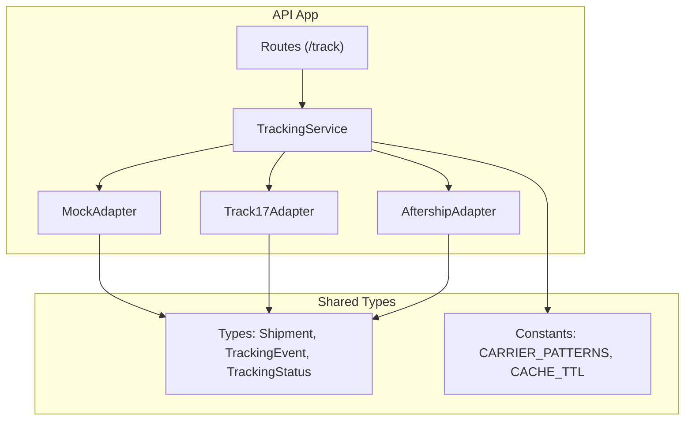
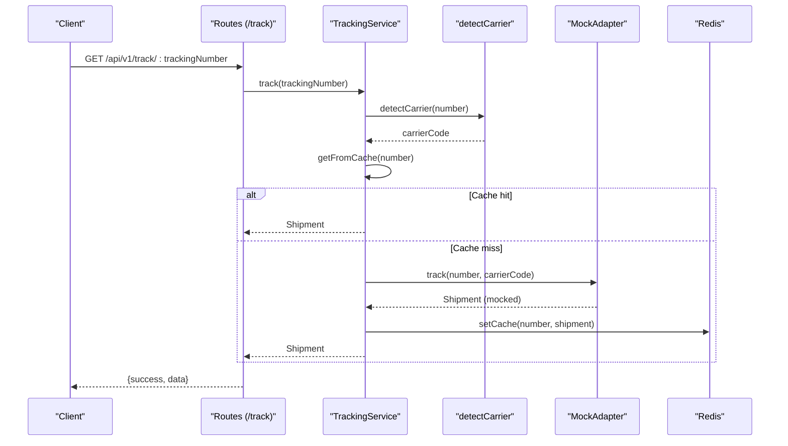
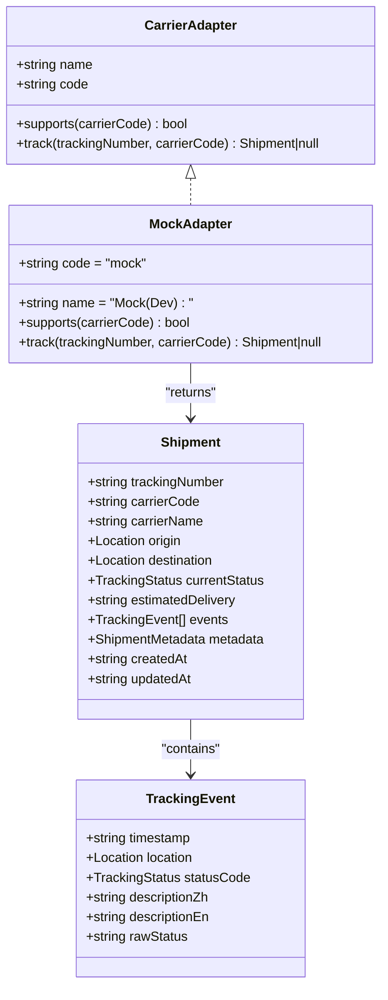
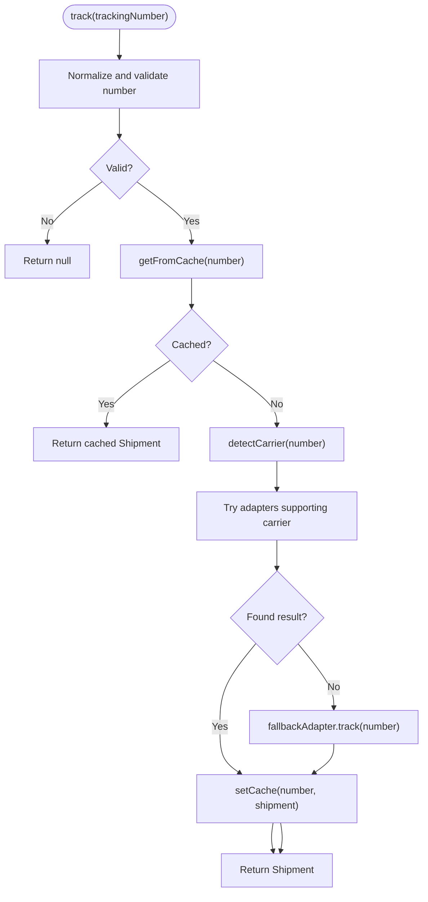
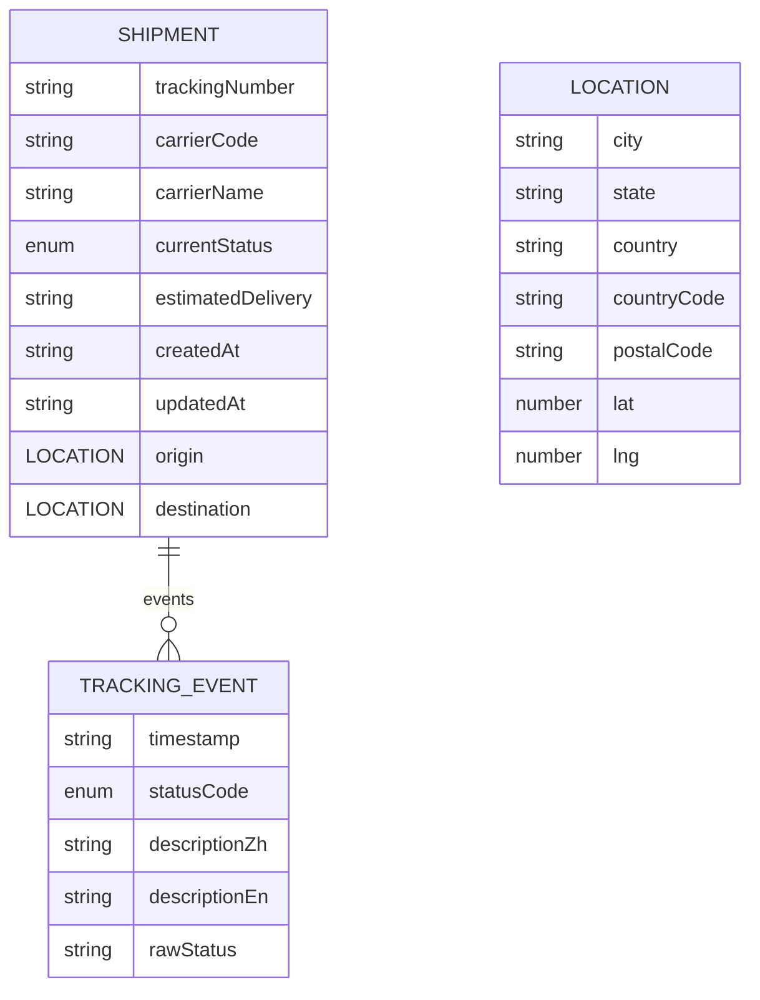
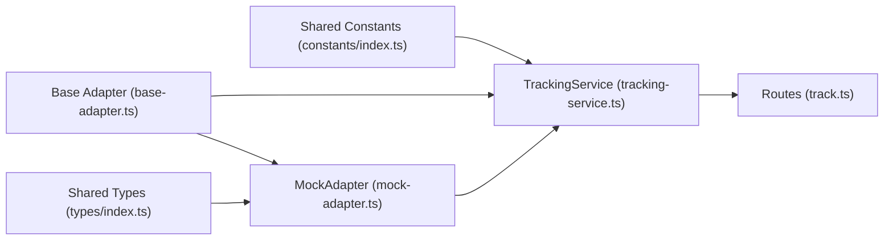

# Mock Adapter Implementation

<cite>
**Referenced Files in This Document**
- [mock-adapter.ts](file://apps/api/src/adapters/mock-adapter.ts)
- [base-adapter.ts](file://apps/api/src/adapters/base-adapter.ts)
- [tracking-service.ts](file://apps/api/src/services/tracking-service.ts)
- [types/index.ts](file://packages/shared/src/types/index.ts)
- [constants/index.ts](file://packages/shared/src/constants/index.ts)
- [track.ts](file://apps/api/src/routes/track.ts)
- [server.ts](file://apps/api/src/server.ts)
- [carrier-detect.ts](file://apps/api/src/services/carrier-detect.ts)
- [17track-adapter.ts](file://apps/api/src/adapters/17track-adapter.ts)
- [aftership-adapter.ts](file://apps/api/src/adapters/aftership-adapter.ts)
</cite>

## Table of Contents
1. [Introduction](#introduction)
2. [Project Structure](#project-structure)
3. [Core Components](#core-components)
4. [Architecture Overview](#architecture-overview)
5. [Detailed Component Analysis](#detailed-component-analysis)
6. [Dependency Analysis](#dependency-analysis)
7. [Performance Considerations](#performance-considerations)
8. [Troubleshooting Guide](#troubleshooting-guide)
9. [Conclusion](#conclusion)
10. [Appendices](#appendices)

## Introduction
This document explains the mock adapter used for development and testing. It simulates carrier responses without external API calls, returning realistic sample data to validate the end-to-end tracking pipeline. The mock adapter is automatically selected when no production carrier API keys are configured, enabling local development and automated testing without network dependencies.

## Project Structure
The mock adapter lives alongside other carrier adapters and integrates with the tracking service and routing layer. Shared types define the canonical shipment model and statuses used across adapters.

**Diagram sources**
- [track.ts:1-75](file://apps/api/src/routes/track.ts#L1-L75)
- [tracking-service.ts:1-128](file://apps/api/src/services/tracking-service.ts#L1-L128)
- [mock-adapter.ts:1-74](file://apps/api/src/adapters/mock-adapter.ts#L1-L74)
- [17track-adapter.ts:1-118](file://apps/api/src/adapters/17track-adapter.ts#L1-L118)
- [aftership-adapter.ts:1-151](file://apps/api/src/adapters/aftership-adapter.ts#L1-L151)
- [types/index.ts:1-101](file://packages/shared/src/types/index.ts#L1-L101)
- [constants/index.ts:1-103](file://packages/shared/src/constants/index.ts#L1-L103)

**Section sources**
- [track.ts:1-75](file://apps/api/src/routes/track.ts#L1-L75)
- [tracking-service.ts:1-128](file://apps/api/src/services/tracking-service.ts#L1-L128)
- [mock-adapter.ts:1-74](file://apps/api/src/adapters/mock-adapter.ts#L1-L74)
- [types/index.ts:1-101](file://packages/shared/src/types/index.ts#L1-L101)
- [constants/index.ts:1-103](file://packages/shared/src/constants/index.ts#L1-L103)

## Core Components
- MockAdapter: Implements the CarrierAdapter interface to return deterministic, realistic tracking data for any tracking number. It simulates latency and constructs a full Shipment with multiple TrackingEvent entries representing a typical international shipment lifecycle.
- TrackingService: Builds an adapter chain based on environment configuration, selecting real adapters when available and falling back to MockAdapter otherwise. It routes requests to the most suitable adapter and caches results.
- Shared Types: Define the canonical Shipment, TrackingEvent, and TrackingStatus structures used by all adapters.

Key behaviors:
- Automatic fallback: When no carrier API keys are present, the service initializes MockAdapter as the sole adapter.
- Carrier detection: Tracking numbers are normalized and detected to select appropriate adapters.
- Caching: Results are cached with TTLs based on current status.

**Section sources**
- [mock-adapter.ts:1-74](file://apps/api/src/adapters/mock-adapter.ts#L1-L74)
- [tracking-service.ts:1-128](file://apps/api/src/services/tracking-service.ts#L1-L128)
- [types/index.ts:1-101](file://packages/shared/src/types/index.ts#L1-L101)
- [constants/index.ts:1-103](file://packages/shared/src/constants/index.ts#L1-L103)

## Architecture Overview
The mock adapter participates in the same request flow as production adapters, ensuring consistent behavior across environments.

**Diagram sources**
- [track.ts:1-75](file://apps/api/src/routes/track.ts#L1-L75)
- [tracking-service.ts:1-128](file://apps/api/src/services/tracking-service.ts#L1-L128)
- [carrier-detect.ts:1-27](file://apps/api/src/services/carrier-detect.ts#L1-L27)
- [mock-adapter.ts:1-74](file://apps/api/src/adapters/mock-adapter.ts#L1-L74)

## Detailed Component Analysis

### MockAdapter
Responsibilities:
- Implements CarrierAdapter interface.
- Returns a realistic Shipment for any input tracking number.
- Simulates network latency to mimic real API behavior.
- Uses a fixed route with staged events representing a cross-border journey.

Mock response characteristics:
- Origin and destination cities/countries are predefined.
- Events reflect a logical progression: pickup, export customs, in-transit hub, import customs.
- Current status is set to in-transit; estimated delivery is offset by a few days.
- Metadata indicates mock data source and high confidence.

Extensibility:
- To customize behavior per carrier, branch on the carrierCode parameter.
- To vary statuses, adjust the currentStatus and event list.
- To simulate delays or exceptions, modify timestamps and statuses.

**Diagram sources**
- [base-adapter.ts:1-39](file://apps/api/src/adapters/base-adapter.ts#L1-L39)
- [mock-adapter.ts:1-74](file://apps/api/src/adapters/mock-adapter.ts#L1-L74)
- [types/index.ts:1-101](file://packages/shared/src/types/index.ts#L1-L101)

**Section sources**
- [mock-adapter.ts:1-74](file://apps/api/src/adapters/mock-adapter.ts#L1-L74)
- [types/index.ts:1-101](file://packages/shared/src/types/index.ts#L1-L101)

### TrackingService Integration
Behavior:
- Builds adapter chain from environment variables.
- Falls back to MockAdapter when no keys are present.
- Routes requests to adapters supporting the detected carrier.
- Caches results using Redis with status-based TTLs.

**Diagram sources**
- [tracking-service.ts:1-128](file://apps/api/src/services/tracking-service.ts#L1-L128)
- [carrier-detect.ts:1-27](file://apps/api/src/services/carrier-detect.ts#L1-L27)

**Section sources**
- [tracking-service.ts:1-128](file://apps/api/src/services/tracking-service.ts#L1-L128)
- [carrier-detect.ts:1-27](file://apps/api/src/services/carrier-detect.ts#L1-L27)

### Data Model and Statuses
The mock adapter produces data conforming to the shared types. Typical statuses used include pickup, export/import customs, in-transit, and out-for-delivery.

**Diagram sources**
- [types/index.ts:1-101](file://packages/shared/src/types/index.ts#L1-L101)

**Section sources**
- [types/index.ts:1-101](file://packages/shared/src/types/index.ts#L1-L101)
- [constants/index.ts:1-103](file://packages/shared/src/constants/index.ts#L1-L103)

## Dependency Analysis
The mock adapter depends on shared types and is consumed by the tracking service. The service orchestrates adapter selection and caching.

**Diagram sources**
- [types/index.ts:1-101](file://packages/shared/src/types/index.ts#L1-L101)
- [constants/index.ts:1-103](file://packages/shared/src/constants/index.ts#L1-L103)
- [base-adapter.ts:1-39](file://apps/api/src/adapters/base-adapter.ts#L1-L39)
- [mock-adapter.ts:1-74](file://apps/api/src/adapters/mock-adapter.ts#L1-L74)
- [tracking-service.ts:1-128](file://apps/api/src/services/tracking-service.ts#L1-L128)
- [track.ts:1-75](file://apps/api/src/routes/track.ts#L1-L75)

**Section sources**
- [tracking-service.ts:1-128](file://apps/api/src/services/tracking-service.ts#L1-L128)
- [mock-adapter.ts:1-74](file://apps/api/src/adapters/mock-adapter.ts#L1-L74)
- [types/index.ts:1-101](file://packages/shared/src/types/index.ts#L1-L101)
- [constants/index.ts:1-103](file://packages/shared/src/constants/index.ts#L1-L103)

## Performance Considerations
- Latency simulation: The mock adapter introduces a small delay to approximate real API behavior, aiding performance testing and UI responsiveness validation.
- Caching: TrackingService caches results with TTLs aligned to status changes, reducing repeated computation and network overhead.
- Concurrency: Batch tracking uses controlled concurrency to balance throughput and resource usage.

Best practices:
- Keep mock data representative but minimal to avoid skewing performance metrics.
- Use varied statuses and timestamps to exercise UI and caching logic under realistic conditions.

**Section sources**
- [mock-adapter.ts:1-74](file://apps/api/src/adapters/mock-adapter.ts#L1-L74)
- [tracking-service.ts:1-128](file://apps/api/src/services/tracking-service.ts#L1-L128)
- [constants/index.ts:1-103](file://packages/shared/src/constants/index.ts#L1-L103)

## Troubleshooting Guide
Common issues and resolutions:
- Unexpected carrier routing: Verify carrier detection logic and ensure the tracking number matches supported patterns.
- Missing mock data: Confirm that no production API keys are set so the service selects MockAdapter.
- Cache-related problems: Check Redis connectivity and TTL behavior; the service gracefully degrades without cache.
- Validation failures: Ensure tracking numbers meet length and character requirements.

Operational checks:
- Health endpoint: Use the health route to confirm service availability and cache status.
- Logging: Inspect server logs for startup and runtime warnings.

**Section sources**
- [track.ts:1-75](file://apps/api/src/routes/track.ts#L1-L75)
- [server.ts:1-60](file://apps/api/src/server.ts#L1-L60)
- [tracking-service.ts:1-128](file://apps/api/src/services/tracking-service.ts#L1-L128)
- [carrier-detect.ts:1-27](file://apps/api/src/services/carrier-detect.ts#L1-L27)

## Conclusion
The mock adapter provides a reliable, deterministic way to develop and test tracking functionality without external dependencies. By integrating seamlessly with the tracking service and adhering to shared data models, it enables comprehensive validation of the full pipeline, including routing, caching, and UI rendering.

## Appendices

### Configuration Options and Environment
- No special configuration is required for the mock adapter. When no production API keys are present, the service automatically uses MockAdapter as the fallback.
- Optional Redis configuration enables caching; absence of Redis disables caching but does not break functionality.

**Section sources**
- [tracking-service.ts:1-128](file://apps/api/src/services/tracking-service.ts#L1-L128)
- [server.ts:1-60](file://apps/api/src/server.ts#L1-L60)

### Testing Strategies
- Unit tests: Instantiate MockAdapter directly to validate response shape and statuses.
- Integration tests: Use TrackingService to verify adapter selection, caching, and error handling.
- End-to-end tests: Call the routes layer to ensure the complete flow behaves as expected.

**Section sources**
- [mock-adapter.ts:1-74](file://apps/api/src/adapters/mock-adapter.ts#L1-L74)
- [tracking-service.ts:1-128](file://apps/api/src/services/tracking-service.ts#L1-L128)
- [track.ts:1-75](file://apps/api/src/routes/track.ts#L1-L75)

### Extending the Mock Adapter
To add new scenarios:
- Branch on carrierCode to return distinct event sequences for different carriers.
- Introduce randomized delays or edge-case statuses (e.g., customs holds, exceptions).
- Add new status combinations to simulate complex international shipping journeys.

Validation tips:
- Ensure timestamps progress logically across events.
- Keep metadata consistent with the chosen data source and confidence level.

**Section sources**
- [mock-adapter.ts:1-74](file://apps/api/src/adapters/mock-adapter.ts#L1-L74)
- [types/index.ts:1-101](file://packages/shared/src/types/index.ts#L1-L101)