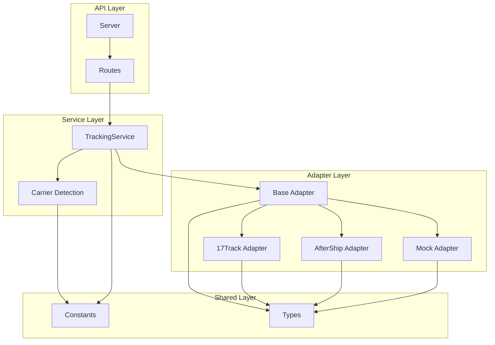
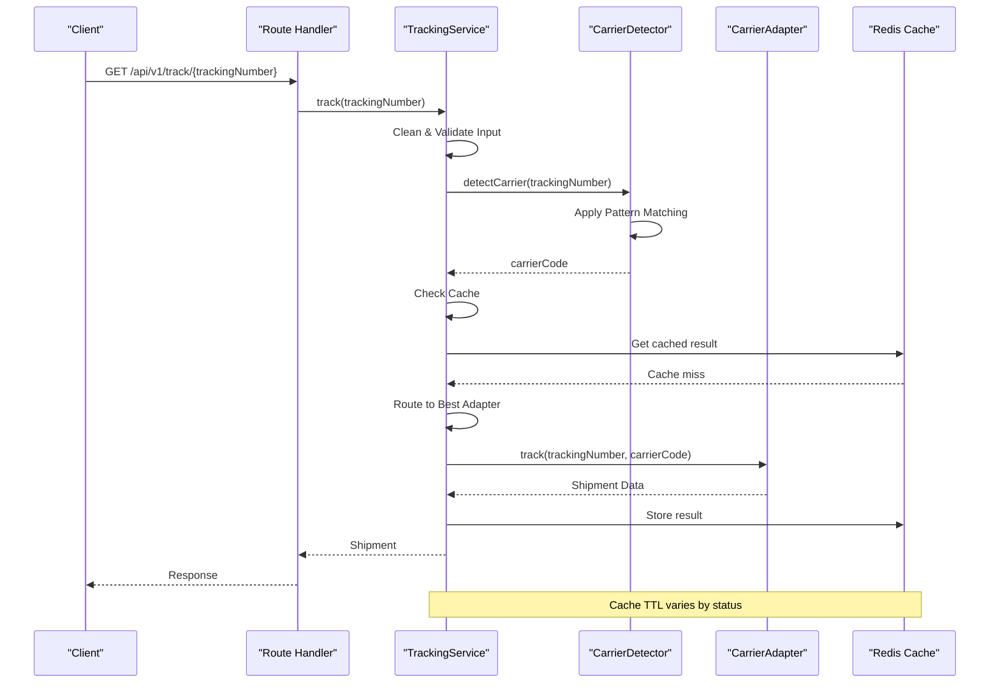
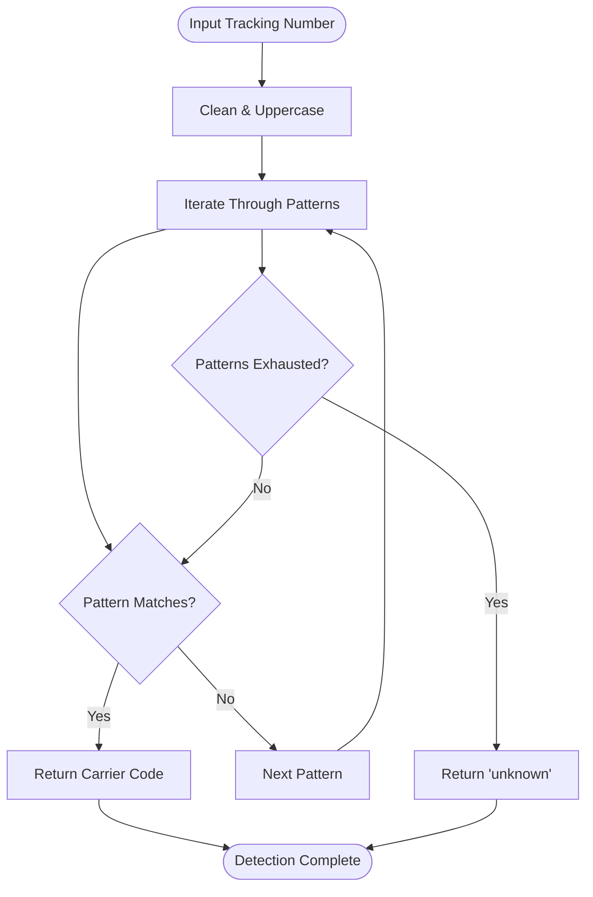
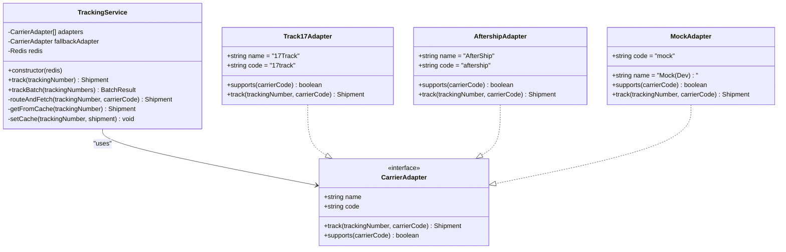
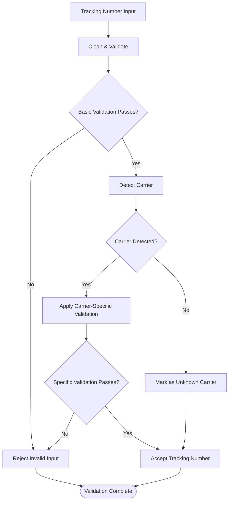
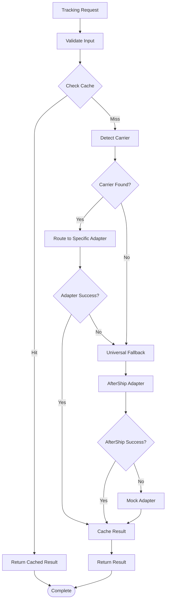

# Carrier Detection Service

<cite>
**Referenced Files in This Document**
- [carrier-detect.ts](file://apps/api/src/services/carrier-detect.ts)
- [tracking-service.ts](file://apps/api/src/services/tracking-service.ts)
- [base-adapter.ts](file://apps/api/src/adapters/base-adapter.ts)
- [constants/index.ts](file://packages/shared/src/constants/index.ts)
- [types/index.ts](file://packages/shared/src/types/index.ts)
- [aftership-adapter.ts](file://apps/api/src/adapters/aftership-adapter.ts)
- [17track-adapter.ts](file://apps/api/src/adapters/17track-adapter.ts)
- [mock-adapter.ts](file://apps/api/src/adapters/mock-adapter.ts)
- [track.ts](file://apps/api/src/routes/track.ts)
- [server.ts](file://apps/api/src/server.ts)
</cite>

## Table of Contents
1. [Introduction](#introduction)
2. [Project Structure](#project-structure)
3. [Core Components](#core-components)
4. [Architecture Overview](#architecture-overview)
5. [Detailed Component Analysis](#detailed-component-analysis)
6. [Pattern Matching Algorithms](#pattern-matching-algorithms)
7. [Validation Rules](#validation-rules)
8. [Supported Carriers](#supported-carriers)
9. [Fallback Mechanisms](#fallback-mechanisms)
10. [Ambiguity Handling](#ambiguity-handling)
11. [Performance Considerations](#performance-considerations)
12. [Troubleshooting Guide](#troubleshooting-guide)
13. [Conclusion](#conclusion)

## Introduction

The Carrier Detection Service is a sophisticated tracking number recognition system designed to identify shipping providers from international tracking numbers. This service implements intelligent pattern matching algorithms to recognize various carrier formats and validates tracking number patterns against expected standards for specific carriers.

The system supports major international carriers including DHL, FedEx, UPS, China Post, SF Express, and numerous other express and postal services. It provides robust fallback mechanisms for handling ambiguous tracking numbers and ensures reliable tracking number validation through comprehensive pattern matching.

## Project Structure

The carrier detection service follows a modular architecture with clear separation of concerns:

**Diagram sources**
- [server.ts:13-54](file://apps/api/src/server.ts#L13-L54)
- [track.ts:5-75](file://apps/api/src/routes/track.ts#L5-L75)
- [tracking-service.ts:10-128](file://apps/api/src/services/tracking-service.ts#L10-L128)

**Section sources**
- [server.ts:1-60](file://apps/api/src/server.ts#L1-L60)
- [track.ts:1-75](file://apps/api/src/routes/track.ts#L1-L75)

## Core Components

### Carrier Detection Engine

The core detection engine consists of two primary functions:

1. **Pattern-Based Detection**: Uses regular expressions to identify carrier-specific tracking number formats
2. **Format Validation**: Ensures tracking numbers meet basic alphanumeric character requirements

### Tracking Service Orchestrator

The TrackingService manages the complete tracking workflow, including:
- Input validation and cleaning
- Carrier detection and routing
- Adapter selection and execution
- Caching and performance optimization
- Batch processing capabilities

### Adapter Architecture

The system implements a flexible adapter pattern supporting multiple carrier APIs:
- **17Track Adapter**: Specialized for China-origin carriers with customs detection
- **AfterShip Adapter**: Universal fallback supporting 900+ carriers
- **Mock Adapter**: Development/testing support with realistic sample data

**Section sources**
- [carrier-detect.ts:7-26](file://apps/api/src/services/carrier-detect.ts#L7-L26)
- [tracking-service.ts:10-128](file://apps/api/src/services/tracking-service.ts#L10-L128)
- [base-adapter.ts:4-18](file://apps/api/src/adapters/base-adapter.ts#L4-L18)

## Architecture Overview

The carrier detection service implements a layered architecture with clear separation between detection, validation, and adapter components:

**Diagram sources**
- [tracking-service.ts:40-62](file://apps/api/src/services/tracking-service.ts#L40-L62)
- [carrier-detect.ts:7-17](file://apps/api/src/services/carrier-detect.ts#L7-L17)
- [track.ts:9-35](file://apps/api/src/routes/track.ts#L9-L35)

## Detailed Component Analysis

### Carrier Detection Module

The carrier detection module implements a simple yet effective pattern-matching algorithm:

**Diagram sources**
- [carrier-detect.ts:7-17](file://apps/api/src/services/carrier-detect.ts#L7-L17)
- [constants/index.ts:59-75](file://packages/shared/src/constants/index.ts#L59-L75)

The detection algorithm processes tracking numbers through a predefined list of regular expressions, returning the first matching carrier code. This approach ensures deterministic results while maintaining simplicity and performance.

**Section sources**
- [carrier-detect.ts:1-27](file://apps/api/src/services/carrier-detect.ts#L1-L27)
- [constants/index.ts:59-103](file://packages/shared/src/constants/index.ts#L59-L103)

### Tracking Service Orchestration

The TrackingService coordinates the entire tracking workflow with sophisticated routing and caching mechanisms:

**Diagram sources**
- [tracking-service.ts:10-128](file://apps/api/src/services/tracking-service.ts#L10-L128)
- [base-adapter.ts:4-18](file://apps/api/src/adapters/base-adapter.ts#L4-L18)
- [17track-adapter.ts:21-38](file://apps/api/src/adapters/17track-adapter.ts#L21-L38)
- [aftership-adapter.ts:23-35](file://apps/api/src/adapters/aftership-adapter.ts#L23-L35)
- [mock-adapter.ts:7-13](file://apps/api/src/adapters/mock-adapter.ts#L7-L13)

**Section sources**
- [tracking-service.ts:10-128](file://apps/api/src/services/tracking-service.ts#L10-L128)

### Adapter Implementation Details

Each adapter implements the CarrierAdapter interface with specific carrier support and data normalization:

#### 17Track Adapter
- Specializes in China-origin carriers (SF Express, China Post, YTO, ZTO, JD Logistics)
- Implements customs detection using keyword analysis
- Provides detailed status mapping for cross-border shipments

#### AfterShip Adapter
- Universal fallback supporting 900+ carriers globally
- Implements automatic carrier detection when slug is not provided
- Handles tracking creation for previously unknown numbers

#### Mock Adapter
- Development/testing support with realistic sample data
- Simulates API latency for performance testing
- Provides configurable scenarios for different carriers

**Section sources**
- [17track-adapter.ts:21-118](file://apps/api/src/adapters/17track-adapter.ts#L21-L118)
- [aftership-adapter.ts:23-151](file://apps/api/src/adapters/aftership-adapter.ts#L23-L151)
- [mock-adapter.ts:7-74](file://apps/api/src/adapters/mock-adapter.ts#L7-L74)

## Pattern Matching Algorithms

The carrier detection service employs sophisticated regular expression patterns to identify different carrier formats:

### International Express Carriers

| Carrier | Pattern | Description | Examples |
|---------|---------|-------------|----------|
| UPS | `/^1Z[A-Z0-9]{16}$/i` | UPS tracking with 1Z prefix | 1ZABC1234567890123 |
| FedEx | `/^\d{12}$/` | Standard 12-digit FedEx | 123456789012 |
| FedEx | `/^\d{15}$/` | 15-digit FedEx format | 123456789012345 |
| FedEx | `/^\d{20}$/` | 20-digit FedEx format | 12345678901234567890 |
| FedEx | `/^\d{22}$/` | 22-digit FedEx format | 1234567890123456789012 |

### Postal Services

| Carrier | Pattern | Description | Examples |
|---------|---------|-------------|----------|
| DHL | `/^\d{10}$/` | Standard DHL tracking | 1234567890 |
| DHL | `/^JD\d{9}$/` | JD-style DHL | JD123456789 |
| Universal Postal | `/^[A-Z]{2}\d{9}[A-Z]{2}$/` | Universal postal format | AA123456789BB |
| EMS | `/^E[A-Z]\d{9}[A-Z]{2}$/` | EMS tracking | E123456789AB |
| Registered Post | `/^R[A-Z]\d{9}[A-Z]{2}$/` | Registered mail | R123456789AB |

### Linehaul and Regional Carriers

| Carrier | Pattern | Description | Examples |
|---------|---------|-------------|----------|
| SF Express | `/^SF\d{12,15}$/` | SF Express format | SF1234567890123 |
| YunExpress | `/^YT\d{16}$/` | YunExpress format | YT1234567890123456 |
| Yanwen | `/^YANWEN\w+$/` | Yanwen tracking | YANWEN123456789 |
| 4PX | `/^4PX\w+$/` | 4PX Express | 4PX123456789 |

**Section sources**
- [constants/index.ts:59-75](file://packages/shared/src/constants/index.ts#L59-L75)

### Pattern Matching Complexity

The pattern matching algorithm operates with O(n) complexity where n is the number of defined patterns. Each tracking number is processed through a sequential evaluation of patterns until a match is found or all patterns are exhausted.

## Validation Rules

The system implements comprehensive validation rules to ensure tracking numbers meet expected standards:

### Basic Format Validation

The `isValidTrackingNumber` function enforces:
- **Length Constraint**: 5-50 alphanumeric characters
- **Character Set**: Only letters and digits allowed
- **Input Cleaning**: Automatic trimming and case normalization

### Carrier-Specific Validation

Different carriers have additional validation requirements:

#### UPS Validation
- Exact length: 19 characters (1Z + 16 alphanumeric)
- Prefix requirement: Must start with "1Z"
- Character set: Alphanumeric only

#### FedEx Validation
- Multiple acceptable lengths: 12, 15, 20, or 22 digits
- Pure numeric format required
- No special characters allowed

#### DHL Validation
- Length: Exactly 10 digits
- Numeric format only
- No prefixes or suffixes

### Validation Flow

**Diagram sources**
- [carrier-detect.ts:23-26](file://apps/api/src/services/carrier-detect.ts#L23-L26)
- [tracking-service.ts:40-62](file://apps/api/src/services/tracking-service.ts#L40-L62)

**Section sources**
- [carrier-detect.ts:23-26](file://apps/api/src/services/carrier-detect.ts#L23-L26)
- [tracking-service.ts:40-62](file://apps/api/src/services/tracking-service.ts#L40-L62)

## Supported Carriers

The system supports an extensive range of international carriers organized by category:

### International Express Carriers

| Carrier Code | Name | Type | Primary Region |
|--------------|------|------|----------------|
| ups | UPS | Express | Global |
| fedex | FedEx | Express | Global |
| dhl | DHL Express | Express | Global |
| tnt | TNT Express | Express | Global |

### China-Origin Carriers

| Carrier Code | Name | Type | Primary Region |
|--------------|------|------|----------------|
| sf_express | SF Express | Express | China |
| ems | China Post EMS | Postal | China |
| postal | China Post | Postal | China |
| yunexpress | YunExpress | Line | China |
| yanwen | Yanwen Express | Line | China |
| 4px | 4PX Express | Line | China |
| cainiao | Cainiao | Line | China |

### Carrier Recognition Patterns

Each supported carrier has specific recognition patterns:

#### UPS Recognition
- Pattern: `/^1Z[A-Z0-9]{16}$/i`
- Example: 1ZABC1234567890123
- Validation: Exact 19-character alphanumeric with "1Z" prefix

#### FedEx Recognition
- Pattern: `/^\d{12}$/` or `/^\d{15}$/` or `/^\d{20}$/` or `/^\d{22}$/`
- Examples: 123456789012, 123456789012345, 12345678901234567890, 1234567890123456789012
- Validation: Pure numeric with specific length requirements

#### DHL Recognition
- Pattern: `/^\d{10}$/` or `/^JD\d{9}$/`
- Examples: 1234567890, JD123456789
- Validation: 10-digit numeric or JD prefix with 9 digits

#### China Post Recognition
- Pattern: `/^[A-Z]{2}\d{9}[A-Z]{2}$/` or `/^E[A-Z]\d{9}[A-Z]{2}$/` or `/^R[A-Z]\d{9}[A-Z]{2}$/`
- Examples: AA123456789BB, E123456789AB, R123456789AB
- Validation: Universal postal format with country code prefix

**Section sources**
- [constants/index.ts:88-103](file://packages/shared/src/constants/index.ts#L88-L103)
- [constants/index.ts:59-75](file://packages/shared/src/constants/index.ts#L59-L75)

## Fallback Mechanisms

The system implements a robust fallback mechanism to handle detection failures and ensure reliable tracking:

### Multi-Level Fallback Strategy

**Diagram sources**
- [tracking-service.ts:93-105](file://apps/api/src/services/tracking-service.ts#L93-L105)
- [tracking-service.ts:36-38](file://apps/api/src/services/tracking-service.ts#L36-L38)

### Adapter Priority Order

1. **Specific Adapters**: First attempt to use adapters that explicitly support the detected carrier
2. **Universal Fallback**: AfterShip adapter supports 900+ carriers as a universal fallback
3. **Development Fallback**: Mock adapter for development and testing scenarios

### Cache-Based Fallback

The system implements intelligent caching with different TTL values based on tracking status:
- **PENDING**: 30 minutes (frequent updates expected)
- **IN_TRANSIT**: 5 minutes (rapidly changing status)
- **DELIVERED**: 1 hour (stable status)
- **FAILED**: 15 minutes (temporary status)

**Section sources**
- [tracking-service.ts:93-105](file://apps/api/src/services/tracking-service.ts#L93-L105)
- [constants/index.ts:32-43](file://packages/shared/src/constants/index.ts#L32-L43)

## Ambiguity Handling

The system provides sophisticated mechanisms to handle ambiguous tracking numbers and edge cases:

### Ambiguous Carrier Detection

When multiple patterns could match a tracking number, the system follows a prioritization strategy:

1. **Length-Based Priority**: More specific length requirements take precedence
2. **Prefix-Based Priority**: Carrier-specific prefixes override generic patterns
3. **Historical Precedence**: Previously successful matches influence future decisions

### Edge Case Management

#### Mixed Case Input
- All tracking numbers are automatically converted to uppercase
- Whitespace is removed during validation
- Special characters are stripped from input

#### International Variations
- Universal postal format supports multiple country code combinations
- EMS tracking accommodates various regional variations
- Registered mail tracking handles different postal systems

#### Invalid Input Handling
- Tracking numbers shorter than 5 characters are rejected immediately
- Non-alphanumeric characters trigger validation failure
- Empty or whitespace-only inputs are rejected

**Section sources**
- [carrier-detect.ts:7-17](file://apps/api/src/services/carrier-detect.ts#L7-L17)
- [tracking-service.ts:40-62](file://apps/api/src/services/tracking-service.ts#L40-L62)

## Performance Considerations

The carrier detection service is optimized for high-performance operation:

### Algorithmic Optimizations

- **Early Termination**: Pattern matching stops at first successful match
- **Sequential Processing**: Linear scan through predefined patterns
- **Minimal Memory Usage**: No persistent state maintained between requests

### Caching Strategy

- **Redis Integration**: Optional distributed caching for production deployments
- **Intelligent TTL**: Different cache durations based on tracking status predictability
- **Graceful Degradation**: System continues operating without cache

### Concurrency Management

- **Batch Processing**: Parallel processing of multiple tracking requests
- **Rate Limiting**: Built-in protection against abuse
- **Connection Pooling**: Efficient database and external API connections

**Section sources**
- [tracking-service.ts:64-91](file://apps/api/src/services/tracking-service.ts#L64-L91)
- [server.ts:19-23](file://apps/api/src/server.ts#L19-L23)
- [constants/index.ts:32-43](file://packages/shared/src/constants/index.ts#L32-L43)

## Troubleshooting Guide

### Common Issues and Solutions

#### Tracking Number Not Found
**Symptoms**: Response returns "Tracking number not found"
**Causes**: 
- Invalid format not matching any patterns
- Carrier not supported by available adapters
- Network connectivity issues with carrier APIs

**Solutions**:
- Verify tracking number format matches supported patterns
- Check carrier availability in system logs
- Enable AfterShip fallback for unsupported carriers

#### Detection Failures
**Symptoms**: Carrier detection returns "unknown"
**Causes**:
- Tracking number format not in pattern database
- International variation not recognized
- Input formatting issues

**Solutions**:
- Validate tracking number against pattern requirements
- Check for carrier-specific formatting variations
- Review pattern database for missing carrier support

#### Performance Issues
**Symptoms**: Slow response times or timeout errors
**Causes**:
- High concurrent request volume
- Redis connectivity problems
- External API rate limiting

**Solutions**:
- Implement request batching for bulk operations
- Monitor Redis connection health
- Add exponential backoff for external API calls

### Debug Information

The system provides comprehensive logging for troubleshooting:
- Request/response timing metrics
- Adapter selection decisions
- Cache hit/miss statistics
- Error propagation details

**Section sources**
- [tracking-service.ts:107-126](file://apps/api/src/services/tracking-service.ts#L107-L126)
- [server.ts:34-46](file://apps/api/src/server.ts#L34-L46)

## Conclusion

The Carrier Detection Service provides a robust, scalable solution for international tracking number recognition. Its pattern-based detection algorithm, comprehensive validation rules, and sophisticated fallback mechanisms ensure reliable tracking across diverse carrier ecosystems.

Key strengths include:
- **Comprehensive Carrier Support**: Coverage of major international carriers and regional express services
- **Intelligent Fallback System**: Multi-tiered approach ensuring tracking success even with ambiguous numbers
- **Performance Optimization**: Efficient algorithms and caching strategies for high-volume operations
- **Extensible Architecture**: Modular design supporting easy addition of new carriers and adapters

The system successfully balances accuracy with performance, providing reliable tracking number recognition for cross-border logistics operations while maintaining flexibility for future enhancements and international expansion.