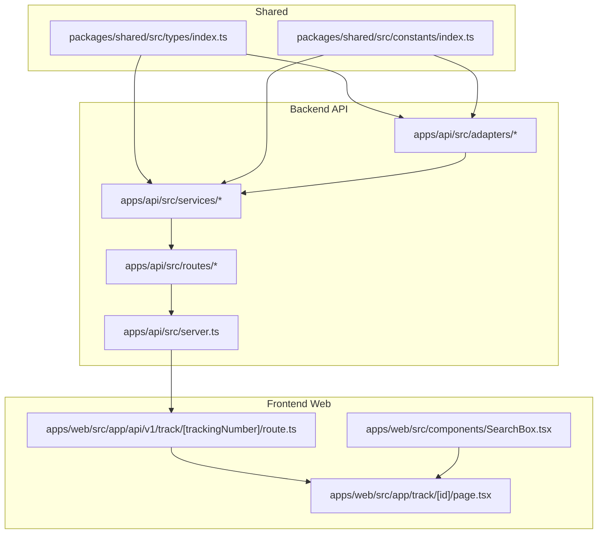
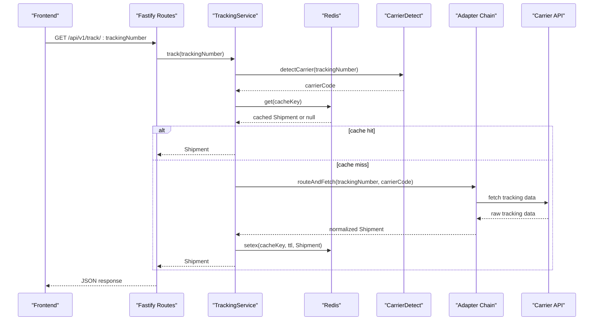
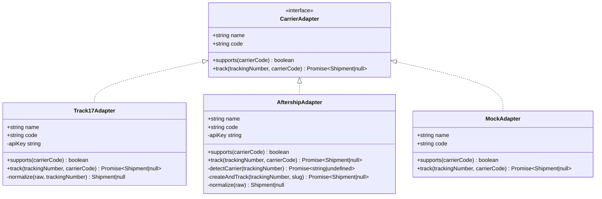
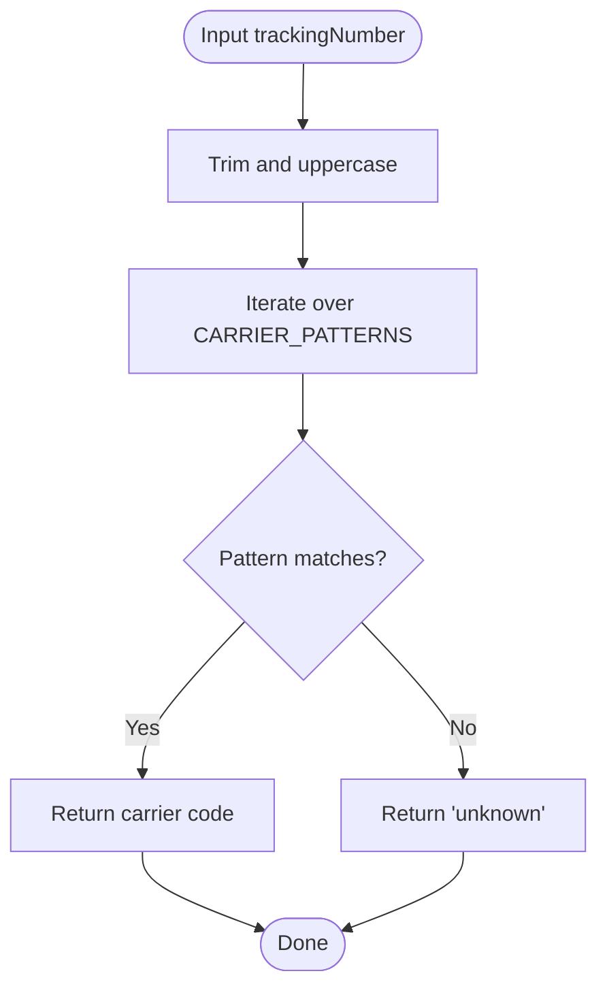
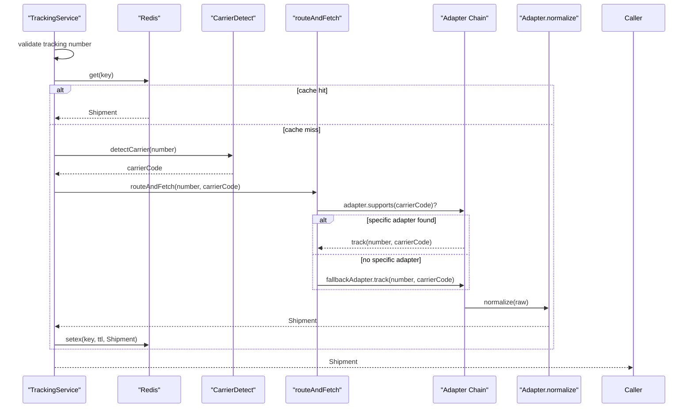
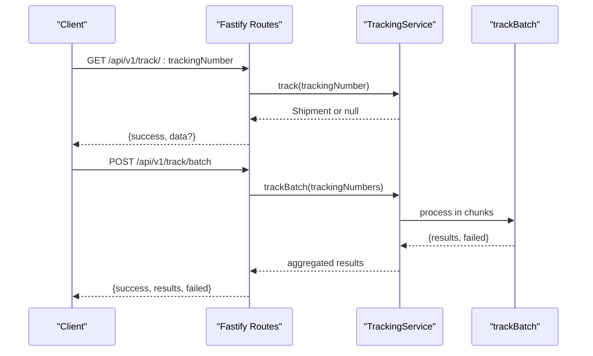
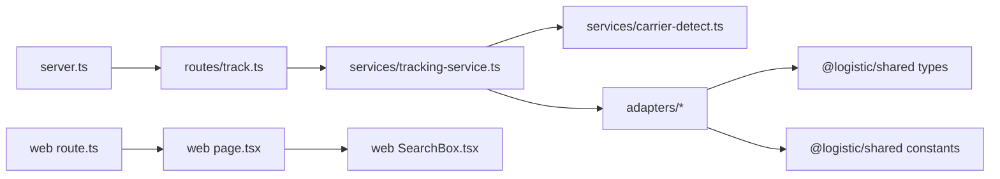

# Carrier Integration System

<cite>
**Referenced Files in This Document**
- [base-adapter.ts](file://apps/api/src/adapters/base-adapter.ts)
- [17track-adapter.ts](file://apps/api/src/adapters/17track-adapter.ts)
- [aftership-adapter.ts](file://apps/api/src/adapters/aftership-adapter.ts)
- [mock-adapter.ts](file://apps/api/src/adapters/mock-adapter.ts)
- [carrier-detect.ts](file://apps/api/src/services/carrier-detect.ts)
- [tracking-service.ts](file://apps/api/src/services/tracking-service.ts)
- [track.ts](file://apps/api/src/routes/track.ts)
- [server.ts](file://apps/api/src/server.ts)
- [index.ts](file://packages/shared/src/types/index.ts)
- [constants.ts](file://packages/shared/src/constants/index.ts)
- [package.json](file://apps/api/package.json)
- [route.ts](file://apps/web/src/app/api/v1/track/[trackingNumber]/route.ts)
- [SearchBox.tsx](file://apps/web/src/components/SearchBox.tsx)
- [page.tsx](file://apps/web/src/app/track/[id]/page.tsx)
</cite>

## Table of Contents
1. [Introduction](#introduction)
2. [Project Structure](#project-structure)
3. [Core Components](#core-components)
4. [Architecture Overview](#architecture-overview)
5. [Detailed Component Analysis](#detailed-component-analysis)
6. [Dependency Analysis](#dependency-analysis)
7. [Performance Considerations](#performance-considerations)
8. [Troubleshooting Guide](#troubleshooting-guide)
9. [Conclusion](#conclusion)
10. [Appendices](#appendices)

## Introduction
This document explains the carrier integration system that provides unified tracking across multiple shipping providers. It implements the Adapter pattern to normalize diverse carrier APIs into a single, consistent response model. The system includes:
- An adapter interface and concrete implementations for 17track, AfterShip, and a mock adapter
- A carrier detection service that identifies shipping providers from tracking numbers
- A tracking service orchestrating adapter selection, caching, and response normalization
- A Fastify-based API with rate limiting and Redis caching
- A Next.js frontend that consumes the API and displays tracking results

## Project Structure
The system is organized into:
- Shared types and constants used across backend and frontend
- Backend API with adapters, services, routes, and server bootstrap
- Frontend Next.js application with UI components and API integration

**Diagram sources**
- [server.ts:1-60](file://apps/api/src/server.ts#L1-L60)
- [track.ts:1-75](file://apps/api/src/routes/track.ts#L1-L75)
- [tracking-service.ts:1-128](file://apps/api/src/services/tracking-service.ts#L1-L128)
- [base-adapter.ts:1-39](file://apps/api/src/adapters/base-adapter.ts#L1-L39)
- [constants.ts:1-103](file://packages/shared/src/constants/index.ts#L1-L103)
- [index.ts:1-101](file://packages/shared/src/types/index.ts#L1-L101)

**Section sources**
- [server.ts:1-60](file://apps/api/src/server.ts#L1-L60)
- [track.ts:1-75](file://apps/api/src/routes/track.ts#L1-L75)
- [tracking-service.ts:1-128](file://apps/api/src/services/tracking-service.ts#L1-L128)
- [base-adapter.ts:1-39](file://apps/api/src/adapters/base-adapter.ts#L1-L39)
- [constants.ts:1-103](file://packages/shared/src/constants/index.ts#L1-L103)
- [index.ts:1-101](file://packages/shared/src/types/index.ts#L1-L101)

## Core Components
- BaseAdapter interface: Defines the contract for all carrier adapters, including identification, capability checks, and tracking methods.
- Concrete adapters:
  - 17track adapter: Specialized for China-origin carriers with customs detection and normalized status mapping.
  - AfterShip adapter: Universal fallback supporting hundreds of carriers with automatic carrier detection and creation of tracking entries.
  - Mock adapter: Development/testing adapter returning synthetic data.
- Carrier detection service: Identifies carrier codes from tracking number patterns.
- Tracking service: Orchestrates adapter selection, caching, and response normalization.
- API routes: Expose single and batch tracking endpoints with validation and rate limiting.
- Frontend integration: Provides user input, displays results, and consumes the backend API.

**Section sources**
- [base-adapter.ts:1-39](file://apps/api/src/adapters/base-adapter.ts#L1-L39)
- [17track-adapter.ts:1-118](file://apps/api/src/adapters/17track-adapter.ts#L1-L118)
- [aftership-adapter.ts:1-151](file://apps/api/src/adapters/aftership-adapter.ts#L1-L151)
- [mock-adapter.ts:1-74](file://apps/api/src/adapters/mock-adapter.ts#L1-L74)
- [carrier-detect.ts:1-27](file://apps/api/src/services/carrier-detect.ts#L1-L27)
- [tracking-service.ts:1-128](file://apps/api/src/services/tracking-service.ts#L1-L128)
- [track.ts:1-75](file://apps/api/src/routes/track.ts#L1-L75)

## Architecture Overview
The system follows a layered architecture:
- Presentation layer: Next.js frontend components and API routes
- Application layer: Fastify routes and tracking service
- Domain layer: Adapters implementing the CarrierAdapter interface
- Infrastructure layer: Redis caching and external carrier APIs

**Diagram sources**
- [track.ts:8-35](file://apps/api/src/routes/track.ts#L8-L35)
- [tracking-service.ts:40-62](file://apps/api/src/services/tracking-service.ts#L40-L62)
- [tracking-service.ts:93-105](file://apps/api/src/services/tracking-service.ts#L93-L105)
- [carrier-detect.ts:7-17](file://apps/api/src/services/carrier-detect.ts#L7-L17)
- [tracking-service.ts:107-126](file://apps/api/src/services/tracking-service.ts#L107-L126)

## Detailed Component Analysis

### Adapter Pattern Implementation
The system defines a common interface for all carrier adapters and implements it with specialized adapters.

**Diagram sources**
- [base-adapter.ts:4-18](file://apps/api/src/adapters/base-adapter.ts#L4-L18)
- [17track-adapter.ts:21-118](file://apps/api/src/adapters/17track-adapter.ts#L21-L118)
- [aftership-adapter.ts:23-151](file://apps/api/src/adapters/aftership-adapter.ts#L23-L151)
- [mock-adapter.ts:7-74](file://apps/api/src/adapters/mock-adapter.ts#L7-L74)

#### 17track Adapter
- Purpose: Specialized adapter for China-origin carriers with robust status mapping and customs detection.
- Key features:
  - Supports a curated list of Chinese carriers and registered postal services.
  - Maps 17track-specific status codes to standardized TrackingStatus.
  - Detects customs-related events using localized keywords.
  - Normalizes raw API responses into the shared Shipment model.

**Section sources**
- [17track-adapter.ts:21-118](file://apps/api/src/adapters/17track-adapter.ts#L21-L118)
- [base-adapter.ts:21-38](file://apps/api/src/adapters/base-adapter.ts#L21-L38)

#### AfterShip Adapter
- Purpose: Universal fallback adapter supporting hundreds of carriers.
- Key features:
  - Automatically detects carrier slugs when not provided.
  - Creates tracking entries if not found (idempotent).
  - Maps AfterShip status tags to standardized TrackingStatus.
  - Normalizes locations and timestamps.

**Section sources**
- [aftership-adapter.ts:23-151](file://apps/api/src/adapters/aftership-adapter.ts#L23-L151)
- [base-adapter.ts:21-38](file://apps/api/src/adapters/base-adapter.ts#L21-L38)

#### Mock Adapter
- Purpose: Development and testing adapter that returns synthetic tracking data.
- Key features:
  - Always supports any carrier code.
  - Simulates realistic events across origin, transit, and destination stages.
  - Useful for UI testing and integration verification.

**Section sources**
- [mock-adapter.ts:7-74](file://apps/api/src/adapters/mock-adapter.ts#L7-L74)
- [base-adapter.ts:21-38](file://apps/api/src/adapters/base-adapter.ts#L21-L38)

### Carrier Detection Service
- Purpose: Identify carrier codes from tracking number patterns.
- Implementation:
  - Uses predefined regular expressions to match known carrier formats.
  - Returns a carrier code or 'unknown' if no pattern matches.
  - Validates basic format constraints for tracking numbers.

**Diagram sources**
- [carrier-detect.ts:7-17](file://apps/api/src/services/carrier-detect.ts#L7-L17)
- [constants.ts:60-75](file://packages/shared/src/constants/index.ts#L60-L75)

**Section sources**
- [carrier-detect.ts:1-27](file://apps/api/src/services/carrier-detect.ts#L1-L27)
- [constants.ts:60-75](file://packages/shared/src/constants/index.ts#L60-L75)

### Tracking Service Orchestration
- Purpose: Coordinate adapter selection, caching, and response normalization.
- Workflow:
  1. Validate tracking number format.
  2. Attempt to load from cache.
  3. Detect carrier code from tracking number.
  4. Route to the best adapter (specific first, then fallback).
  5. Cache normalized result with TTL based on current status.

**Diagram sources**
- [tracking-service.ts:40-62](file://apps/api/src/services/tracking-service.ts#L40-L62)
- [tracking-service.ts:93-105](file://apps/api/src/services/tracking-service.ts#L93-L105)
- [tracking-service.ts:107-126](file://apps/api/src/services/tracking-service.ts#L107-L126)

**Section sources**
- [tracking-service.ts:1-128](file://apps/api/src/services/tracking-service.ts#L1-L128)

### API Integration Workflow
- Single tracking endpoint:
  - Validates input length.
  - Delegates to TrackingService.
  - Returns success or error response.
- Batch tracking endpoint:
  - Validates array input and size limits.
  - Processes requests in batches with concurrency control.
  - Aggregates successful results and failures.

**Diagram sources**
- [track.ts:8-35](file://apps/api/src/routes/track.ts#L8-L35)
- [track.ts:37-64](file://apps/api/src/routes/track.ts#L37-L64)
- [tracking-service.ts:64-91](file://apps/api/src/services/tracking-service.ts#L64-L91)

**Section sources**
- [track.ts:1-75](file://apps/api/src/routes/track.ts#L1-L75)
- [tracking-service.ts:64-91](file://apps/api/src/services/tracking-service.ts#L64-L91)

### Frontend Integration
- SearchBox component collects tracking numbers and navigates to the result page.
- TrackResultPage fetches data from the backend API and renders a timeline and summary.
- The Next.js route under apps/web provides a fallback mock implementation for development.

**Section sources**
- [SearchBox.tsx:1-123](file://apps/web/src/components/SearchBox.tsx#L1-L123)
- [page.tsx:1-263](file://apps/web/src/app/track/[id]/page.tsx#L1-L263)
- [route.ts:187-223](file://apps/web/src/app/api/v1/track/[trackingNumber]/route.ts#L187-L223)

## Dependency Analysis
- Backend dependencies:
  - Fastify for HTTP server and routing
  - @fastify/cors and @fastify/rate-limit for middleware
  - ioredis for optional caching
  - dotenv for environment configuration
- Shared dependencies:
  - Types and constants define the canonical data model and carrier patterns
- Frontend dependencies:
  - Next.js for SSR/SSG and routing
  - React components for UI rendering

**Diagram sources**
- [server.ts:1-60](file://apps/api/src/server.ts#L1-L60)
- [track.ts:1-75](file://apps/api/src/routes/track.ts#L1-L75)
- [tracking-service.ts:1-128](file://apps/api/src/services/tracking-service.ts#L1-L128)
- [carrier-detect.ts:1-27](file://apps/api/src/services/carrier-detect.ts#L1-L27)
- [package.json:13-25](file://apps/api/package.json#L13-L25)

**Section sources**
- [package.json:13-25](file://apps/api/package.json#L13-L25)
- [server.ts:1-60](file://apps/api/src/server.ts#L1-L60)

## Performance Considerations
- Caching:
  - Redis cache stores normalized Shipment objects with TTLs tailored to status changes.
  - TTLs reduce unnecessary API calls and improve response times.
- Concurrency:
  - Batch processing uses controlled concurrency to balance throughput and resource usage.
- Rate limiting:
  - Global rate limit prevents abuse and protects downstream APIs.
- Adapter prioritization:
  - Specific adapters are tried first to minimize retries and leverage provider-specific optimizations.

[No sources needed since this section provides general guidance]

## Troubleshooting Guide
- Validation errors:
  - Single tracking endpoint rejects short or missing tracking numbers.
  - Batch endpoint validates array presence and size limits.
- Adapter failures:
  - If no adapter returns a result, the service returns null/404.
  - Ensure environment variables for API keys are configured to enable real adapters.
- Cache issues:
  - Redis errors are handled gracefully; the system continues without cache.
- Frontend fallback:
  - The Next.js route provides a mock implementation for local development.

**Section sources**
- [track.ts:14-28](file://apps/api/src/routes/track.ts#L14-L28)
- [track.ts:43-55](file://apps/api/src/routes/track.ts#L43-L55)
- [tracking-service.ts:107-126](file://apps/api/src/services/tracking-service.ts#L107-L126)
- [server.ts:25-46](file://apps/api/src/server.ts#L25-L46)
- [route.ts:193-198](file://apps/web/src/app/api/v1/track/[trackingNumber]/route.ts#L193-L198)

## Conclusion
The carrier integration system provides a robust, extensible framework for unified tracking across multiple providers. By leveraging the Adapter pattern, the system cleanly separates provider-specific logic while delivering a consistent response model. Features like carrier detection, intelligent adapter routing, caching, and rate limiting ensure scalability and reliability. The modular design facilitates adding new carrier integrations with minimal impact.

[No sources needed since this section summarizes without analyzing specific files]

## Appendices

### Adapter Configuration and Environment Variables
- Configure API keys via environment variables to enable specific adapters:
  - TRACK17_API_KEY: Enables 17track adapter
  - AFTERSHIP_API_KEY: Enables AfterShip adapter
- Redis URL enables caching:
  - REDIS_URL: Optional; if absent, the system runs without cache

**Section sources**
- [tracking-service.ts:15-38](file://apps/api/src/services/tracking-service.ts#L15-L38)
- [server.ts:27-46](file://apps/api/src/server.ts#L27-L46)

### Extensibility Patterns for New Carriers
- Implement a new adapter:
  - Create a class implementing CarrierAdapter
  - Add support logic for carrier codes
  - Implement track() and normalize() methods
  - Integrate into TrackingService adapter chain
- Update carrier detection:
  - Extend CARRIER_PATTERNS with new tracking number patterns
- Update shared types if needed:
  - Add new DataSource values if integrating a new provider

**Section sources**
- [base-adapter.ts:4-18](file://apps/api/src/adapters/base-adapter.ts#L4-L18)
- [constants.ts:60-75](file://packages/shared/src/constants/index.ts#L60-L75)
- [tracking-service.ts:15-38](file://apps/api/src/services/tracking-service.ts#L15-L38)

### Response Normalization Across Providers
- Standardized data model:
  - Shipment includes trackingNumber, carrierCode, origin, destination, currentStatus, events, metadata, and timestamps
- Status mapping:
  - Provider-specific statuses are mapped to a unified TrackingStatus enum
- Location normalization:
  - Locations are represented consistently with city, country, and countryCode fields
- Confidence and metadata:
  - Each Shipment includes metadata indicating data source, lastSynced timestamp, and confidence score

**Section sources**
- [index.ts:48-67](file://packages/shared/src/types/index.ts#L48-L67)
- [17track-adapter.ts:63-116](file://apps/api/src/adapters/17track-adapter.ts#L63-L116)
- [aftership-adapter.ts:106-149](file://apps/api/src/adapters/aftership-adapter.ts#L106-L149)
- [mock-adapter.ts:22-72](file://apps/api/src/adapters/mock-adapter.ts#L22-L72)