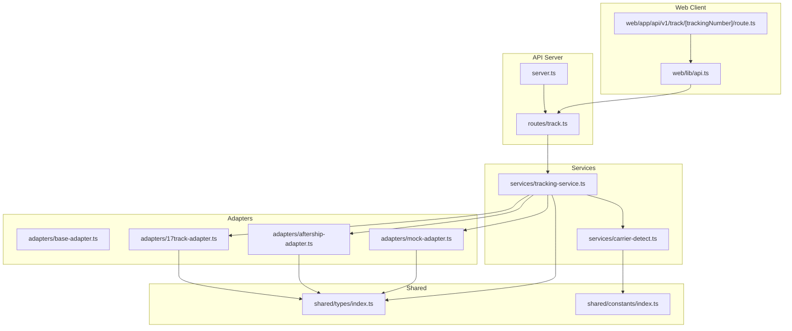
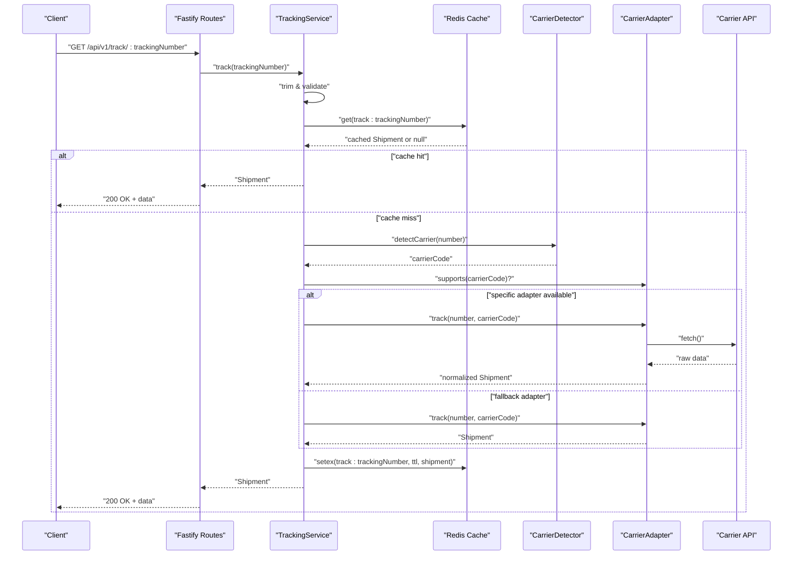
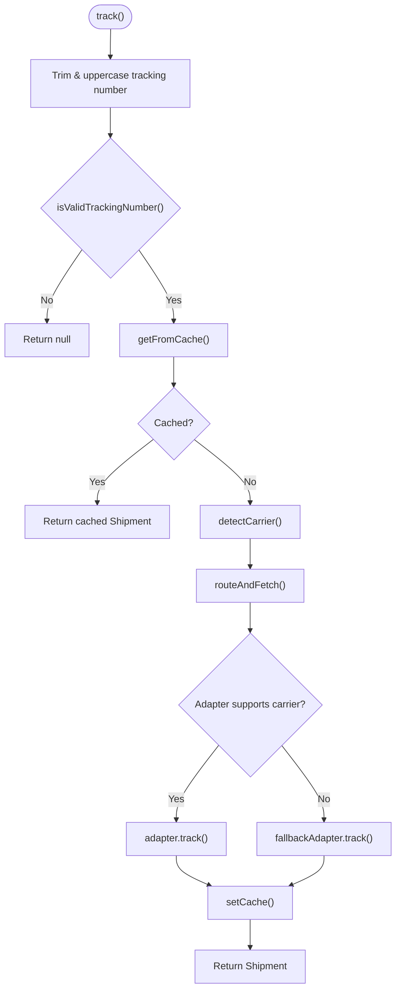
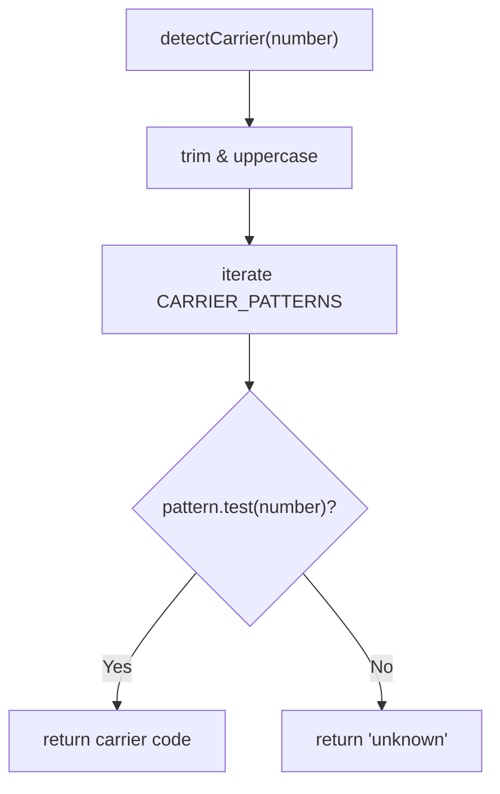
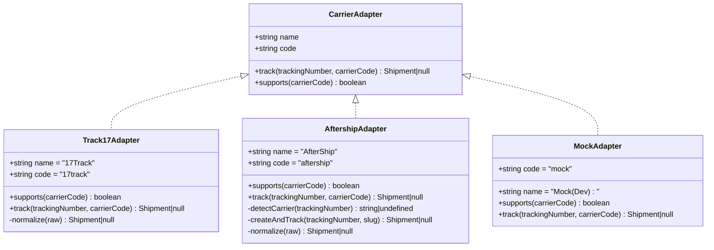
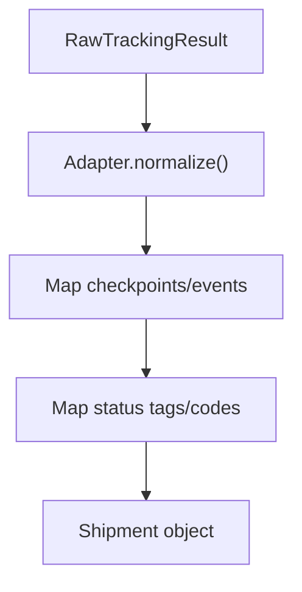
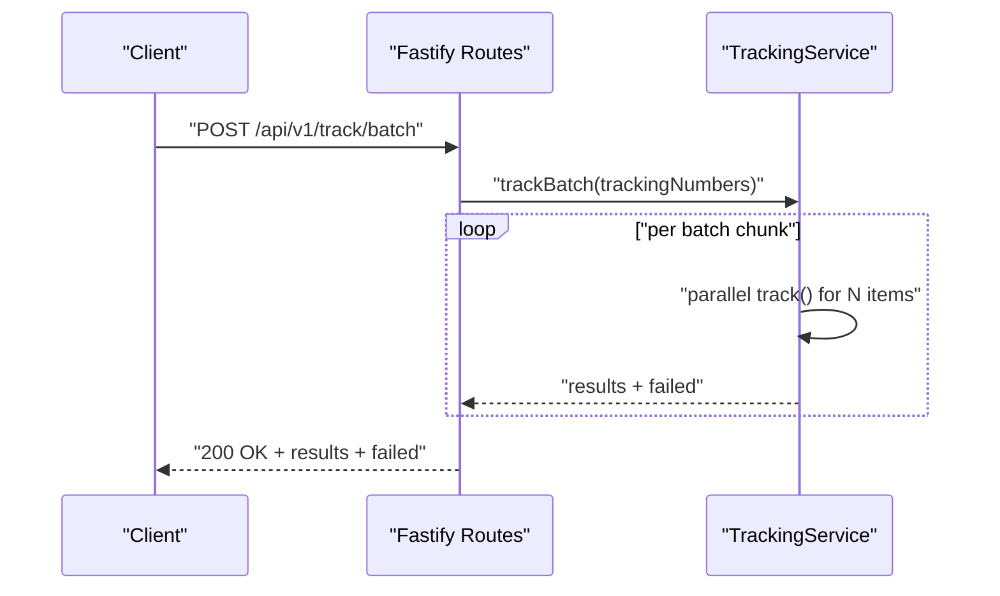
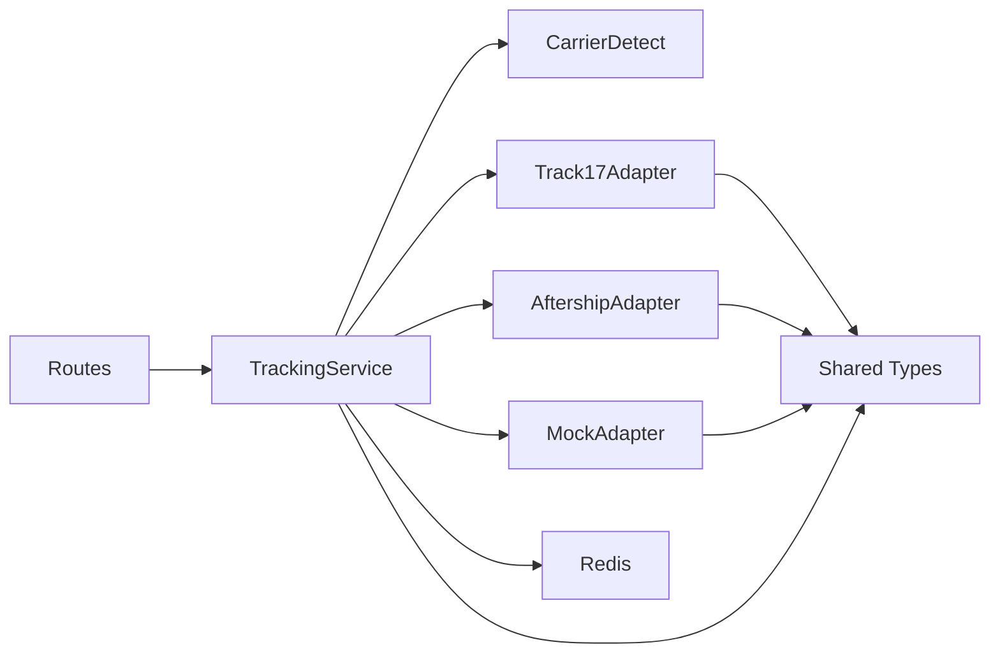

# Integration Workflow and Orchestration

<cite>
**Referenced Files in This Document**
- [server.ts](file://apps/api/src/server.ts)
- [track.ts](file://apps/api/src/routes/track.ts)
- [tracking-service.ts](file://apps/api/src/services/tracking-service.ts)
- [carrier-detect.ts](file://apps/api/src/services/carrier-detect.ts)
- [base-adapter.ts](file://apps/api/src/adapters/base-adapter.ts)
- [17track-adapter.ts](file://apps/api/src/adapters/17track-adapter.ts)
- [aftership-adapter.ts](file://apps/api/src/adapters/aftership-adapter.ts)
- [mock-adapter.ts](file://apps/api/src/adapters/mock-adapter.ts)
- [index.ts](file://packages/shared/src/types/index.ts)
- [index.ts](file://packages/shared/src/constants/index.ts)
- [route.ts](file://apps/web/src/app/api/v1/track/[trackingNumber]/route.ts)
- [api.ts](file://apps/web/src/lib/api.ts)
</cite>

## Table of Contents
1. [Introduction](#introduction)
2. [Project Structure](#project-structure)
3. [Core Components](#core-components)
4. [Architecture Overview](#architecture-overview)
5. [Detailed Component Analysis](#detailed-component-analysis)
6. [Dependency Analysis](#dependency-analysis)
7. [Performance Considerations](#performance-considerations)
8. [Troubleshooting Guide](#troubleshooting-guide)
9. [Conclusion](#conclusion)
10. [Appendices](#appendices)

## Introduction
This document explains the complete integration workflow from a tracking number input to a normalized Shipment response. It covers how the tracking service orchestrates carrier detection, adapter selection, external API calls, and response normalization. It also documents decision logic for choosing adapters, error handling strategies, caching, and batch processing. Finally, it clarifies how raw carrier responses are transformed into the standardized Shipment object returned to clients.

## Project Structure
The system is organized into:
- API server with Fastify and route registration
- Tracking service orchestrating the workflow
- Carrier detection utilities
- Adapter implementations for external carriers
- Shared types and constants
- Web client integration

**Diagram sources**
- [server.ts:13-54](file://apps/api/src/server.ts#L13-L54)
- [track.ts:5-74](file://apps/api/src/routes/track.ts#L5-L74)
- [tracking-service.ts:10-38](file://apps/api/src/services/tracking-service.ts#L10-L38)
- [carrier-detect.ts:7-26](file://apps/api/src/services/carrier-detect.ts#L7-L26)
- [base-adapter.ts:4-39](file://apps/api/src/adapters/base-adapter.ts#L4-L39)
- [17track-adapter.ts:21-61](file://apps/api/src/adapters/17track-adapter.ts#L21-L61)
- [aftership-adapter.ts:23-64](file://apps/api/src/adapters/aftership-adapter.ts#L23-L64)
- [mock-adapter.ts:7-73](file://apps/api/src/adapters/mock-adapter.ts#L7-73)
- [index.ts:1-101](file://packages/shared/src/types/index.ts#L1-L101)
- [index.ts:1-103](file://packages/shared/src/constants/index.ts#L1-L103)
- [route.ts:187-222](file://apps/web/src/app/api/v1/track/[trackingNumber]/route.ts#L187-L222)
- [api.ts:5-55](file://apps/web/src/lib/api.ts#L5-L55)

**Section sources**
- [server.ts:13-54](file://apps/api/src/server.ts#L13-L54)
- [track.ts:5-74](file://apps/api/src/routes/track.ts#L5-L74)
- [tracking-service.ts:10-38](file://apps/api/src/services/tracking-service.ts#L10-L38)
- [carrier-detect.ts:7-26](file://apps/api/src/services/carrier-detect.ts#L7-L26)
- [base-adapter.ts:4-39](file://apps/api/src/adapters/base-adapter.ts#L4-L39)
- [17track-adapter.ts:21-61](file://apps/api/src/adapters/17track-adapter.ts#L21-L61)
- [aftership-adapter.ts:23-64](file://apps/api/src/adapters/aftership-adapter.ts#L23-L64)
- [mock-adapter.ts:7-73](file://apps/api/src/adapters/mock-adapter.ts#L7-73)
- [index.ts:1-101](file://packages/shared/src/types/index.ts#L1-L101)
- [index.ts:1-103](file://packages/shared/src/constants/index.ts#L1-L103)
- [route.ts:187-222](file://apps/web/src/app/api/v1/track/[trackingNumber]/route.ts#L187-L222)
- [api.ts:5-55](file://apps/web/src/lib/api.ts#L5-L55)

## Core Components
- TrackingService: Orchestrates the entire workflow, including cache, carrier detection, adapter routing, and batching.
- Carrier detection: Determines carrier code from tracking number patterns.
- Adapters: Implement CarrierAdapter interface to call external APIs and normalize responses to Shipment.
- Shared types and constants: Define Shipment, TrackingStatus, and carrier patterns.

Key responsibilities:
- Input validation and sanitization
- Cache-first strategy with TTL per status
- Adapter selection prioritizing carrier-specific adapters, falling back to universal adapter
- Batch processing with concurrency limits
- Graceful degradation when Redis or adapters are unavailable

**Section sources**
- [tracking-service.ts:40-127](file://apps/api/src/services/tracking-service.ts#L40-L127)
- [carrier-detect.ts:7-26](file://apps/api/src/services/carrier-detect.ts#L7-L26)
- [base-adapter.ts:4-39](file://apps/api/src/adapters/base-adapter.ts#L4-L39)
- [index.ts:1-101](file://packages/shared/src/types/index.ts#L1-L101)

## Architecture Overview
The system follows a layered architecture:
- HTTP layer: Fastify routes expose tracking endpoints.
- Service layer: TrackingService encapsulates business logic.
- Adapter layer: Pluggable adapters for different carriers.
- Data layer: Redis cache and external carrier APIs.

**Diagram sources**
- [track.ts:9-35](file://apps/api/src/routes/track.ts#L9-L35)
- [tracking-service.ts:40-62](file://apps/api/src/services/tracking-service.ts#L40-L62)
- [tracking-service.ts:93-105](file://apps/api/src/services/tracking-service.ts#L93-L105)
- [carrier-detect.ts:7-17](file://apps/api/src/services/carrier-detect.ts#L7-L17)
- [17track-adapter.ts:40-61](file://apps/api/src/adapters/17track-adapter.ts#L40-L61)
- [aftership-adapter.ts:37-64](file://apps/api/src/adapters/aftership-adapter.ts#L37-L64)
- [mock-adapter.ts:15-73](file://apps/api/src/adapters/mock-adapter.ts#L15-L73)

## Detailed Component Analysis

### TrackingService Orchestration
Responsibilities:
- Initialize adapters based on environment variables (17Track, AfterShip, or Mock fallback)
- Validate input and sanitize tracking number
- Cache-first retrieval with TTL per status
- Carrier detection and adapter routing
- Batch processing with concurrency control
- Non-fatal cache write failures

Adapter selection logic:
- Try adapters that explicitly support the detected carrier code
- Fall back to the last configured adapter (universal fallback)

**Diagram sources**
- [tracking-service.ts:40-62](file://apps/api/src/services/tracking-service.ts#L40-L62)
- [tracking-service.ts:93-105](file://apps/api/src/services/tracking-service.ts#L93-L105)
- [carrier-detect.ts:7-17](file://apps/api/src/services/carrier-detect.ts#L7-L17)
- [tracking-service.ts:107-126](file://apps/api/src/services/tracking-service.ts#L107-L126)

**Section sources**
- [tracking-service.ts:15-38](file://apps/api/src/services/tracking-service.ts#L15-L38)
- [tracking-service.ts:40-62](file://apps/api/src/services/tracking-service.ts#L40-L62)
- [tracking-service.ts:64-91](file://apps/api/src/services/tracking-service.ts#L64-L91)
- [tracking-service.ts:93-105](file://apps/api/src/services/tracking-service.ts#L93-L105)
- [tracking-service.ts:107-126](file://apps/api/src/services/tracking-service.ts#L107-L126)

### Carrier Detection
- Uses shared CARRIER_PATTERNS to match tracking number formats to carrier codes
- Returns 'unknown' if no pattern matches
- Validates basic format length and alphanumeric constraints

**Diagram sources**
- [carrier-detect.ts:7-17](file://apps/api/src/services/carrier-detect.ts#L7-L17)
- [index.ts:59-75](file://packages/shared/src/constants/index.ts#L59-L75)

**Section sources**
- [carrier-detect.ts:7-26](file://apps/api/src/services/carrier-detect.ts#L7-L26)
- [index.ts:59-75](file://packages/shared/src/constants/index.ts#L59-L75)

### Adapter Layer
Interfaces and responsibilities:
- CarrierAdapter: track() and supports() methods
- RawTrackingResult/RawTrackingEvent: intermediate normalized form before Shipment mapping

Adapter implementations:
- Track17Adapter: Strong coverage for China-origin carriers; maps 17Track status codes to standard statuses; detects customs events
- AftershipAdapter: Universal fallback supporting many carriers; auto-detects carrier when missing; creates tracking if not found
- MockAdapter: Development/testing adapter returning synthetic data

**Diagram sources**
- [base-adapter.ts:4-39](file://apps/api/src/adapters/base-adapter.ts#L4-L39)
- [17track-adapter.ts:21-61](file://apps/api/src/adapters/17track-adapter.ts#L21-L61)
- [aftership-adapter.ts:23-64](file://apps/api/src/adapters/aftership-adapter.ts#L23-L64)
- [mock-adapter.ts:7-73](file://apps/api/src/adapters/mock-adapter.ts#L7-73)

**Section sources**
- [base-adapter.ts:4-39](file://apps/api/src/adapters/base-adapter.ts#L4-L39)
- [17track-adapter.ts:21-61](file://apps/api/src/adapters/17track-adapter.ts#L21-L61)
- [aftership-adapter.ts:23-64](file://apps/api/src/adapters/aftership-adapter.ts#L23-L64)
- [mock-adapter.ts:7-73](file://apps/api/src/adapters/mock-adapter.ts#L7-73)

### Response Normalization to Shipment
- Each adapter normalizes its raw response into a standardized Shipment object
- Fields include trackingNumber, carrierCode/name, origin/destination, currentStatus, events, metadata, timestamps
- Status mapping ensures cross-carrier consistency using TrackingStatus enum

**Diagram sources**
- [base-adapter.ts:20-39](file://apps/api/src/adapters/base-adapter.ts#L20-L39)
- [17track-adapter.ts:63-116](file://apps/api/src/adapters/17track-adapter.ts#L63-L116)
- [aftership-adapter.ts:106-149](file://apps/api/src/adapters/aftership-adapter.ts#L106-L149)

**Section sources**
- [base-adapter.ts:20-39](file://apps/api/src/adapters/base-adapter.ts#L20-L39)
- [17track-adapter.ts:63-116](file://apps/api/src/adapters/17track-adapter.ts#L63-L116)
- [aftership-adapter.ts:106-149](file://apps/api/src/adapters/aftership-adapter.ts#L106-L149)
- [index.ts:48-67](file://packages/shared/src/types/index.ts#L48-L67)

### Batch Processing
- Parallel processing with a fixed concurrency window
- Aggregates successful results and collects failures with reasons
- Limits batch size to prevent overload

**Diagram sources**
- [track.ts:37-63](file://apps/api/src/routes/track.ts#L37-L63)
- [tracking-service.ts:64-91](file://apps/api/src/services/tracking-service.ts#L64-L91)

**Section sources**
- [tracking-service.ts:64-91](file://apps/api/src/services/tracking-service.ts#L64-L91)
- [track.ts:37-63](file://apps/api/src/routes/track.ts#L37-L63)

### Frontend Integration
- Web app routes call the backend API endpoints
- Provides mock scenarios for demo purposes when backend is unavailable
- Uses shared types for type-safe handling

**Section sources**
- [route.ts:187-222](file://apps/web/src/app/api/v1/track/[trackingNumber]/route.ts#L187-L222)
- [api.ts:5-55](file://apps/web/src/lib/api.ts#L5-L55)

## Dependency Analysis
- TrackingService depends on:
  - Redis client for caching
  - Carrier detection module
  - Adapter implementations
- Adapters depend on:
  - Shared types for Shipment and TrackingStatus
  - External carrier APIs
- Routes depend on:
  - TrackingService
  - Environment configuration for Redis and API keys

**Diagram sources**
- [tracking-service.ts:10-38](file://apps/api/src/services/tracking-service.ts#L10-L38)
- [tracking-service.ts:40-62](file://apps/api/src/services/tracking-service.ts#L40-L62)
- [17track-adapter.ts:21-61](file://apps/api/src/adapters/17track-adapter.ts#L21-L61)
- [aftership-adapter.ts:23-64](file://apps/api/src/adapters/aftership-adapter.ts#L23-L64)
- [mock-adapter.ts:7-73](file://apps/api/src/adapters/mock-adapter.ts#L7-73)
- [index.ts:1-101](file://packages/shared/src/types/index.ts#L1-L101)

**Section sources**
- [tracking-service.ts:10-38](file://apps/api/src/services/tracking-service.ts#L10-L38)
- [tracking-service.ts:40-62](file://apps/api/src/services/tracking-service.ts#L40-L62)
- [17track-adapter.ts:21-61](file://apps/api/src/adapters/17track-adapter.ts#L21-L61)
- [aftership-adapter.ts:23-64](file://apps/api/src/adapters/aftership-adapter.ts#L23-L64)
- [mock-adapter.ts:7-73](file://apps/api/src/adapters/mock-adapter.ts#L7-73)
- [index.ts:1-101](file://packages/shared/src/types/index.ts#L1-L101)

## Performance Considerations
- Caching:
  - Cache key: "track:{trackingNumber}"
  - TTL varies by status to balance freshness and cost
  - Cache writes are non-fatal to avoid blocking requests
- Concurrency:
  - Batch processing uses a fixed concurrency window to prevent overload
- Adapter prioritization:
  - Prefer carrier-specific adapters for better accuracy and fewer retries
- Redis resilience:
  - Graceful degradation when Redis is unavailable
  - Configured retry strategy and ping to verify connectivity

**Section sources**
- [tracking-service.ts:107-126](file://apps/api/src/services/tracking-service.ts#L107-L126)
- [tracking-service.ts:64-91](file://apps/api/src/services/tracking-service.ts#L64-L91)
- [server.ts:25-46](file://apps/api/src/server.ts#L25-L46)
- [index.ts:31-43](file://packages/shared/src/constants/index.ts#L31-L43)

## Troubleshooting Guide
Common issues and handling:
- Invalid tracking number:
  - Validation fails early; service returns null
- Tracking not found:
  - Adapters return null; service returns null
  - AfterShip fallback attempts creation if applicable
- Network errors:
  - Adapters wrap fetch calls; return null on exceptions
  - Cache write failures are ignored to keep request flow smooth
- Redis unavailability:
  - Service continues without cache; logs warnings
- Rate limiting:
  - Fastify rate limit middleware protects the API

Operational checks:
- Verify environment variables for API keys
- Confirm Redis connectivity and configuration
- Review adapter support for the detected carrier code

**Section sources**
- [tracking-service.ts:43-45](file://apps/api/src/services/tracking-service.ts#L43-L45)
- [tracking-service.ts:56](file://apps/api/src/services/tracking-service.ts#L56)
- [aftership-adapter.ts:52-57](file://apps/api/src/adapters/aftership-adapter.ts#L52-L57)
- [aftership-adapter.ts:84-104](file://apps/api/src/adapters/aftership-adapter.ts#L84-L104)
- [17track-adapter.ts:58-61](file://apps/api/src/adapters/17track-adapter.ts#L58-L61)
- [aftership-adapter.ts:61-64](file://apps/api/src/adapters/aftership-adapter.ts#L61-L64)
- [server.ts:34-46](file://apps/api/src/server.ts#L34-L46)
- [track.ts:14-28](file://apps/api/src/routes/track.ts#L14-L28)

## Conclusion
The integration workflow is designed for reliability and scalability:
- A robust cache-first strategy reduces external API load
- Intelligent adapter selection improves accuracy and reduces retries
- Graceful degradation ensures availability even under partial outages
- Batch processing and rate limiting protect system resources
- Standardized Shipment objects unify diverse carrier responses for clients

## Appendices

### API Endpoints
- GET /api/v1/track/:trackingNumber
  - Query parameters: lang (optional)
  - Response: TrackResponse with success flag and Shipment data
- POST /api/v1/track/batch
  - Body: trackingNumbers array
  - Response: BatchTrackResponse with results and failed entries
- GET /api/v1/health
  - Response: Health status and Redis connectivity

**Section sources**
- [track.ts:9-35](file://apps/api/src/routes/track.ts#L9-L35)
- [track.ts:37-63](file://apps/api/src/routes/track.ts#L37-L63)
- [track.ts:66-73](file://apps/api/src/routes/track.ts#L66-L73)