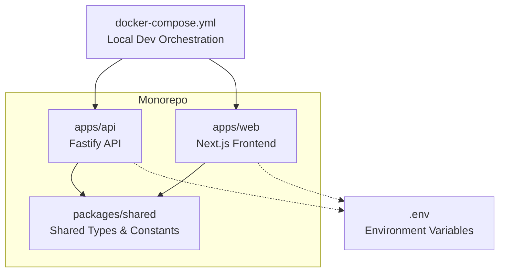
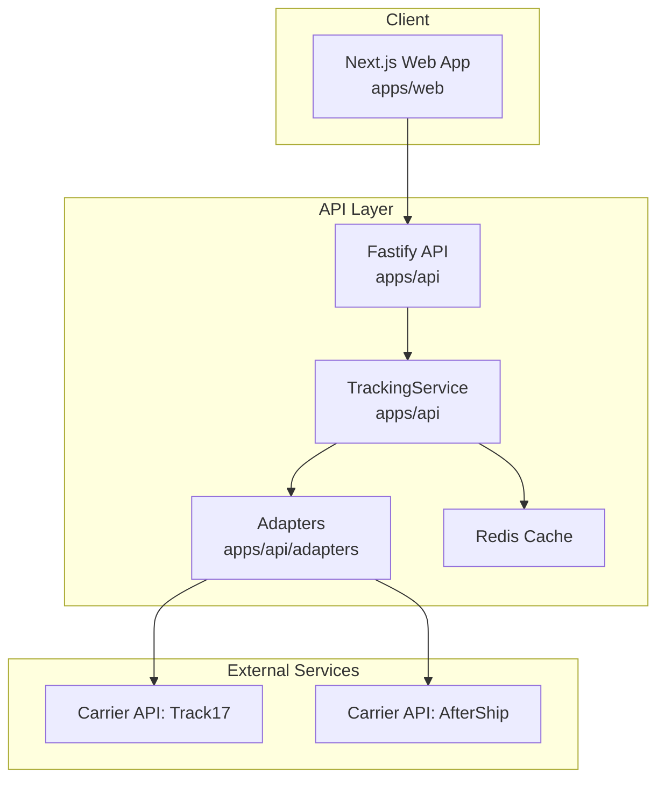
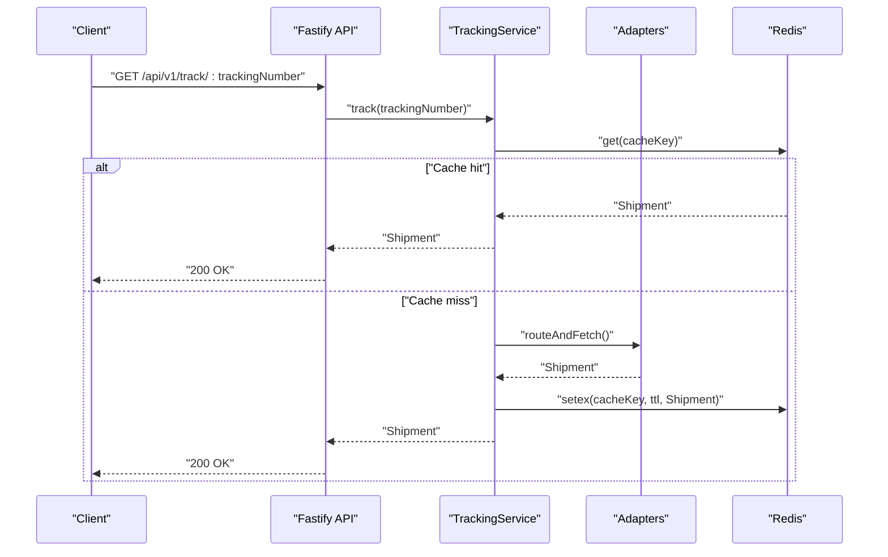
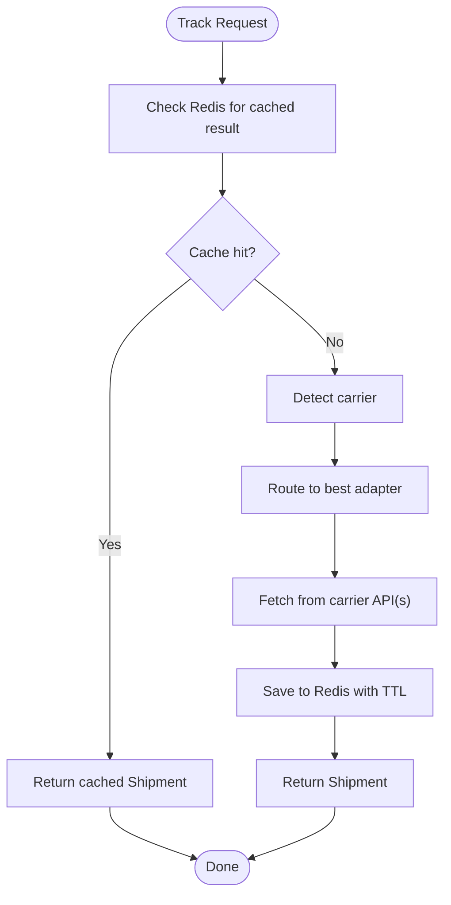
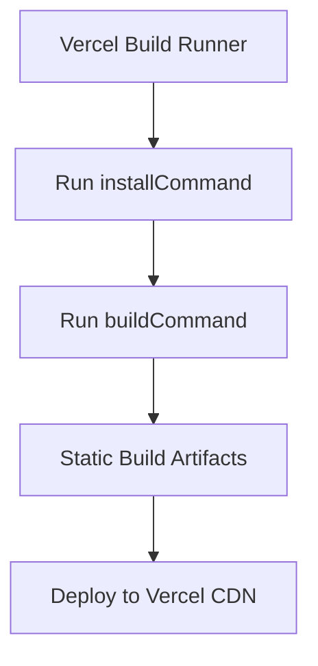
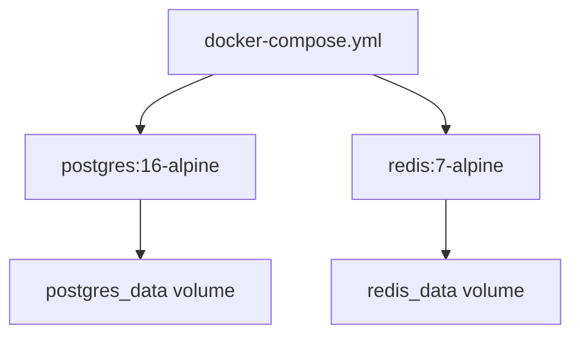
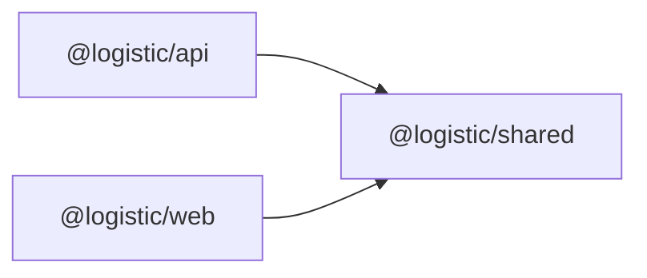

# Deployment and Operations

<cite>
**Referenced Files in This Document**
- [docker-compose.yml](file://docker-compose.yml)
- [package.json](file://package.json)
- [pnpm-workspace.yaml](file://pnpm-workspace.yaml)
- [apps/api/package.json](file://apps/api/package.json)
- [apps/api/src/server.ts](file://apps/api/src/server.ts)
- [apps/api/src/routes/track.ts](file://apps/api/src/routes/track.ts)
- [apps/api/src/services/tracking-service.ts](file://apps/api/src/services/tracking-service.ts)
- [apps/api/src/adapters/base-adapter.ts](file://apps/api/src/adapters/base-adapter.ts)
- [apps/web/package.json](file://apps/web/package.json)
- [apps/web/vercel.json](file://apps/web/vercel.json)
- [apps/web/src/app/api/v1/health/route.ts](file://apps/web/src/app/api/v1/health/route.ts)
- [packages/shared/src/constants/index.ts](file://packages/shared/src/constants/index.ts)
- [packages/shared/src/types/index.ts](file://packages/shared/src/types/index.ts)
</cite>

## Table of Contents
1. [Introduction](#introduction)
2. [Project Structure](#project-structure)
3. [Core Components](#core-components)
4. [Architecture Overview](#architecture-overview)
5. [Detailed Component Analysis](#detailed-component-analysis)
6. [Dependency Analysis](#dependency-analysis)
7. [Performance Considerations](#performance-considerations)
8. [Troubleshooting Guide](#troubleshooting-guide)
9. [Conclusion](#conclusion)
10. [Appendices](#appendices)

## Introduction
This document provides comprehensive deployment and operations guidance for the LOGISTIC platform. It covers local development and production deployment strategies, environment variable management, Redis configuration, service dependencies, Vercel deployment for the frontend, Fastify deployment strategies, container orchestration, monitoring and health checks, alerting, backup strategies, scaling considerations, maintenance procedures, security configurations, SSL/TLS setup, access control, troubleshooting, and performance optimization.

## Project Structure
The LOGISTIC platform is a monorepo managed with pnpm workspaces. It includes:
- A Fastify-based API application under apps/api
- A Next.js frontend application under apps/web
- A shared package under packages/shared containing types, constants, and internationalization resources

**Diagram sources**
- [pnpm-workspace.yaml:1-8](file://pnpm-workspace.yaml#L1-L8)
- [apps/api/package.json:1-27](file://apps/api/package.json#L1-L27)
- [apps/web/package.json:1-30](file://apps/web/package.json#L1-L30)
- [packages/shared/package.json:1-21](file://packages/shared/package.json#L1-L21)
- [docker-compose.yml:1-23](file://docker-compose.yml#L1-L23)

**Section sources**
- [pnpm-workspace.yaml:1-8](file://pnpm-workspace.yaml#L1-L8)
- [package.json:6-12](file://package.json#L6-L12)

## Core Components
- Fastify API service
  - Provides tracking endpoints and health checks
  - Integrates Redis for caching with graceful degradation
  - Uses environment variables for configuration and optional carrier API integrations
- Next.js Web application
  - Serves the frontend UI
  - Includes a basic health endpoint
- Shared package
  - Defines types, constants (including cache TTLs and tier configurations), and i18n resources
- Local orchestration
  - Docker Compose defines PostgreSQL and Redis services for local development

**Section sources**
- [apps/api/src/server.ts:13-54](file://apps/api/src/server.ts#L13-L54)
- [apps/api/src/routes/track.ts:5-74](file://apps/api/src/routes/track.ts#L5-L74)
- [apps/api/src/services/tracking-service.ts:10-38](file://apps/api/src/services/tracking-service.ts#L10-L38)
- [packages/shared/src/constants/index.ts:31-43](file://packages/shared/src/constants/index.ts#L31-L43)
- [docker-compose.yml:1-23](file://docker-compose.yml#L1-L23)

## Architecture Overview
The platform follows a client-server architecture:
- The Next.js frontend communicates with the Fastify API over HTTP
- The API integrates Redis for caching and optionally connects to external carrier APIs via adapters
- Local development uses Docker Compose to provision PostgreSQL and Redis

**Diagram sources**
- [apps/api/src/routes/track.ts:5-74](file://apps/api/src/routes/track.ts#L5-L74)
- [apps/api/src/services/tracking-service.ts:10-38](file://apps/api/src/services/tracking-service.ts#L10-L38)
- [apps/api/src/adapters/base-adapter.ts:1-39](file://apps/api/src/adapters/base-adapter.ts#L1-L39)

## Detailed Component Analysis

### Fastify API Deployment
- Startup and configuration
  - Loads environment variables and initializes Fastify with logging
  - Registers CORS and rate-limit plugins
  - Attempts Redis connection with graceful fallback if unavailable
- Endpoints
  - GET /api/v1/track/:trackingNumber
  - POST /api/v1/track/batch
  - GET /api/v1/health
- Environment variables
  - PORT, HOST, REDIS_URL, TRACK17_API_KEY, AFTERSHIP_API_KEY, NODE_ENV
- Redis integration
  - Optional caching layer; service continues without Redis
  - TTLs derived from shared constants based on tracking status

**Diagram sources**
- [apps/api/src/server.ts:13-54](file://apps/api/src/server.ts#L13-L54)
- [apps/api/src/routes/track.ts:8-35](file://apps/api/src/routes/track.ts#L8-L35)
- [apps/api/src/services/tracking-service.ts:40-62](file://apps/api/src/services/tracking-service.ts#L40-L62)
- [apps/api/src/services/tracking-service.ts:107-126](file://apps/api/src/services/tracking-service.ts#L107-L126)

**Section sources**
- [apps/api/src/server.ts:13-54](file://apps/api/src/server.ts#L13-L54)
- [apps/api/src/routes/track.ts:5-74](file://apps/api/src/routes/track.ts#L5-L74)
- [apps/api/src/services/tracking-service.ts:10-38](file://apps/api/src/services/tracking-service.ts#L10-L38)
- [packages/shared/src/constants/index.ts:31-43](file://packages/shared/src/constants/index.ts#L31-L43)

### Redis Configuration
- Purpose
  - Caching normalized tracking results with TTLs based on status
- Behavior
  - Optional; service starts without Redis
  - Graceful degradation on connection errors
- Keys and TTLs
  - Keys follow a pattern like track:{number}
  - TTLs configured per status in shared constants

**Diagram sources**
- [apps/api/src/services/tracking-service.ts:40-62](file://apps/api/src/services/tracking-service.ts#L40-L62)
- [apps/api/src/services/tracking-service.ts:107-126](file://apps/api/src/services/tracking-service.ts#L107-L126)
- [packages/shared/src/constants/index.ts:31-43](file://packages/shared/src/constants/index.ts#L31-L43)

**Section sources**
- [apps/api/src/server.ts:25-46](file://apps/api/src/server.ts#L25-L46)
- [apps/api/src/services/tracking-service.ts:107-126](file://apps/api/src/services/tracking-service.ts#L107-L126)
- [packages/shared/src/constants/index.ts:31-43](file://packages/shared/src/constants/index.ts#L31-L43)

### Frontend Deployment on Vercel
- Build and install commands are defined in the Vercel configuration
- The monorepo uses pnpm; Vercel runs installation from the repository root and builds the web filter

**Diagram sources**
- [apps/web/vercel.json:1-5](file://apps/web/vercel.json#L1-L5)

**Section sources**
- [apps/web/vercel.json:1-5](file://apps/web/vercel.json#L1-L5)
- [apps/web/package.json:5-11](file://apps/web/package.json#L5-L11)

### Environment Variable Management
- API environment variables
  - PORT, HOST, REDIS_URL, TRACK17_API_KEY, AFTERSHIP_API_KEY, NODE_ENV
- Web application
  - Next.js environment variables are managed via the runtime configuration; ensure secrets are scoped appropriately
- Local development
  - Use a .env file loaded by dotenv during development
  - For production, configure environment variables via your container orchestrator or platform

**Section sources**
- [apps/api/src/server.ts:8-11](file://apps/api/src/server.ts#L8-L11)
- [apps/api/src/server.ts:27-46](file://apps/api/src/server.ts#L27-L46)
- [apps/api/src/services/tracking-service.ts:21-29](file://apps/api/src/services/tracking-service.ts#L21-L29)
- [apps/web/package.json:5-11](file://apps/web/package.json#L5-L11)

### Service Dependencies
- Internal
  - apps/api depends on packages/shared
  - apps/web depends on packages/shared
- External
  - Fastify, @fastify/cors, @fastify/rate-limit, ioredis, dotenv
  - Next.js, React, Tailwind CSS, and related tooling

**Section sources**
- [apps/api/package.json:13-26](file://apps/api/package.json#L13-L26)
- [apps/web/package.json:12-29](file://apps/web/package.json#L12-L29)
- [pnpm-workspace.yaml:1-8](file://pnpm-workspace.yaml#L1-L8)

### Container Orchestration (Docker Compose)
- Services
  - postgres:16-alpine with persistent volumes
  - redis:7-alpine with persistent volumes
- Ports
  - Exposes PostgreSQL on 5432 and Redis on 6379
- Volumes
  - Named volumes for persistence

**Diagram sources**
- [docker-compose.yml:1-23](file://docker-compose.yml#L1-L23)

**Section sources**
- [docker-compose.yml:1-23](file://docker-compose.yml#L1-L23)

### Monitoring, Health Checks, and Alerting
- API health endpoint
  - GET /api/v1/health returns platform status and Redis connectivity indicator
- Frontend health endpoint
  - GET /api/v1/health returns platform status and timestamp
- Recommendations
  - Integrate with a monitoring solution (e.g., Prometheus/Grafana, DataDog, New Relic)
  - Configure synthetic checks and error tracking (e.g., Sentry)
  - Set up alerts for HTTP 5xx, latency p95, cache miss rates, and Redis connectivity

**Section sources**
- [apps/api/src/routes/track.ts:66-73](file://apps/api/src/routes/track.ts#L66-L73)
- [apps/web/src/app/api/v1/health/route.ts:1-9](file://apps/web/src/app/api/v1/health/route.ts#L1-L9)

### Backup Strategies
- PostgreSQL
  - Use logical backups (e.g., pg_dump) or continuous archiving/streaming replication
  - Automate backups with retention policies and offsite storage
- Redis
  - Enable RDB snapshots or AOF durability depending on consistency needs
  - Back up snapshot files regularly
- Shared package and application code
  - Version control and artifact storage for reproducible deployments

[No sources needed since this section provides general guidance]

### Scaling Considerations
- Horizontal scaling
  - Stateless API allows multiple replicas behind a load balancer
  - Use sticky sessions only if required; otherwise distribute across instances
- Caching
  - Centralized Redis improves cache hit rates and reduces external API calls
- Database
  - Consider read replicas for reporting and background jobs
- Frontend
  - Vercel’s global edge network provides horizontal scaling for the Next.js app

[No sources needed since this section provides general guidance]

### Maintenance Procedures
- Rolling updates
  - Gradually replace API instances to minimize downtime
- Blue-green or canary deployments
  - Route a small percentage of traffic to the new version
- Database migrations
  - Use a migration tool and apply changes during scheduled maintenance windows
- Dependency updates
  - Regularly audit and update dependencies; test in staging first

[No sources needed since this section provides general guidance]

### Security Configurations, SSL/TLS, and Access Control
- TLS termination
  - Terminate TLS at the edge (Vercel for frontend; reverse proxy or platform ingress for API)
- Secrets management
  - Store sensitive environment variables in your platform’s secret manager
  - Never commit secrets to version control
- CORS and rate limits
  - CORS is enabled with origin support; rate-limit plugin is registered
- Access control
  - Implement authentication and authorization at the API gateway or middleware
  - Enforce quotas per tier using shared tier configurations

**Section sources**
- [apps/api/src/server.ts:16-23](file://apps/api/src/server.ts#L16-L23)
- [packages/shared/src/types/index.ts:85-100](file://packages/shared/src/types/index.ts#L85-L100)
- [packages/shared/src/constants/index.ts:3-29](file://packages/shared/src/constants/index.ts#L3-L29)

## Dependency Analysis
The API depends on shared types and constants for cache TTLs and tier configurations. The web app depends on shared resources for UI and types. Docker Compose orchestrates PostgreSQL and Redis for local development.

**Diagram sources**
- [pnpm-workspace.yaml:1-8](file://pnpm-workspace.yaml#L1-L8)
- [apps/api/package.json:14](file://apps/api/package.json#L14)
- [apps/web/package.json:13](file://apps/web/package.json#L13)

**Section sources**
- [pnpm-workspace.yaml:1-8](file://pnpm-workspace.yaml#L1-L8)
- [apps/api/package.json:14](file://apps/api/package.json#L14)
- [apps/web/package.json:13](file://apps/web/package.json#L13)

## Performance Considerations
- Caching strategy
  - Use Redis to cache normalized tracking results with TTLs tuned per status
- Batch processing
  - Limit batch sizes and process in chunks to avoid overload
- Adapter routing
  - Prefer adapters supporting the detected carrier to reduce retries
- Rate limiting
  - Tune rate limits per user tier to balance fairness and throughput

**Section sources**
- [apps/api/src/services/tracking-service.ts:64-91](file://apps/api/src/services/tracking-service.ts#L64-L91)
- [packages/shared/src/constants/index.ts:31-43](file://packages/shared/src/constants/index.ts#L31-L43)
- [packages/shared/src/types/index.ts:85-100](file://packages/shared/src/types/index.ts#L85-L100)

## Troubleshooting Guide
- API fails to start
  - Verify environment variables (PORT, HOST, REDIS_URL, carrier API keys)
  - Check Redis connectivity; service degrades gracefully without Redis
- Redis connectivity issues
  - Confirm REDIS_URL format and network accessibility
  - Inspect Redis logs and health
- High cache miss rates
  - Review TTL configuration and external API response times
  - Consider increasing concurrency for batch requests
- Frontend build failures on Vercel
  - Ensure installCommand and buildCommand target the correct filter
  - Confirm pnpm version compatibility

**Section sources**
- [apps/api/src/server.ts:8-11](file://apps/api/src/server.ts#L8-L11)
- [apps/api/src/server.ts:25-46](file://apps/api/src/server.ts#L25-L46)
- [apps/web/vercel.json:1-5](file://apps/web/vercel.json#L1-L5)

## Conclusion
The LOGISTIC platform provides a scalable, modular architecture suitable for both local development and production deployment. By leveraging Docker Compose for local orchestration, Vercel for frontend hosting, and Fastify for the API, teams can achieve reliable, observable, and secure operations. Proper environment management, Redis caching, health monitoring, and adherence to security best practices are essential for robust operations.

## Appendices

### Environment Variables Reference
- API
  - PORT, HOST, REDIS_URL, TRACK17_API_KEY, AFTERSHIP_API_KEY, NODE_ENV
- Web
  - Next.js runtime environment variables managed via platform configuration

**Section sources**
- [apps/api/src/server.ts:8-11](file://apps/api/src/server.ts#L8-L11)
- [apps/api/src/services/tracking-service.ts:21-29](file://apps/api/src/services/tracking-service.ts#L21-L29)
- [apps/web/package.json:5-11](file://apps/web/package.json#L5-L11)