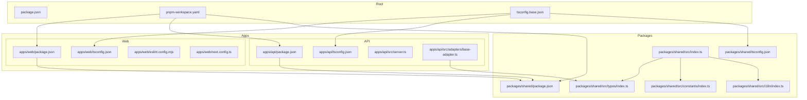
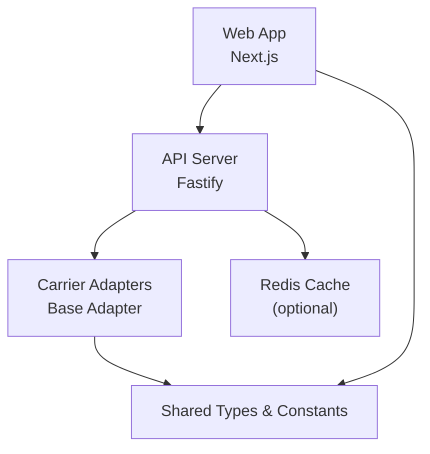
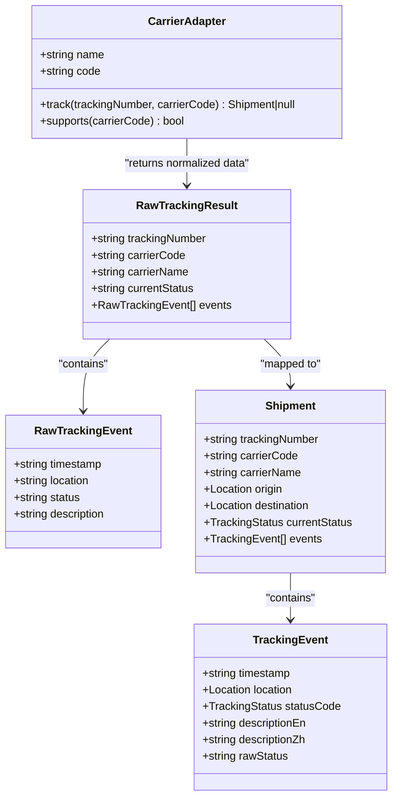
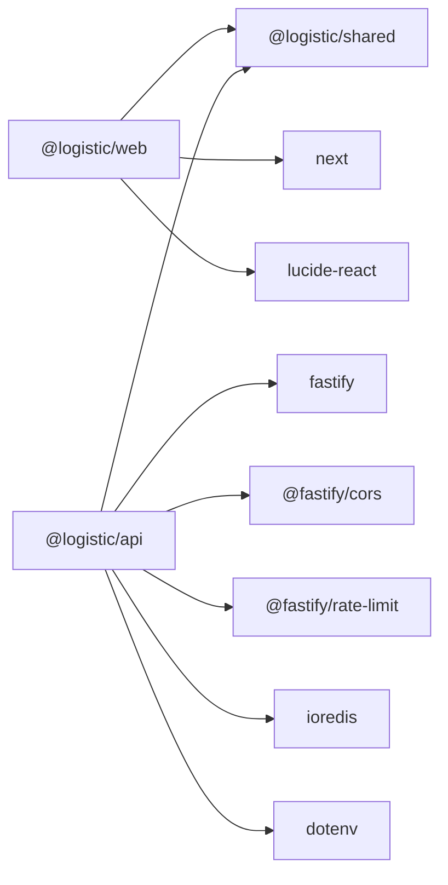

# Development Guidelines

<cite>
**Referenced Files in This Document**
- [pnpm-workspace.yaml](file://pnpm-workspace.yaml)
- [package.json](file://package.json)
- [tsconfig.base.json](file://tsconfig.base.json)
- [apps/web/package.json](file://apps/web/package.json)
- [apps/web/tsconfig.json](file://apps/web/tsconfig.json)
- [apps/web/eslint.config.mjs](file://apps/web/eslint.config.mjs)
- [apps/web/next.config.ts](file://apps/web/next.config.ts)
- [apps/api/package.json](file://apps/api/package.json)
- [apps/api/tsconfig.json](file://apps/api/tsconfig.json)
- [apps/api/src/server.ts](file://apps/api/src/server.ts)
- [apps/api/src/adapters/base-adapter.ts](file://apps/api/src/adapters/base-adapter.ts)
- [packages/shared/package.json](file://packages/shared/package.json)
- [packages/shared/tsconfig.json](file://packages/shared/tsconfig.json)
- [packages/shared/src/index.ts](file://packages/shared/src/index.ts)
- [packages/shared/src/types/index.ts](file://packages/shared/src/types/index.ts)
- [packages/shared/src/constants/index.ts](file://packages/shared/src/constants/index.ts)
- [packages/shared/src/i18n/index.ts](file://packages/shared/src/i18n/index.ts)
</cite>

## Table of Contents
1. [Introduction](#introduction)
2. [Project Structure](#project-structure)
3. [Core Components](#core-components)
4. [Architecture Overview](#architecture-overview)
5. [Detailed Component Analysis](#detailed-component-analysis)
6. [Dependency Analysis](#dependency-analysis)
7. [Performance Considerations](#performance-considerations)
8. [Troubleshooting Guide](#troubleshooting-guide)
9. [Conclusion](#conclusion)
10. [Appendices](#appendices)

## Introduction
This document defines development guidelines for the LOGISTIC project. It covers TypeScript configuration standards, ESLint rules, code quality practices, pnpm workspace management, package dependencies, build processes, coding standards for frontend and backend, component design patterns, testing strategies, extension points for new carrier adapters, shared types maintenance, development workflow, branch strategies, contribution guidelines, debugging techniques, performance profiling, and troubleshooting common issues.

## Project Structure
The repository is a pnpm monorepo organized into:
- apps/web: Next.js frontend application
- apps/api: Fastify backend service
- packages/shared: Shared TypeScript library exporting types, constants, and i18n

Key configuration files:
- Workspace definition: pnpm-workspace.yaml
- Root scripts and engines: package.json
- Base TypeScript compiler options: tsconfig.base.json
- Application-specific configs: apps/*/tsconfig.json and apps/*/package.json
- Frontend linting: apps/web/eslint.config.mjs
- Frontend runtime config: apps/web/next.config.ts
- Backend server bootstrap: apps/api/src/server.ts
- Shared exports and types: packages/shared/src/index.ts and related modules

**Diagram sources**
- [pnpm-workspace.yaml:1-8](file://pnpm-workspace.yaml#L1-L8)
- [package.json:1-19](file://package.json#L1-L19)
- [tsconfig.base.json:1-18](file://tsconfig.base.json#L1-L18)
- [apps/web/package.json:1-30](file://apps/web/package.json#L1-L30)
- [apps/web/tsconfig.json:1-35](file://apps/web/tsconfig.json#L1-L35)
- [apps/web/eslint.config.mjs:1-19](file://apps/web/eslint.config.mjs#L1-L19)
- [apps/web/next.config.ts:1-23](file://apps/web/next.config.ts#L1-L23)
- [apps/api/package.json:1-27](file://apps/api/package.json#L1-L27)
- [apps/api/tsconfig.json:1-9](file://apps/api/tsconfig.json#L1-L9)
- [apps/api/src/server.ts:1-60](file://apps/api/src/server.ts#L1-L60)
- [apps/api/src/adapters/base-adapter.ts:1-39](file://apps/api/src/adapters/base-adapter.ts#L1-L39)
- [packages/shared/package.json:1-22](file://packages/shared/package.json#L1-L22)
- [packages/shared/tsconfig.json:1-9](file://packages/shared/tsconfig.json#L1-L9)
- [packages/shared/src/index.ts:1-4](file://packages/shared/src/index.ts#L1-L4)
- [packages/shared/src/types/index.ts:1-101](file://packages/shared/src/types/index.ts#L1-L101)
- [packages/shared/src/constants/index.ts:1-103](file://packages/shared/src/constants/index.ts#L1-L103)
- [packages/shared/src/i18n/index.ts:1-61](file://packages/shared/src/i18n/index.ts#L1-L61)

**Section sources**
- [pnpm-workspace.yaml:1-8](file://pnpm-workspace.yaml#L1-L8)
- [package.json:1-19](file://package.json#L1-L19)
- [tsconfig.base.json:1-18](file://tsconfig.base.json#L1-L18)
- [apps/web/package.json:1-30](file://apps/web/package.json#L1-L30)
- [apps/api/package.json:1-27](file://apps/api/package.json#L1-L27)
- [packages/shared/package.json:1-22](file://packages/shared/package.json#L1-L22)

## Core Components
- Shared library (@logistic/shared)
  - Exports types, constants, and i18n for both frontend and backend
  - Provides standardized enums, interfaces, and lookup tables for tracking, carriers, and UI text
- Web application (@logistic/web)
  - Next.js app with React components, routing, and Tailwind CSS
  - Uses ESLint Next.js configuration and TypeScript strict checks
- API application (@logistic/api)
  - Fastify microservice with CORS, rate limiting, optional Redis caching, and adapter-based tracking integrations

Guidelines summary:
- Use shared types and constants to maintain consistency across apps
- Keep adapter interfaces aligned with shared types
- Centralize internationalization in shared i18n module
- Enforce strict TypeScript settings and linting in both apps

**Section sources**
- [packages/shared/src/index.ts:1-4](file://packages/shared/src/index.ts#L1-L4)
- [packages/shared/src/types/index.ts:1-101](file://packages/shared/src/types/index.ts#L1-L101)
- [packages/shared/src/constants/index.ts:1-103](file://packages/shared/src/constants/index.ts#L1-L103)
- [packages/shared/src/i18n/index.ts:1-61](file://packages/shared/src/i18n/index.ts#L1-L61)
- [apps/web/eslint.config.mjs:1-19](file://apps/web/eslint.config.mjs#L1-L19)
- [apps/web/tsconfig.json:1-35](file://apps/web/tsconfig.json#L1-L35)
- [apps/api/tsconfig.json:1-9](file://apps/api/tsconfig.json#L1-L9)

## Architecture Overview
High-level architecture:
- Web app consumes backend via API routes or local proxy during development
- API orchestrates carrier adapters to normalize tracking data into shared types
- Shared package centralizes domain models and constants

**Diagram sources**
- [apps/web/next.config.ts:1-23](file://apps/web/next.config.ts#L1-L23)
- [apps/api/src/server.ts:1-60](file://apps/api/src/server.ts#L1-L60)
- [apps/api/src/adapters/base-adapter.ts:1-39](file://apps/api/src/adapters/base-adapter.ts#L1-L39)
- [packages/shared/src/types/index.ts:1-101](file://packages/shared/src/types/index.ts#L1-L101)

## Detailed Component Analysis

### TypeScript Configuration Standards
- Base compiler options
  - Target ES2022, module resolution “bundler”, strict mode enabled, declaration/source maps generated
  - Exclude node_modules and dist by default
- Web app
  - Bundler module resolution, isolated modules, JSX transform, path alias @/*
  - Incremental compilation, no emit, strict mode
- API app
  - Extends base config, sets outDir/rootDir under src
- Shared package
  - Extends base config, sets outDir/rootDir under src

Best practices:
- Prefer bundler module resolution for both apps and shared package
- Keep strict mode enabled across all packages
- Use incremental builds in web app for faster type-checking
- Centralize compiler options in base config to avoid duplication

**Section sources**
- [tsconfig.base.json:1-18](file://tsconfig.base.json#L1-L18)
- [apps/web/tsconfig.json:1-35](file://apps/web/tsconfig.json#L1-L35)
- [apps/api/tsconfig.json:1-9](file://apps/api/tsconfig.json#L1-L9)
- [packages/shared/tsconfig.json:1-9](file://packages/shared/tsconfig.json#L1-L9)

### ESLint Rules and Code Quality Practices
- Web app
  - Uses eslint-config-next for core-web-vitals and TypeScript rules
  - Overrides default ignores to include development artifacts
- API app
  - No dedicated lint script configured yet; consider adopting a similar lint strategy or a minimal recommended TS-only linting setup

Recommendations:
- Align API linting with Next.js ESLint configuration or a minimal TS-focused setup
- Add lint-staged and pre-commit hooks to enforce formatting and linting before commits
- Integrate Prettier for formatting consistency across the monorepo

**Section sources**
- [apps/web/eslint.config.mjs:1-19](file://apps/web/eslint.config.mjs#L1-L19)
- [apps/api/package.json:1-27](file://apps/api/package.json#L1-L27)

### Build Processes and Scripts
- Root scripts
  - dev: runs dev in all packages in parallel
  - dev:web and dev:api: filter-specific apps
  - build: builds all packages
  - lint: lints all packages
  - typecheck: type-checks all packages
- Engines
  - Requires Node >= 20 and pnpm >= 9

Workspace allowances:
- Enables specific native build tools in workspace

**Section sources**
- [package.json:1-19](file://package.json#L1-L19)
- [pnpm-workspace.yaml:1-8](file://pnpm-workspace.yaml#L1-L8)

### Coding Standards: Frontend (Web)
- Strict TypeScript configuration with no emit
- Path alias @/* mapped to ./src
- ESLint Next.js configuration applied
- Tailwind CSS configured as dev dependency

Standards:
- Use path aliases for imports
- Keep components self-contained and reusable
- Centralize theme tokens and styles in shared constants
- Use shared i18n keys for UI text

**Section sources**
- [apps/web/tsconfig.json:1-35](file://apps/web/tsconfig.json#L1-L35)
- [apps/web/eslint.config.mjs:1-19](file://apps/web/eslint.config.mjs#L1-L19)
- [apps/web/package.json:1-30](file://apps/web/package.json#L1-L30)

### Coding Standards: Backend (API)
- Fastify server with CORS and rate limiting
- Optional Redis integration with graceful fallback
- TypeScript strict mode and module resolution
- Adapter pattern for carrier integrations

Standards:
- Keep adapters stateless and deterministic
- Normalize raw carrier responses into shared Shipment and TrackingEvent
- Validate inputs and handle errors gracefully
- Use environment variables for configuration (PORT, HOST, REDIS_URL)

**Section sources**
- [apps/api/src/server.ts:1-60](file://apps/api/src/server.ts#L1-L60)
- [apps/api/package.json:1-27](file://apps/api/package.json#L1-L27)
- [apps/api/tsconfig.json:1-9](file://apps/api/tsconfig.json#L1-L9)

### Component Design Patterns
- Shared types and constants
  - Enumerations for tracking statuses and user tiers
  - Interfaces for Shipment, TrackingEvent, Location, and responses
  - Lookup tables for carriers, cache TTLs, milestone order, and status colors
- Adapter pattern
  - CarrierAdapter interface ensures consistent contract for all carriers
  - RawTrackingResult normalization before mapping to Shipment

Guidelines:
- Extend shared enums and interfaces when introducing new statuses or tiers
- Add new carriers to constants and update detection patterns
- Implement new adapters by adhering to the CarrierAdapter interface

**Diagram sources**
- [apps/api/src/adapters/base-adapter.ts:1-39](file://apps/api/src/adapters/base-adapter.ts#L1-L39)
- [packages/shared/src/types/index.ts:1-101](file://packages/shared/src/types/index.ts#L1-L101)

**Section sources**
- [packages/shared/src/types/index.ts:1-101](file://packages/shared/src/types/index.ts#L1-L101)
- [packages/shared/src/constants/index.ts:1-103](file://packages/shared/src/constants/index.ts#L1-L103)
- [apps/api/src/adapters/base-adapter.ts:1-39](file://apps/api/src/adapters/base-adapter.ts#L1-L39)

### Testing Strategies
- Frontend
  - Use React Testing Library for unit tests
  - Add Playwright for E2E tests if not present
- Backend
  - Unit tests for adapters and services
  - Integration tests for route handlers
- Shared
  - Type-level tests to ensure compatibility across consumers

Note: No explicit test runner or framework is configured in the repository. Consider adding vitest or jest for unit tests and playwright for E2E tests.

**Section sources**
- [apps/web/package.json:1-30](file://apps/web/package.json#L1-L30)
- [apps/api/package.json:1-27](file://apps/api/package.json#L1-L27)
- [packages/shared/package.json:1-22](file://packages/shared/package.json#L1-L22)

### Adding New Carrier Adapters
Steps:
1. Define adapter contract
   - Implement CarrierAdapter interface
   - Accept tracking number and optional carrier code
   - Return normalized RawTrackingResult
2. Normalize to shared types
   - Map raw fields to Shipment and TrackingEvent
   - Translate status codes and descriptions using shared enums
3. Integrate with tracking pipeline
   - Register adapter in the tracking service
   - Update carrier detection logic if needed
4. Export adapter from API app
   - Ensure adapter is discoverable by the tracking service

Guidelines:
- Keep adapter functions pure and free of side effects
- Handle missing or invalid tracking numbers by returning null
- Respect rate limits and timeouts when calling external APIs
- Log warnings for partial or inconsistent data

**Section sources**
- [apps/api/src/adapters/base-adapter.ts:1-39](file://apps/api/src/adapters/base-adapter.ts#L1-L39)
- [packages/shared/src/types/index.ts:1-101](file://packages/shared/src/types/index.ts#L1-L101)

### Extending Shared Types
When extending shared types:
- Add new enums or interfaces in packages/shared/src/types/index.ts
- Update packages/shared/src/index.ts to re-export new symbols
- Import from @logistic/shared in both apps and API
- Run typecheck across the monorepo to validate usage

Guidelines:
- Keep enums finite and well-scoped
- Use union types for external identifiers (DataSource)
- Add related constants (e.g., cache TTLs, status colors) in constants module
- Provide translation keys in i18n module for new statuses or UI strings

**Section sources**
- [packages/shared/src/types/index.ts:1-101](file://packages/shared/src/types/index.ts#L1-L101)
- [packages/shared/src/constants/index.ts:1-103](file://packages/shared/src/constants/index.ts#L1-L103)
- [packages/shared/src/i18n/index.ts:1-61](file://packages/shared/src/i18n/index.ts#L1-L61)
- [packages/shared/src/index.ts:1-4](file://packages/shared/src/index.ts#L1-L4)

### Maintaining Consistency Across Applications
- Use workspace:* for internal dependencies
- Keep shared exports centralized in packages/shared/src/index.ts
- Align TypeScript and ESLint configurations across apps
- Enforce consistent naming conventions for routes, components, and constants

**Section sources**
- [apps/web/package.json:1-30](file://apps/web/package.json#L1-L30)
- [apps/api/package.json:1-27](file://apps/api/package.json#L1-L27)
- [packages/shared/package.json:1-22](file://packages/shared/package.json#L1-L22)
- [packages/shared/src/index.ts:1-4](file://packages/shared/src/index.ts#L1-L4)

### Development Workflow and Branch Strategies
Recommended workflow:
- Feature branches per feature or bug fix
- Rebase develop onto feature branches before opening PRs
- Squash and merge PRs after review and CI approval
- Tag releases on main with semantic versioning

Branch protection:
- Require at least one approving review
- Run typecheck, lint, and tests on CI

[No sources needed since this section provides general guidance]

### Contribution Guidelines
- Follow existing code style and naming conventions
- Add or update shared types before consuming them in apps
- Write tests for new features and bug fixes
- Update documentation and comments as needed

[No sources needed since this section provides general guidance]

## Dependency Analysis
- Internal dependencies
  - @logistic/web depends on @logistic/shared
  - @logistic/api depends on @logistic/shared
- External dependencies
  - Web: next, lucide-react, Tailwind CSS
  - API: fastify, @fastify/cors, @fastify/rate-limit, ioredis, dotenv
- Workspace configuration enables native build tools

**Diagram sources**
- [apps/web/package.json:1-30](file://apps/web/package.json#L1-L30)
- [apps/api/package.json:1-27](file://apps/api/package.json#L1-L27)
- [packages/shared/package.json:1-22](file://packages/shared/package.json#L1-L22)

**Section sources**
- [apps/web/package.json:1-30](file://apps/web/package.json#L1-L30)
- [apps/api/package.json:1-27](file://apps/api/package.json#L1-L27)
- [packages/shared/package.json:1-22](file://packages/shared/package.json#L1-L22)

## Performance Considerations
- Frontend
  - Enable incremental builds and isolated modules for faster type-checking
  - Use path aliases to reduce bundle overhead
- Backend
  - Use Redis for caching normalized tracking data
  - Apply rate limiting to protect upstream carrier APIs
  - Gracefully degrade when Redis is unavailable
- Shared
  - Keep enums and constants small and immutable to minimize memory footprint

[No sources needed since this section provides general guidance]

## Troubleshooting Guide
Common issues and resolutions:
- Redis connectivity problems
  - Verify REDIS_URL environment variable
  - Confirm network accessibility and credentials
  - Review server logs for Redis ping failures
- CORS or proxy issues in development
  - Ensure API_URL is set when proxying to a separate backend
  - Check Next.js rewrites configuration
- Type errors after adding shared types
  - Re-run typecheck across the monorepo
  - Verify re-exports in packages/shared/src/index.ts
- Lint failures in API
  - Configure ESLint for the API app to align with Next.js rules
  - Run lint and fix reported issues

**Section sources**
- [apps/api/src/server.ts:1-60](file://apps/api/src/server.ts#L1-L60)
- [apps/web/next.config.ts:1-23](file://apps/web/next.config.ts#L1-L23)
- [packages/shared/src/index.ts:1-4](file://packages/shared/src/index.ts#L1-L4)

## Conclusion
These guidelines establish a consistent development experience across the LOGISTIC monorepo. By leveraging shared types, following the adapter pattern, enforcing strict TypeScript and ESLint rules, and maintaining clear separation of concerns, contributors can efficiently extend carrier support, improve UI/UX, and scale the backend while preserving reliability and performance.

[No sources needed since this section summarizes without analyzing specific files]

## Appendices

### Appendix A: Frontend Runtime Proxy Behavior
- When API_URL is set, Next.js rewrites /api/* to the external backend
- On Vercel, built-in API Routes handle /api/* directly without rewriting

**Section sources**
- [apps/web/next.config.ts:1-23](file://apps/web/next.config.ts#L1-L23)

### Appendix B: Shared Type Reference
- TrackingStatus enum and related constants
- DataSource union and Location interface
- Shipment, TrackingEvent, and response interfaces
- UserTier and TierConfig for rate limiting

**Section sources**
- [packages/shared/src/types/index.ts:1-101](file://packages/shared/src/types/index.ts#L1-L101)
- [packages/shared/src/constants/index.ts:1-103](file://packages/shared/src/constants/index.ts#L1-L103)
- [packages/shared/src/i18n/index.ts:1-61](file://packages/shared/src/i18n/index.ts#L1-L61)