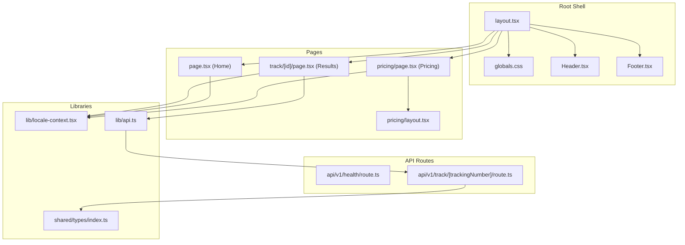
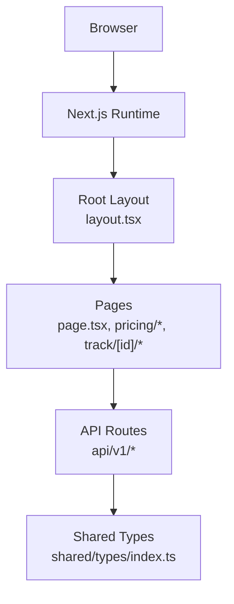
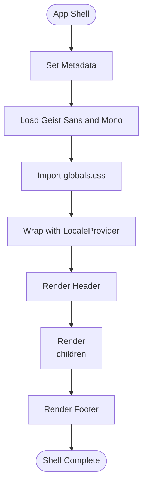
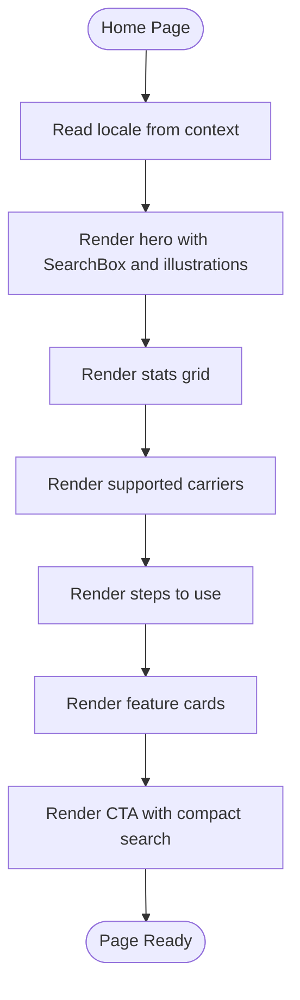
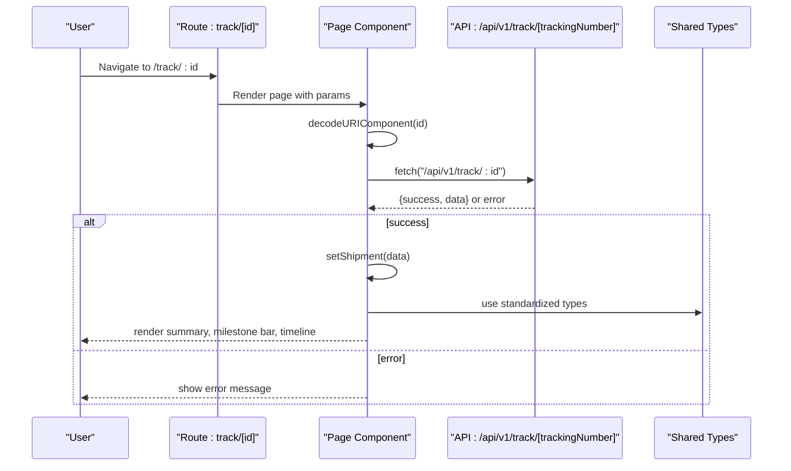
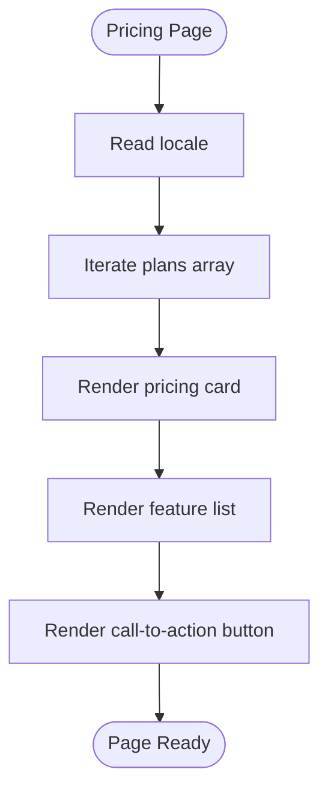
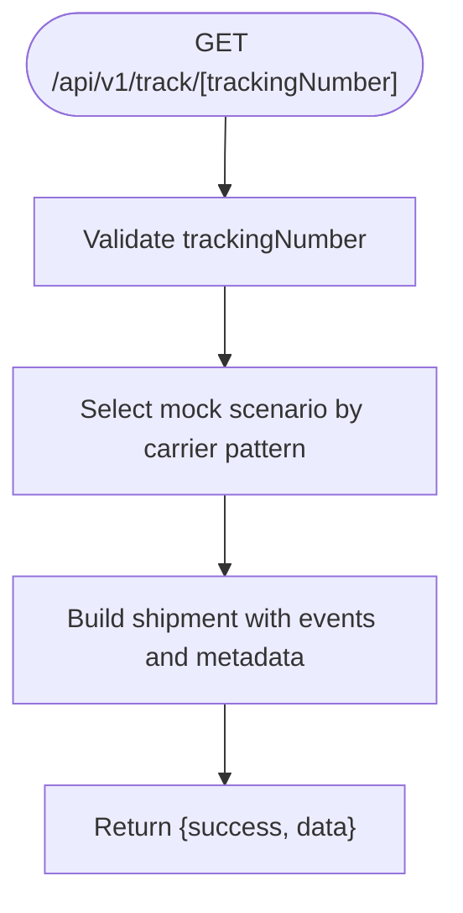
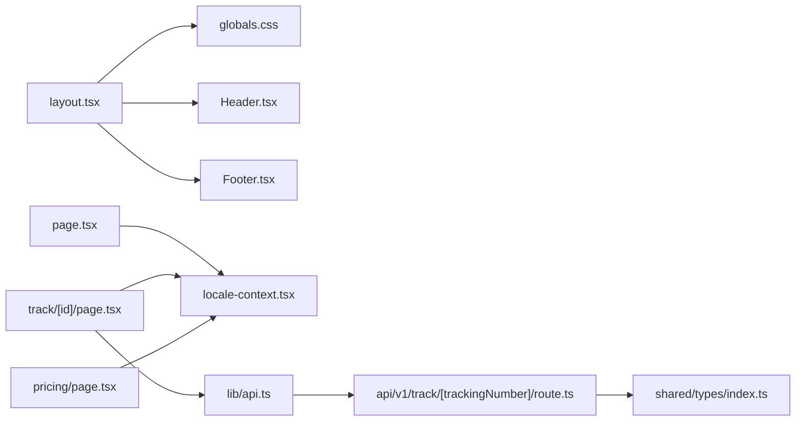
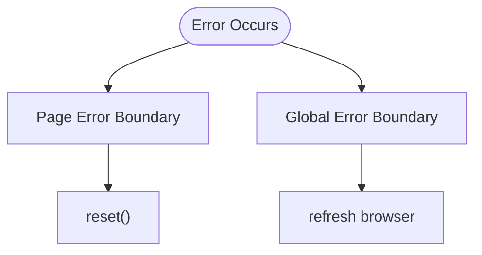

# Application Structure

<cite>
**Referenced Files in This Document**
- [layout.tsx](file://apps/web/src/app/layout.tsx)
- [page.tsx](file://apps/web/src/app/page.tsx)
- [error.tsx](file://apps/web/src/app/error.tsx)
- [global-error.tsx](file://apps/web/src/app/global-error.tsx)
- [globals.css](file://apps/web/src/app/globals.css)
- [Header.tsx](file://apps/web/src/components/Header.tsx)
- [Footer.tsx](file://apps/web/src/components/Footer.tsx)
- [next.config.ts](file://apps/web/next.config.ts)
- [track-[id]/page.tsx](file://apps/web/src/app/track/[id]/page.tsx)
- [track-[id]/loading.tsx](file://apps/web/src/app/track/[id]/loading.tsx)
- [pricing/layout.tsx](file://apps/web/src/app/pricing/layout.tsx)
- [pricing/page.tsx](file://apps/web/src/app/pricing/page.tsx)
- [api/v1/health/route.ts](file://apps/web/src/app/api/v1/health/route.ts)
- [api/v1/track/[trackingNumber]/route.ts](file://apps/web/src/app/api/v1/track/[trackingNumber]/route.ts)
- [api.ts](file://apps/web/src/lib/api.ts)
- [locale-context.tsx](file://apps/web/src/lib/locale-context.tsx)
- [shared/types/index.ts](file://packages/shared/src/types/index.ts)
</cite>

## Table of Contents
1. [Introduction](#introduction)
2. [Project Structure](#project-structure)
3. [Core Components](#core-components)
4. [Architecture Overview](#architecture-overview)
5. [Detailed Component Analysis](#detailed-component-analysis)
6. [Dependency Analysis](#dependency-analysis)
7. [Performance Considerations](#performance-considerations)
8. [Troubleshooting Guide](#troubleshooting-guide)
9. [Conclusion](#conclusion)

## Introduction
This document explains the Next.js application structure and routing system for the TrackFlow logistics tracking platform. It covers the App Router configuration, page component hierarchy, dynamic routing patterns, root layout composition, and client-side navigation. It also documents metadata configuration, font loading, global CSS integration, and the relationship between server-side rendering and client-side interactivity.

## Project Structure
The application follows Next.js App Router conventions under apps/web/src/app. Key areas:
- Root layout and global assets define the shell and theme
- Pages for home, tracking results, and pricing
- Dynamic routes for tracking ID resolution
- API routes for health checks and mock tracking data
- Shared types and i18n utilities

**Diagram sources**
- [layout.tsx:24-43](file://apps/web/src/app/layout.tsx#L24-L43)
- [globals.css:1-441](file://apps/web/src/app/globals.css#L1-L441)
- [Header.tsx:8-58](file://apps/web/src/components/Header.tsx#L8-L58)
- [Footer.tsx:7-36](file://apps/web/src/components/Footer.tsx#L7-L36)
- [page.tsx:60-444](file://apps/web/src/app/page.tsx#L60-L444)
- [track-[id]/page.tsx](file://apps/web/src/app/track/[id]/page.tsx#L25-L242)
- [pricing/layout.tsx:9-15](file://apps/web/src/app/pricing/layout.tsx#L9-L15)
- [pricing/page.tsx:97-216](file://apps/web/src/app/pricing/page.tsx#L97-L216)
- [api/v1/health/route.ts:1-9](file://apps/web/src/app/api/v1/health/route.ts#L1-L9)
- [api/v1/track/[trackingNumber]/route.ts](file://apps/web/src/app/api/v1/track/[trackingNumber]/route.ts#L187-L222)
- [api.ts:5-27](file://apps/web/src/lib/api.ts#L5-L27)
- [locale-context.tsx:16-28](file://apps/web/src/lib/locale-context.tsx#L16-L28)
- [shared/types/index.ts:1-101](file://packages/shared/src/types/index.ts#L1-L101)

**Section sources**
- [layout.tsx:1-44](file://apps/web/src/app/layout.tsx#L1-L44)
- [globals.css:1-441](file://apps/web/src/app/globals.css#L1-L441)
- [Header.tsx:1-59](file://apps/web/src/components/Header.tsx#L1-L59)
- [Footer.tsx:1-37](file://apps/web/src/components/Footer.tsx#L1-L37)
- [page.tsx:1-445](file://apps/web/src/app/page.tsx#L1-L445)
- [track-[id]/page.tsx](file://apps/web/src/app/track/[id]/page.tsx#L1-L263)
- [track-[id]/loading.tsx](file://apps/web/src/app/track/[id]/loading.tsx#L1-L19)
- [pricing/layout.tsx:1-16](file://apps/web/src/app/pricing/layout.tsx#L1-L16)
- [pricing/page.tsx:1-217](file://apps/web/src/app/pricing/page.tsx#L1-L217)
- [api/v1/health/route.ts:1-9](file://apps/web/src/app/api/v1/health/route.ts#L1-L9)
- [api/v1/track/[trackingNumber]/route.ts](file://apps/web/src/app/api/v1/track/[trackingNumber]/route.ts#L1-L223)
- [api.ts:1-56](file://apps/web/src/lib/api.ts#L1-L56)
- [locale-context.tsx:1-33](file://apps/web/src/lib/locale-context.tsx#L1-L33)
- [shared/types/index.ts:1-101](file://packages/shared/src/types/index.ts#L1-L101)

## Core Components
- Root layout defines the HTML shell, fonts, global styles, and composes header, main content area, and footer.
- Global CSS establishes a design system with Tailwind-based CSS variables, animations, and component utilities.
- Locale provider enables language switching and i18n-aware rendering across pages.
- Page components implement client-side interactivity for search, tracking, and pricing presentation.

Key responsibilities:
- Root layout: metadata, font loading, global CSS import, locale provider wrapper, header/footer composition.
- Home page: hero, stats, features, and CTA sections with locale-aware content.
- Tracking results page: loading skeleton, error fallback, shipment summary, milestone bar, and timeline.
- Pricing page: plan cards with feature lists and call-to-action buttons.
- API routes: health check and mock tracking endpoint returning standardized shipment data.

**Section sources**
- [layout.tsx:18-43](file://apps/web/src/app/layout.tsx#L18-L43)
- [globals.css:8-121](file://apps/web/src/app/globals.css#L8-L121)
- [locale-context.tsx:16-32](file://apps/web/src/lib/locale-context.tsx#L16-L32)
- [page.tsx:60-444](file://apps/web/src/app/page.tsx#L60-L444)
- [track-[id]/page.tsx](file://apps/web/src/app/track/[id]/page.tsx#L25-L242)
- [pricing/page.tsx:97-216](file://apps/web/src/app/pricing/page.tsx#L97-L216)
- [api/v1/track/[trackingNumber]/route.ts](file://apps/web/src/app/api/v1/track/[trackingNumber]/route.ts#L187-L222)

## Architecture Overview
The application uses Next.js App Router with:
- Root layout as the application shell
- Static and dynamic routes for pages
- Route handlers for API endpoints
- Client-side navigation via Next/link and client components
- Shared types and i18n utilities

**Diagram sources**
- [layout.tsx:24-43](file://apps/web/src/app/layout.tsx#L24-L43)
- [page.tsx:60-444](file://apps/web/src/app/page.tsx#L60-L444)
- [pricing/page.tsx:97-216](file://apps/web/src/app/pricing/page.tsx#L97-L216)
- [track-[id]/page.tsx](file://apps/web/src/app/track/[id]/page.tsx#L25-L242)
- [api/v1/track/[trackingNumber]/route.ts](file://apps/web/src/app/api/v1/track/[trackingNumber]/route.ts#L187-L222)
- [shared/types/index.ts:1-101](file://packages/shared/src/types/index.ts#L1-L101)

## Detailed Component Analysis

### Root Layout and Global Assets
The root layout sets metadata, loads fonts from next/font/google, imports global CSS, wraps children with a locale provider, and renders header and footer around the main content area. The global CSS defines a design system with CSS variables, animations, and reusable component classes.

**Diagram sources**
- [layout.tsx:18-43](file://apps/web/src/app/layout.tsx#L18-L43)
- [globals.css:1-441](file://apps/web/src/app/globals.css#L1-L441)
- [Header.tsx:8-58](file://apps/web/src/components/Header.tsx#L8-L58)
- [Footer.tsx:7-36](file://apps/web/src/components/Footer.tsx#L7-L36)

**Section sources**
- [layout.tsx:1-44](file://apps/web/src/app/layout.tsx#L1-L44)
- [globals.css:1-441](file://apps/web/src/app/globals.css#L1-L441)
- [Header.tsx:1-59](file://apps/web/src/components/Header.tsx#L1-L59)
- [Footer.tsx:1-37](file://apps/web/src/components/Footer.tsx#L1-L37)

### Home Page
The home page is a client component that renders:
- Hero section with animated floating cards and gradient backgrounds
- Stats grid
- Carrier trust bar
- Steps to use
- Feature grid
- Call-to-action section with compact search

It uses locale-aware content and animations for progressive reveal.

**Diagram sources**
- [page.tsx:60-444](file://apps/web/src/app/page.tsx#L60-L444)
- [locale-context.tsx:30-32](file://apps/web/src/lib/locale-context.tsx#L30-L32)

**Section sources**
- [page.tsx:1-445](file://apps/web/src/app/page.tsx#L1-L445)
- [locale-context.tsx:1-33](file://apps/web/src/lib/locale-context.tsx#L1-L33)

### Tracking Results Page
The tracking results page handles dynamic route parameters, client-side fetching, loading states, errors, and rendering shipment details.

**Diagram sources**
- [track-[id]/page.tsx](file://apps/web/src/app/track/[id]/page.tsx#L25-L242)
- [api/v1/track/[trackingNumber]/route.ts](file://apps/web/src/app/api/v1/track/[trackingNumber]/route.ts#L187-L222)
- [api.ts:5-27](file://apps/web/src/lib/api.ts#L5-L27)
- [shared/types/index.ts:48-83](file://packages/shared/src/types/index.ts#L48-L83)

**Section sources**
- [track-[id]/page.tsx](file://apps/web/src/app/track/[id]/page.tsx#L1-L263)
- [track-[id]/loading.tsx](file://apps/web/src/app/track/[id]/loading.tsx#L1-L19)
- [api.ts:1-56](file://apps/web/src/lib/api.ts#L1-L56)
- [shared/types/index.ts:1-101](file://packages/shared/src/types/index.ts#L1-L101)

### Pricing Page
The pricing page presents tiered plans with feature comparisons and call-to-actions. It reads locale from context to localize content.

**Diagram sources**
- [pricing/page.tsx:97-216](file://apps/web/src/app/pricing/page.tsx#L97-L216)
- [pricing/layout.tsx:3-7](file://apps/web/src/app/pricing/layout.tsx#L3-L7)

**Section sources**
- [pricing/page.tsx:1-217](file://apps/web/src/app/pricing/page.tsx#L1-L217)
- [pricing/layout.tsx:1-16](file://apps/web/src/app/pricing/layout.tsx#L1-L16)

### API Routes
- Health check route returns a simple JSON response.
- Tracking route validates input, selects a mock scenario based on the tracking number, constructs a standardized shipment object, and returns it.

**Diagram sources**
- [api/v1/track/[trackingNumber]/route.ts](file://apps/web/src/app/api/v1/track/[trackingNumber]/route.ts#L187-L222)

**Section sources**
- [api/v1/health/route.ts:1-9](file://apps/web/src/app/api/v1/health/route.ts#L1-L9)
- [api/v1/track/[trackingNumber]/route.ts](file://apps/web/src/app/api/v1/track/[trackingNumber]/route.ts#L1-L223)

### Client-Side Navigation and Interactivity
- Client components use Next/link for navigation and React hooks for state and effects.
- Locale provider toggles language and persists selection in context.
- API client encapsulates fetch logic and error handling.

```mermaid
classDiagram
class LocaleProvider {
+locale : string
+toggleLocale() : void
}
class Header {
+navigation links
+language toggle
}
class TrackResultPage {
+params : id
+fetch shipment
+render loading/error/result
}
class PricingPage {
+plans : Plan[]
+render cards
}
class APIClient {
+trackShipment(number)
+trackBatch(numbers)
}
Header --> LocaleProvider : "consumes"
TrackResultPage --> APIClient : "uses"
TrackResultPage --> LocaleProvider : "reads locale"
PricingPage --> LocaleProvider : "reads locale"
```

**Diagram sources**
- [locale-context.tsx:16-32](file://apps/web/src/lib/locale-context.tsx#L16-L32)
- [Header.tsx:8-58](file://apps/web/src/components/Header.tsx#L8-L58)
- [track-[id]/page.tsx](file://apps/web/src/app/track/[id]/page.tsx#L25-L242)
- [pricing/page.tsx:97-216](file://apps/web/src/app/pricing/page.tsx#L97-L216)
- [api.ts:5-27](file://apps/web/src/lib/api.ts#L5-L27)

**Section sources**
- [Header.tsx:1-59](file://apps/web/src/components/Header.tsx#L1-L59)
- [locale-context.tsx:1-33](file://apps/web/src/lib/locale-context.tsx#L1-L33)
- [track-[id]/page.tsx](file://apps/web/src/app/track/[id]/page.tsx#L1-L263)
- [pricing/page.tsx:1-217](file://apps/web/src/app/pricing/page.tsx#L1-L217)
- [api.ts:1-56](file://apps/web/src/lib/api.ts#L1-L56)

## Dependency Analysis
- Root layout depends on global CSS and components for header/footer.
- Pages depend on shared types for shape validation and locale context for i18n.
- API routes depend on shared types for standardized responses.
- Client components depend on API client for data fetching.

**Diagram sources**
- [layout.tsx:1-44](file://apps/web/src/app/layout.tsx#L1-L44)
- [globals.css:1-441](file://apps/web/src/app/globals.css#L1-L441)
- [Header.tsx:1-59](file://apps/web/src/components/Header.tsx#L1-L59)
- [Footer.tsx:1-37](file://apps/web/src/components/Footer.tsx#L1-L37)
- [page.tsx:1-445](file://apps/web/src/app/page.tsx#L1-L445)
- [track-[id]/page.tsx](file://apps/web/src/app/track/[id]/page.tsx#L1-L263)
- [pricing/page.tsx:1-217](file://apps/web/src/app/pricing/page.tsx#L1-L217)
- [api.ts:1-56](file://apps/web/src/lib/api.ts#L1-L56)
- [api/v1/track/[trackingNumber]/route.ts](file://apps/web/src/app/api/v1/track/[trackingNumber]/route.ts#L1-L223)
- [shared/types/index.ts:1-101](file://packages/shared/src/types/index.ts#L1-L101)

**Section sources**
- [layout.tsx:1-44](file://apps/web/src/app/layout.tsx#L1-L44)
- [page.tsx:1-445](file://apps/web/src/app/page.tsx#L1-L445)
- [track-[id]/page.tsx](file://apps/web/src/app/track/[id]/page.tsx#L1-L263)
- [pricing/page.tsx:1-217](file://apps/web/src/app/pricing/page.tsx#L1-L217)
- [api.ts:1-56](file://apps/web/src/lib/api.ts#L1-L56)
- [api/v1/track/[trackingNumber]/route.ts](file://apps/web/src/app/api/v1/track/[trackingNumber]/route.ts#L1-L223)
- [shared/types/index.ts:1-101](file://packages/shared/src/types/index.ts#L1-L101)

## Performance Considerations
- Font loading: next/font/google self-hosts fonts and exposes CSS variables for efficient rendering.
- CSS architecture: CSS variables and Tailwind utilities minimize runtime style recalculation.
- Client-side caching: consider memoizing API responses and avoiding redundant fetches during navigation.
- Skeletons: use loading skeletons for faster perceived performance during data fetch.
- Animations: keep animation-heavy hero sections optimized and avoid heavy JS in initial viewport.

[No sources needed since this section provides general guidance]

## Troubleshooting Guide
- Error boundaries:
  - Page-level error boundary displays localized messages and provides retry/reset actions.
  - Global error boundary ensures a fallback UI for unhandled errors outside the app shell.
- API connectivity:
  - API client returns structured errors for network failures and invalid responses.
  - API routes validate inputs and return appropriate HTTP status codes.
- Local development proxy:
  - next.config.ts conditionally rewrites /api/* to an external backend when API_URL is set.

**Diagram sources**
- [error.tsx:6-51](file://apps/web/src/app/error.tsx#L6-L51)
- [global-error.tsx:3-52](file://apps/web/src/app/global-error.tsx#L3-L52)

**Section sources**
- [error.tsx:1-52](file://apps/web/src/app/error.tsx#L1-L52)
- [global-error.tsx:1-53](file://apps/web/src/app/global-error.tsx#L1-L53)
- [api.ts:5-27](file://apps/web/src/lib/api.ts#L5-L27)
- [next.config.ts:1-23](file://apps/web/next.config.ts#L1-L23)

## Conclusion
The application leverages Next.js App Router to deliver a structured, i18n-aware, and visually consistent tracking experience. The root layout and global CSS establish a cohesive design system, while dynamic routes and API handlers enable scalable client-side interactivity. Shared types and utilities promote consistency across components and data flows.