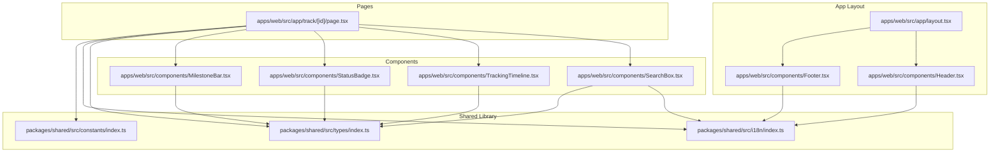
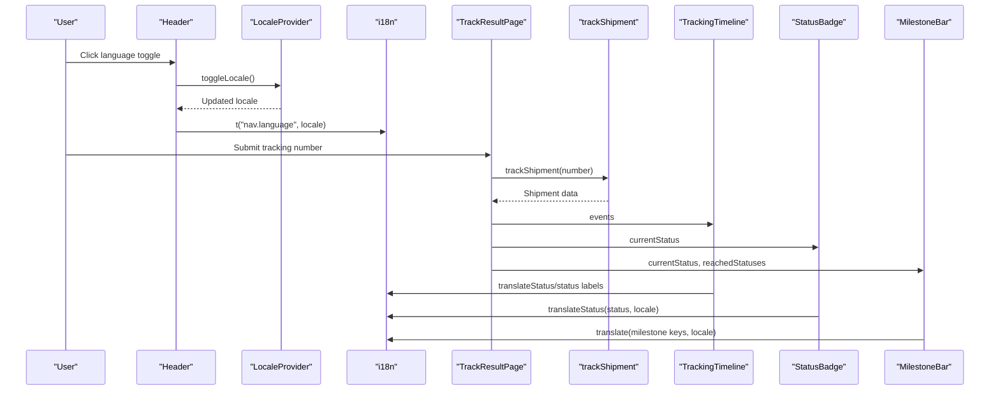
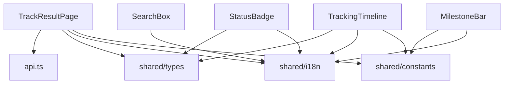

# Component Architecture

<cite>
**Referenced Files in This Document**
- [Header.tsx](file://apps/web/src/components/Header.tsx)
- [Footer.tsx](file://apps/web/src/components/Footer.tsx)
- [SearchBox.tsx](file://apps/web/src/components/SearchBox.tsx)
- [TrackingTimeline.tsx](file://apps/web/src/components/TrackingTimeline.tsx)
- [StatusBadge.tsx](file://apps/web/src/components/StatusBadge.tsx)
- [MilestoneBar.tsx](file://apps/web/src/components/MilestoneBar.tsx)
- [locale-context.tsx](file://apps/web/src/lib/locale-context.tsx)
- [layout.tsx](file://apps/web/src/app/layout.tsx)
- [page.tsx](file://apps/web/src/app/track/[id]/page.tsx)
- [api.ts](file://apps/web/src/lib/api.ts)
- [globals.css](file://apps/web/src/app/globals.css)
- [index.ts](file://packages/shared/src/types/index.ts)
- [index.ts](file://packages/shared/src/i18n/index.ts)
- [index.ts](file://packages/shared/src/constants/index.ts)
</cite>

## Table of Contents
1. [Introduction](#introduction)
2. [Project Structure](#project-structure)
3. [Core Components](#core-components)
4. [Architecture Overview](#architecture-overview)
5. [Detailed Component Analysis](#detailed-component-analysis)
6. [Dependency Analysis](#dependency-analysis)
7. [Performance Considerations](#performance-considerations)
8. [Troubleshooting Guide](#troubleshooting-guide)
9. [Conclusion](#conclusion)
10. [Appendices](#appendices)

## Introduction
This document provides comprehensive documentation for the frontend component architecture of the TrackFlow application. It focuses on five key components: Header, Footer, SearchBox, TrackingTimeline, StatusBadge, and MilestoneBar. The documentation covers component responsibilities, props interfaces, state management, event handling, styling patterns, and integration guidelines. It also explains how these components interact with shared types, internationalization utilities, and the locale provider context.

## Project Structure
The frontend is organized as a Next.js application with a clear separation between UI components, shared libraries, and application pages. Components are placed under apps/web/src/components, while shared types, constants, and i18n resources live under packages/shared. The application layout wraps all pages with a global locale provider and renders a shared Header and Footer.

**Diagram sources**
- [layout.tsx:24-43](file://apps/web/src/app/layout.tsx#L24-L43)
- [Header.tsx:8-58](file://apps/web/src/components/Header.tsx#L8-L58)
- [Footer.tsx:7-36](file://apps/web/src/components/Footer.tsx#L7-L36)
- [SearchBox.tsx:20-122](file://apps/web/src/components/SearchBox.tsx#L20-L122)
- [TrackingTimeline.tsx:42-125](file://apps/web/src/components/TrackingTimeline.tsx#L42-L125)
- [StatusBadge.tsx:11-32](file://apps/web/src/components/StatusBadge.tsx#L11-L32)
- [MilestoneBar.tsx:26-137](file://apps/web/src/components/MilestoneBar.tsx#L26-L137)
- [page.tsx:25-242](file://apps/web/src/app/track/[id]/page.tsx#L25-L242)
- [index.ts:1-101](file://packages/shared/src/types/index.ts#L1-L101)
- [index.ts:1-61](file://packages/shared/src/i18n/index.ts#L1-L61)
- [index.ts:1-103](file://packages/shared/src/constants/index.ts#L1-L103)

**Section sources**
- [layout.tsx:24-43](file://apps/web/src/app/layout.tsx#L24-L43)
- [Header.tsx:8-58](file://apps/web/src/components/Header.tsx#L8-L58)
- [Footer.tsx:7-36](file://apps/web/src/components/Footer.tsx#L7-L36)
- [SearchBox.tsx:20-122](file://apps/web/src/components/SearchBox.tsx#L20-L122)
- [TrackingTimeline.tsx:42-125](file://apps/web/src/components/TrackingTimeline.tsx#L42-L125)
- [StatusBadge.tsx:11-32](file://apps/web/src/components/StatusBadge.tsx#L11-L32)
- [MilestoneBar.tsx:26-137](file://apps/web/src/components/MilestoneBar.tsx#L26-L137)
- [page.tsx:25-242](file://apps/web/src/app/track/[id]/page.tsx#L25-L242)
- [index.ts:1-101](file://packages/shared/src/types/index.ts#L1-L101)
- [index.ts:1-61](file://packages/shared/src/i18n/index.ts#L1-L61)
- [index.ts:1-103](file://packages/shared/src/constants/index.ts#L1-L103)

## Core Components
This section outlines the primary UI components and their roles within the application.

- Header: Provides branding, navigation links, and language switching via a locale toggle.
- Footer: Displays brand identity, description, and legal links with dynamic localization.
- SearchBox: Handles tracking number input with validation, submission, and sample number selection.
- TrackingTimeline: Renders shipment event history with localized date/time, location formatting, and status badges.
- StatusBadge: Visual indicator for a single tracking status with configurable size.
- MilestoneBar: Progress visualization across key logistics milestones with desktop and mobile layouts.

Each component integrates with the shared library for types, constants, and i18n, and relies on the locale context for language-aware rendering.

**Section sources**
- [Header.tsx:8-58](file://apps/web/src/components/Header.tsx#L8-L58)
- [Footer.tsx:7-36](file://apps/web/src/components/Footer.tsx#L7-L36)
- [SearchBox.tsx:20-122](file://apps/web/src/components/SearchBox.tsx#L20-L122)
- [TrackingTimeline.tsx:42-125](file://apps/web/src/components/TrackingTimeline.tsx#L42-L125)
- [StatusBadge.tsx:11-32](file://apps/web/src/components/StatusBadge.tsx#L11-L32)
- [MilestoneBar.tsx:26-137](file://apps/web/src/components/MilestoneBar.tsx#L26-L137)

## Architecture Overview
The application follows a layered architecture:
- Presentation Layer: Components render UI and manage local state.
- Shared Layer: Types, constants, and i18n provide cross-cutting concerns.
- Application Layer: Pages orchestrate data fetching and pass props to components.
- Context Layer: LocaleProvider supplies language preferences to components.

**Diagram sources**
- [Header.tsx:47-53](file://apps/web/src/components/Header.tsx#L47-L53)
- [locale-context.tsx:16-28](file://apps/web/src/lib/locale-context.tsx#L16-L28)
- [index.ts:54-60](file://packages/shared/src/i18n/index.ts#L54-L60)
- [page.tsx:35-68](file://apps/web/src/app/track/[id]/page.tsx#L35-L68)
- [api.ts:5-27](file://apps/web/src/lib/api.ts#L5-L27)
- [TrackingTimeline.tsx:42-125](file://apps/web/src/components/TrackingTimeline.tsx#L42-L125)
- [StatusBadge.tsx:11-32](file://apps/web/src/components/StatusBadge.tsx#L11-L32)
- [MilestoneBar.tsx:26-137](file://apps/web/src/components/MilestoneBar.tsx#L26-L137)

## Detailed Component Analysis

### Header Component
Responsibilities:
- Renders the application logo and brand name.
- Provides navigation links for Home, Pricing, and API Docs.
- Implements a language switch button using the locale context.

Props and Behavior:
- No props required. Uses useLocale to access locale and toggleLocale.
- Navigation links are internationalized using t("nav.*", locale).
- Language toggle button displays t("nav.language", locale) and triggers toggleLocale.

Styling Patterns:
- Uses glass effect styling for the header container.
- Hover states apply transitions and color changes for navigation items.
- Language toggle button uses globe icon and primary color accents.

Integration:
- Wrapped by LocaleProvider in the root layout.
- Consumes shared i18n utilities for text translation.

Usage Example:
- Place inside the root layout to appear on all pages.

**Section sources**
- [Header.tsx:8-58](file://apps/web/src/components/Header.tsx#L8-L58)
- [layout.tsx:35-39](file://apps/web/src/app/layout.tsx#L35-L39)
- [locale-context.tsx:30-32](file://apps/web/src/lib/locale-context.tsx#L30-L32)
- [index.ts:41-47](file://packages/shared/src/i18n/index.ts#L41-L47)

### Footer Component
Responsibilities:
- Displays the brand identity with logo and name.
- Shows a localized description and legal links.
- Reflects current locale for dynamic content.

Props and Behavior:
- No props required. Uses useLocale to localize content.
- Legal links reflect current locale for Privacy and Terms.

Styling Patterns:
- Centered layout with subtle borders and spacing.
- Branding uses primary color accents and consistent typography.

Integration:
- Wrapped by LocaleProvider in the root layout.
- Consumes shared i18n utilities for text translation.

Usage Example:
- Place inside the root layout to appear at the bottom of all pages.

**Section sources**
- [Footer.tsx:7-36](file://apps/web/src/components/Footer.tsx#L7-L36)
- [layout.tsx:35-39](file://apps/web/src/app/layout.tsx#L35-L39)
- [locale-context.tsx:30-32](file://apps/web/src/lib/locale-context.tsx#L30-L32)
- [index.ts:48-51](file://packages/shared/src/i18n/index.ts#L48-L51)

### SearchBox Component
Responsibilities:
- Accepts a tracking number input with validation.
- Submits the query via routing to the tracking result page.
- Provides sample tracking numbers for quick demos.

Props and Behavior:
- variant: "hero" (default) or "compact".
- State: trackingNumber managed locally.
- Validation: submission disabled when input length < 5.
- Submission: navigates to /track/[encodedNumber] on form submit or Enter key.

Events and Interactions:
- Form submit handler prevents default and validates input.
- Keyboard handler listens for Enter key to trigger submission.
- Sample number chips populate the input field on click.

Styling Patterns:
- Hero variant: larger input and button with gradient background.
- Compact variant: minimal input with gradient submit button.
- Focus styles and hover effects use transitions and shadows.

Integration:
- Uses shared i18n for placeholders and button text.
- Uses shared constants for sample numbers and colors.

Usage Example:
- Use variant="hero" on landing pages; variant="compact" in result page top bar.

**Section sources**
- [SearchBox.tsx:9-122](file://apps/web/src/components/SearchBox.tsx#L9-L122)
- [page.tsx:114-115](file://apps/web/src/app/track/[id]/page.tsx#L114-L115)
- [index.ts:21-25](file://packages/shared/src/i18n/index.ts#L21-L25)
- [globals.css:264-276](file://apps/web/src/app/globals.css#L264-L276)

### TrackingTimeline Component
Responsibilities:
- Renders a chronological timeline of shipment events.
- Localizes dates/times and locations based on locale.
- Highlights the current event with visual cues.

Props and Behavior:
- events: array of TrackingEvent from shared types.
- Empty state: renders a message with map pin icon when no events.

Formatting Functions:
- formatFullDate: produces locale-specific date/time strings.
- formatLocation: formats city/country according to locale.

Rendering Logic:
- Iterates over events to build timeline items with vertical connector lines.
- Current event is visually distinct with a pulsing dot and stronger text.
- Status badges use STATUS_COLORS and translateStatus for labels.

Integration:
- Consumes shared types for TrackingEvent and TrackingStatus.
- Uses shared constants for STATUS_COLORS and translateStatus.

Usage Example:
- Pass shipment.events from the tracking result page to render the timeline.

**Section sources**
- [TrackingTimeline.tsx:8-125](file://apps/web/src/components/TrackingTimeline.tsx#L8-L125)
- [index.ts:37-45](file://packages/shared/src/types/index.ts#L37-L45)
- [index.ts:45-57](file://packages/shared/src/constants/index.ts#L45-L57)
- [index.ts:54-60](file://packages/shared/src/i18n/index.ts#L54-L60)

### StatusBadge Component
Responsibilities:
- Displays a single tracking status with a small or medium size option.
- Shows a colored dot and localized status text.

Props and Behavior:
- status: TrackingStatus from shared types.
- size: "sm" or "md" (default "md").
- Color: derived from STATUS_COLORS for the given status.

Rendering:
- Uses translateStatus to localize the status text.
- Applies background color with transparency and a colored dot.

Integration:
- Consumes shared types and constants for status definitions and colors.
- Uses shared i18n for localized status labels.

Usage Example:
- Render on the tracking result page header alongside the tracking number.

**Section sources**
- [StatusBadge.tsx:6-32](file://apps/web/src/components/StatusBadge.tsx#L6-L32)
- [index.ts:1-13](file://packages/shared/src/types/index.ts#L1-L13)
- [index.ts:45-57](file://packages/shared/src/constants/index.ts#L45-L57)
- [index.ts:54-60](file://packages/shared/src/i18n/index.ts#L54-L60)

### MilestoneBar Component
Responsibilities:
- Visualizes shipment progress across key logistics milestones.
- Supports both desktop and mobile layouts.
- Highlights error states with a banner.

Props and Behavior:
- currentStatus: TrackingStatus indicating the active milestone.
- reachedStatuses: array of statuses that have occurred.

Rendering:
- Desktop: horizontal bar with dots and connecting lines.
- Mobile: vertical stack of milestone items.
- Error state: displays a banner for FAILED, RETURNED, or EXPIRED.

Integration:
- Consumes shared constants for MILESTONE_ORDER and STATUS_COLORS.
- Uses shared i18n for milestone labels and error messages.

Usage Example:
- Render on the tracking result page below the summary card.

**Section sources**
- [MilestoneBar.tsx:21-137](file://apps/web/src/components/MilestoneBar.tsx#L21-L137)
- [index.ts:77-85](file://packages/shared/src/constants/index.ts#L77-L85)
- [index.ts:45-57](file://packages/shared/src/constants/index.ts#L45-L57)
- [index.ts:35-40](file://packages/shared/src/i18n/index.ts#L35-L40)

## Dependency Analysis
The components depend on shared resources and the locale context. The tracking result page orchestrates data fetching and passes props to child components.

**Diagram sources**
- [page.tsx:25-242](file://apps/web/src/app/track/[id]/page.tsx#L25-L242)
- [api.ts:5-27](file://apps/web/src/lib/api.ts#L5-L27)
- [index.ts:1-101](file://packages/shared/src/types/index.ts#L1-L101)
- [index.ts:1-61](file://packages/shared/src/i18n/index.ts#L1-L61)
- [index.ts:1-103](file://packages/shared/src/constants/index.ts#L1-L103)
- [SearchBox.tsx:20-122](file://apps/web/src/components/SearchBox.tsx#L20-L122)
- [TrackingTimeline.tsx:42-125](file://apps/web/src/components/TrackingTimeline.tsx#L42-L125)
- [StatusBadge.tsx:11-32](file://apps/web/src/components/StatusBadge.tsx#L11-L32)
- [MilestoneBar.tsx:26-137](file://apps/web/src/components/MilestoneBar.tsx#L26-L137)

**Section sources**
- [page.tsx:25-242](file://apps/web/src/app/track/[id]/page.tsx#L25-L242)
- [api.ts:5-27](file://apps/web/src/lib/api.ts#L5-L27)
- [index.ts:1-101](file://packages/shared/src/types/index.ts#L1-L101)
- [index.ts:1-61](file://packages/shared/src/i18n/index.ts#L1-L61)
- [index.ts:1-103](file://packages/shared/src/constants/index.ts#L1-L103)

## Performance Considerations
- Memoization: Consider memoizing expensive computations in components that receive large datasets (e.g., timeline rendering).
- Lazy Loading: Defer non-critical assets and animations until after initial render.
- CSS Variables: Utilize CSS variables for theme updates to minimize reflows.
- Event Handlers: Debounce input handlers where appropriate to reduce unnecessary re-renders.
- Conditional Rendering: Render empty states efficiently to avoid heavy DOM structures.

## Troubleshooting Guide
Common Issues and Resolutions:
- Locale Toggle Not Working:
  - Verify LocaleProvider is wrapping the application layout.
  - Ensure useLocale is used within the provider context.
- Translation Keys Missing:
  - Confirm keys exist in shared i18n and are properly exported.
  - Check locale prop passed to components.
- Timeline Not Rendering:
  - Ensure events prop is an array of TrackingEvent with valid timestamps and locations.
  - Verify STATUS_COLORS mapping includes all used TrackingStatus values.
- StatusBadge Color Incorrect:
  - Confirm TrackingStatus is valid and present in STATUS_COLORS.
- MilestoneBar Layout Issues:
  - Ensure currentStatus and reachedStatuses arrays contain valid TrackingStatus values.
  - Check MILESTONE_ORDER alignment with expected milestone sequence.

**Section sources**
- [locale-context.tsx:16-28](file://apps/web/src/lib/locale-context.tsx#L16-L28)
- [index.ts:19-60](file://packages/shared/src/i18n/index.ts#L19-L60)
- [index.ts:45-85](file://packages/shared/src/constants/index.ts#L45-L85)
- [TrackingTimeline.tsx:42-125](file://apps/web/src/components/TrackingTimeline.tsx#L42-L125)
- [MilestoneBar.tsx:26-137](file://apps/web/src/components/MilestoneBar.tsx#L26-L137)

## Conclusion
The TrackFlow frontend components are designed with modularity, localization, and responsive UX in mind. They leverage shared types, constants, and i18n utilities to ensure consistency across the application. The Header and Footer provide cohesive branding and navigation, while SearchBox, TrackingTimeline, StatusBadge, and MilestoneBar deliver a rich tracking experience. Integrating these components requires adherence to their props interfaces and locale-aware rendering patterns.

## Appendices

### Props Interfaces Summary
- SearchBoxProps
  - variant?: "hero" | "compact"
- TrackingTimelineProps
  - events: TrackingEvent[]
- StatusBadgeProps
  - status: TrackingStatus
  - size?: "sm" | "md"
- MilestoneBarProps
  - currentStatus: TrackingStatus
  - reachedStatuses: TrackingStatus[]

**Section sources**
- [SearchBox.tsx:9-11](file://apps/web/src/components/SearchBox.tsx#L9-L11)
- [TrackingTimeline.tsx:8-10](file://apps/web/src/components/TrackingTimeline.tsx#L8-L10)
- [StatusBadge.tsx:6-9](file://apps/web/src/components/StatusBadge.tsx#L6-L9)
- [MilestoneBar.tsx:21-24](file://apps/web/src/components/MilestoneBar.tsx#L21-L24)

### Styling Patterns Reference
- Component-level CSS classes:
  - Card: .card, .card-interactive
  - Search Input: .search-container
  - Milestone Progress: .milestone-dot, .milestone-line
  - Timeline: .timeline-item, .timeline-dot
  - Badge: .status-badge
- Global gradients and shadows:
  - --gradient-primary-btn, --shadow-primary
- Animation utilities:
  - .animate-fade-in, .animate-fade-in-up, .animate-pulse-dot

**Section sources**
- [globals.css:242-320](file://apps/web/src/app/globals.css#L242-L320)
- [globals.css:48-66](file://apps/web/src/app/globals.css#L48-L66)
- [globals.css:141-229](file://apps/web/src/app/globals.css#L141-L229)