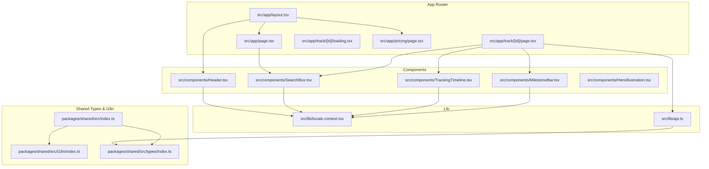
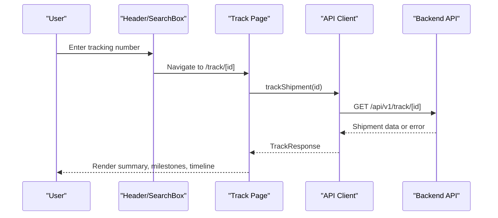
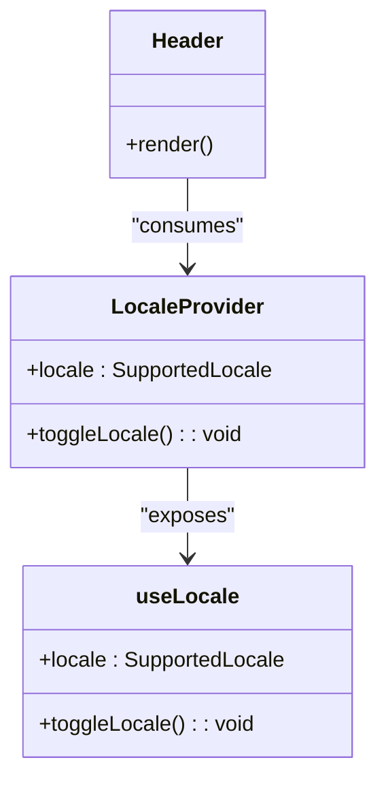
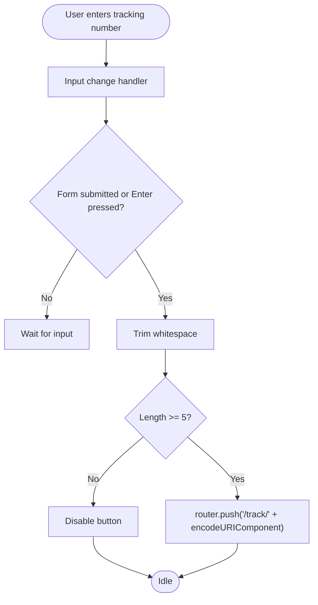
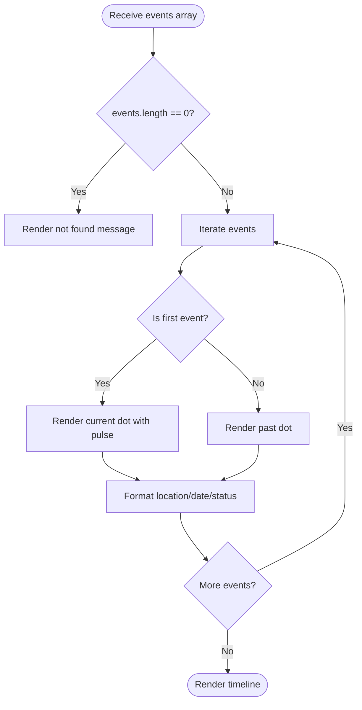
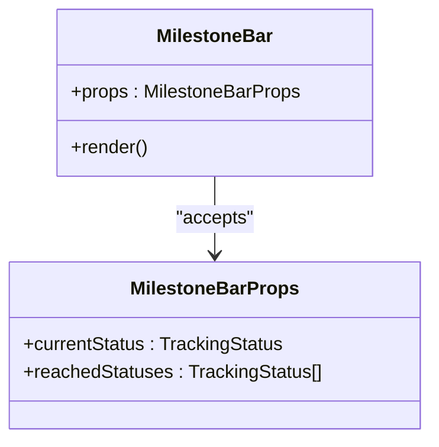
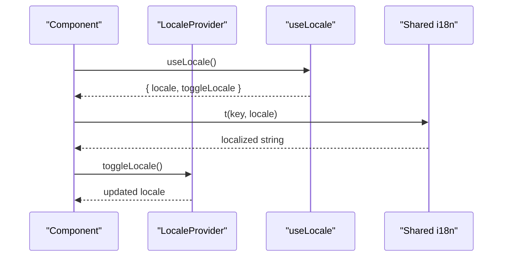
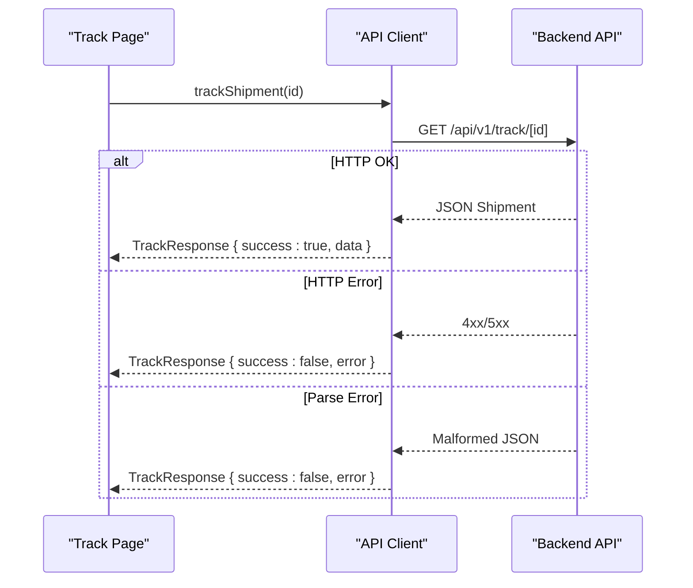
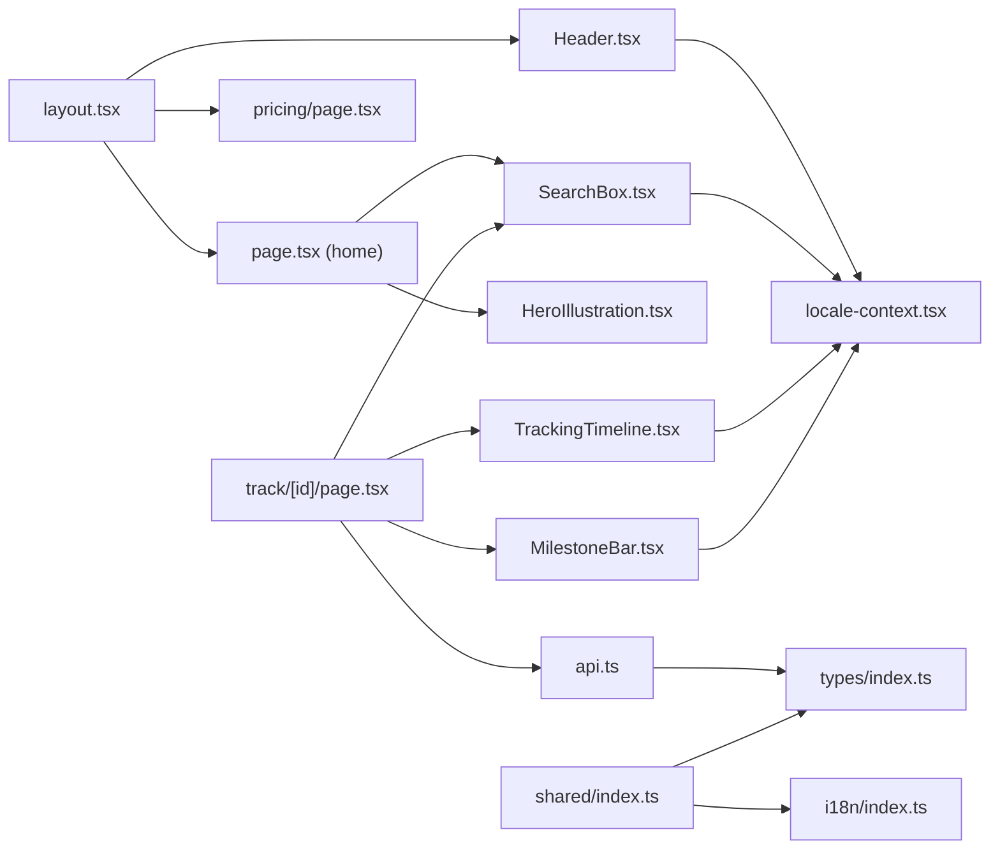

# Frontend Application (Next.js)

<cite>
**Referenced Files in This Document**
- [layout.tsx](file://apps/web/src/app/layout.tsx)
- [page.tsx](file://apps/web/src/app/page.tsx)
- [page.tsx](file://apps/web/src/app/track/[id]/page.tsx)
- [loading.tsx](file://apps/web/src/app/track/[id]/loading.tsx)
- [page.tsx](file://apps/web/src/app/pricing/page.tsx)
- [Header.tsx](file://apps/web/src/components/Header.tsx)
- [SearchBox.tsx](file://apps/web/src/components/SearchBox.tsx)
- [TrackingTimeline.tsx](file://apps/web/src/components/TrackingTimeline.tsx)
- [MilestoneBar.tsx](file://apps/web/src/components/MilestoneBar.tsx)
- [HeroIllustration.tsx](file://apps/web/src/components/HeroIllustration.tsx)
- [locale-context.tsx](file://apps/web/src/lib/locale-context.tsx)
- [api.ts](file://apps/web/src/lib/api.ts)
- [globals.css](file://apps/web/src/app/globals.css)
- [next.config.ts](file://apps/web/next.config.ts)
- [postcss.config.mjs](file://apps/web/postcss.config.mjs)
- [index.ts](file://packages/shared/src/index.ts)
- [index.ts](file://packages/shared/src/i18n/index.ts)
- [index.ts](file://packages/shared/src/types/index.ts)
</cite>

## Table of Contents
1. [Introduction](#introduction)
2. [Project Structure](#project-structure)
3. [Core Components](#core-components)
4. [Architecture Overview](#architecture-overview)
5. [Detailed Component Analysis](#detailed-component-analysis)
6. [Dependency Analysis](#dependency-analysis)
7. [Performance Considerations](#performance-considerations)
8. [Troubleshooting Guide](#troubleshooting-guide)
9. [Conclusion](#conclusion)
10. [Appendices](#appendices)

## Introduction
This document describes the Next.js frontend application for a cross-border shipment tracking platform. It covers the app router structure, page components, and component architecture. It explains the Header component with navigation and language switching, the SearchBox for user input, and the TrackingTimeline for displaying shipment data. It also documents styling with TailwindCSS, internationalization implementation with locale context, responsive design patterns, component composition patterns, prop interfaces, and integration with the backend API. Finally, it outlines the user workflow from search to result display and error handling strategies.

## Project Structure
The frontend is organized as a Next.js app under apps/web. The app router follows file-based routing conventions, with pages under src/app. Shared logic and types are provided by the packages/shared package. Styling is centralized in globals.css with TailwindCSS configured via PostCSS.

**Diagram sources**
- [layout.tsx:24-43](file://apps/web/src/app/layout.tsx#L24-L43)
- [page.tsx:60-444](file://apps/web/src/app/page.tsx#L60-L444)
- [page.tsx:25-242](file://apps/web/src/app/track/[id]/page.tsx#L25-L242)
- [loading.tsx:1-19](file://apps/web/src/app/track/[id]/loading.tsx#L1-L19)
- [page.tsx:97-216](file://apps/web/src/app/pricing/page.tsx#L97-L216)
- [Header.tsx:8-58](file://apps/web/src/components/Header.tsx#L8-L58)
- [SearchBox.tsx:20-122](file://apps/web/src/components/SearchBox.tsx#L20-L122)
- [TrackingTimeline.tsx:42-125](file://apps/web/src/components/TrackingTimeline.tsx#L42-L125)
- [MilestoneBar.tsx:26-137](file://apps/web/src/components/MilestoneBar.tsx#L26-L137)
- [HeroIllustration.tsx:1-238](file://apps/web/src/components/HeroIllustration.tsx#L1-L238)
- [locale-context.tsx:16-28](file://apps/web/src/lib/locale-context.tsx#L16-L28)
- [api.ts:5-55](file://apps/web/src/lib/api.ts#L5-L55)
- [index.ts:1-4](file://packages/shared/src/index.ts#L1-L4)
- [index.ts:1-61](file://packages/shared/src/i18n/index.ts#L1-L61)
- [index.ts:1-101](file://packages/shared/src/types/index.ts#L1-L101)

**Section sources**
- [layout.tsx:1-44](file://apps/web/src/app/layout.tsx#L1-L44)
- [page.tsx:1-445](file://apps/web/src/app/page.tsx#L1-L445)
- [page.tsx:1-263](file://apps/web/src/app/track/[id]/page.tsx#L1-L263)
- [loading.tsx:1-19](file://apps/web/src/app/track/[id]/loading.tsx#L1-L19)
- [page.tsx:1-217](file://apps/web/src/app/pricing/page.tsx#L1-L217)
- [Header.tsx:1-59](file://apps/web/src/components/Header.tsx#L1-L59)
- [SearchBox.tsx:1-123](file://apps/web/src/components/SearchBox.tsx#L1-L123)
- [TrackingTimeline.tsx:1-126](file://apps/web/src/components/TrackingTimeline.tsx#L1-L126)
- [MilestoneBar.tsx:1-138](file://apps/web/src/components/MilestoneBar.tsx#L1-L138)
- [HeroIllustration.tsx:1-238](file://apps/web/src/components/HeroIllustration.tsx#L1-L238)
- [locale-context.tsx:1-33](file://apps/web/src/lib/locale-context.tsx#L1-L33)
- [api.ts:1-56](file://apps/web/src/lib/api.ts#L1-L56)
- [globals.css:1-441](file://apps/web/src/app/globals.css#L1-L441)
- [next.config.ts:1-23](file://apps/web/next.config.ts#L1-L23)
- [postcss.config.mjs:1-8](file://apps/web/postcss.config.mjs#L1-L8)
- [index.ts:1-4](file://packages/shared/src/index.ts#L1-L4)
- [index.ts:1-61](file://packages/shared/src/i18n/index.ts#L1-L61)
- [index.ts:1-101](file://packages/shared/src/types/index.ts#L1-L101)

## Core Components
- Header: Provides branding, navigation links, and language toggle using locale context.
- SearchBox: Accepts tracking numbers, validates input, and navigates to the result page.
- TrackingTimeline: Renders shipment events as a localized, animated timeline.
- MilestoneBar: Visualizes progress across standardized logistics milestones.
- HeroIllustration: SVG-based animated illustration showcasing global shipping routes.
- LocaleProvider/useLocale: Manages language state and exposes locale-aware translation helpers.
- API client: Encapsulates backend calls for single and batch tracking.

Key prop interfaces:
- SearchBoxProps: variant ("hero" | "compact")
- TrackingTimelineProps: events (TrackingEvent[])
- MilestoneBarProps: currentStatus (TrackingStatus), reachedStatuses (TrackingStatus[])

**Section sources**
- [Header.tsx:8-58](file://apps/web/src/components/Header.tsx#L8-L58)
- [SearchBox.tsx:9-122](file://apps/web/src/components/SearchBox.tsx#L9-L122)
- [TrackingTimeline.tsx:8-125](file://apps/web/src/components/TrackingTimeline.tsx#L8-L125)
- [MilestoneBar.tsx:21-137](file://apps/web/src/components/MilestoneBar.tsx#L21-L137)
- [HeroIllustration.tsx:1-238](file://apps/web/src/components/HeroIllustration.tsx#L1-L238)
- [locale-context.tsx:6-32](file://apps/web/src/lib/locale-context.tsx#L6-L32)
- [api.ts:5-55](file://apps/web/src/lib/api.ts#L5-L55)
- [index.ts:37-61](file://packages/shared/src/types/index.ts#L37-L61)

## Architecture Overview
The application uses Next.js App Router with a root layout that wraps all pages. The layout injects the LocaleProvider so all pages and components can access locale-aware translations and toggles. Pages orchestrate data fetching and render reusable components. The API client abstracts backend communication and normalizes errors into user-friendly messages.

**Diagram sources**
- [Header.tsx:8-58](file://apps/web/src/components/Header.tsx#L8-L58)
- [SearchBox.tsx:20-45](file://apps/web/src/components/SearchBox.tsx#L20-L45)
- [page.tsx:35-68](file://apps/web/src/app/track/[id]/page.tsx#L35-L68)
- [api.ts:5-27](file://apps/web/src/lib/api.ts#L5-L27)
- [next.config.ts:5-20](file://apps/web/next.config.ts#L5-L20)

## Detailed Component Analysis

### Header Component
Responsibilities:
- Renders brand identity and navigation links.
- Exposes a language switch button that toggles locale via useLocale.
- Uses translation keys for nav items and language label.

Composition pattern:
- Uses Link for internal navigation.
- Integrates Lucide icons for globe and package visuals.
- Applies glass-like styling and transitions for interactive states.

**Diagram sources**
- [Header.tsx:8-58](file://apps/web/src/components/Header.tsx#L8-L58)
- [locale-context.tsx:16-32](file://apps/web/src/lib/locale-context.tsx#L16-L32)

**Section sources**
- [Header.tsx:1-59](file://apps/web/src/components/Header.tsx#L1-L59)
- [locale-context.tsx:1-33](file://apps/web/src/lib/locale-context.tsx#L1-L33)

### SearchBox Component
Responsibilities:
- Captures tracking number input with form submission and Enter key handling.
- Validates minimum length and navigates to the result route.
- Provides sample tracking numbers for quick demos.
- Supports two variants: hero and compact.

Prop interfaces:
- variant: "hero" | "compact"

Behavior:
- On submit, trims input and redirects to /track/[id] using next/navigation.
- Compact variant is used in pricing and track header for consistent UX.

**Diagram sources**
- [SearchBox.tsx:20-45](file://apps/web/src/components/SearchBox.tsx#L20-L45)

**Section sources**
- [SearchBox.tsx:1-123](file://apps/web/src/components/SearchBox.tsx#L1-L123)

### TrackingTimeline Component
Responsibilities:
- Renders a vertical timeline of tracking events.
- Localizes dates and locations based on locale.
- Highlights the most recent event with a pulsing dot and stronger emphasis.
- Handles empty state with a friendly message.

Prop interfaces:
- events: TrackingEvent[]

Localization:
- Uses translateStatus and t for status labels.
- Formats timestamps and locations differently for zh vs en.

**Diagram sources**
- [TrackingTimeline.tsx:42-125](file://apps/web/src/components/TrackingTimeline.tsx#L42-L125)

**Section sources**
- [TrackingTimeline.tsx:1-126](file://apps/web/src/components/TrackingTimeline.tsx#L1-L126)

### MilestoneBar Component
Responsibilities:
- Visualizes standardized logistics milestones with progress indicators.
- Highlights reached milestones and current state.
- Shows an error banner for failed, returned, or expired states.

Responsive design:
- Desktop: Horizontal bar with connecting lines.
- Mobile: Vertical stacked items.

**Diagram sources**
- [MilestoneBar.tsx:21-24](file://apps/web/src/components/MilestoneBar.tsx#L21-L24)
- [MilestoneBar.tsx:26-137](file://apps/web/src/components/MilestoneBar.tsx#L26-L137)

**Section sources**
- [MilestoneBar.tsx:1-138](file://apps/web/src/components/MilestoneBar.tsx#L1-L138)

### HeroIllustration Component
Responsibilities:
- Provides an animated SVG illustration of global shipping routes.
- Includes moving airplane, ship, and truck along predefined paths.
- Adds city markers and ambient particles with subtle animations.

Usage:
- Used in the home page hero section to communicate global coverage and motion.

**Section sources**
- [HeroIllustration.tsx:1-238](file://apps/web/src/components/HeroIllustration.tsx#L1-L238)

### Locale Provider and Internationalization
Implementation:
- LocaleProvider maintains locale state and exposes toggleLocale.
- useLocale returns the current locale and toggle function.
- Translation helpers t and translateStatus are imported from @logistic/shared.

Supported locales:
- zh and en.

Integration:
- Components consume useLocale to localize text and formats.
- Shared i18n module centralizes UI and status translations.

**Diagram sources**
- [locale-context.tsx:16-32](file://apps/web/src/lib/locale-context.tsx#L16-L32)
- [index.ts:54-60](file://packages/shared/src/i18n/index.ts#L54-L60)

**Section sources**
- [locale-context.tsx:1-33](file://apps/web/src/lib/locale-context.tsx#L1-L33)
- [index.ts:1-61](file://packages/shared/src/i18n/index.ts#L1-L61)

### API Integration
Client functions:
- trackShipment(trackingNumber): Fetches a single shipment.
- trackBatch(trackingNumbers[]): Posts a batch request.

Error handling:
- Non-OK HTTP responses are normalized into TrackResponse/BatchTrackResponse with user-friendly messages.
- JSON parsing failures are caught and reported as invalid data.

Routing:
- API base path is /api/v1.
- Next.js rewrites proxy /api/* to external backend during local development when API_URL is set.

**Diagram sources**
- [page.tsx:35-68](file://apps/web/src/app/track/[id]/page.tsx#L35-L68)
- [api.ts:5-27](file://apps/web/src/lib/api.ts#L5-L27)
- [next.config.ts:5-20](file://apps/web/next.config.ts#L5-L20)

**Section sources**
- [api.ts:1-56](file://apps/web/src/lib/api.ts#L1-L56)
- [page.tsx:1-263](file://apps/web/src/app/track/[id]/page.tsx#L1-L263)
- [next.config.ts:1-23](file://apps/web/next.config.ts#L1-L23)

## Dependency Analysis
- Root layout composes Header and wraps pages with LocaleProvider.
- Home page composes SearchBox and HeroIllustration.
- Track page composes API client, SearchBox, MilestoneBar, and TrackingTimeline.
- Shared package provides types and i18n utilities consumed by components and pages.
- Styling relies on TailwindCSS via PostCSS and a centralized design system in globals.css.

**Diagram sources**
- [layout.tsx:24-43](file://apps/web/src/app/layout.tsx#L24-L43)
- [page.tsx:60-444](file://apps/web/src/app/page.tsx#L60-L444)
- [page.tsx:25-242](file://apps/web/src/app/track/[id]/page.tsx#L25-L242)
- [page.tsx:97-216](file://apps/web/src/app/pricing/page.tsx#L97-L216)
- [Header.tsx:8-58](file://apps/web/src/components/Header.tsx#L8-L58)
- [SearchBox.tsx:20-122](file://apps/web/src/components/SearchBox.tsx#L20-L122)
- [TrackingTimeline.tsx:42-125](file://apps/web/src/components/TrackingTimeline.tsx#L42-L125)
- [MilestoneBar.tsx:26-137](file://apps/web/src/components/MilestoneBar.tsx#L26-L137)
- [HeroIllustration.tsx:1-238](file://apps/web/src/components/HeroIllustration.tsx#L1-L238)
- [locale-context.tsx:16-32](file://apps/web/src/lib/locale-context.tsx#L16-L32)
- [api.ts:5-55](file://apps/web/src/lib/api.ts#L5-L55)
- [index.ts:1-4](file://packages/shared/src/index.ts#L1-L4)
- [index.ts:1-61](file://packages/shared/src/i18n/index.ts#L1-L61)
- [index.ts:1-101](file://packages/shared/src/types/index.ts#L1-L101)

**Section sources**
- [layout.tsx:1-44](file://apps/web/src/app/layout.tsx#L1-L44)
- [page.tsx:1-445](file://apps/web/src/app/page.tsx#L1-L445)
- [page.tsx:1-263](file://apps/web/src/app/track/[id]/page.tsx#L1-L263)
- [page.tsx:1-217](file://apps/web/src/app/pricing/page.tsx#L1-L217)
- [Header.tsx:1-59](file://apps/web/src/components/Header.tsx#L1-L59)
- [SearchBox.tsx:1-123](file://apps/web/src/components/SearchBox.tsx#L1-L123)
- [TrackingTimeline.tsx:1-126](file://apps/web/src/components/TrackingTimeline.tsx#L1-L126)
- [MilestoneBar.tsx:1-138](file://apps/web/src/components/MilestoneBar.tsx#L1-L138)
- [HeroIllustration.tsx:1-238](file://apps/web/src/components/HeroIllustration.tsx#L1-L238)
- [locale-context.tsx:1-33](file://apps/web/src/lib/locale-context.tsx#L1-L33)
- [api.ts:1-56](file://apps/web/src/lib/api.ts#L1-L56)
- [index.ts:1-4](file://packages/shared/src/index.ts#L1-L4)
- [index.ts:1-61](file://packages/shared/src/i18n/index.ts#L1-L61)
- [index.ts:1-101](file://packages/shared/src/types/index.ts#L1-L101)

## Performance Considerations
- Client-side routing minimizes server requests for navigation.
- API client normalizes error responses to avoid expensive retries on malformed data.
- Components use lightweight state and memoization via Set for reached statuses.
- TailwindCSS utility classes keep styles declarative and scoped to components.
- SVG illustrations leverage hardware-accelerated animations for smooth motion.

## Troubleshooting Guide
Common issues and resolutions:
- No tracking data after search:
  - Verify the tracking number length and format.
  - Confirm backend availability and network connectivity.
  - Check normalized error messages returned by the API client.
- Language toggle not working:
  - Ensure LocaleProvider is rendered at the root layout level.
  - Confirm useLocale is used inside components.
- Route mismatch in local development:
  - Confirm API_URL environment variable and Next.js rewrites configuration.
- Timeline not rendering:
  - Validate that events array is passed and not empty.
  - Ensure locale is supported and translation keys exist.

**Section sources**
- [page.tsx:35-68](file://apps/web/src/app/track/[id]/page.tsx#L35-L68)
- [api.ts:12-27](file://apps/web/src/lib/api.ts#L12-L27)
- [layout.tsx:35-39](file://apps/web/src/app/layout.tsx#L35-L39)
- [locale-context.tsx:16-32](file://apps/web/src/lib/locale-context.tsx#L16-L32)
- [next.config.ts:5-20](file://apps/web/next.config.ts#L5-L20)
- [TrackingTimeline.tsx:42-52](file://apps/web/src/components/TrackingTimeline.tsx#L42-L52)

## Conclusion
The frontend application leverages Next.js App Router, a modular component architecture, and a shared design system to deliver a responsive, internationalized tracking experience. The Header, SearchBox, and TrackingTimeline form the core user journey, while the LocaleProvider and API client encapsulate localization and backend integration. TailwindCSS and SVG animations contribute to a polished, globally focused interface.

## Appendices

### Styling and Responsive Patterns
- Centralized design tokens and gradients in globals.css.
- Component-specific utilities (.card, .search-container, .milestone-dot, .timeline-item).
- Animation utilities for fade-in, shimmer, spin, and floating effects.
- Responsive variants for desktop and mobile layouts in MilestoneBar and SearchBox.

**Section sources**
- [globals.css:8-441](file://apps/web/src/app/globals.css#L8-L441)
- [MilestoneBar.tsx:38-115](file://apps/web/src/components/MilestoneBar.tsx#L38-L115)
- [SearchBox.tsx:47-71](file://apps/web/src/components/SearchBox.tsx#L47-L71)

### Backend API Routing
- Next.js rewrites proxy /api/* to external backend when API_URL is set.
- On Vercel, built-in API Routes handle /api/* directly without rewrites.

**Section sources**
- [next.config.ts:5-20](file://apps/web/next.config.ts#L5-L20)

### Data Models and Interfaces
- TrackingEvent, Shipment, TrackResponse, BatchTrackResponse, and related types.
- Standardized TrackingStatus enum with 10 cross-border statuses.

**Section sources**
- [index.ts:1-101](file://packages/shared/src/types/index.ts#L1-L101)