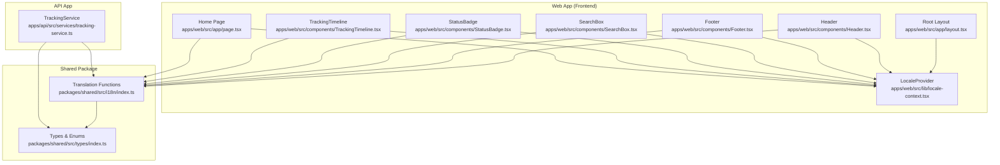
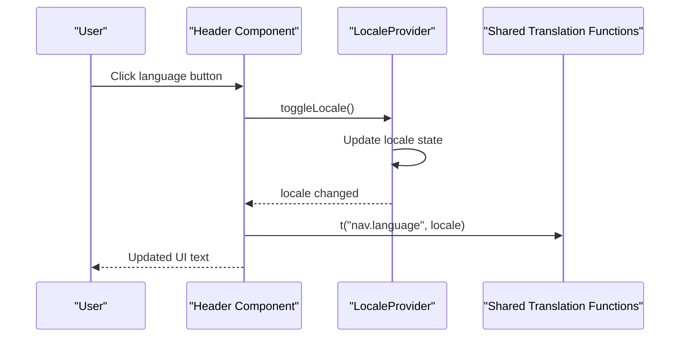
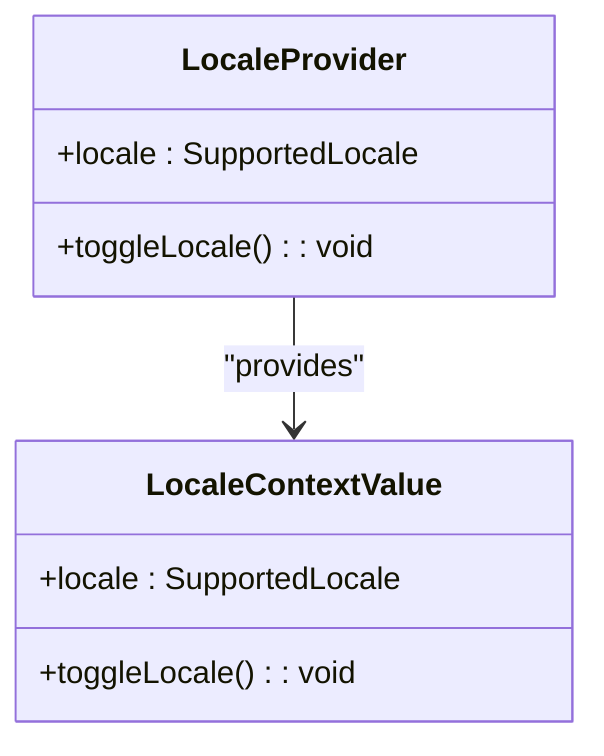
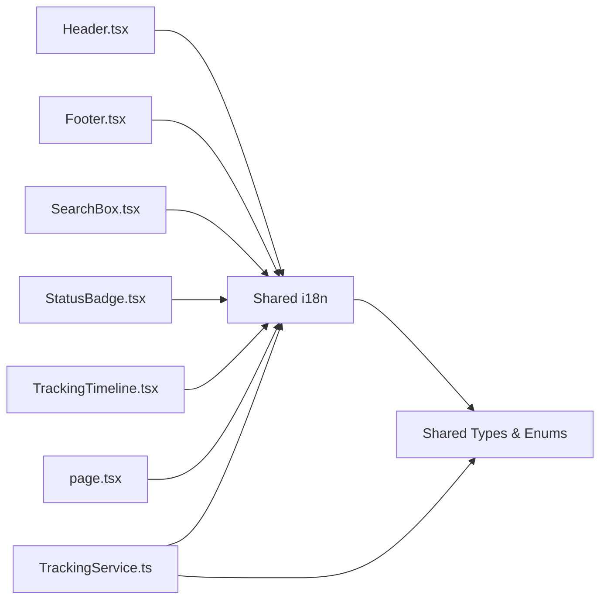
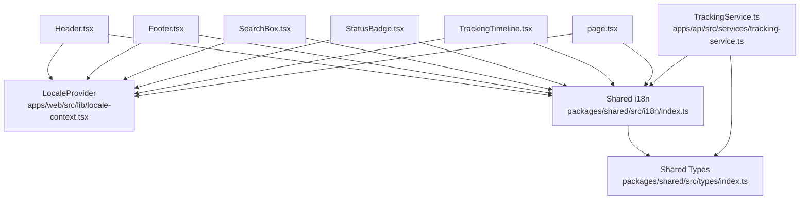

# Internationalization (i18n)

<cite>
**Referenced Files in This Document**
- [apps/web/src/lib/locale-context.tsx](file://apps/web/src/lib/locale-context.tsx)
- [apps/web/src/app/layout.tsx](file://apps/web/src/app/layout.tsx)
- [apps/web/src/components/Header.tsx](file://apps/web/src/components/Header.tsx)
- [apps/web/src/components/Footer.tsx](file://apps/web/src/components/Footer.tsx)
- [apps/web/src/components/SearchBox.tsx](file://apps/web/src/components/SearchBox.tsx)
- [apps/web/src/components/StatusBadge.tsx](file://apps/web/src/components/StatusBadge.tsx)
- [apps/web/src/components/TrackingTimeline.tsx](file://apps/web/src/components/TrackingTimeline.tsx)
- [apps/web/src/app/page.tsx](file://apps/web/src/app/page.tsx)
- [packages/shared/src/i18n/index.ts](file://packages/shared/src/i18n/index.ts)
- [packages/shared/src/types/index.ts](file://packages/shared/src/types/index.ts)
- [apps/api/src/services/tracking-service.ts](file://apps/api/src/services/tracking-service.ts)
</cite>

## Table of Contents
1. [Introduction](#introduction)
2. [Project Structure](#project-structure)
3. [Core Components](#core-components)
4. [Architecture Overview](#architecture-overview)
5. [Detailed Component Analysis](#detailed-component-analysis)
6. [Dependency Analysis](#dependency-analysis)
7. [Performance Considerations](#performance-considerations)
8. [Troubleshooting Guide](#troubleshooting-guide)
9. [Conclusion](#conclusion)
10. [Appendices](#appendices)

## Introduction
This document explains the internationalization (i18n) implementation and locale management in the project. It covers the LocaleProvider component and context-based language switching, translation resources for Chinese and English, locale detection and persistence, integration with shared internationalization resources, and component-level usage. It also provides guidelines for adding new languages, managing translation keys, handling right-to-left languages, and clarifies the relationship between frontend i18n and backend localization.

## Project Structure
The i18n system spans two layers:
- Frontend (Next.js web app): LocaleProvider and components that consume translations.
- Shared package: Translation functions and types used across frontend and backend.

**Diagram sources**
- [apps/web/src/lib/locale-context.tsx:1-33](file://apps/web/src/lib/locale-context.tsx#L1-L33)
- [apps/web/src/app/layout.tsx:1-44](file://apps/web/src/app/layout.tsx#L1-L44)
- [apps/web/src/components/Header.tsx:1-59](file://apps/web/src/components/Header.tsx#L1-L59)
- [apps/web/src/components/Footer.tsx:1-37](file://apps/web/src/components/Footer.tsx#L1-L37)
- [apps/web/src/components/SearchBox.tsx:1-123](file://apps/web/src/components/SearchBox.tsx#L1-L123)
- [apps/web/src/components/StatusBadge.tsx:1-33](file://apps/web/src/components/StatusBadge.tsx#L1-L33)
- [apps/web/src/components/TrackingTimeline.tsx:1-126](file://apps/web/src/components/TrackingTimeline.tsx#L1-L126)
- [apps/web/src/app/page.tsx:1-445](file://apps/web/src/app/page.tsx#L1-L445)
- [packages/shared/src/i18n/index.ts:1-61](file://packages/shared/src/i18n/index.ts#L1-L61)
- [packages/shared/src/types/index.ts:1-101](file://packages/shared/src/types/index.ts#L1-L101)
- [apps/api/src/services/tracking-service.ts:1-128](file://apps/api/src/services/tracking-service.ts#L1-L128)

**Section sources**
- [apps/web/src/lib/locale-context.tsx:1-33](file://apps/web/src/lib/locale-context.tsx#L1-L33)
- [apps/web/src/app/layout.tsx:1-44](file://apps/web/src/app/layout.tsx#L1-L44)
- [packages/shared/src/i18n/index.ts:1-61](file://packages/shared/src/i18n/index.ts#L1-L61)
- [packages/shared/src/types/index.ts:1-101](file://packages/shared/src/types/index.ts#L1-L101)

## Core Components
- LocaleProvider: A React context provider that manages the current locale and toggles between supported locales. It initializes to a default locale and exposes a toggle function to switch languages.
- Translation functions: Provided by the shared package, these include status translations and UI text translations keyed by locale.
- Components: Header, Footer, SearchBox, StatusBadge, TrackingTimeline, and the home page consume the locale context and translation functions to render localized content.

Key responsibilities:
- LocaleProvider: Holds state for the current locale and exposes a toggle function.
- Translation functions: Provide bilingual UI text and standardized status labels.
- Components: Render localized strings and adapt date/location formatting to the selected locale.

**Section sources**
- [apps/web/src/lib/locale-context.tsx:16-32](file://apps/web/src/lib/locale-context.tsx#L16-L32)
- [packages/shared/src/i18n/index.ts:54-60](file://packages/shared/src/i18n/index.ts#L54-L60)

## Architecture Overview
The frontend i18n architecture centers on a context provider and shared translation utilities. Components read the current locale from context and call translation functions to render localized text. Backend services rely on shared types and enums but do not implement frontend-style locale switching.

**Diagram sources**
- [apps/web/src/components/Header.tsx:47-53](file://apps/web/src/components/Header.tsx#L47-L53)
- [apps/web/src/lib/locale-context.tsx:16-28](file://apps/web/src/lib/locale-context.tsx#L16-L28)
- [packages/shared/src/i18n/index.ts:58-60](file://packages/shared/src/i18n/index.ts#L58-L60)

## Detailed Component Analysis

### LocaleProvider and Context
LocaleProvider creates a context with the current locale and a toggle function. The layout wraps the app with this provider so all components can access locale-aware APIs.

**Diagram sources**
- [apps/web/src/lib/locale-context.tsx:6-14](file://apps/web/src/lib/locale-context.tsx#L6-L14)
- [apps/web/src/lib/locale-context.tsx:16-28](file://apps/web/src/lib/locale-context.tsx#L16-L28)

**Section sources**
- [apps/web/src/lib/locale-context.tsx:16-32](file://apps/web/src/lib/locale-context.tsx#L16-L32)
- [apps/web/src/app/layout.tsx:24-42](file://apps/web/src/app/layout.tsx#L24-L42)

### Translation Resources: Chinese and English
The shared i18n module defines:
- Supported locales: Chinese and English.
- Status translations: Mapping of standardized tracking statuses to localized strings.
- UI translations: Keys for navigation, search, result sections, milestones, and tiers.

Usage patterns:
- Components import translation functions and pass the current locale to render localized text.
- Some components also adapt date and location formatting based on locale.

**Section sources**
- [packages/shared/src/i18n/index.ts:3](file://packages/shared/src/i18n/index.ts#L3)
- [packages/shared/src/i18n/index.ts:6-17](file://packages/shared/src/i18n/index.ts#L6-L17)
- [packages/shared/src/i18n/index.ts:19-52](file://packages/shared/src/i18n/index.ts#L19-L52)
- [packages/shared/src/i18n/index.ts:54-60](file://packages/shared/src/i18n/index.ts#L54-L60)

### Locale Detection and Persistence
- Initial detection: The root HTML element declares a default language attribute. The provider initializes to a default locale.
- User preference handling: The language toggle switches between supported locales.
- Persistence: There is no persistence mechanism in the current implementation. The locale is local to the browser session.

Recommendations:
- To persist user preference, store the chosen locale in storage and hydrate the provider state on mount.
- Consider reading initial locale from URL, cookies, or navigator language for automatic detection.

**Section sources**
- [apps/web/src/app/layout.tsx:30-33](file://apps/web/src/app/layout.tsx#L30-L33)
- [apps/web/src/lib/locale-context.tsx:17](file://apps/web/src/lib/locale-context.tsx#L17)
- [apps/web/src/lib/locale-context.tsx:19-21](file://apps/web/src/lib/locale-context.tsx#L19-L21)

### Integration with Shared Internationalization Resources
Components import translation functions from the shared package and use the current locale to resolve text. The shared package also exports types and enums used by both frontend and backend.

**Diagram sources**
- [apps/web/src/components/Header.tsx:4](file://apps/web/src/components/Header.tsx#L4)
- [apps/web/src/components/Footer.tsx:3](file://apps/web/src/components/Footer.tsx#L3)
- [apps/web/src/components/SearchBox.tsx:5](file://apps/web/src/components/SearchBox.tsx#L5)
- [apps/web/src/components/StatusBadge.tsx:3](file://apps/web/src/components/StatusBadge.tsx#L3)
- [apps/web/src/components/TrackingTimeline.tsx:4](file://apps/web/src/components/TrackingTimeline.tsx#L4)
- [apps/web/src/app/page.tsx:1](file://apps/web/src/app/page.tsx#L1)
- [packages/shared/src/i18n/index.ts:1](file://packages/shared/src/i18n/index.ts#L1)
- [packages/shared/src/types/index.ts:1](file://packages/shared/src/types/index.ts#L1)
- [apps/api/src/services/tracking-service.ts:1](file://apps/api/src/services/tracking-service.ts#L1)

### Component-Level Translation Usage
- Header: Renders navigation and language toggle using translation keys.
- Footer: Renders platform description and static links conditionally based on locale.
- SearchBox: Uses translation keys for placeholders and buttons.
- StatusBadge: Uses status translation function to display localized status labels.
- TrackingTimeline: Uses translation functions for status labels and UI messages, and adapts date/location formatting to locale.
- Home page: Uses conditional rendering for large blocks of text and statistics.

**Section sources**
- [apps/web/src/components/Header.tsx:30-52](file://apps/web/src/components/Header.tsx#L30-L52)
- [apps/web/src/components/Footer.tsx:22-30](file://apps/web/src/components/Footer.tsx#L22-L30)
- [apps/web/src/components/SearchBox.tsx:57-66](file://apps/web/src/components/SearchBox.tsx#L57-L66)
- [apps/web/src/components/StatusBadge.tsx:29](file://apps/web/src/components/StatusBadge.tsx#L29)
- [apps/web/src/components/TrackingTimeline.tsx:49-117](file://apps/web/src/components/TrackingTimeline.tsx#L49-L117)
- [apps/web/src/app/page.tsx:209-239](file://apps/web/src/app/page.tsx#L209-L239)

### Right-to-Left Languages
The current implementation supports left-to-right languages and does not include RTL-specific logic. When adding RTL languages:
- Add the locale to supported locales.
- Provide translation resources for all UI keys.
- Apply directionality and layout adjustments in components and global styles.
- Consider using a library for bidirectional text handling if needed.

[No sources needed since this section provides general guidance]

### Relationship Between Frontend i18n and Backend Localization
- Frontend: Manages user-facing text and locale switching using React context and shared translation functions.
- Backend: Uses shared types and enums for standardized data representation. Localization is not implemented in the backend service shown here.

Implications:
- Keep shared types consistent to avoid mismatches between frontend and backend data.
- If backend needs localized messages, introduce backend-side localization mechanisms separate from the frontend context.

**Section sources**
- [packages/shared/src/types/index.ts:1-13](file://packages/shared/src/types/index.ts#L1-L13)
- [apps/api/src/services/tracking-service.ts:1](file://apps/api/src/services/tracking-service.ts#L1)

## Dependency Analysis
The frontend components depend on the shared i18n module for translations and on the locale context for the current locale. The shared module depends on shared types. The API service depends on shared types and enums but does not implement frontend-style locale switching.

**Diagram sources**
- [apps/web/src/lib/locale-context.tsx:1-33](file://apps/web/src/lib/locale-context.tsx#L1-L33)
- [apps/web/src/components/Header.tsx:1-59](file://apps/web/src/components/Header.tsx#L1-L59)
- [apps/web/src/components/Footer.tsx:1-37](file://apps/web/src/components/Footer.tsx#L1-L37)
- [apps/web/src/components/SearchBox.tsx:1-123](file://apps/web/src/components/SearchBox.tsx#L1-L123)
- [apps/web/src/components/StatusBadge.tsx:1-33](file://apps/web/src/components/StatusBadge.tsx#L1-L33)
- [apps/web/src/components/TrackingTimeline.tsx:1-126](file://apps/web/src/components/TrackingTimeline.tsx#L1-L126)
- [apps/web/src/app/page.tsx:1-445](file://apps/web/src/app/page.tsx#L1-L445)
- [packages/shared/src/i18n/index.ts:1-61](file://packages/shared/src/i18n/index.ts#L1-L61)
- [packages/shared/src/types/index.ts:1-101](file://packages/shared/src/types/index.ts#L1-L101)
- [apps/api/src/services/tracking-service.ts:1-128](file://apps/api/src/services/tracking-service.ts#L1-L128)

**Section sources**
- [packages/shared/src/i18n/index.ts:1-61](file://packages/shared/src/i18n/index.ts#L1-L61)
- [packages/shared/src/types/index.ts:1-101](file://packages/shared/src/types/index.ts#L1-L101)
- [apps/api/src/services/tracking-service.ts:1-128](file://apps/api/src/services/tracking-service.ts#L1-L128)

## Performance Considerations
- Translation lookups are O(1) hash map accesses; overhead is negligible.
- Avoid unnecessary re-renders by memoizing derived values and using shallow comparisons where appropriate.
- Keep translation keys concise and hierarchical to simplify maintenance and reduce lookup costs.

[No sources needed since this section provides general guidance]

## Troubleshooting Guide
Common issues and resolutions:
- Missing translation key: If a key is not found, the translation function falls back to returning the key itself. Verify that the key exists in the shared translation resources.
- Incorrect locale switching: Ensure the toggle function updates the provider state and that components consuming the context re-render after the update.
- Mixed content: When combining shared translation functions with conditional rendering, ensure both sides of the condition are localized consistently.

**Section sources**
- [packages/shared/src/i18n/index.ts:58-60](file://packages/shared/src/i18n/index.ts#L58-L60)
- [apps/web/src/lib/locale-context.tsx:19-21](file://apps/web/src/lib/locale-context.tsx#L19-L21)

## Conclusion
The project implements a clean, context-driven i18n system with shared translation resources. Components consistently use translation functions and the locale context to render localized UI text. The backend relies on shared types and enums without frontend-style locale switching. Extending the system involves adding locales and translation keys, optionally persisting user preferences, and applying RTL considerations if needed.

[No sources needed since this section summarizes without analyzing specific files]

## Appendices

### Guidelines for Adding New Languages
- Extend supported locales in the shared i18n module.
- Add translation entries for all UI keys and status translations.
- Update components that hardcode text to use translation functions or conditional rendering.
- Test locale switching and ensure all UI surfaces render correctly.

**Section sources**
- [packages/shared/src/i18n/index.ts:3](file://packages/shared/src/i18n/index.ts#L3)
- [packages/shared/src/i18n/index.ts:19-52](file://packages/shared/src/i18n/index.ts#L19-L52)
- [packages/shared/src/i18n/index.ts:6-17](file://packages/shared/src/i18n/index.ts#L6-L17)

### Managing Translation Keys
- Use descriptive, hierarchical keys to avoid collisions.
- Keep keys stable across releases to prevent breaking existing translations.
- Centralize key definitions in the shared i18n module for consistency.

**Section sources**
- [packages/shared/src/i18n/index.ts:19-52](file://packages/shared/src/i18n/index.ts#L19-L52)

### Handling Right-to-Left Languages
- Add the new locale to supported locales.
- Provide translations for all keys.
- Apply directionality and layout adjustments in components and global styles.
- Consider using a dedicated library for bidirectional text if needed.

[No sources needed since this section provides general guidance]