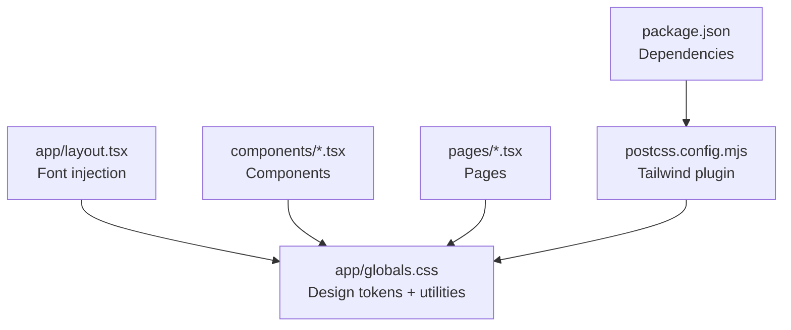
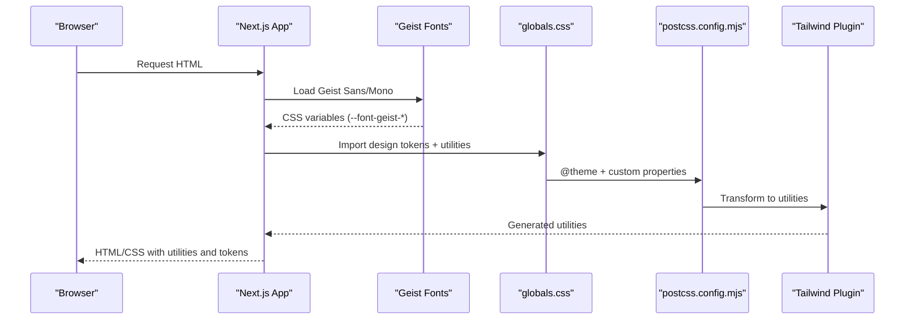
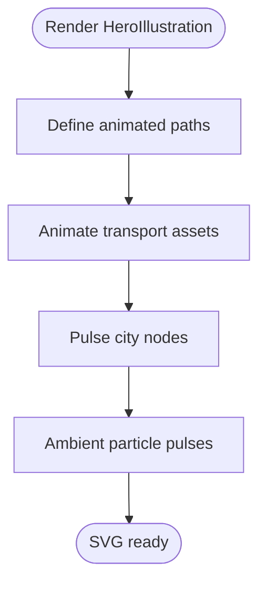
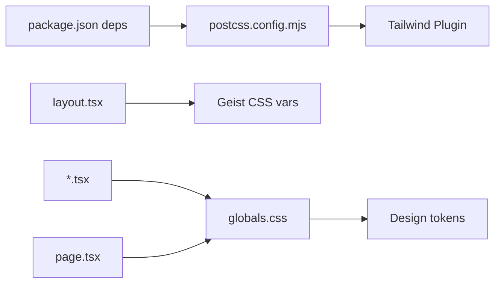

# Styling and Design System

<cite>
**Referenced Files in This Document**
- [globals.css](file://apps/web/src/app/globals.css)
- [layout.tsx](file://apps/web/src/app/layout.tsx)
- [page.tsx](file://apps/web/src/app/page.tsx)
- [HeroIllustration.tsx](file://apps/web/src/components/HeroIllustration.tsx)
- [SearchBox.tsx](file://apps/web/src/components/SearchBox.tsx)
- [Header.tsx](file://apps/web/src/components/Header.tsx)
- [Footer.tsx](file://apps/web/src/components/Footer.tsx)
- [StatusBadge.tsx](file://apps/web/src/components/StatusBadge.tsx)
- [MilestoneBar.tsx](file://apps/web/src/components/MilestoneBar.tsx)
- [postcss.config.mjs](file://apps/web/postcss.config.mjs)
- [package.json](file://apps/web/package.json)
</cite>

## Table of Contents
1. [Introduction](#introduction)
2. [Project Structure](#project-structure)
3. [Core Components](#core-components)
4. [Architecture Overview](#architecture-overview)
5. [Detailed Component Analysis](#detailed-component-analysis)
6. [Dependency Analysis](#dependency-analysis)
7. [Performance Considerations](#performance-considerations)
8. [Troubleshooting Guide](#troubleshooting-guide)
9. [Conclusion](#conclusion)

## Introduction
This document describes the styling approach and design system for the web application. It covers TailwindCSS configuration, custom CSS variables, design tokens, typography with Geist fonts, color schemes, spacing and radius scales, component styling patterns, the HeroIllustration visual element, dark mode considerations, responsive breakpoints, accessibility guidelines, and CSS-in-JS patterns used alongside a utility-first approach.

## Project Structure
The styling system is organized around:
- A central stylesheet that defines design tokens and reusable utilities
- Next.js app layout that injects font variables into the document head
- Component-level styling using Tailwind utilities and CSS custom properties
- SVG illustrations with animated motion primitives

**Diagram sources**
- [layout.tsx:8-16](file://apps/web/src/app/layout.tsx#L8-L16)
- [globals.css:8-121](file://apps/web/src/app/globals.css#L8-L121)
- [postcss.config.mjs:1-8](file://apps/web/postcss.config.mjs#L1-L8)
- [package.json:12-28](file://apps/web/package.json#L12-L28)

**Section sources**
- [layout.tsx:8-16](file://apps/web/src/app/layout.tsx#L8-L16)
- [globals.css:8-121](file://apps/web/src/app/globals.css#L8-L121)
- [postcss.config.mjs:1-8](file://apps/web/postcss.config.mjs#L1-L8)
- [package.json:12-28](file://apps/web/package.json#L12-L28)

## Core Components
- Design tokens: Centralized CSS variables define core palette, semantic colors, gradients, shadows, spacing, radii, and transitions.
- Typography: Geist Sans and Geist Mono are loaded via Next.js font providers and exposed as CSS variables for theme usage.
- Utilities: Reusable utility classes encapsulate common patterns (cards, search containers, badges, pricing highlights).
- Animations: A curated set of keyframes and utility classes enable micro-interactions and hero animations.
- Components: Header, Footer, SearchBox, StatusBadge, MilestoneBar, and HeroIllustration demonstrate consistent styling patterns.

**Section sources**
- [globals.css:8-121](file://apps/web/src/app/globals.css#L8-L121)
- [layout.tsx:8-16](file://apps/web/src/app/layout.tsx#L8-L16)
- [Header.tsx:12-56](file://apps/web/src/components/Header.tsx#L12-L56)
- [Footer.tsx:11-34](file://apps/web/src/components/Footer.tsx#L11-L34)
- [SearchBox.tsx:20-122](file://apps/web/src/components/SearchBox.tsx#L20-L122)
- [StatusBadge.tsx:11-32](file://apps/web/src/components/StatusBadge.tsx#L11-L32)
- [MilestoneBar.tsx:26-137](file://apps/web/src/components/MilestoneBar.tsx#L26-L137)
- [HeroIllustration.tsx:1-238](file://apps/web/src/components/HeroIllustration.tsx#L1-L238)

## Architecture Overview
The styling pipeline integrates Next.js font providers, a PostCSS/Tailwind plugin chain, and a centralized stylesheet that exposes design tokens to components.

**Diagram sources**
- [layout.tsx:8-16](file://apps/web/src/app/layout.tsx#L8-L16)
- [globals.css:94-121](file://apps/web/src/app/globals.css#L94-L121)
- [postcss.config.mjs:1-8](file://apps/web/postcss.config.mjs#L1-L8)
- [package.json:20-26](file://apps/web/package.json#L20-L26)

## Detailed Component Analysis

### Design Tokens and CSS Variables
- Palette: Core background/surface/border, primary brand blue, semantic success/warning/error, text roles, and logistic accents (amber, teal, sky, violet).
- Gradients: Hero gradient, glow overlays, card hover, primary button, and shine effects.
- Shadows: Elevated card, hover, and primary glow shadows.
- Spacing: 4px base scale mapped to named tokens (e.g., --space-1 to --space-24).
- Radius: Corner radii from small to full.
- Transitions: Easing curves and durations for smooth interactions.

These tokens are exposed to Tailwind via @theme and referenced throughout components using CSS variables.

**Section sources**
- [globals.css:8-92](file://apps/web/src/app/globals.css#L8-L92)
- [globals.css:94-121](file://apps/web/src/app/globals.css#L94-L121)

### Typography System with Geist
- Font loading: Geist Sans and Geist Mono are loaded via Next.js font providers and injected as CSS variables (--font-geist-sans, --font-geist-mono).
- Theme mapping: Tailwind consumes these variables to set font families.
- Usage: Components reference the variables for consistent typography across the app.

Responsive typography is achieved through utility classes and component-specific sizing, with page.tsx demonstrating headline and paragraph scales.

**Section sources**
- [layout.tsx:8-16](file://apps/web/src/app/layout.tsx#L8-L16)
- [globals.css:119-120](file://apps/web/src/app/globals.css#L119-L120)
- [page.tsx:215-240](file://apps/web/src/app/page.tsx#L215-L240)

### Color Schemes and Accessibility
- Primary: Trust blue with hover/light variants and glow.
- Semantic: Success, warning, error with light variants for subtle backgrounds.
- Surface: Background, foreground, raised surface, borders.
- Accessibility: Color contrast maintained via careful palette selection; text roles (primary, secondary, tertiary, inverse) support readable hierarchy; interactive states use color + subtle elevation.

**Section sources**
- [globals.css:17-46](file://apps/web/src/app/globals.css#L17-L46)
- [globals.css:31-35](file://apps/web/src/app/globals.css#L31-L35)
- [Header.tsx:47-53](file://apps/web/src/components/Header.tsx#L47-L53)

### Spacing and Radius Systems
- Spacing scale: 4px increments mapped to named tokens enabling consistent gutters, paddings, and margins.
- Radius scale: Small to full-circle corners for cards, inputs, and interactive elements.

**Section sources**
- [globals.css:67-84](file://apps/web/src/app/globals.css#L67-L84)

### Component Styling Patterns
- Cards: Elevated surfaces with hover transforms and border transitions.
- Inputs: Focus-within states with border and shadow highlights.
- Badges: Dynamic color and background blending with rounded pill shapes.
- Pricing: Featured card with accent strip and elevated shadow.
- Utilities: Glass morphism, gradient text, carrier tags, sample chips, hero cards, and stats items.

**Section sources**
- [globals.css:242-259](file://apps/web/src/app/globals.css#L242-L259)
- [globals.css:264-275](file://apps/web/src/app/globals.css#L264-L275)
- [globals.css:310-319](file://apps/web/src/app/globals.css#L310-L319)
- [globals.css:324-342](file://apps/web/src/app/globals.css#L324-L342)
- [globals.css:347-358](file://apps/web/src/app/globals.css#L347-L358)
- [globals.css:360-384](file://apps/web/src/app/globals.css#L360-L384)
- [globals.css:386-407](file://apps/web/src/app/globals.css#L386-L407)
- [globals.css:410-417](file://apps/web/src/app/globals.css#L410-L417)
- [globals.css:420-440](file://apps/web/src/app/globals.css#L420-L440)

### HeroIllustration Component
HeroIllustration is a custom SVG illustration featuring:
- Animated motion paths for air, sea, and ground transport.
- Floating city nodes with pulsing rings and labels.
- Micro-interactions using SVG animate and animateMotion elements.
- Complementary CSS classes (e.g., hero-card, animate-float-card-*) for floating cards in the hero section.

**Diagram sources**
- [HeroIllustration.tsx:9-16](file://apps/web/src/components/HeroIllustration.tsx#L9-L16)
- [HeroIllustration.tsx:59-97](file://apps/web/src/components/HeroIllustration.tsx#L59-L97)
- [HeroIllustration.tsx:146-200](file://apps/web/src/components/HeroIllustration.tsx#L146-L200)
- [HeroIllustration.tsx:222-234](file://apps/web/src/components/HeroIllustration.tsx#L222-L234)

**Section sources**
- [HeroIllustration.tsx:1-238](file://apps/web/src/components/HeroIllustration.tsx#L1-L238)
- [page.tsx:164-204](file://apps/web/src/app/page.tsx#L164-L204)

### Page-Level Styling and Layout
- Hero section: Gradient backgrounds, glow overlays, and floating cards leverage design tokens and utilities.
- Transport mode bar: Accent colors for modes (air, sea, ground) use logistic accent tokens.
- Carrier trust bar: Grid of carrier tags with hover interactivity.
- Feature cards: Interactive cards with hover transforms and color accents.
- Call-to-action: Full-width gradient CTA with centered content.

**Section sources**
- [page.tsx:144-270](file://apps/web/src/app/page.tsx#L144-L270)
- [page.tsx:272-305](file://apps/web/src/app/page.tsx#L272-L305)
- [page.tsx:307-324](file://apps/web/src/app/page.tsx#L307-L324)
- [page.tsx:368-412](file://apps/web/src/app/page.tsx#L368-L412)
- [page.tsx:414-441](file://apps/web/src/app/page.tsx#L414-L441)

### Component-Specific Styling Conventions
- Header/Footer: Glass effect using backdrop filters; navigation items use hover states aligned with tokens.
- SearchBox: Dual variants (hero and compact) share a common container class with dynamic button gradients and sample chips.
- StatusBadge: Dynamic color and background derived from status color map; size variants adjust padding and font size.
- MilestoneBar: Responsive desktop/tablet layouts; active/current state uses glow and check icons; error states use status-specific colors.

**Section sources**
- [Header.tsx:12-56](file://apps/web/src/components/Header.tsx#L12-L56)
- [Footer.tsx:11-34](file://apps/web/src/components/Footer.tsx#L11-L34)
- [SearchBox.tsx:20-122](file://apps/web/src/components/SearchBox.tsx#L20-L122)
- [StatusBadge.tsx:11-32](file://apps/web/src/components/StatusBadge.tsx#L11-L32)
- [MilestoneBar.tsx:26-137](file://apps/web/src/components/MilestoneBar.tsx#L26-L137)

## Dependency Analysis
- TailwindCSS v4 is configured via a PostCSS plugin.
- Next.js loads Geist fonts and exposes CSS variables for theme consumption.
- Components consume both Tailwind utilities and CSS variables for consistent design.

**Diagram sources**
- [package.json:12-28](file://apps/web/package.json#L12-L28)
- [postcss.config.mjs:1-8](file://apps/web/postcss.config.mjs#L1-L8)
- [layout.tsx:8-16](file://apps/web/src/app/layout.tsx#L8-L16)
- [globals.css:94-121](file://apps/web/src/app/globals.css#L94-L121)

**Section sources**
- [package.json:12-28](file://apps/web/package.json#L12-L28)
- [postcss.config.mjs:1-8](file://apps/web/postcss.config.mjs#L1-L8)
- [layout.tsx:8-16](file://apps/web/src/app/layout.tsx#L8-L16)
- [globals.css:94-121](file://apps/web/src/app/globals.css#L94-L121)

## Performance Considerations
- CSS variables reduce duplication and enable runtime theme switching without rebuilding styles.
- SVG animations are scoped to illustrations; keep heavy animations off critical rendering paths.
- Prefer Tailwind utilities for common patterns to minimize custom CSS and improve caching.
- Use minimal JavaScript for styling (e.g., inline styles only for dynamic colors) to avoid layout thrashing.

## Troubleshooting Guide
- Fonts not loading: Verify font provider variables are present in the document head and Tailwind is consuming them.
- Missing utilities: Ensure Tailwind plugin is enabled and @theme directives are processed.
- Token mismatches: Confirm CSS variables match Tailwind’s @theme mapping and are applied consistently across components.
- Animation stutter: Reduce the number of simultaneous SVG animations or throttle their durations.

**Section sources**
- [layout.tsx:30-33](file://apps/web/src/app/layout.tsx#L30-L33)
- [globals.css:94-121](file://apps/web/src/app/globals.css#L94-L121)
- [postcss.config.mjs:1-8](file://apps/web/postcss.config.mjs#L1-L8)

## Conclusion
The design system combines TailwindCSS utilities with a centralized token-driven stylesheet, Next.js font providers, and component-specific patterns. This approach yields a cohesive, maintainable, and scalable styling architecture with strong support for responsiveness, accessibility, and performance.