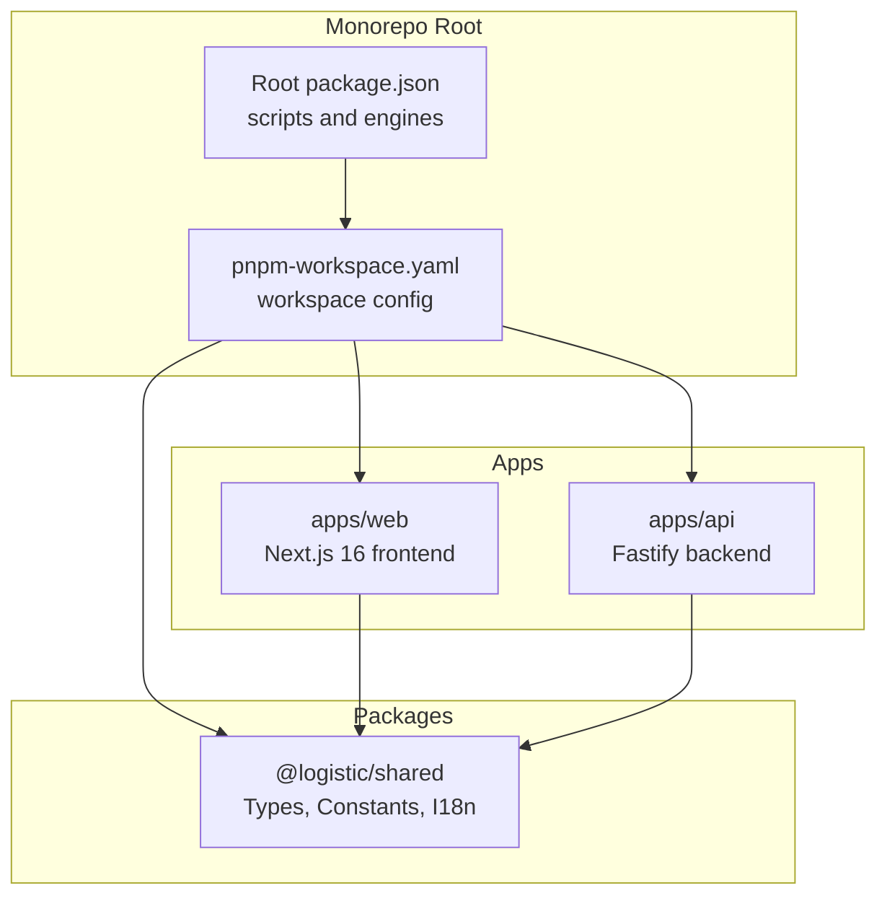
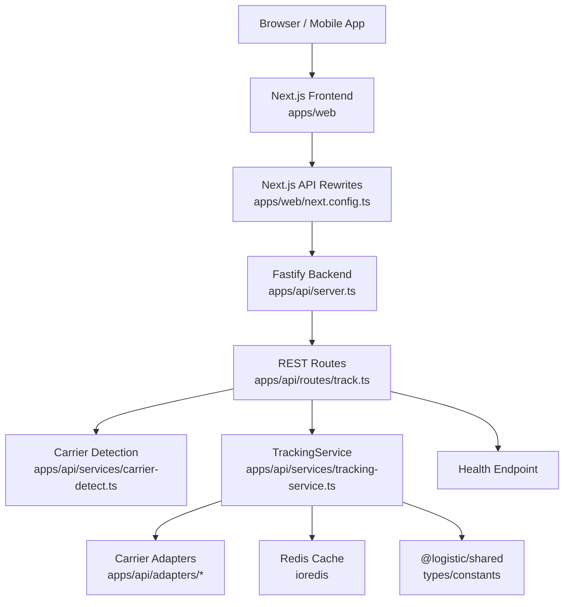
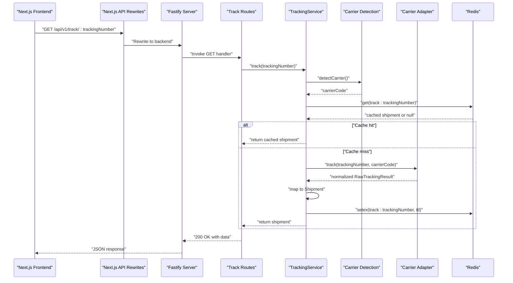
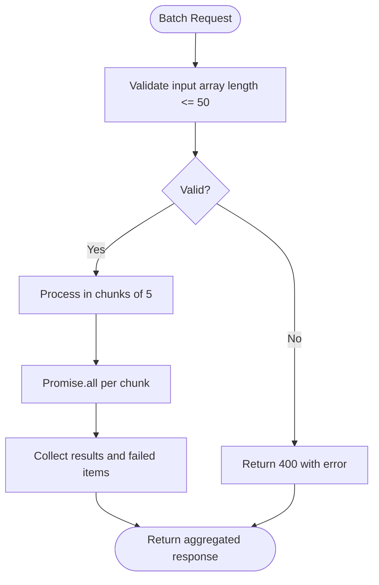
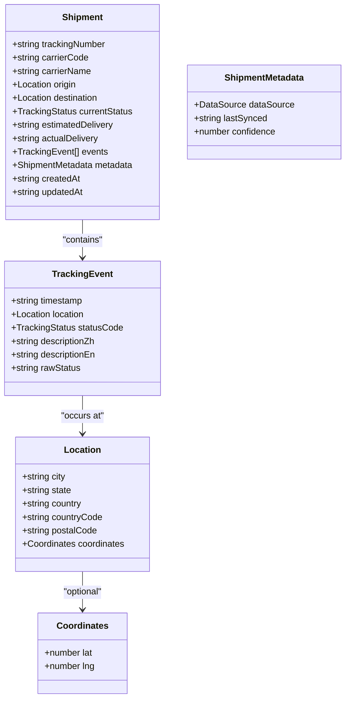
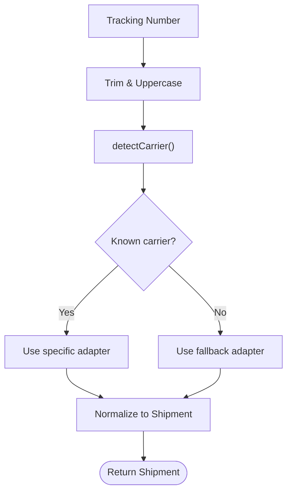
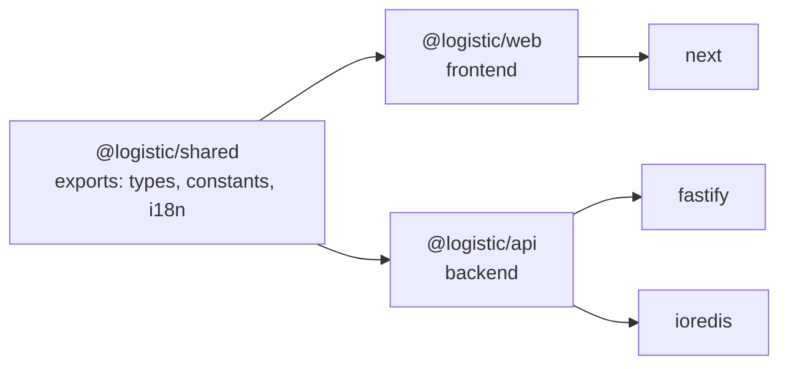

# Project Overview

<cite>
**Referenced Files in This Document**
- [package.json](file://package.json)
- [pnpm-workspace.yaml](file://pnpm-workspace.yaml)
- [apps/api/package.json](file://apps/api/package.json)
- [apps/web/package.json](file://apps/web/package.json)
- [packages/shared/package.json](file://packages/shared/package.json)
- [apps/api/src/server.ts](file://apps/api/src/server.ts)
- [apps/api/src/routes/track.ts](file://apps/api/src/routes/track.ts)
- [apps/api/src/services/tracking-service.ts](file://apps/api/src/services/tracking-service.ts)
- [apps/api/src/services/carrier-detect.ts](file://apps/api/src/services/carrier-detect.ts)
- [apps/api/src/adapters/base-adapter.ts](file://apps/api/src/adapters/base-adapter.ts)
- [apps/web/next.config.ts](file://apps/web/next.config.ts)
- [apps/web/src/lib/api.ts](file://apps/web/src/lib/api.ts)
- [packages/shared/src/types/index.ts](file://packages/shared/src/types/index.ts)
- [packages/shared/src/constants/index.ts](file://packages/shared/src/constants/index.ts)
</cite>

## Table of Contents
1. [Introduction](#introduction)
2. [Project Structure](#project-structure)
3. [Core Components](#core-components)
4. [Architecture Overview](#architecture-overview)
5. [Detailed Component Analysis](#detailed-component-analysis)
6. [Dependency Analysis](#dependency-analysis)
7. [Performance Considerations](#performance-considerations)
8. [Troubleshooting Guide](#troubleshooting-guide)
9. [Conclusion](#conclusion)

## Introduction
LOGISTIC is a cross-border logistics tracking platform designed to unify tracking data from diverse global carriers into a normalized, real-time experience. It serves two primary audiences:
- Business stakeholders: decision-makers, product managers, and operations teams who need visibility into shipment status, carrier performance, and user-tier analytics.
- Developers: engineers building integrations, extending carrier support, or operating the platform at scale.

Key platform capabilities include:
- Unified tracking for hundreds of carriers via adapter-driven integrations
- Real-time status updates with standardized statuses and localized descriptions
- Batch tracking for operational workflows
- Intelligent caching and rate limiting for reliability and performance
- Monorepo architecture enabling shared types, constants, and utilities across applications

Practical example: The platform supports tracking over 900 carriers globally by detecting carrier codes from tracking numbers and routing requests to appropriate carrier adapters, returning normalized shipment data with timestamps, locations, and statuses.

## Project Structure
The project follows a monorepo managed by pnpm workspaces, separating concerns into:
- apps/web: Next.js 16 frontend application serving the public UI and client-side tracking experiences
- apps/api: Fastify backend providing REST APIs for tracking and health checks
- packages/shared: Shared TypeScript packages exporting types, constants, and internationalization resources used by both apps

**Diagram sources**
- [pnpm-workspace.yaml:1-8](file://pnpm-workspace.yaml#L1-L8)
- [apps/web/package.json:1-30](file://apps/web/package.json#L1-L30)
- [apps/api/package.json:1-27](file://apps/api/package.json#L1-L27)
- [packages/shared/package.json:1-22](file://packages/shared/package.json#L1-L22)
- [package.json:1-19](file://package.json#L1-L19)

**Section sources**
- [pnpm-workspace.yaml:1-8](file://pnpm-workspace.yaml#L1-L8)
- [package.json:6-12](file://package.json#L6-L12)

## Core Components
- Next.js 16 Web Application
  - Provides the public UI, routing under the pages router, and client-side API calls to the backend
  - Uses a rewrite/proxy configuration to integrate with the backend during local development
  - Consumes shared types and constants for consistent UI behavior and data modeling

- Fastify API Server
  - Exposes REST endpoints for single and batch tracking
  - Implements CORS, rate limiting, and optional Redis caching
  - Orchestrates carrier detection and adapter routing to normalize shipment data

- Shared Package (@logistic/shared)
  - Defines standardized types for shipments, tracking events, and statuses
  - Provides constants for carriers, cache TTLs, user tiers, and milestone ordering
  - Supplies enums for tracking statuses and user tiers, ensuring consistency across apps

**Section sources**
- [apps/web/package.json:12-29](file://apps/web/package.json#L12-L29)
- [apps/api/package.json:13-26](file://apps/api/package.json#L13-L26)
- [packages/shared/package.json:8-13](file://packages/shared/package.json#L8-L13)
- [apps/web/next.config.ts:3-22](file://apps/web/next.config.ts#L3-L22)
- [apps/web/src/lib/api.ts:1-56](file://apps/web/src/lib/api.ts#L1-L56)
- [apps/api/src/server.ts:1-60](file://apps/api/src/server.ts#L1-L60)
- [apps/api/src/routes/track.ts:1-75](file://apps/api/src/routes/track.ts#L1-L75)
- [packages/shared/src/types/index.ts:1-101](file://packages/shared/src/types/index.ts#L1-L101)
- [packages/shared/src/constants/index.ts:1-103](file://packages/shared/src/constants/index.ts#L1-L103)

## Architecture Overview
The platform uses a client-server architecture with a monorepo:
- The frontend (Next.js) renders tracking pages and submits queries to the backend
- The backend (Fastify) validates requests, detects carriers, routes to adapters, normalizes data, caches results, and returns unified shipment records
- Shared packages define the contract for data models, statuses, and configuration

**Diagram sources**
- [apps/web/next.config.ts:3-22](file://apps/web/next.config.ts#L3-L22)
- [apps/api/src/server.ts:13-54](file://apps/api/src/server.ts#L13-L54)
- [apps/api/src/routes/track.ts:5-74](file://apps/api/src/routes/track.ts#L5-L74)
- [apps/api/src/services/carrier-detect.ts:1-27](file://apps/api/src/services/carrier-detect.ts#L1-L27)
- [apps/api/src/services/tracking-service.ts:10-127](file://apps/api/src/services/tracking-service.ts#L10-L127)
- [apps/api/src/adapters/base-adapter.ts:1-39](file://apps/api/src/adapters/base-adapter.ts#L1-L39)
- [packages/shared/src/types/index.ts:1-101](file://packages/shared/src/types/index.ts#L1-L101)
- [packages/shared/src/constants/index.ts:1-103](file://packages/shared/src/constants/index.ts#L1-L103)

## Detailed Component Analysis

### Technology Stack
- Next.js 16: React-based SSR/SSG framework powering the frontend UI and routing
- Fastify: High-performance Node.js web framework for the backend API server
- TypeScript: Strongly typed development across all packages for safety and maintainability
- Redis (via ioredis): Optional caching layer to reduce latency and downstream API load
- pnpm workspaces: Monorepo management enabling shared packages and streamlined builds

**Section sources**
- [apps/web/package.json:15, 22-28](file://apps/web/package.json#L15, 22-L28)
- [apps/api/package.json:15-19, 22-25](file://apps/api/package.json#L15-L19, 22-L25)
- [packages/shared/package.json:18-20](file://packages/shared/package.json#L18-L20)
- [pnpm-workspace.yaml:1-8](file://pnpm-workspace.yaml#L1-L8)

### API Workflow: Single Tracking Request
This sequence illustrates how a tracking request flows from the frontend to the backend and adapter integrations.

**Diagram sources**
- [apps/web/next.config.ts:8-19](file://apps/web/next.config.ts#L8-L19)
- [apps/api/src/server.ts:48-49](file://apps/api/src/server.ts#L48-L49)
- [apps/api/src/routes/track.ts:9-35](file://apps/api/src/routes/track.ts#L9-L35)
- [apps/api/src/services/tracking-service.ts:40-62](file://apps/api/src/services/tracking-service.ts#L40-L62)
- [apps/api/src/services/carrier-detect.ts:7-17](file://apps/api/src/services/carrier-detect.ts#L7-L17)
- [apps/api/src/adapters/base-adapter.ts:4-18](file://apps/api/src/adapters/base-adapter.ts#L4-L18)
- [apps/api/src/services/tracking-service.ts:107-126](file://apps/api/src/services/tracking-service.ts#L107-L126)

### Batch Tracking Flow
Batch tracking enables querying up to 50 tracking numbers concurrently with controlled concurrency and grouped results.

**Diagram sources**
- [apps/api/src/routes/track.ts:37-64](file://apps/api/src/routes/track.ts#L37-L64)
- [apps/api/src/services/tracking-service.ts:64-91](file://apps/api/src/services/tracking-service.ts#L64-L91)

### Data Model: Shipment and TrackingEvent
The shared types define a normalized representation of cross-border shipment data, including statuses, locations, and metadata.

**Diagram sources**
- [packages/shared/src/types/index.ts:24-67](file://packages/shared/src/types/index.ts#L24-L67)

### Carrier Support and Detection
The platform supports a wide range of carriers by combining:
- Carrier detection patterns that infer carrier codes from tracking number formats
- Adapter implementations for specific carriers (e.g., 17track, AfterShip) and a universal fallback
- Shared constants enumerating supported carriers and their metadata

**Diagram sources**
- [apps/api/src/services/carrier-detect.ts:7-26](file://apps/api/src/services/carrier-detect.ts#L7-L26)
- [packages/shared/src/constants/index.ts:59-102](file://packages/shared/src/constants/index.ts#L59-L102)
- [apps/api/src/adapters/base-adapter.ts:4-18](file://apps/api/src/adapters/base-adapter.ts#L4-L18)

## Dependency Analysis
The monorepo enforces clear boundaries:
- apps/web depends on @logistic/shared for types and constants
- apps/api depends on @logistic/shared and integrates Redis and Fastify
- packages/shared exports types, constants, and i18n modules for reuse

**Diagram sources**
- [apps/web/package.json:12-29](file://apps/web/package.json#L12-L29)
- [apps/api/package.json:13-26](file://apps/api/package.json#L13-L26)
- [packages/shared/package.json:8-13](file://packages/shared/package.json#L8-L13)

**Section sources**
- [apps/web/package.json:12-29](file://apps/web/package.json#L12-L29)
- [apps/api/package.json:13-26](file://apps/api/package.json#L13-L26)
- [packages/shared/package.json:8-13](file://packages/shared/package.json#L8-L13)

## Performance Considerations
- Caching: Redis-backed cache with TTLs tailored to shipment statuses reduces repeated carrier API calls and improves response times
- Concurrency: Batch tracking processes up to 50 items with controlled concurrency to balance throughput and resource usage
- Graceful degradation: Redis failures do not block requests; the system continues without cache
- Rate limiting: Built-in rate limiting protects upstream carrier APIs and maintains service stability

**Section sources**
- [apps/api/src/server.ts:25-46](file://apps/api/src/server.ts#L25-L46)
- [apps/api/src/services/tracking-service.ts:71-91](file://apps/api/src/services/tracking-service.ts#L71-L91)
- [packages/shared/src/constants/index.ts:31-43](file://packages/shared/src/constants/index.ts#L31-L43)

## Troubleshooting Guide
- Health endpoint: Verify backend availability and Redis connectivity via the health route
- Environment variables: Ensure API keys for carrier adapters and Redis URL are configured appropriately
- Frontend/backend integration: Confirm Next.js API rewrites are active locally when using a separate backend process
- Error responses: The API returns structured errors for invalid inputs, not found scenarios, and HTTP failures

**Section sources**
- [apps/api/src/routes/track.ts:66-73](file://apps/api/src/routes/track.ts#L66-L73)
- [apps/web/next.config.ts:8-19](file://apps/web/next.config.ts#L8-L19)
- [apps/web/src/lib/api.ts:12-26](file://apps/web/src/lib/api.ts#L12-L26)

## Conclusion
LOGISTIC delivers a scalable, developer-friendly platform for cross-border shipment tracking. Its monorepo architecture, shared contracts, and adapter-driven design enable rapid expansion to new carriers while maintaining a consistent user experience. With Next.js 16 and Fastify, the platform balances developer productivity with performance, and with Redis caching and rate limiting, it remains robust under real-world loads.