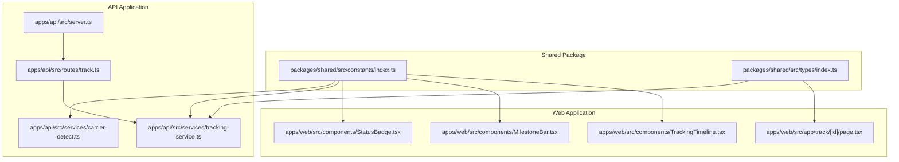
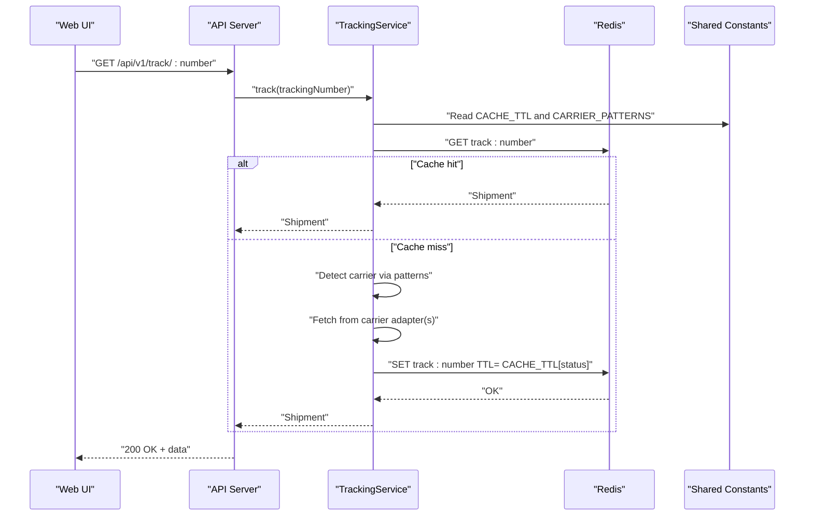
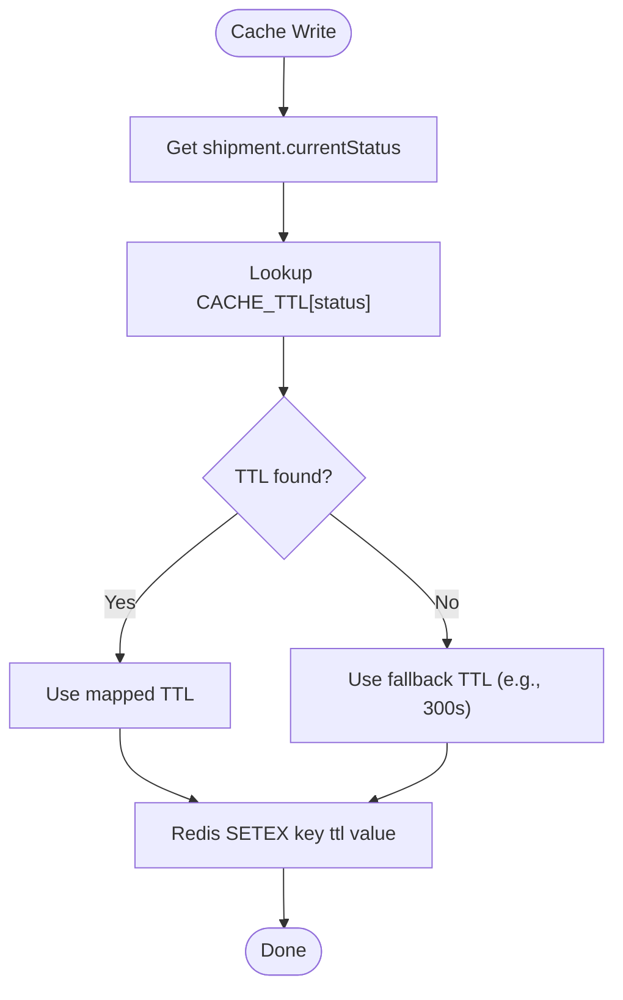
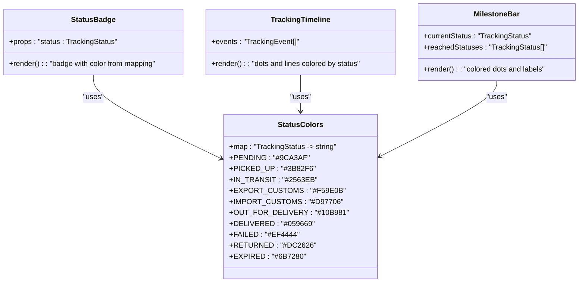
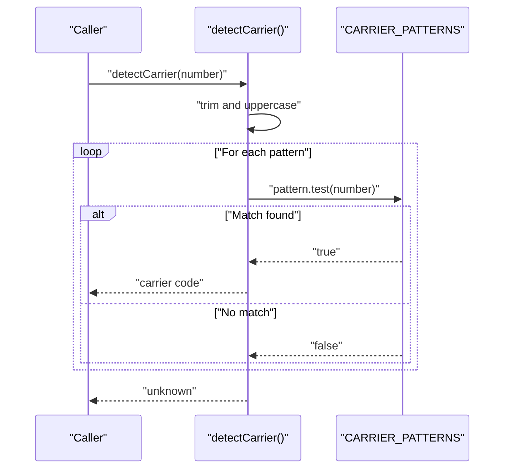
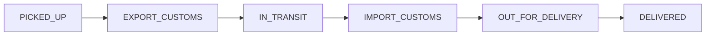
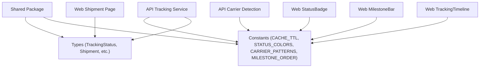

# Constants and Configuration

<cite>
**Referenced Files in This Document**
- [constants/index.ts](file://packages/shared/src/constants/index.ts)
- [types/index.ts](file://packages/shared/src/types/index.ts)
- [carrier-detect.ts](file://apps/api/src/services/carrier-detect.ts)
- [tracking-service.ts](file://apps/api/src/services/tracking-service.ts)
- [track.ts](file://apps/api/src/routes/track.ts)
- [StatusBadge.tsx](file://apps/web/src/components/StatusBadge.tsx)
- [MilestoneBar.tsx](file://apps/web/src/components/MilestoneBar.tsx)
- [TrackingTimeline.tsx](file://apps/web/src/components/TrackingTimeline.tsx)
- [page.tsx](file://apps/web/src/app/track/[id]/page.tsx)
- [server.ts](file://apps/api/src/server.ts)
- [next.config.ts](file://apps/web/next.config.ts)
- [docker-compose.yml](file://docker-compose.yml)
</cite>

## Table of Contents
1. [Introduction](#introduction)
2. [Project Structure](#project-structure)
3. [Core Components](#core-components)
4. [Architecture Overview](#architecture-overview)
5. [Detailed Component Analysis](#detailed-component-analysis)
6. [Dependency Analysis](#dependency-analysis)
7. [Performance Considerations](#performance-considerations)
8. [Troubleshooting Guide](#troubleshooting-guide)
9. [Conclusion](#conclusion)

## Introduction
This document describes the shared constants and configuration values used across the LOGISTIC application. It focuses on:
- Cache TTL values for different tracking statuses and their performance impact
- Status color mappings for UI presentation
- Carrier pattern matching constants for intelligent carrier detection
- Milestone ordering constants that define the sequence of tracking stages
- Default configuration values for rate limits, batch processing limits, and API integration settings
- Environment variable constants and their roles in application configuration
- Practical examples of how these constants are imported and used across the API and Web layers

## Project Structure
The constants and configuration are centralized in a shared package consumed by both the API and Web applications. The shared package defines enums, types, and constants that are reused across layers.

**Diagram sources**
- [constants/index.ts:1-103](file://packages/shared/src/constants/index.ts#L1-L103)
- [types/index.ts:1-101](file://packages/shared/src/types/index.ts#L1-L101)
- [server.ts:1-30](file://apps/api/src/server.ts#L1-L30)
- [track.ts:1-75](file://apps/api/src/routes/track.ts#L1-L75)
- [carrier-detect.ts:1-27](file://apps/api/src/services/carrier-detect.ts#L1-L27)
- [tracking-service.ts:100-127](file://apps/api/src/services/tracking-service.ts#L100-L127)
- [StatusBadge.tsx:1-32](file://apps/web/src/components/StatusBadge.tsx#L1-L32)
- [MilestoneBar.tsx:1-138](file://apps/web/src/components/MilestoneBar.tsx#L1-L138)
- [TrackingTimeline.tsx:54-90](file://apps/web/src/components/TrackingTimeline.tsx#L54-L90)
- [page.tsx:211-242](file://apps/web/src/app/track/[id]/page.tsx#L211-L242)

**Section sources**
- [constants/index.ts:1-103](file://packages/shared/src/constants/index.ts#L1-L103)
- [types/index.ts:1-101](file://packages/shared/src/types/index.ts#L1-L101)

## Core Components
This section documents the primary constant groups and their roles.

- Tier configuration constants
  - Purpose: Define rate limits, batch sizes, history windows, and feature flags per user tier.
  - Key values: Queries per day, queries per minute, batch size, history days, webhook enablement, and supported export formats.
  - Consumption: Used by the API to enforce quotas and by the Web to present feature differences.

- Cache TTL constants
  - Purpose: Control Redis cache expiration per tracking status to balance freshness and performance.
  - Values: Seconds per status; higher for settled statuses (delivered/failed/expired), lower for active transit.

- Status color constants
  - Purpose: Provide consistent UI colors for status badges, timeline dots, milestone bars, and error banners.
  - Values: Hex color strings mapped to each tracking status.

- Carrier pattern constants
  - Purpose: Enable intelligent carrier detection from tracking number formats.
  - Values: Array of pattern-to-carrier mappings for major carriers.

- Milestone ordering constants
  - Purpose: Define the canonical sequence of cross-border tracking stages for UI rendering and logic.
  - Values: Ordered list of statuses representing the journey from pickup to delivery.

- Carriers metadata
  - Purpose: Provide localized names and carrier categories for display and filtering.
  - Values: Named records mapping carrier codes to metadata.

**Section sources**
- [constants/index.ts:4-29](file://packages/shared/src/constants/index.ts#L4-L29)
- [constants/index.ts:31-43](file://packages/shared/src/constants/index.ts#L31-L43)
- [constants/index.ts:45-57](file://packages/shared/src/constants/index.ts#L45-L57)
- [constants/index.ts:59-75](file://packages/shared/src/constants/index.ts#L59-L75)
- [constants/index.ts:77-85](file://packages/shared/src/constants/index.ts#L77-L85)
- [constants/index.ts:87-103](file://packages/shared/src/constants/index.ts#L87-L103)

## Architecture Overview
The shared constants are imported and applied across the API and Web layers as follows:
- API layer uses carrier detection patterns and cache TTL to optimize retrieval and caching.
- Web layer uses status colors and milestone ordering to render UI consistently.
- Types define the shape of data structures used by both layers.

**Diagram sources**
- [tracking-service.ts:107-127](file://apps/api/src/services/tracking-service.ts#L107-L127)
- [carrier-detect.ts:1-27](file://apps/api/src/services/carrier-detect.ts#L1-L27)
- [constants/index.ts:31-43](file://packages/shared/src/constants/index.ts#L31-L43)
- [constants/index.ts:59-75](file://packages/shared/src/constants/index.ts#L59-L75)

## Detailed Component Analysis

### Cache TTL Constants
- Definition: A mapping from each tracking status to a TTL in seconds.
- Usage in API caching:
  - The service reads the TTL from the mapping based on the shipment’s current status and sets Redis expiration accordingly.
  - A fallback TTL is used if the status is not present in the mapping.
- Performance impact:
  - Active statuses (in-transit, customs) use shorter TTLs to ensure frequent refresh and up-to-date UI.
  - Settled statuses (delivered, failed, returned, expired) use longer TTLs to reduce backend load and network calls.

**Diagram sources**
- [tracking-service.ts:118-126](file://apps/api/src/services/tracking-service.ts#L118-L126)
- [constants/index.ts:31-43](file://packages/shared/src/constants/index.ts#L31-L43)

**Section sources**
- [constants/index.ts:31-43](file://packages/shared/src/constants/index.ts#L31-L43)
- [tracking-service.ts:118-126](file://apps/api/src/services/tracking-service.ts#L118-L126)

### Status Color Constants
- Definition: A mapping from each tracking status to a hex color string.
- UI usage:
  - StatusBadge renders badges with background and border colors derived from the mapping.
  - TrackingTimeline and MilestoneBar use the same mapping to color dots, lines, and labels.
  - Error banners reflect the status color for consistent visual semantics.

**Diagram sources**
- [constants/index.ts:45-57](file://packages/shared/src/constants/index.ts#L45-L57)
- [StatusBadge.tsx:1-32](file://apps/web/src/components/StatusBadge.tsx#L1-L32)
- [TrackingTimeline.tsx:54-90](file://apps/web/src/components/TrackingTimeline.tsx#L54-L90)
- [MilestoneBar.tsx:1-138](file://apps/web/src/components/MilestoneBar.tsx#L1-L138)

**Section sources**
- [constants/index.ts:45-57](file://packages/shared/src/constants/index.ts#L45-L57)
- [StatusBadge.tsx:1-32](file://apps/web/src/components/StatusBadge.tsx#L1-L32)
- [TrackingTimeline.tsx:54-90](file://apps/web/src/components/TrackingTimeline.tsx#L54-L90)
- [MilestoneBar.tsx:1-138](file://apps/web/src/components/MilestoneBar.tsx#L1-L138)

### Carrier Pattern Matching Constants
- Definition: An array of pattern-to-carrier mappings for common tracking number formats.
- Usage:
  - The API detects the carrier by iterating through patterns and returning the matched carrier code.
  - A secondary validation ensures the tracking number meets basic length/format constraints.

**Diagram sources**
- [carrier-detect.ts:1-27](file://apps/api/src/services/carrier-detect.ts#L1-L27)
- [constants/index.ts:59-75](file://packages/shared/src/constants/index.ts#L59-L75)

**Section sources**
- [constants/index.ts:59-75](file://packages/shared/src/constants/index.ts#L59-L75)
- [carrier-detect.ts:1-27](file://apps/api/src/services/carrier-detect.ts#L1-L27)

### Milestone Ordering Constants
- Definition: An ordered list of statuses representing the canonical cross-border journey.
- Usage:
  - The Web renders milestone bars and labels in this fixed order.
  - The UI highlights the current stage and connects previous stages with colored lines.

**Diagram sources**
- [constants/index.ts:77-85](file://packages/shared/src/constants/index.ts#L77-L85)
- [MilestoneBar.tsx:40-87](file://apps/web/src/components/MilestoneBar.tsx#L40-L87)

**Section sources**
- [constants/index.ts:77-85](file://packages/shared/src/constants/index.ts#L77-L85)
- [MilestoneBar.tsx:1-138](file://apps/web/src/components/MilestoneBar.tsx#L1-L138)

### Default Configuration Values
- Tier configuration defaults:
  - Free tier: low daily and per-minute quotas, small batch size, limited history, no webhooks, no exports.
  - Pro tier: moderate quotas, larger batch size, extended history, webhooks enabled, CSV export.
  - Enterprise tier: high quotas, very large batch size, unlimited history, webhooks enabled, multiple export formats.
- Batch processing limits:
  - The API enforces a maximum batch size to prevent overload.
- API integration settings:
  - The service reads provider-specific API keys from environment variables to integrate with external carriers.

**Section sources**
- [constants/index.ts:4-29](file://packages/shared/src/constants/index.ts#L4-L29)
- [track.ts:50-55](file://apps/api/src/routes/track.ts#L50-L55)
- [tracking-service.ts:20-25](file://apps/api/src/services/tracking-service.ts#L20-L25)

### Environment Variable Constants
- API runtime:
  - Host and port configuration, Redis connection URL.
- Web runtime:
  - API base URL override for frontend-backend communication.
- Infrastructure:
  - Docker Compose defines database and cache service exposure and credentials.

**Section sources**
- [server.ts:9-26](file://apps/api/src/server.ts#L9-L26)
- [next.config.ts:1-5](file://apps/web/next.config.ts#L1-L5)
- [docker-compose.yml:1-22](file://docker-compose.yml#L1-L22)

## Dependency Analysis
The shared constants and types form a central dependency for both API and Web layers. The diagram below shows how the API and Web depend on the shared package.

**Diagram sources**
- [constants/index.ts:1-103](file://packages/shared/src/constants/index.ts#L1-L103)
- [types/index.ts:1-101](file://packages/shared/src/types/index.ts#L1-L101)
- [carrier-detect.ts:1-27](file://apps/api/src/services/carrier-detect.ts#L1-L27)
- [tracking-service.ts:107-127](file://apps/api/src/services/tracking-service.ts#L107-L127)
- [StatusBadge.tsx:1-32](file://apps/web/src/components/StatusBadge.tsx#L1-L32)
- [MilestoneBar.tsx:1-138](file://apps/web/src/components/MilestoneBar.tsx#L1-L138)
- [TrackingTimeline.tsx:54-90](file://apps/web/src/components/TrackingTimeline.tsx#L54-L90)
- [page.tsx:211-242](file://apps/web/src/app/track/[id]/page.tsx#L211-L242)

**Section sources**
- [constants/index.ts:1-103](file://packages/shared/src/constants/index.ts#L1-L103)
- [types/index.ts:1-101](file://packages/shared/src/types/index.ts#L1-L101)

## Performance Considerations
- Cache TTL tuning:
  - Short TTLs for active statuses ensure timely updates but increase backend and network load.
  - Long TTLs for delivered/failed statuses reduce load but may delay reflecting late updates.
- Batch processing:
  - Enforcing a maximum batch size prevents resource exhaustion and maintains response latency.
- Carrier detection:
  - Pattern matching is O(P) where P is the number of patterns; keep the list concise and ordered by frequency.
- UI rendering:
  - Using precomputed status colors avoids dynamic computation and improves rendering performance.

[No sources needed since this section provides general guidance]

## Troubleshooting Guide
- Cache misses frequently:
  - Verify that the current status exists in the cache TTL mapping and that Redis is reachable.
- Incorrect carrier detection:
  - Confirm the tracking number format matches one of the patterns; consider adding new patterns for regional carriers.
- UI color inconsistencies:
  - Ensure the status passed to UI components exists in the status color mapping.
- Batch requests failing:
  - Check that the number of tracking numbers does not exceed the enforced limit.

**Section sources**
- [tracking-service.ts:118-126](file://apps/api/src/services/tracking-service.ts#L118-L126)
- [carrier-detect.ts:1-27](file://apps/api/src/services/carrier-detect.ts#L1-L27)
- [track.ts:50-55](file://apps/api/src/routes/track.ts#L50-L55)
- [StatusBadge.tsx:1-32](file://apps/web/src/components/StatusBadge.tsx#L1-L32)
- [MilestoneBar.tsx:1-138](file://apps/web/src/components/MilestoneBar.tsx#L1-L138)

## Conclusion
The LOGISTIC application centralizes its configuration and constants in a shared package, enabling consistent behavior across the API and Web layers. Cache TTLs, status colors, carrier patterns, milestone ordering, and tier configurations collectively optimize performance, maintain UX coherence, and support scalable integrations with carrier APIs.