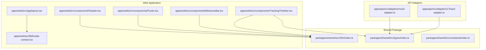
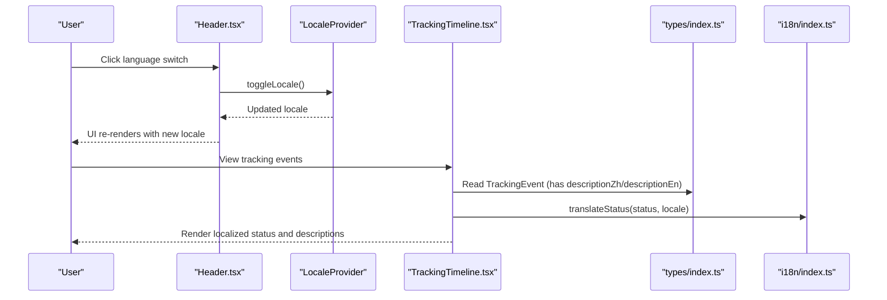
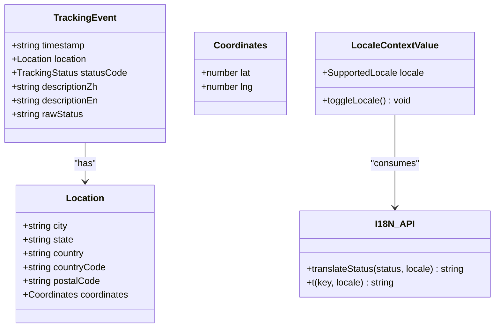
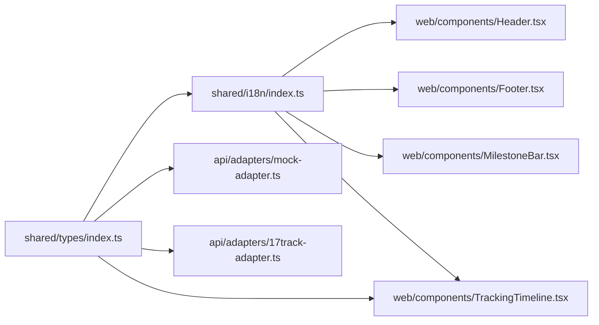

# Internationalization (i18n)

<cite>
**Referenced Files in This Document**
- [packages/shared/src/i18n/index.ts](file://packages/shared/src/i18n/index.ts)
- [apps/web/src/lib/locale-context.tsx](file://apps/web/src/lib/locale-context.tsx)
- [apps/web/src/app/layout.tsx](file://apps/web/src/app/layout.tsx)
- [apps/web/src/components/Header.tsx](file://apps/web/src/components/Header.tsx)
- [apps/web/src/components/Footer.tsx](file://apps/web/src/components/Footer.tsx)
- [apps/web/src/components/MilestoneBar.tsx](file://apps/web/src/components/MilestoneBar.tsx)
- [apps/web/src/components/TrackingTimeline.tsx](file://apps/web/src/components/TrackingTimeline.tsx)
- [packages/shared/src/types/index.ts](file://packages/shared/src/types/index.ts)
- [packages/shared/src/constants/index.ts](file://packages/shared/src/constants/index.ts)
- [apps/api/src/adapters/mock-adapter.ts](file://apps/api/src/adapters/mock-adapter.ts)
- [apps/api/src/adapters/17track-adapter.ts](file://apps/api/src/adapters/17track-adapter.ts)
</cite>

## Table of Contents
1. [Introduction](#introduction)
2. [Project Structure](#project-structure)
3. [Core Components](#core-components)
4. [Architecture Overview](#architecture-overview)
5. [Detailed Component Analysis](#detailed-component-analysis)
6. [Dependency Analysis](#dependency-analysis)
7. [Performance Considerations](#performance-considerations)
8. [Troubleshooting Guide](#troubleshooting-guide)
9. [Conclusion](#conclusion)
10. [Appendices](#appendices)

## Introduction
This document explains the internationalization (i18n) system for the LOGISTIC application, focusing on support for Chinese and English. It covers the translation resource structure, how multilingual content is managed for tracking status descriptions, UI text, and user messages, the locale provider implementation, language switching, translation utilities, and integration patterns across frontend React components and backend services. It also provides best practices for adding new languages, extending translation resources, maintaining consistency, and handling fallback languages.

## Project Structure
The i18n system is organized around a shared package that defines locales, translation keys, and lookup functions, and a web application that consumes these utilities via a React context provider. Backend adapters supply multilingual event descriptions for tracking timelines.

**Diagram sources**
- [packages/shared/src/i18n/index.ts:1-61](file://packages/shared/src/i18n/index.ts#L1-L61)
- [apps/web/src/lib/locale-context.tsx:1-33](file://apps/web/src/lib/locale-context.tsx#L1-L33)
- [apps/web/src/app/layout.tsx:1-44](file://apps/web/src/app/layout.tsx#L1-L44)
- [apps/web/src/components/Header.tsx:1-59](file://apps/web/src/components/Header.tsx#L1-L59)
- [apps/web/src/components/Footer.tsx:1-37](file://apps/web/src/components/Footer.tsx#L1-L37)
- [apps/web/src/components/MilestoneBar.tsx:1-138](file://apps/web/src/components/MilestoneBar.tsx#L1-L138)
- [apps/web/src/components/TrackingTimeline.tsx:1-126](file://apps/web/src/components/TrackingTimeline.tsx#L1-L126)
- [packages/shared/src/types/index.ts:1-101](file://packages/shared/src/types/index.ts#L1-L101)
- [apps/api/src/adapters/mock-adapter.ts:1-74](file://apps/api/src/adapters/mock-adapter.ts#L1-L74)
- [apps/api/src/adapters/17track-adapter.ts:74-117](file://apps/api/src/adapters/17track-adapter.ts#L74-L117)

**Section sources**
- [packages/shared/src/i18n/index.ts:1-61](file://packages/shared/src/i18n/index.ts#L1-L61)
- [apps/web/src/lib/locale-context.tsx:1-33](file://apps/web/src/lib/locale-context.tsx#L1-L33)
- [apps/web/src/app/layout.tsx:1-44](file://apps/web/src/app/layout.tsx#L1-L44)
- [packages/shared/src/types/index.ts:1-101](file://packages/shared/src/types/index.ts#L1-L101)

## Core Components
- Supported locales: Chinese ("zh") and English ("en").
- Translation resources:
  - Status translations for standardized tracking statuses.
  - UI translations for keys such as navigation, search, result sections, and pricing tiers.
- Utilities:
  - A function to translate standardized tracking statuses by locale.
  - A function to resolve UI text by key and locale with fallback to the key itself if missing.
- Locale provider:
  - React context that stores the current locale and toggles between "zh" and "en".
- Backend data model:
  - Tracking events include separate fields for Chinese and English descriptions, enabling bilingual display in the UI.

Key responsibilities:
- Shared package: Defines locale types, translation dictionaries, and lookup helpers.
- Web app: Consumes locale context and translation helpers to render localized UI and timelines.
- API adapters: Provide multilingual event descriptions for display.

**Section sources**
- [packages/shared/src/i18n/index.ts:3-60](file://packages/shared/src/i18n/index.ts#L3-L60)
- [apps/web/src/lib/locale-context.tsx:6-32](file://apps/web/src/lib/locale-context.tsx#L6-L32)
- [packages/shared/src/types/index.ts:38-45](file://packages/shared/src/types/index.ts#L38-L45)

## Architecture Overview
The i18n architecture separates concerns between data (shared translation dictionaries), presentation (React components), and runtime state (locale context). The backend supplies multilingual event descriptions that the frontend renders according to the current locale.

**Diagram sources**
- [apps/web/src/components/Header.tsx:47-53](file://apps/web/src/components/Header.tsx#L47-L53)
- [apps/web/src/lib/locale-context.tsx:16-28](file://apps/web/src/lib/locale-context.tsx#L16-L28)
- [apps/web/src/components/TrackingTimeline.tsx:42-126](file://apps/web/src/components/TrackingTimeline.tsx#L42-L126)
- [packages/shared/src/types/index.ts:38-45](file://packages/shared/src/types/index.ts#L38-L45)
- [packages/shared/src/i18n/index.ts:54-60](file://packages/shared/src/i18n/index.ts#L54-L60)

## Detailed Component Analysis

### Translation Resources and Utilities
- Supported locale type: "zh" | "en".
- Status translations: A dictionary keyed by standardized tracking statuses with entries for each locale.
- UI translations: A dictionary keyed by semantic keys (e.g., navigation, search, result, milestone, pricing) with entries for each locale.
- Utility functions:
  - translateStatus(status, locale): Returns localized status text or falls back to the status value if missing.
  - t(key, locale): Returns localized UI text for a given key or falls back to the key itself if missing.

Best practices:
- Keep UI keys stable and hierarchical to simplify maintenance.
- Ensure both "zh" and "en" entries exist for every key to avoid fallback rendering.

**Section sources**
- [packages/shared/src/i18n/index.ts:3-60](file://packages/shared/src/i18n/index.ts#L3-L60)

### Locale Provider Implementation
- Context value includes:
  - locale: current locale ("zh" or "en").
  - toggleLocale: switches between "zh" and "en".
- Provider wraps the application layout and exposes the context to all components.
- Components consume the context via a hook to access locale and toggle behavior.

Integration patterns:
- Place the provider at the root layout level so all pages and components inherit the locale state.
- Use the hook in any component that needs to render localized text or trigger locale changes.

**Section sources**
- [apps/web/src/lib/locale-context.tsx:6-32](file://apps/web/src/lib/locale-context.tsx#L6-L32)
- [apps/web/src/app/layout.tsx:24-42](file://apps/web/src/app/layout.tsx#L24-L42)

### Frontend Integration with React Components
- Header:
  - Renders navigation links and a language switch button using UI translation keys.
  - Uses the locale context to pass the current locale to translation helpers.
- Footer:
  - Displays localized footer text and links using UI translation keys.
- MilestoneBar:
  - Translates milestone labels using UI translation keys and the current locale.
  - Handles special error-state banners with inline conditional localization.
- TrackingTimeline:
  - Chooses between descriptionZh and descriptionEn for each event based on the current locale.
  - Formats dates and locations differently depending on locale.
  - Uses translateStatus to localize status labels.

Fallback behavior:
- If a translation key or locale-specific value is missing, the system falls back to the key itself for UI text and to the status enum value for status translations.

**Section sources**
- [apps/web/src/components/Header.tsx:8-58](file://apps/web/src/components/Header.tsx#L8-L58)
- [apps/web/src/components/Footer.tsx:7-36](file://apps/web/src/components/Footer.tsx#L7-L36)
- [apps/web/src/components/MilestoneBar.tsx:26-137](file://apps/web/src/components/MilestoneBar.tsx#L26-L137)
- [apps/web/src/components/TrackingTimeline.tsx:42-126](file://apps/web/src/components/TrackingTimeline.tsx#L42-L126)

### Backend Integration and Multilingual Event Descriptions
- Data model:
  - TrackingEvent includes descriptionZh and descriptionEn for each event.
- Adapters:
  - Mock adapter: Provides realistic sample data with both Chinese and English descriptions.
  - 17track adapter: Assigns both descriptionZh and descriptionEn from the upstream description, allowing bilingual display.

Implications:
- The frontend does not need to translate event descriptions; it simply selects the appropriate field based on the current locale.
- Backend adapters should ensure both fields are populated consistently.

**Section sources**
- [packages/shared/src/types/index.ts:38-45](file://packages/shared/src/types/index.ts#L38-L45)
- [apps/api/src/adapters/mock-adapter.ts:30-63](file://apps/api/src/adapters/mock-adapter.ts#L30-L63)
- [apps/api/src/adapters/17track-adapter.ts:74-94](file://apps/api/src/adapters/17track-adapter.ts#L74-L94)

### Class Model of Translation and Data Structures

**Diagram sources**
- [packages/shared/src/types/index.ts:24-45](file://packages/shared/src/types/index.ts#L24-L45)
- [apps/web/src/lib/locale-context.tsx:6-14](file://apps/web/src/lib/locale-context.tsx#L6-L14)
- [packages/shared/src/i18n/index.ts:54-60](file://packages/shared/src/i18n/index.ts#L54-L60)

## Dependency Analysis
- Shared i18n module depends on the shared types module for the TrackingStatus enum.
- Web components depend on the shared i18n module for translation helpers and on the locale context for runtime locale selection.
- Backend adapters depend on shared types for the TrackingEvent interface and populate multilingual fields for UI consumption.

**Diagram sources**
- [packages/shared/src/types/index.ts:1-101](file://packages/shared/src/types/index.ts#L1-L101)
- [packages/shared/src/i18n/index.ts:1-61](file://packages/shared/src/i18n/index.ts#L1-L61)
- [apps/web/src/components/Header.tsx:1-59](file://apps/web/src/components/Header.tsx#L1-L59)
- [apps/web/src/components/Footer.tsx:1-37](file://apps/web/src/components/Footer.tsx#L1-L37)
- [apps/web/src/components/MilestoneBar.tsx:1-138](file://apps/web/src/components/MilestoneBar.tsx#L1-L138)
- [apps/web/src/components/TrackingTimeline.tsx:1-126](file://apps/web/src/components/TrackingTimeline.tsx#L1-L126)
- [apps/api/src/adapters/mock-adapter.ts:1-74](file://apps/api/src/adapters/mock-adapter.ts#L1-L74)
- [apps/api/src/adapters/17track-adapter.ts:74-117](file://apps/api/src/adapters/17track-adapter.ts#L74-L117)

**Section sources**
- [packages/shared/src/i18n/index.ts:1-61](file://packages/shared/src/i18n/index.ts#L1-L61)
- [packages/shared/src/types/index.ts:1-101](file://packages/shared/src/types/index.ts#L1-L101)

## Performance Considerations
- Translation lookups are O(1) hash map accesses; negligible overhead.
- Avoid unnecessary re-renders by passing locale via context and memoizing derived values when possible.
- Keep translation dictionaries compact and avoid deep nesting to minimize memory footprint.
- Backend adapters should precompute localized descriptions to reduce frontend work.

## Troubleshooting Guide
Common issues and resolutions:
- Missing translations:
  - Symptom: UI displays the translation key instead of localized text.
  - Resolution: Add both "zh" and "en" entries for the key in the UI translation dictionary.
- Status not translated:
  - Symptom: Status appears as the raw enum value.
  - Resolution: Add the status-to-locale mapping in the status translations dictionary.
- Incorrect language switching:
  - Symptom: Toggle does not change language.
  - Resolution: Verify the locale context provider is at the root and the hook is used correctly in components.
- Mixed-language event descriptions:
  - Symptom: Timeline shows inconsistent language for event descriptions.
  - Resolution: Ensure backend adapters populate both descriptionZh and descriptionEn fields.

**Section sources**
- [packages/shared/src/i18n/index.ts:54-60](file://packages/shared/src/i18n/index.ts#L54-L60)
- [apps/web/src/lib/locale-context.tsx:16-28](file://apps/web/src/lib/locale-context.tsx#L16-L28)
- [apps/web/src/components/TrackingTimeline.tsx:59-61](file://apps/web/src/components/TrackingTimeline.tsx#L59-L61)

## Conclusion
The LOGISTIC i18n system cleanly separates shared translation resources from UI rendering and locale state management. It supports Chinese and English for both standardized tracking statuses and UI text, while backend adapters provide multilingual event descriptions. The design enables straightforward fallback behavior and offers clear extension points for adding new languages and keys.

## Appendices

### Best Practices for Adding New Languages
- Extend the SupportedLocale union with the new language code.
- Add translation entries for all status and UI keys in the new language.
- Update locale context logic to include the new language in toggle behavior if applicable.
- Ensure backend adapters populate the corresponding description fields for events.

### Maintaining Translation Consistency
- Use semantic keys for UI text and keep a centralized dictionary.
- Regularly audit missing translations and enforce coverage in CI if possible.
- Standardize date and location formatting per locale in components that handle formatting.

### Examples of Localized Tracking Event Display
- Timeline selection:
  - Choose descriptionZh or descriptionEn based on the current locale.
- Status labels:
  - Use translateStatus to render localized status text.
- Milestones:
  - Use UI translation keys for milestone labels and apply conditional localization for error states.

**Section sources**
- [apps/web/src/components/TrackingTimeline.tsx:59-61](file://apps/web/src/components/TrackingTimeline.tsx#L59-L61)
- [packages/shared/src/i18n/index.ts:54-60](file://packages/shared/src/i18n/index.ts#L54-L60)
- [apps/web/src/components/MilestoneBar.tsx:12-19](file://apps/web/src/components/MilestoneBar.tsx#L12-L19)