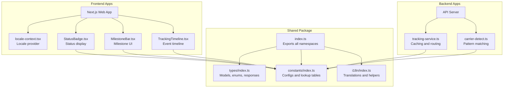
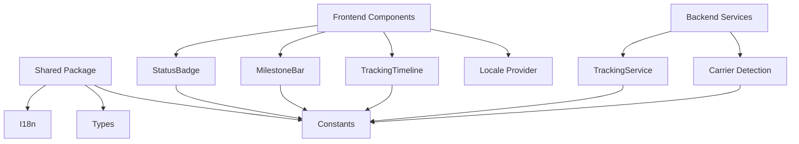
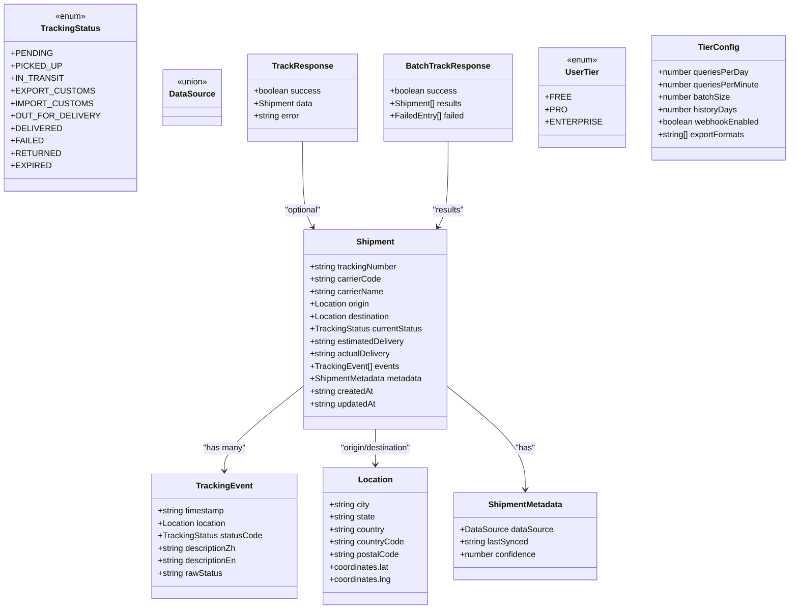
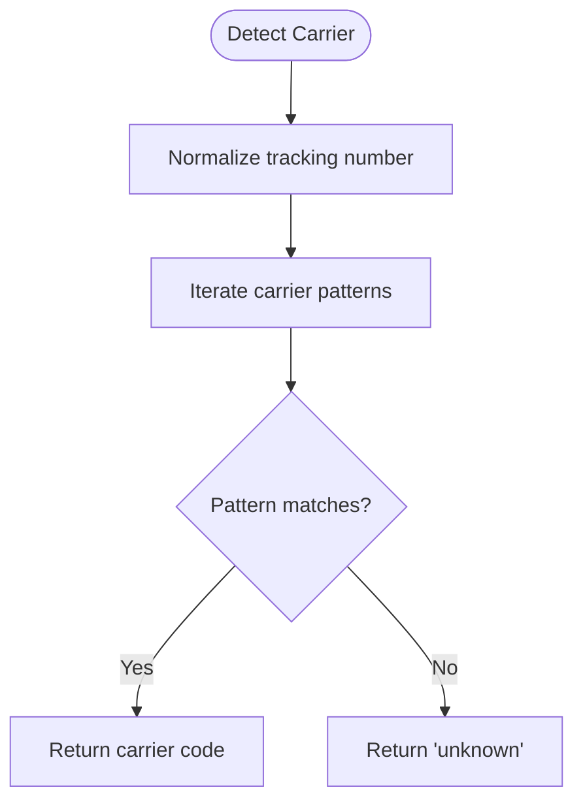
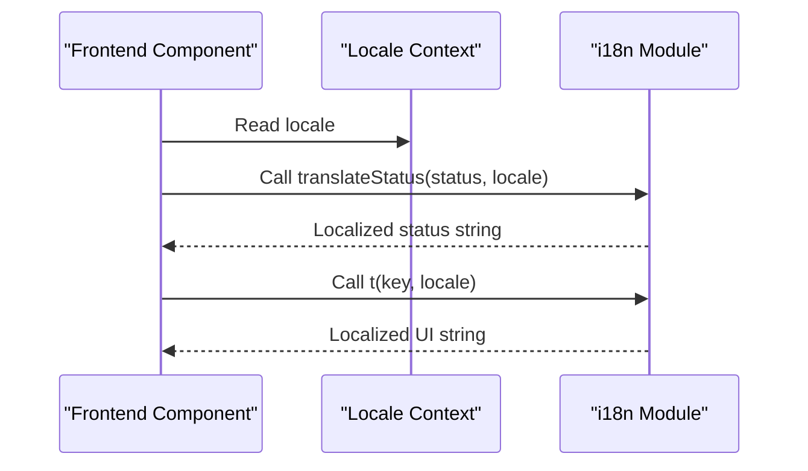
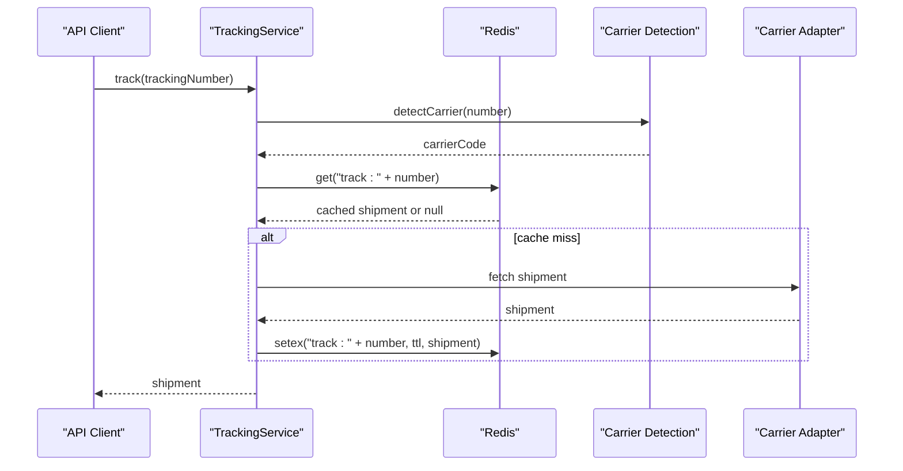
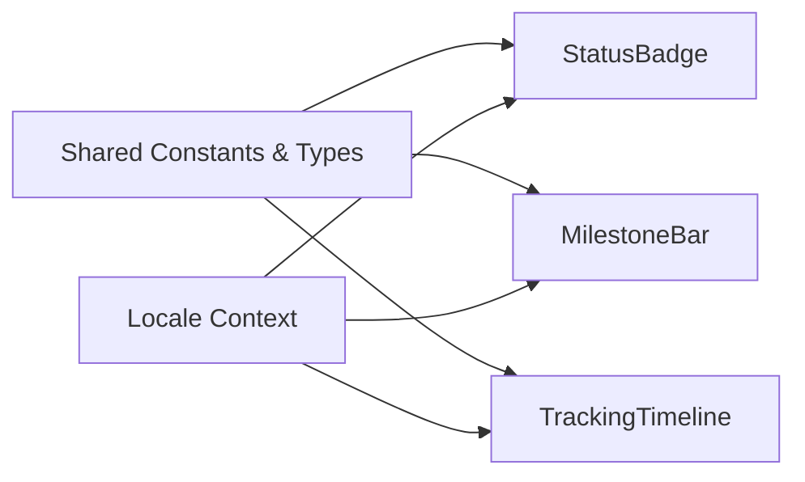
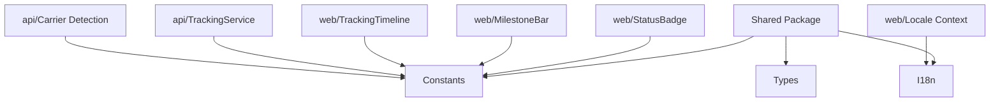

# Shared Package (packages/shared)

<cite>
**Referenced Files in This Document**
- [packages/shared/src/index.ts](file://packages/shared/src/index.ts)
- [packages/shared/src/types/index.ts](file://packages/shared/src/types/index.ts)
- [packages/shared/src/constants/index.ts](file://packages/shared/src/constants/index.ts)
- [packages/shared/src/i18n/index.ts](file://packages/shared/src/i18n/index.ts)
- [packages/shared/package.json](file://packages/shared/package.json)
- [apps/web/src/lib/locale-context.tsx](file://apps/web/src/lib/locale-context.tsx)
- [apps/web/src/components/StatusBadge.tsx](file://apps/web/src/components/StatusBadge.tsx)
- [apps/web/src/components/MilestoneBar.tsx](file://apps/web/src/components/MilestoneBar.tsx)
- [apps/web/src/components/TrackingTimeline.tsx](file://apps/web/src/components/TrackingTimeline.tsx)
- [apps/api/src/services/tracking-service.ts](file://apps/api/src/services/tracking-service.ts)
- [apps/api/src/services/carrier-detect.ts](file://apps/api/src/services/carrier-detect.ts)
</cite>

## Table of Contents
1. [Introduction](#introduction)
2. [Project Structure](#project-structure)
3. [Core Components](#core-components)
4. [Architecture Overview](#architecture-overview)
5. [Detailed Component Analysis](#detailed-component-analysis)
6. [Dependency Analysis](#dependency-analysis)
7. [Performance Considerations](#performance-considerations)
8. [Troubleshooting Guide](#troubleshooting-guide)
9. [Conclusion](#conclusion)
10. [Appendices](#appendices)

## Introduction
The shared package centralizes common types, constants, and internationalization resources used across the frontend and backend applications. It defines standardized data models for shipments and tracking events, enumerations for statuses and user tiers, and configuration constants for caching, visuals, carrier detection, and milestone ordering. It also provides a compact i18n system for status labels and UI strings in Chinese and English, enabling consistent presentation and behavior across the product stack.

## Project Structure
The shared package exports four primary namespaces:
- Types: Core data models and enums
- Constants: Configuration records for tiers, cache TTLs, status colors, carrier patterns, milestone order, and supported carriers
- I18n: Translation utilities and resources for status and UI strings
- Index: Barrel exports aggregating all namespaces

**Diagram sources**
- [packages/shared/src/index.ts:1-4](file://packages/shared/src/index.ts#L1-L4)
- [packages/shared/src/types/index.ts:1-101](file://packages/shared/src/types/index.ts#L1-L101)
- [packages/shared/src/constants/index.ts:1-103](file://packages/shared/src/constants/index.ts#L1-L103)
- [packages/shared/src/i18n/index.ts:1-61](file://packages/shared/src/i18n/index.ts#L1-L61)
- [apps/web/src/lib/locale-context.tsx:1-33](file://apps/web/src/lib/locale-context.tsx#L1-L33)
- [apps/web/src/components/StatusBadge.tsx:1-33](file://apps/web/src/components/StatusBadge.tsx#L1-L33)
- [apps/web/src/components/MilestoneBar.tsx:1-138](file://apps/web/src/components/MilestoneBar.tsx#L1-L138)
- [apps/web/src/components/TrackingTimeline.tsx:1-126](file://apps/web/src/components/TrackingTimeline.tsx#L1-L126)
- [apps/api/src/services/tracking-service.ts:1-128](file://apps/api/src/services/tracking-service.ts#L1-L128)
- [apps/api/src/services/carrier-detect.ts:1-27](file://apps/api/src/services/carrier-detect.ts#L1-L27)

**Section sources**
- [packages/shared/src/index.ts:1-4](file://packages/shared/src/index.ts#L1-L4)
- [packages/shared/package.json:1-22](file://packages/shared/package.json#L1-L22)

## Core Components
This section documents the core data models, enumerations, and configuration constants that form the foundation of the shared package.

- TrackingStatus enumeration
  - Purpose: Standardized cross-border logistics statuses
  - Values: Pending, Picked Up, In Transit, Export Customs, Import Customs, Out for Delivery, Delivered, Failed, Returned, Expired
  - Usage: Applied to TrackingEvent.statusCode and Shipment.currentStatus

- DataSource union type
  - Purpose: Identifies the upstream data source for a shipment
  - Values: 17track, aftership, trackingmore, dhl_direct, fedex_direct, ups_direct

- Location interface
  - Fields: city, state, country, countryCode (ISO 3166-1 alpha-2), postalCode, coordinates (lat/lng)
  - Usage: Origin/Destination locations in Shipment; embedded in TrackingEvent

- TrackingEvent interface
  - Fields: timestamp (ISO 8601 UTC), location (Location), statusCode (TrackingStatus), descriptionZh, descriptionEn, rawStatus
  - Usage: Individual event entries in Shipment.events

- Shipment interface
  - Fields: trackingNumber, carrierCode, carrierName, origin (Location), destination (Location), currentStatus (TrackingStatus), estimatedDelivery, actualDelivery, events (TrackingEvent[]), metadata (ShipmentMetadata), createdAt, updatedAt
  - Usage: Complete shipment record returned by tracking APIs

- ShipmentMetadata interface
  - Fields: dataSource (DataSource), lastSynced, confidence (0–100)
  - Usage: Metadata about data provenance and quality

- API response types
  - TrackResponse: success flag, optional data (Shipment), optional error message
  - BatchTrackResponse: success flag, results array (Shipment[]), failed entries with trackingNumber and error

- UserTier enumeration
  - Purpose: Subscription tiers for rate limiting and feature gating
  - Values: FREE, PRO, ENTERPRISE

- TierConfig interface
  - Fields: queriesPerDay (null means unlimited), queriesPerMinute, batchSize, historyDays (null means unlimited), webhookEnabled, exportFormats[]
  - Usage: Enforced via backend services and potentially frontend UI

**Section sources**
- [packages/shared/src/types/index.ts:1-101](file://packages/shared/src/types/index.ts#L1-L101)

## Architecture Overview
The shared package acts as a contract between frontend and backend applications. Frontend components consume types, constants, and i18n utilities to render UI consistently. Backend services rely on shared constants for caching, carrier detection, and status semantics. The package’s exports enable flexible imports tailored to each module’s needs.

**Diagram sources**
- [packages/shared/src/index.ts:1-4](file://packages/shared/src/index.ts#L1-L4)
- [packages/shared/src/types/index.ts:1-101](file://packages/shared/src/types/index.ts#L1-L101)
- [packages/shared/src/constants/index.ts:1-103](file://packages/shared/src/constants/index.ts#L1-L103)
- [packages/shared/src/i18n/index.ts:1-61](file://packages/shared/src/i18n/index.ts#L1-L61)
- [apps/web/src/components/StatusBadge.tsx:1-33](file://apps/web/src/components/StatusBadge.tsx#L1-L33)
- [apps/web/src/components/MilestoneBar.tsx:1-138](file://apps/web/src/components/MilestoneBar.tsx#L1-L138)
- [apps/web/src/components/TrackingTimeline.tsx:1-126](file://apps/web/src/components/TrackingTimeline.tsx#L1-L126)
- [apps/api/src/services/tracking-service.ts:1-128](file://apps/api/src/services/tracking-service.ts#L1-L128)
- [apps/api/src/services/carrier-detect.ts:1-27](file://apps/api/src/services/carrier-detect.ts#L1-L27)

## Detailed Component Analysis

### Types and Data Models
This component defines the canonical shape of shipment data and related structures.

**Diagram sources**
- [packages/shared/src/types/index.ts:1-101](file://packages/shared/src/types/index.ts#L1-L101)

**Section sources**
- [packages/shared/src/types/index.ts:1-101](file://packages/shared/src/types/index.ts#L1-L101)

### Constants and Configuration
This component provides configuration-driven behavior for caching, visuals, carrier detection, and UI milestones.

- Tier configurations
  - Purpose: Define rate limits and capabilities per UserTier
  - Keys: queriesPerDay, queriesPerMinute, batchSize, historyDays, webhookEnabled, exportFormats
  - Behavior: null values indicate unlimited quotas

- Cache TTL by status
  - Purpose: Suggest TTL seconds for Redis caching keyed by current status
  - Typical pattern: More frequent refresh for active statuses, longer retention for resolved statuses

- Status visual configuration
  - Purpose: Provide semantic colors for UI rendering
  - Keys: TrackingStatus → hex color

- Carrier detection patterns
  - Purpose: Map tracking number patterns to carrier codes
  - Format: Array of { pattern: RegExp; carrier: string }

- Milestone ordering
  - Purpose: Define the logical progression of cross-border milestones
  - Order: Picked Up → Export Customs → In Transit → Import Customs → Out for Delivery → Delivered

- Supported carriers
  - Purpose: Provide localized names and carrier categories
  - Categories: express, postal, line
  - Includes major international and China-based carriers

**Diagram sources**
- [packages/shared/src/constants/index.ts:59-75](file://packages/shared/src/constants/index.ts#L59-L75)
- [apps/api/src/services/carrier-detect.ts:7-17](file://apps/api/src/services/carrier-detect.ts#L7-L17)

**Section sources**
- [packages/shared/src/constants/index.ts:1-103](file://packages/shared/src/constants/index.ts#L1-L103)
- [apps/api/src/services/carrier-detect.ts:1-27](file://apps/api/src/services/carrier-detect.ts#L1-L27)

### Internationalization System
The i18n module provides:
- SupportedLocale union: zh | en
- Status translations: mapping of TrackingStatus to localized strings
- UI translations: mapping of keys to localized strings
- Helper functions:
  - translateStatus(status, locale): localized status label
  - t(key, locale): localized UI string

Frontend components integrate locale state via a React context provider and use the helper functions to render localized content.

**Diagram sources**
- [packages/shared/src/i18n/index.ts:1-61](file://packages/shared/src/i18n/index.ts#L1-L61)
- [apps/web/src/lib/locale-context.tsx:1-33](file://apps/web/src/lib/locale-context.tsx#L1-L33)
- [apps/web/src/components/StatusBadge.tsx:1-33](file://apps/web/src/components/StatusBadge.tsx#L1-L33)
- [apps/web/src/components/MilestoneBar.tsx:1-138](file://apps/web/src/components/MilestoneBar.tsx#L1-L138)
- [apps/web/src/components/TrackingTimeline.tsx:1-126](file://apps/web/src/components/TrackingTimeline.tsx#L1-L126)

**Section sources**
- [packages/shared/src/i18n/index.ts:1-61](file://packages/shared/src/i18n/index.ts#L1-L61)
- [apps/web/src/lib/locale-context.tsx:1-33](file://apps/web/src/lib/locale-context.tsx#L1-L33)

### Backend Usage Patterns
Backend services consume shared constants and types to implement caching, routing, and validation.

- TrackingService
  - Uses CACHE_TTL to set Redis TTL based on current status
  - Routes requests to carrier-specific adapters and falls back to a universal adapter
  - Implements batch tracking with concurrency control

- Carrier detection
  - Uses CARRIER_PATTERNS to infer carrier from tracking number
  - Applies basic format validation for tracking numbers

**Diagram sources**
- [apps/api/src/services/tracking-service.ts:1-128](file://apps/api/src/services/tracking-service.ts#L1-L128)
- [apps/api/src/services/carrier-detect.ts:1-27](file://apps/api/src/services/carrier-detect.ts#L1-L27)
- [packages/shared/src/constants/index.ts:31-43](file://packages/shared/src/constants/index.ts#L31-L43)

**Section sources**
- [apps/api/src/services/tracking-service.ts:1-128](file://apps/api/src/services/tracking-service.ts#L1-L128)
- [apps/api/src/services/carrier-detect.ts:1-27](file://apps/api/src/services/carrier-detect.ts#L1-L27)

### Frontend Usage Patterns
Frontend components import shared types and constants to render UI consistently.

- StatusBadge
  - Uses STATUS_COLORS and translateStatus to render a colored badge
  - Integrates with locale context for language switching

- MilestoneBar
  - Uses MILESTONE_ORDER and STATUS_COLORS to render a progress visualization
  - Uses t to localize milestone labels

- TrackingTimeline
  - Uses STATUS_COLORS and translateStatus to render event rows
  - Uses t for “not found” messaging

**Diagram sources**
- [packages/shared/src/constants/index.ts:45-85](file://packages/shared/src/constants/index.ts#L45-L85)
- [packages/shared/src/i18n/index.ts:54-60](file://packages/shared/src/i18n/index.ts#L54-L60)
- [apps/web/src/components/StatusBadge.tsx:1-33](file://apps/web/src/components/StatusBadge.tsx#L1-L33)
- [apps/web/src/components/MilestoneBar.tsx:1-138](file://apps/web/src/components/MilestoneBar.tsx#L1-L138)
- [apps/web/src/components/TrackingTimeline.tsx:1-126](file://apps/web/src/components/TrackingTimeline.tsx#L1-L126)
- [apps/web/src/lib/locale-context.tsx:1-33](file://apps/web/src/lib/locale-context.tsx#L1-L33)

**Section sources**
- [apps/web/src/components/StatusBadge.tsx:1-33](file://apps/web/src/components/StatusBadge.tsx#L1-L33)
- [apps/web/src/components/MilestoneBar.tsx:1-138](file://apps/web/src/components/MilestoneBar.tsx#L1-L138)
- [apps/web/src/components/TrackingTimeline.tsx:1-126](file://apps/web/src/components/TrackingTimeline.tsx#L1-L126)
- [apps/web/src/lib/locale-context.tsx:1-33](file://apps/web/src/lib/locale-context.tsx#L1-L33)

## Dependency Analysis
The shared package is consumed by both frontend and backend applications. The dependency graph highlights how frontend components depend on shared constants and i18n, while backend services depend on shared constants for runtime behavior.

**Diagram sources**
- [packages/shared/src/index.ts:1-4](file://packages/shared/src/index.ts#L1-L4)
- [packages/shared/src/types/index.ts:1-101](file://packages/shared/src/types/index.ts#L1-L101)
- [packages/shared/src/constants/index.ts:1-103](file://packages/shared/src/constants/index.ts#L1-L103)
- [packages/shared/src/i18n/index.ts:1-61](file://packages/shared/src/i18n/index.ts#L1-L61)
- [apps/web/src/components/StatusBadge.tsx:1-33](file://apps/web/src/components/StatusBadge.tsx#L1-L33)
- [apps/web/src/components/MilestoneBar.tsx:1-138](file://apps/web/src/components/MilestoneBar.tsx#L1-L138)
- [apps/web/src/components/TrackingTimeline.tsx:1-126](file://apps/web/src/components/TrackingTimeline.tsx#L1-L126)
- [apps/web/src/lib/locale-context.tsx:1-33](file://apps/web/src/lib/locale-context.tsx#L1-L33)
- [apps/api/src/services/tracking-service.ts:1-128](file://apps/api/src/services/tracking-service.ts#L1-L128)
- [apps/api/src/services/carrier-detect.ts:1-27](file://apps/api/src/services/carrier-detect.ts#L1-L27)

**Section sources**
- [packages/shared/src/index.ts:1-4](file://packages/shared/src/index.ts#L1-L4)
- [packages/shared/package.json:8-13](file://packages/shared/package.json#L8-L13)

## Performance Considerations
- Caching strategy
  - Use CACHE_TTL to set appropriate expiration times based on current status
  - Active statuses benefit from shorter TTLs; resolved statuses can use longer TTLs
- Batch processing
  - Backend services implement concurrency-limited batching to avoid overload
- Carrier detection
  - Pattern matching is linear over the number of patterns; keep the list concise and ordered by frequency

[No sources needed since this section provides general guidance]

## Troubleshooting Guide
- Status not found
  - Verify tracking number format and length; backend validation enforces 5–50 alphanumeric characters
  - Confirm carrier detection matched a known pattern
- Incorrect status color or label
  - Ensure locale context is properly initialized and passed to components
  - Confirm translateStatus and t are invoked with the correct locale
- Cache misses or stale data
  - Check Redis connectivity and key naming convention
  - Validate TTL selection aligns with current status

**Section sources**
- [apps/api/src/services/carrier-detect.ts:23-26](file://apps/api/src/services/carrier-detect.ts#L23-L26)
- [apps/api/src/services/tracking-service.ts:107-126](file://apps/api/src/services/tracking-service.ts#L107-L126)
- [apps/web/src/lib/locale-context.tsx:16-28](file://apps/web/src/lib/locale-context.tsx#L16-L28)

## Conclusion
The shared package establishes a unified contract for data models, configuration, and localization across the application stack. By centralizing types, constants, and i18n resources, it improves consistency, maintainability, and extensibility. Frontend components leverage shared constants and translations for a cohesive user experience, while backend services use shared constants to implement efficient caching and routing logic.

[No sources needed since this section summarizes without analyzing specific files]

## Appendices

### Import Strategies
- Frontend
  - Import types and constants directly from @logistic/shared
  - Use barrel exports for convenience: import { TrackingStatus, STATUS_COLORS } from "@logistic/shared"
- Backend
  - Import types for request/response typing and constants for runtime behavior
  - Example: import { CACHE_TTL, TrackingStatus } from "@logistic/shared"

**Section sources**
- [packages/shared/src/index.ts:1-4](file://packages/shared/src/index.ts#L1-L4)
- [packages/shared/package.json:8-13](file://packages/shared/package.json#L8-L13)

### Extension Points
- Adding new statuses
  - Extend TrackingStatus and update STATUS_COLORS, CACHE_TTL, and MILESTONE_ORDER accordingly
- Adding new carriers
  - Add a new entry to CARRIERS and include a corresponding pattern in CARRIER_PATTERNS
- New UI strings
  - Add keys to uiTranslations and use t(key, locale) in components
- New tier features
  - Update TIER_CONFIGS with new capabilities and enforce them in services

**Section sources**
- [packages/shared/src/constants/index.ts:3-29](file://packages/shared/src/constants/index.ts#L3-L29)
- [packages/shared/src/constants/index.ts:45-57](file://packages/shared/src/constants/index.ts#L45-L57)
- [packages/shared/src/constants/index.ts:77-85](file://packages/shared/src/constants/index.ts#L77-L85)
- [packages/shared/src/constants/index.ts:87-103](file://packages/shared/src/constants/index.ts#L87-L103)
- [packages/shared/src/i18n/index.ts:19-52](file://packages/shared/src/i18n/index.ts#L19-L52)