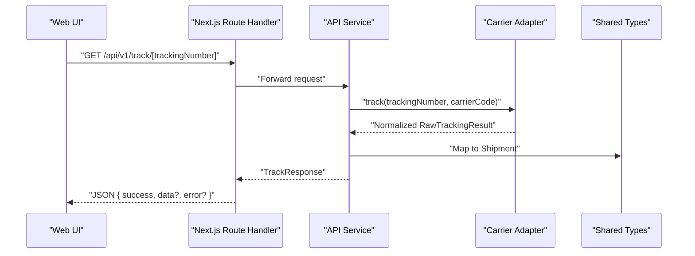
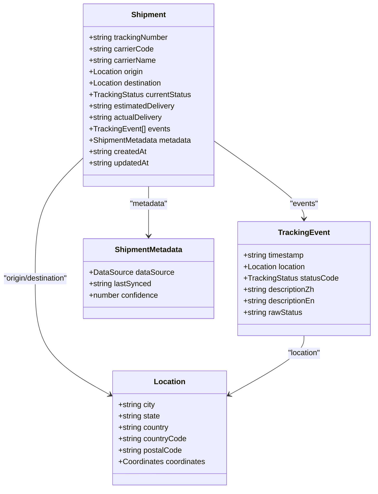
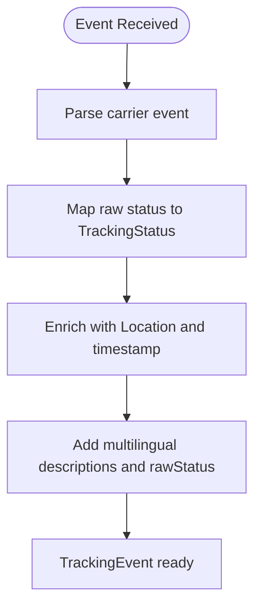
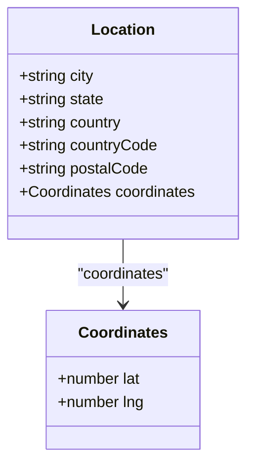
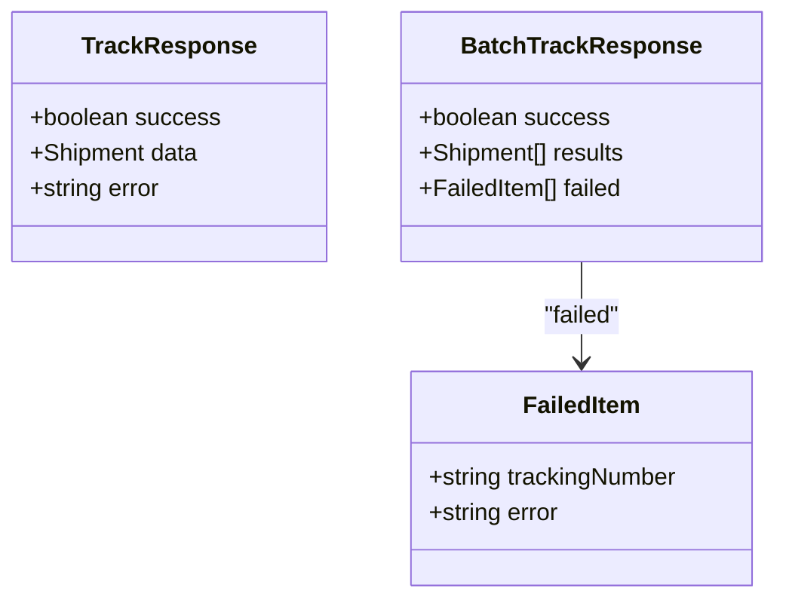
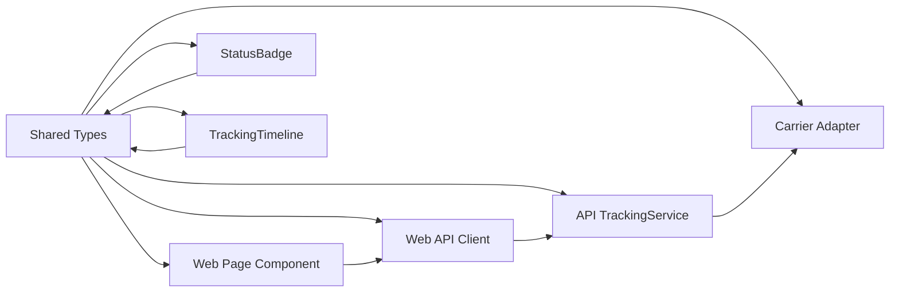
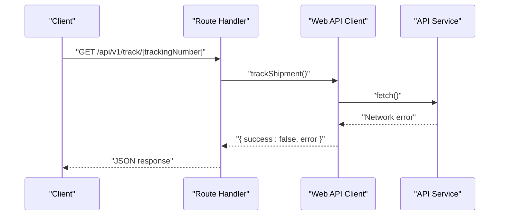

# Type Definitions

<cite>
**Referenced Files in This Document**
- [packages/shared/src/types/index.ts](file://packages/shared/src/types/index.ts)
- [packages/shared/src/constants/index.ts](file://packages/shared/src/constants/index.ts)
- [packages/shared/src/i18n/index.ts](file://packages/shared/src/i18n/index.ts)
- [packages/shared/src/index.ts](file://packages/shared/src/index.ts)
- [apps/api/src/services/tracking-service.ts](file://apps/api/src/services/tracking-service.ts)
- [apps/api/src/adapters/base-adapter.ts](file://apps/api/src/adapters/base-adapter.ts)
- [apps/web/src/lib/api.ts](file://apps/web/src/lib/api.ts)
- [apps/web/src/app/api/v1/track/[trackingNumber]/route.ts](file://apps/web/src/app/api/v1/track/[trackingNumber]/route.ts)
- [apps/web/src/components/StatusBadge.tsx](file://apps/web/src/components/StatusBadge.tsx)
- [apps/web/src/components/TrackingTimeline.tsx](file://apps/web/src/components/TrackingTimeline.tsx)
- [apps/web/src/app/track/[id]/page.tsx](file://apps/web/src/app/track/[id]/page.tsx)
- [apps/api/package.json](file://apps/api/package.json)
- [apps/web/package.json](file://apps/web/package.json)
- [packages/shared/package.json](file://packages/shared/package.json)
</cite>

## Table of Contents
1. [Introduction](#introduction)
2. [Project Structure](#project-structure)
3. [Core Components](#core-components)
4. [Architecture Overview](#architecture-overview)
5. [Detailed Component Analysis](#detailed-component-analysis)
6. [Dependency Analysis](#dependency-analysis)
7. [Performance Considerations](#performance-considerations)
8. [Troubleshooting Guide](#troubleshooting-guide)
9. [Conclusion](#conclusion)

## Introduction
This document describes the shared type definitions used across the LOGISTIC monorepo. It focuses on the core data models for cross-border shipment tracking, including the standardized tracking status enumeration, shipment representation, tracking events, location information, metadata, and API response types. It also covers user tier configurations and how these types are imported and used in both frontend and backend applications.

## Project Structure
The shared types live in the packages/shared package and are consumed by both the Next.js web application and the Fastify API service. The shared package exports:
- Types: types/index.ts
- Constants: constants/index.ts
- Internationalization helpers: i18n/index.ts

```mermaid
graph TB
subgraph "Shared Package"
SHARED_TYPES["packages/shared/src/types/index.ts"]
SHARED_CONST["packages/shared/src/constants/index.ts"]
SHARED_I18N["packages/shared/src/i18n/index.ts"]
SHARED_INDEX["packages/shared/src/index.ts"]
end
subgraph "Web App (@logistic/web)"
WEB_LIB["apps/web/src/lib/api.ts"]
WEB_ROUTE["apps/web/src/app/api/v1/track/[trackingNumber]/route.ts"]
WEB_PAGE["apps/web/src/app/track/[id]/page.tsx"]
WEB_BADGE["apps/web/src/components/StatusBadge.tsx"]
WEB_TIMELINE["apps/web/src/components/TrackingTimeline.tsx"]
end
subgraph "API App (@logistic/api)"
API_TRACKING["apps/api/src/services/tracking-service.ts"]
API_ADAPTER["apps/api/src/adapters/base-adapter.ts"]
end
SHARED_INDEX --> SHARED_TYPES
SHARED_INDEX --> SHARED_CONST
SHARED_INDEX --> SHARED_I18N
WEB_LIB --> SHARED_TYPES
WEB_ROUTE --> SHARED_TYPES
WEB_PAGE --> SHARED_TYPES
WEB_BADGE --> SHARED_TYPES
WEB_TIMELINE --> SHARED_TYPES
API_TRACKING --> SHARED_TYPES
API_ADAPTER --> SHARED_TYPES
```



**Diagram sources**
- [packages/shared/src/index.ts:1-4](file://packages/shared/src/index.ts#L1-L4)
- [packages/shared/src/types/index.ts:1-101](file://packages/shared/src/types/index.ts#L1-L101)
- [packages/shared/src/constants/index.ts:1-103](file://packages/shared/src/constants/index.ts#L1-L103)
- [packages/shared/src/i18n/index.ts:1-61](file://packages/shared/src/i18n/index.ts#L1-L61)
- [apps/web/src/lib/api.ts:1-56](file://apps/web/src/lib/api.ts#L1-L56)
- [apps/web/src/app/api/v1/track/[trackingNumber]/route.ts](file://apps/web/src/app/api/v1/track/[trackingNumber]/route.ts#L1-L223)
- [apps/web/src/app/track/[id]/page.tsx](file://apps/web/src/app/track/[id]/page.tsx#L1-L263)
- [apps/web/src/components/StatusBadge.tsx:1-33](file://apps/web/src/components/StatusBadge.tsx#L1-L33)
- [apps/web/src/components/TrackingTimeline.tsx:1-126](file://apps/web/src/components/TrackingTimeline.tsx#L1-L126)
- [apps/api/src/services/tracking-service.ts:1-128](file://apps/api/src/services/tracking-service.ts#L1-L128)
- [apps/api/src/adapters/base-adapter.ts:1-39](file://apps/api/src/adapters/base-adapter.ts#L1-L39)

**Section sources**
- [packages/shared/src/index.ts:1-4](file://packages/shared/src/index.ts#L1-L4)
- [packages/shared/package.json:1-22](file://packages/shared/package.json#L1-L22)
- [apps/web/package.json:1-29](file://apps/web/package.json#L1-L29)
- [apps/api/package.json:1-26](file://apps/api/package.json#L1-L26)

## Core Components
This section documents the primary shared types and their roles in representing cross-border shipment tracking data.

- TrackingStatus enumeration
  - Purpose: Standardized 10-state tracking lifecycle for cross-border logistics.
  - Values: PENDING, PICKED_UP, IN_TRANSIT, EXPORT_CUSTOMS, IMPORT_CUSTOMS, OUT_FOR_DELIVERY, DELIVERED, FAILED, RETURNED, EXPIRED.
  - Usage: Used as statusCode in TrackingEvent and as currentStatus in Shipment.

- Location interface
  - Fields: city, state, country, countryCode, postalCode, coordinates (lat, lng).
  - Usage: Origin and destination locations in Shipment; location in TrackingEvent.

- TrackingEvent interface
  - Fields: timestamp (ISO 8601 UTC), location (Location), statusCode (TrackingStatus), descriptionZh, descriptionEn, rawStatus.
  - Usage: Individual milestone entries in Shipment.events.

- Shipment interface
  - Fields: trackingNumber, carrierCode, carrierName, origin (Location), destination (Location), currentStatus (TrackingStatus), estimatedDelivery, actualDelivery, events (TrackingEvent[]), metadata (ShipmentMetadata), createdAt, updatedAt.
  - Usage: Complete shipment record returned by tracking operations.

- ShipmentMetadata interface
  - Fields: dataSource (DataSource union), lastSynced (ISO 8601), confidence (0–100).
  - Usage: Provenance and quality indicator of tracking data.

- API response types
  - TrackResponse: success (boolean), data (Shipment?), error (string?).
  - BatchTrackResponse: success (boolean), results (Shipment[]), failed (array of { trackingNumber, error }).

- UserTier enum and TierConfig interface
  - UserTier: FREE, PRO, ENTERPRISE.
  - TierConfig: queriesPerDay (number|null), queriesPerMinute, batchSize, historyDays (number|null), webhookEnabled (boolean), exportFormats (string[]).

**Section sources**
- [packages/shared/src/types/index.ts:1-101](file://packages/shared/src/types/index.ts#L1-L101)
- [packages/shared/src/constants/index.ts:1-103](file://packages/shared/src/constants/index.ts#L1-L103)

## Architecture Overview
The shared types define the canonical data model for cross-border tracking. The web app consumes these types to render UI and manage state, while the API app produces them by normalizing carrier responses.



**Diagram sources**
- [apps/web/src/app/api/v1/track/[trackingNumber]/route.ts](file://apps/web/src/app/api/v1/track/[trackingNumber]/route.ts#L187-L222)
- [apps/api/src/services/tracking-service.ts:40-62](file://apps/api/src/services/tracking-service.ts#L40-L62)
- [apps/api/src/adapters/base-adapter.ts:20-39](file://apps/api/src/adapters/base-adapter.ts#L20-L39)
- [packages/shared/src/types/index.ts:48-61](file://packages/shared/src/types/index.ts#L48-L61)

## Detailed Component Analysis

### TrackingStatus Enumeration
- Definition: 10 standard cross-border statuses.
- Usage: Enumerated state machine for shipment lifecycle.
- Related constants:
  - CACHE_TTL: per-status cache durations.
  - STATUS_COLORS: UI color mapping for statuses.
  - MILESTONE_ORDER: canonical order of key milestones.

```mermaid
classDiagram
class TrackingStatus {
<<enumeration>>
"PENDING"
"PICKED_UP"
"IN_TRANSIT"
"EXPORT_CUSTOMS"
"IMPORT_CUSTOMS"
"OUT_FOR_DELIVERY"
"DELIVERED"
"FAILED"
"RETURNED"
"EXPIRED"
}
```

**Diagram sources**
- [packages/shared/src/types/index.ts:2-13](file://packages/shared/src/types/index.ts#L2-L13)
- [packages/shared/src/constants/index.ts:32-57](file://packages/shared/src/constants/index.ts#L32-L57)

**Section sources**
- [packages/shared/src/types/index.ts:2-13](file://packages/shared/src/types/index.ts#L2-L13)
- [packages/shared/src/constants/index.ts:32-57](file://packages/shared/src/constants/index.ts#L32-L57)

### Shipment Interface
- Purpose: Complete representation of a tracked shipment.
- Key fields:
  - Identity: trackingNumber, carrierCode, carrierName
  - Geography: origin, destination (Location)
  - Lifecycle: currentStatus, estimatedDelivery, actualDelivery, events
  - Metadata: metadata (ShipmentMetadata)
  - Timestamps: createdAt, updatedAt



**Diagram sources**
- [packages/shared/src/types/index.ts:24-61](file://packages/shared/src/types/index.ts#L24-L61)

**Section sources**
- [packages/shared/src/types/index.ts:48-61](file://packages/shared/src/types/index.ts#L48-L61)

### TrackingEvent Interface
- Purpose: Single milestone in the shipment journey.
- Multilingual support: descriptionZh, descriptionEn.
- Raw status: rawStatus preserves carrier-specific status text.



**Diagram sources**
- [packages/shared/src/types/index.ts:37-45](file://packages/shared/src/types/index.ts#L37-L45)
- [apps/api/src/adapters/base-adapter.ts:20-39](file://apps/api/src/adapters/base-adapter.ts#L20-L39)

**Section sources**
- [packages/shared/src/types/index.ts:37-45](file://packages/shared/src/types/index.ts#L37-L45)
- [apps/api/src/adapters/base-adapter.ts:20-39](file://apps/api/src/adapters/base-adapter.ts#L20-L39)

### Location Interface
- Purpose: Geographical context for origin/destination and event locations.
- Optional fields: state, postalCode, coordinates.



**Diagram sources**
- [packages/shared/src/types/index.ts:24-35](file://packages/shared/src/types/index.ts#L24-L35)

**Section sources**
- [packages/shared/src/types/index.ts:24-35](file://packages/shared/src/types/index.ts#L24-L35)

### ShipmentMetadata Interface
- Purpose: Data provenance and quality.
- Fields: dataSource, lastSynced, confidence.

```mermaid
classDiagram
class ShipmentMetadata {
+DataSource dataSource
+string lastSynced
+number confidence
}
class DataSource {
<<union>>
"'17track'"
"'aftership'"
"'trackingmore'"
"'dhl_direct'"
"'fedex_direct'"
"'ups_direct'"
}
ShipmentMetadata --> DataSource : "dataSource"
```

**Diagram sources**
- [packages/shared/src/types/index.ts:15-22](file://packages/shared/src/types/index.ts#L15-L22)
- [packages/shared/src/types/index.ts:63-67](file://packages/shared/src/types/index.ts#L63-L67)

**Section sources**
- [packages/shared/src/types/index.ts:15-22](file://packages/shared/src/types/index.ts#L15-L22)
- [packages/shared/src/types/index.ts:63-67](file://packages/shared/src/types/index.ts#L63-L67)

### API Response Types
- TrackResponse: success flag, optional data (Shipment), optional error message.
- BatchTrackResponse: success flag, results array, failed array with trackingNumber and error.



**Diagram sources**
- [packages/shared/src/types/index.ts:69-83](file://packages/shared/src/types/index.ts#L69-L83)

**Section sources**
- [packages/shared/src/types/index.ts:69-83](file://packages/shared/src/types/index.ts#L69-L83)

### User Tier Configurations
- UserTier enum: FREE, PRO, ENTERPRISE.
- TierConfig interface: daily and per-minute query limits, batch size, history window, webhook enablement, supported export formats.

```mermaid
classDiagram
class UserTier {
<<enumeration>>
"FREE"
"PRO"
"ENTERPRISE"
}
class TierConfig {
+number|null queriesPerDay
+number queriesPerMinute
+number batchSize
+number|null historyDays
+boolean webhookEnabled
+string[] exportFormats
}
```

**Diagram sources**
- [packages/shared/src/types/index.ts:85-100](file://packages/shared/src/types/index.ts#L85-L100)
- [packages/shared/src/constants/index.ts:4-29](file://packages/shared/src/constants/index.ts#L4-L29)

**Section sources**
- [packages/shared/src/types/index.ts:85-100](file://packages/shared/src/types/index.ts#L85-L100)
- [packages/shared/src/constants/index.ts:4-29](file://packages/shared/src/constants/index.ts#L4-L29)

## Dependency Analysis
The shared types are consumed across the monorepo via explicit imports. The web app uses TrackResponse and BatchTrackResponse for API responses, while the API app uses Shipment and related types to represent normalized tracking data.



**Diagram sources**
- [apps/web/src/lib/api.ts:1-56](file://apps/web/src/lib/api.ts#L1-L56)
- [apps/web/src/app/track/[id]/page.tsx](file://apps/web/src/app/track/[id]/page.tsx#L6-L12)
- [apps/web/src/components/StatusBadge.tsx:3-4](file://apps/web/src/components/StatusBadge.tsx#L3-L4)
- [apps/web/src/components/TrackingTimeline.tsx:3-4](file://apps/web/src/components/TrackingTimeline.tsx#L3-L4)
- [apps/api/src/services/tracking-service.ts:1-7](file://apps/api/src/services/tracking-service.ts#L1-L7)
- [apps/api/src/adapters/base-adapter.ts:1-2](file://apps/api/src/adapters/base-adapter.ts#L1-L2)

**Section sources**
- [apps/web/src/lib/api.ts:1-56](file://apps/web/src/lib/api.ts#L1-L56)
- [apps/web/src/app/track/[id]/page.tsx](file://apps/web/src/app/track/[id]/page.tsx#L6-L12)
- [apps/web/src/components/StatusBadge.tsx:3-4](file://apps/web/src/components/StatusBadge.tsx#L3-L4)
- [apps/web/src/components/TrackingTimeline.tsx:3-4](file://apps/web/src/components/TrackingTimeline.tsx#L3-L4)
- [apps/api/src/services/tracking-service.ts:1-7](file://apps/api/src/services/tracking-service.ts#L1-L7)
- [apps/api/src/adapters/base-adapter.ts:1-2](file://apps/api/src/adapters/base-adapter.ts#L1-L2)

## Performance Considerations
- Cache TTL by status: The shared constants define per-status cache durations to balance freshness and cost. The API service reads TTL from CACHE_TTL to set Redis expiration.
- Batch processing: The API service processes batches with controlled concurrency to avoid overload.
- Data source confidence: Confidence scores in ShipmentMetadata help downstream components decide whether to present data or prompt re-query.

**Section sources**
- [packages/shared/src/constants/index.ts:32-43](file://packages/shared/src/constants/index.ts#L32-L43)
- [apps/api/src/services/tracking-service.ts:64-91](file://apps/api/src/services/tracking-service.ts#L64-L91)

## Troubleshooting Guide
- Invalid tracking number: The web route handler validates the input and returns an error payload conforming to TrackResponse.
- Network errors: The web API client wraps fetch failures into TrackResponse with an error message.
- Adapter failures: The API service catches adapter errors and returns null or records failures in BatchTrackResponse.failed.



**Diagram sources**
- [apps/web/src/app/api/v1/track/[trackingNumber]/route.ts](file://apps/web/src/app/api/v1/track/[trackingNumber]/route.ts#L193-L198)
- [apps/web/src/lib/api.ts:12-26](file://apps/web/src/lib/api.ts#L12-L26)

**Section sources**
- [apps/web/src/app/api/v1/track/[trackingNumber]/route.ts](file://apps/web/src/app/api/v1/track/[trackingNumber]/route.ts#L193-L198)
- [apps/web/src/lib/api.ts:12-26](file://apps/web/src/lib/api.ts#L12-L26)

## Usage Examples

### Frontend Usage
- Importing types and helpers:
  - TrackResponse and BatchTrackResponse for API responses.
  - TrackingStatus, STATUS_COLORS, translateStatus for UI rendering.
  - CARRIERS for carrier name resolution.
- Typical usage:
  - Using trackShipment to fetch a single shipment and render TrackResultPage.
  - Rendering a timeline of TrackingEvent entries with StatusBadge and localized descriptions.

**Section sources**
- [apps/web/src/lib/api.ts:1-56](file://apps/web/src/lib/api.ts#L1-L56)
- [apps/web/src/app/track/[id]/page.tsx](file://apps/web/src/app/track/[id]/page.tsx#L6-L12)
- [apps/web/src/components/StatusBadge.tsx:3-4](file://apps/web/src/components/StatusBadge.tsx#L3-L4)
- [apps/web/src/components/TrackingTimeline.tsx:3-4](file://apps/web/src/components/TrackingTimeline.tsx#L3-L4)

### Backend Usage
- Importing types:
  - Shipment, TrackingEvent, Location, ShipmentMetadata for modeling normalized tracking data.
  - TrackingStatus for status mapping and cache TTL selection.
- Typical usage:
  - TrackingService orchestrates adapter selection, caching, and normalization into Shipment.
  - Carrier adapters implement track and supports to produce normalized results consumable by TrackingService.

**Section sources**
- [apps/api/src/services/tracking-service.ts:1-7](file://apps/api/src/services/tracking-service.ts#L1-L7)
- [apps/api/src/adapters/base-adapter.ts:1-2](file://apps/api/src/adapters/base-adapter.ts#L1-L2)

## Conclusion
The shared type definitions establish a consistent, strongly typed contract for cross-border shipment tracking across the LOGISTIC monorepo. They enable reliable data interchange between the web frontend and the API backend, support internationalization and UI theming, and provide structured user tier configurations for rate limiting and feature gating.